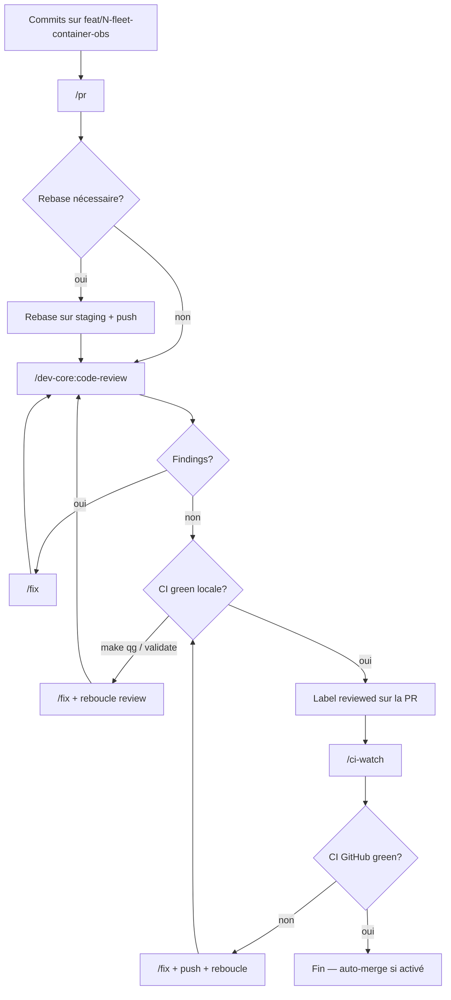

# Goal — Fleet container observability (M₁ `/fleet`)

> Plan vivant pour l'exécution `/goal`. Mettre à jour ce fichier au fur et à mesure :
> cocher les tâches, noter les écarts, ajouter des entrées dans le journal de progression.

| Champ | Valeur |
|-------|--------|
| **Issue** | _À créer_ — `feat(dashboard): fleet container observability — /fleet + roxabi-obs` (parent suggéré : [#1760](https://github.com/Roxabi/roxabi-factory/issues/1760) control-plane) |
| **ADR** | [ADR-091](../../docs/architecture/adr/091-observability-plane-taxonomy.mdx) plane ③ · [ADR-092](../../docs/architecture/adr/092-observability-stack.mdx) · [ADR-094](../../docs/architecture/adr/094-control-plane-dashboard-consolidation.mdx) |
| **Base** | `staging` |
| **Branche travail** | `feat/<N>-fleet-container-obs` (créée **dans le worktree courant** — **pas** de commit direct sur `staging`) |
| **Worktree** | Grok : `/home/mickael/.grok/worktrees/projects-roxabi-factory/…` — **ne pas** utiliser `/setup-worktree` (`.claude/worktrees/`) ici |
| **Statut global** | `phase_a_done` — PR Phase B en attente |
| **Dernière MAJ** | 2026-06-29 (session Grok) |
| **Scope v1** | M₁ (`factory-hub` / `roxabi.network`) uniquement — M₂ ignoré |
| **Panel review** | 2026-06-29 — tri-agent (arch / NATS / impl) → **Approuver avec changements** |

---

## Démarrage rapide (humain)

**Une seule commande à lancer** — tout le reste est dans ce fichier :

```text
/goal Execute artifacts/plans/fleet-container-obs-goal.md
```

**Avant (optionnel, 1 min)** — si pas encore de branche feature :

```bash
cd /home/mickael/.grok/worktrees/projects-roxabi-factory/2026-06-29-b8dd0e18
git fetch origin staging && git checkout staging
git checkout -b feat/<N>-fleet-container-obs    # ou feat/fleet-container-obs sans issue
```

Remplacer `<N>` dans le tableau ci-dessus + journal une fois l'issue GitHub créée.

---

## Instructions agent `/goal` (lire en premier)

Ce fichier est **SSoT** pour l'exécution end-to-end. L'agent doit :

1. **Lire ce plan en entier** avant de coder.
2. **Travailler dans le worktree Grok courant** — ne pas appeler `/setup-worktree`.
3. **Branche** : `feat/<N>-fleet-container-obs` (créer depuis `staging` si besoin). Ne jamais committer sur `staging`.
4. **Phase A — Implémentation** : exécuter dans l'ordre strict  
   `Pre-flight → Block 1 → … → Block 7 → Block 9`  
   (Block 8 = repo `voiceCLI` séparé, Phase C).  
   Cocher les tâches + journaliser après chaque bloc.  
   Chaque bloc : satisfaire son **done when** + `make qg` sur chemins touchés avant le suivant.
5. **Phase B — Livraison factory** (une PR, fin de Phase A) :  
   `/pr --base staging` → rebase si behind → `/dev-core:code-review` → `/fix` (boucle 0 findings) → `make qg` → label `reviewed` → `/ci-watch` → si CI rouge : `/fix` + push + reboucler.
6. **Phase C — voiceCLI** (Block 8) : PR séparée dans `~/projects/voiceCLI` après contracts mergés.
7. **Phase D — Deploy M₁** (manuel post-merge) : converge / autoupdate ; vérif `/fleet` Tailnet.
8. **Fin** : mettre à jour checkboxes + journal ici ; `Statut global` → `done` si Phase B CI green.

### Invariants non négociables

| Règle | Valeur |
|-------|--------|
| Subject NATS | `factory.metric.host.container_report` — pas `factory.ops.*`, pas `factory.fleet.*` |
| Store hub | `FleetStore` **séparé** de `WorkerRegistry` — pas de fusion avec `factory.*.heartbeat` |
| Package reporter | `packages/roxabi-obs` — **pas** `src/factory/obs/` |
| Lecture dashboard | Hub RPC `factory.dashboard.fleet.list` — pas d'import `infrastructure.stores` |
| Clé fleet | `(host, container_name)` — `container_name` = Quadlet `ContainerName` |
| TTL / cap | report 30s · stale TTL 90s · prune 180s · max 32 entrées |

### Commandes gates

```bash
make qg
uv run pytest packages/roxabi-contracts/tests/test_fleet_models.py -q
uv run pytest src/factory -k fleet -q
make nats-regen-specs && factory-acl check grants
cd apps/dashboard && bun run build && bun run lint && bun run typecheck && bun run test
```

---

## Statut par bloc

| Bloc | Statut | Notes |
|------|--------|-------|
| Pre-flight | `done` | Branche `feat/fleet-container-obs` ; décisions verrouillées |
| Block 1 — Contrat + FleetStore hub | `done` | Contrats v0.13, FleetStore, RPC squelette |
| Block 2 — `packages/roxabi-obs` + ACL identity | `done` | ACL publish narrow + auth.conf regen |
| Block 3 — Premier container (`factory-hub`) | `done` | Reporter câblé hub_standalone |
| Block 4 — BFF + UI `/fleet` | `done` | FleetPage + BFF + tests |
| Block 5 — Catalogue manifest (tierces) | `done` | 19 entrées factory ; tierces en `unknown` |
| Block 6 — STALE digest GHCR | `deferred` | Non-goal harness |
| Block 7 — Rollout factory (10 units restantes) | `done` | 11 units câblées + quadlet env |
| Block 8 — voiceCLI (repo séparé) | `deferred` | PR voiceCLI post-merge contracts |
| Block 9 — Deep-link logs `/ops` | `deferred` | Optionnel post-MVP |

---

## Workflow validé (implémentation → merge)

> **Validé 2026-06-29** — tout le goal s'exécute sur une branche feature dans le **worktree Grok déjà ouvert** ; la livraison passe par la boucle PR standard, pas de push direct sur `staging`.

### 1. Setup branche (worktree Grok — pas `/setup-worktree`)

On est déjà dans un worktree Grok (`~/.grok/worktrees/projects-roxabi-factory/…`), en général checkouté sur `staging`. Le skill `/setup-worktree` cible `.claude/worktrees/` dans le repo principal — **inutile et potentiellement conflictuel** ici.

**À la place**, depuis le worktree courant :

```bash
# 1. S'assurer d'être à jour
git fetch origin staging
git checkout staging
git pull --ff-only origin staging   # si nécessaire

# 2. Créer + basculer la branche feature (une fois l'issue <N> créée)
git checkout -b feat/<N>-fleet-container-obs

# 3. Lier l'issue GitHub (si pas déjà fait à la création)
gh issue develop <N> --base staging --name feat/<N>-fleet-container-obs
# ↑ échoue si la branche existe déjà — dans ce cas lier via le panneau Development de l'issue
```

- **Rester** dans ce worktree Grok pour tout le goal — pas de second worktree
- Commits Conventional Commits sur `feat/<N>-fleet-container-obs` uniquement
- `/goal` met à jour ce plan + journal ; **ne merge pas** sur `staging` en fin de session

### 2. Boucle PR (par slice ou à la fin d'un bloc « done when »)



| Étape | Commande | Notes |
|-------|----------|-------|
| Ouvrir / mettre à jour PR | `/pr` | Base `staging` ; rebase post-create inclus dans le skill |
| Rebase si besoin | manuel ou re-run `/pr` step 5 | Après fetch `origin/staging` si la PR est behind |
| Review | `/dev-core:code-review` | Multi-domaine ; findings structurés |
| Corriger | `/fix` | Applique les findings review |
| Boucle review | répéter review → fix | Jusqu'à **0 findings** |
| Pré-push green | `make qg` ou `/validate` | Gate locale **avant** label `reviewed` |
| Label | `gh pr edit --add-label reviewed` | Débloque `/ci-watch` auto-merge si configuré |
| Surveiller CI | `/ci-watch` | Dashboard live ; dump logs si rouge |

### 3. Règles (mode goal complet)

- **Une PR factory** en fin de Phase A (Blocks 1–7 + 9) — pas de PR intermédiaire sauf si l'agent est bloqué
- **Ne pas** label `reviewed` tant que `make qg` local est rouge
- **Ne pas** skip `/ci-watch` après label — attendre CI GitHub green
- Si CI rouge : `/fix` → push → `make qg` → reboucle review si fix substantiel
- Merge : auto-merge post-`/ci-watch` ou merge manuel une fois green

---

## Contexte

### Problème

L'opérateur n'a pas de vue unifiée **OK/KO + fraîcheur + version** des containers M₁. La page `/ops` couvre Loki/Langfuse/OTel (engines headless), pas l'état systemd/Quadlet de la flotte. Le bug dictate récent (`voicecli-stt`/`tts` crash loop) a montré qu'un service peut être **KO** sans signal visible dans le dashboard.

### Direction validée

| Décision | Choix |
|----------|-------|
| Pattern | **`roxabi-obs`** — brique légère dans chaque **image Roxabi** (pas sidecar, pas +1 container) |
| Transport | Publish NATS périodique **~30 s** |
| Subject | **`factory.metric.host.container_report`** (JetStream `factory-metrics`, pas `factory.ops.*`) |
| Contrat | **`ContainerReport`** dans `roxabi-contracts/fleet/` |
| Agrégation hub | **`FleetStore`** in-memory — **séparé** de `WorkerRegistry` (routage workers) |
| UI | Page **`/fleet`** + BFF read-only ; logs incidents → **`/ops`** filtré (Block 9) |
| Deploy badge v1 | **OK** (report récent) · **STALE** (pas de report / age ≥ TTL) · **PINNED** (pas d'autoupdate Quadlet) |
| Exclusions | Pas de timer host reporter · pas de sondes HTTP dashboard · heartbeats workers **inchangés** |

### Reviews agents (2026-06-29)

Sources : `/tmp/grok-review-{arch,nats,impl}-d408c003.md`

- **Arch** : Approuver avec changements — clé `container_name` Quadlet, TTL 90s, manifest tierces, RPC `factory.dashboard.fleet.list`
- **NATS** : Approuver conditionnellement — subject `factory.metric.host.*`, identité `host-obs`, hub subscribe narrow, pas de fusion heartbeat
- **Impl** : MVP phasé — PR1 = contrat + FleetStore sans Docker ; STALE GHCR en slice 6+

### État actuel codebase

- `deploy/quadlet.toml` : **21 components** factory sur M₁ (incl. 9 tierces sans runtime Roxabi Python)
- **13 images Roxabi** instrumentables : 11 factory (`:staging` / `:staging-svc`) + 2 voiceCLI (`voiceCLI` repo)
- `WorkerRegistry` : heartbeats 5s / TTL 15s — **ne pas réutiliser** pour fleet
- `factory-metrics` stream : déjà provisionné (`factory.metric.>`)
- Dashboard : `/ops` existe (`apps/dashboard/src/pages/OpsPage.tsx`) ; **pas** de `/fleet`
- `src/factory/obs/` : stack OTel/Langfuse — **différent** de `packages/roxabi-obs`

---

## Invariants globaux (tous blocs)

- [ ] **Ne pas** fusionner `ContainerReport` avec `factory.*.heartbeat` / `WorkerRegistry`
- [ ] **Ne pas** introduire `factory.ops.*` ni `factory.fleet.*` comme nouveau namespace top-level
- [ ] `factory.dashboard` **ne doit pas** importer `factory.infrastructure.stores.*` ni lire `FleetStore` directement — hub RPC uniquement (ADR-094)
- [ ] Clé fleet = **`(host, container_name)`** où `container_name` = Quadlet `ContainerName` (ex. `factory-langfuse-postgres`)
- [ ] Valider `container_name` avec `validate_nats_single_token` (comme `worker_id`)
- [ ] `packages/roxabi-obs` : pas d'import `factory.*` ; dépendances = `roxabi-contracts` + `roxabi-nats` seulement
- [ ] `src/factory/obs/` reste la stack traces — **ne pas** y mettre le reporter fleet
- [ ] Gates SLOC 300 / dossier 15 sur nouveaux chemins
- [ ] Tests fleet : CI + compose NATS — **pas** de dépendance SSH M₁ jusqu'à Block 6

---

## PRE-FLIGHT — avant Block 1

> Verrouiller les décisions non négociables. Ne pas coder avant ces items.

- [ ] Créer l'issue GitHub + lier à #1760 ; mettre à jour la ligne **Issue** en tête de ce plan
- [ ] Créer branche `feat/<N>-fleet-container-obs` **dans le worktree Grok courant** (`git checkout -b …` depuis `staging`) — **pas** `/setup-worktree`
- [ ] ADR slice ou paragraphe spec : subject `factory.metric.host.container_report`, modèle `ContainerReport`, identité publisher par container (nkey du service, pas `host-obs` sidecar en v1)
- [ ] Décision publisher v1 : **in-process asyncio task** dans chaque image Roxabi (identity = nkey du service existant, ex. `hub`, `web-adapter`) — publish grant **narrow** ajouté à chaque identity
- [ ] Décision hub ingest : **core subscribe** sur subject JS-captured + `FleetStore` in-memory (pas durable consumer obligatoire en v1)
- [ ] Décision STALE v1 : badge **live vs missing** seulement ; digest GHCR = Block 6
- [ ] Lire `deploy/quadlet.toml` + lister les 13 units Roxabi vs 9 tierces pour le catalogue Block 5

---

## BLOCK 1 — Contrat + FleetStore hub (PR1)

**Statut :** `not_started`  
**GO :** oui — premier mergeable, zéro Dockerfile / quadlet / UI

### `roxabi-contracts` — module `fleet/`

- [ ] `packages/roxabi-contracts/src/roxabi_contracts/fleet/subjects.py`
  - `CONTAINER_REPORT = "factory.metric.host.container_report"`
- [ ] `packages/roxabi-contracts/src/roxabi_contracts/fleet/models.py`
  - `ContainerReport(ContractEnvelope)` champs minimum :
    - `host: str` (hostname, défaut socket)
    - `container_name: str` (**requis**, token validé)
    - `image_ref: str` (ex. `ghcr.io/roxabi/factory:staging-svc`)
    - `image_revision: str | None` (git SHA OCI label / build info)
    - `health: Literal["starting", "healthy", "unhealthy", "unknown"]`
    - `systemd_unit: str | None` (ex. `factory-hub.service`)
    - `reported_at: datetime` (UTC)
  - `extra="ignore"` sur envelope
- [ ] `packages/roxabi-contracts/tests/test_fleet_models.py` + assertions littérales subject
- [ ] Bump version contracts (minor additive)

### Hub — `FleetStore`

- [ ] `src/factory/core/hub/fleet_store.py` (ou `src/factory/nats/fleet_store.py` — suivre voisinage `worker_registry.py`)
  - Clé dict : `(host, container_name)`
  - `report_ttl_s = 90` (3× interval 30s)
  - `prune_horizon_s = 180`
  - `MAX_ENTRIES = 32` ; rejet + log warning si flood / token invalide
  - Méthodes : `upsert(report)`, `list_snapshot()`, `status_for(name)` → `ok | stale | unknown`
- [ ] Subscriber hub au boot (près de `start_dashboard_rpc` dans `src/factory/bootstrap/factory/dashboard_rpc.py`)
  - `nc.subscribe("factory.metric.host.container_report", cb=...)`
  - Désérialisation via `roxabi_nats.deserialize()` (gate 1 MB)
- [ ] Tests unitaires FleetStore (TTL, prune, cap, token invalide)
- [ ] Tests intégration NATS (`@pytest.mark.integration` ou compose) : publish fake report → FleetStore contient la ligne

### Hub RPC (squelette — consommé Block 4)

- [ ] `roxabi_contracts.dashboard.subjects` : `fleet_list = "factory.dashboard.fleet.list"`
- [ ] `DashboardFleetRow` + `DashboardFleetResponse` dans contracts dashboard models
- [ ] Handler stub `fleet_list` dans `dashboard_rpc.py` → `FleetStore.list_snapshot()` (vide OK en PR1)

### ACL (partiel — compléter Block 2)

- [ ] `hub` subscribe : ajouter `factory.metric.host.>` (ou subject exact)
- [ ] `make nats-regen-specs` + `factory-acl check grants` green sur hub subscribe
- [ ] **Pas encore** de publish grants per-service — Block 2/3

### Block 1 — done when

- [ ] `uv run pytest packages/roxabi-contracts/tests/test_fleet_models.py` green
- [ ] pytest FleetStore + subscriber green (unit + integration compose)
- [ ] `make qg` green sur chemins touchés
- [ ] Aucun Dockerfile / `.container` / fichier `apps/dashboard` modifié

---

## BLOCK 2 — `packages/roxabi-obs` + ACL publish

**Statut :** `not_started`  
**GO :** après Block 1 green

### Package workspace

- [ ] `packages/roxabi-obs/pyproject.toml` — membre workspace uv
- [ ] `packages/roxabi-obs/src/roxabi_obs/__init__.py`
- [ ] `packages/roxabi-obs/src/roxabi_obs/reporter.py`
  - Lit env : `CONTAINER_NAME` (requis), `IMAGE_REF`, `IMAGE_REVISION` (optionnel)
  - Fallback `image_revision` : `/app/.roxabi-build-info.json` ou label OCI si présent
  - Boucle asyncio : publish `ContainerReport` toutes les **30 s**
  - Health : best-effort (process alive = healthy ; pas de sonde HTTP en v1)
- [ ] `packages/roxabi-obs/AGENTS.md` — scope : reporter fleet plane ③ uniquement, pas engines
- [ ] Dockerfile builder : `COPY packages/` inclut déjà roxabi-obs — vérifier wheel dans `svc-runtime` + `agent-runtime`
- [ ] Tests unitaires : payload shape, interval mock, env manquant → no crash / log warning

### ACL publish (toutes identities Roxabi v1)

- [ ] Pour chaque identity des 11 factory units + dashboard : ajouter publish narrow
  - `factory.metric.host.container_report` (**pas** `factory.metric.>`)
- [ ] `deploy/nats/acl-matrix.json` + `make nats-regen-specs`
- [ ] `factory ops verify` / drift scripts green
- [ ] Documenter : `factory-nats` ne peut pas self-report si NATS down → hub marque NATS **stale** par absence (règle out-of-band)

### Block 2 — done when

- [ ] `uv run pytest packages/roxabi-obs/` green
- [ ] ACL matrix regen + grants check green
- [ ] Toujours **zéro** quadlet / image rebuild déployée

---

## BLOCK 3 — Premier container instrumenté (`factory-hub`)

**Statut :** `not_started`  
**GO :** après Block 2 green

### Wire hub

- [ ] `src/factory/bootstrap/factory/hub_bootstrap.py` (ou entry hub) : `asyncio.create_task(start_fleet_reporter(...))` au démarrage NATS
- [ ] Env quadlet `factory-hub.container` :
  - `CONTAINER_NAME=factory-hub`
  - `IMAGE_REF=ghcr.io/roxabi/factory:staging-svc` (déjà implicite via Image=)
- [ ] CI publish : écrire `org.opencontainers.image.revision` + `.roxabi-build-info.json` dans image `staging-svc`
- [ ] Test manuel / integration : hub publish → FleetStore row `factory-hub` age &lt; 90s

### Block 3 — done when

- [ ] Image `staging-svc` rebuild + publish CI
- [ ] Sur M₁ (ou compose full stack) : `factory-hub` report visible dans FleetStore / RPC stub
- [ ] Heartbeats workers inchangés (smoke voice/clipool si dispo)

---

## BLOCK 4 — BFF + UI `/fleet`

**Statut :** `not_started`  
**GO :** après Block 3 green (au moins 1 reporter live)

### Hub RPC complet

- [ ] `factory.dashboard.fleet.list` handler : merge FleetStore + catalogue manifest (Block 5 si prêt, sinon FleetStore seul)
- [ ] Réponse : `container_name`, `host`, `image_ref`, `image_revision`, `health`, `status` (`ok|stale|unknown|pinned`), `last_report_at`, `age_s`, `systemd_unit`

### BFF

- [ ] `src/factory/dashboard/routes/bff.py` : `GET /api/bff/fleet` → `hub_client.fleet_list()`
- [ ] `src/factory/dashboard/hub_client.py` : méthode `fleet_list()`
- [ ] `src/factory/dashboard/e2e.py` : `stub_fleet()` pour `FACTORY_DASHBOARD_E2E=1`
- [ ] Tests `test_dashboard_bff.py` : chemin prod + stub E2E

### UI

- [ ] `apps/dashboard/src/pages/FleetPage.tsx` — table dense : name, status badge, image, revision, age, health
- [ ] `apps/dashboard/src/router.tsx` : route `/fleet`
- [ ] `apps/dashboard/src/lib/nav.ts` : `observeNavItems` — ajouter `/fleet` (icône + i18n `nav.fleet`)
- [ ] i18n `en` + `fr` : `fleet.json` ou clés dans `dashboard.json`
- [ ] vitest : render table, stale row, unknown manifest row
- [ ] Playwright e2e (optionnel ce bloc) : snapshot dark/light

### Block 4 — done when

- [ ] Opérateur Tailnet : `/fleet` affiche au moins `factory-hub` **OK** avec age rafraîchi
- [ ] `make qg` green (vitest + pytest BFF)
- [ ] Pas de lecture directe FleetStore depuis le process dashboard

---

## BLOCK 5 — Catalogue manifest (couverture tierces)

**Statut :** `not_started`  
**GO :** en parallèle ou juste avant Block 4 ship

### Manifest SSoT

- [ ] `tools/emit_fleet_catalog.py` — génère depuis `deploy/quadlet.toml` :
  - `container_name`, `component_key`, `image_ref` (parse `.container`), `instrumented: bool`, `systemd_unit`
- [ ] Option : glob `VOICE_DIR/deploy/quadlet/voicecli-*.container` pour 2 satellites
- [ ] Hub charge catalogue au boot ; `FleetStore.list_snapshot()` merge :
  - **instrumented** + report récent → `ok`
  - **instrumented** + pas de report → `stale`
  - **non instrumented** → `unknown` + `source=manifest`
- [ ] UI : badge distinct « non instrumenté » pour Loki, Promtail, Langfuse×6, NATS, OTel

### Block 5 — done when

- [ ] `/fleet` affiche **~21+ lignes** (factory + voiceCLI si catalogués), pas seulement les reporters actifs
- [ ] Test : manifest row sans report → `unknown`, pas masquée

---

## BLOCK 6 — STALE digest GHCR (polish deploy)

**Statut :** `not_started`  
**GO :** après Block 4 shipped — **pas bloquant MVP liveness**

### Sémantique

- [ ] **STALE_IMAGE** = `running_digest != registry_digest(tag)` pour le tag Quadlet `Image=`
- [ ] **UNKNOWN_COMPARE** si auth GHCR échoue ou fenêtre parallel-publish #1325
- [ ] Ne pas confondre avec **STALE_LIVENESS** (pas de report NATS)

### Implémentation

- [ ] Poller **host-side** (systemd oneshot ou `factory.monitoring` slice) — pas dans `factory-hub` sans token registry monté
- [ ] Publie enrichissement vers FleetStore ou KV `fleet.digest.<container_name>`
- [ ] Gérer tags flottants `:staging` / `:staging-svc` / voiceCLI `:staging`
- [ ] Tests : mock registry HTTP + fixtures digest

### Block 6 — done when

- [ ] Badge « image obsolète » sur au moins 1 scénario test
- [ ] Documenté dans `docs/ops/container-publishing.md` (accepted staging window)

---

## BLOCK 7 — Rollout factory (10 units restantes)

**Statut :** `not_started`  
**GO :** après Block 4 green

### Batches (rebuild + autoupdate M₁)

- [ ] **Batch A** `staging-svc` : dashboard, turn-writer, blobstore, ingress, socialmedia-adapter
- [ ] **Batch B** `staging` : clipool, omp, gh-helper, telegram, discord
- [ ] Chaque unit : `CONTAINER_NAME` env + reporter task dans entrypoint existant
- [ ] `deploy/converge.sh` : pas de timer host ; restart via autoupdate ou converge manuel

### Block 7 — done when

- [ ] 11/11 factory Roxabi units reportent sur `/fleet`
- [ ] ACL publish vérifié pour chaque identity (pas de silent drop)

---

## BLOCK 8 — voiceCLI (repo séparé)

**Statut :** `not_started`  
**GO :** après Block 7

- [ ] `roxabi-contracts` bump mergé
- [ ] PR `voiceCLI` : pin contracts + `roxabi-obs` via `[tool.uv.sources]` git subdirectory
- [ ] Wire reporter dans `voicecli-stt` / `voicecli-tts` entrypoints
- [ ] Quadlets : `CONTAINER_NAME=voicecli-stt` / `voicecli-tts`
- [ ] `contracts-bump.yml` + image publish `ghcr.io/roxabi/voicecli-{stt,tts}:staging`
- [ ] M₁ : pull + restart (pattern dictate fix — pas de restart auto si `failed` state)

### Block 8 — done when

- [ ] 2 lignes voiceCLI **OK** sur `/fleet`
- [ ] Dictate smoke : STT/TTS heartbeat routing **inchangé**

---

## BLOCK 9 — Deep-link logs `/ops` (optionnel)

**Statut :** `not_started`  
**GO :** après Block 4 — nice-to-have

- [ ] `ops_proxy.py` : preset `container-journal`
  - `'{job="factory-journal", systemd_unit="factory-<name>.service"}'`
- [ ] `GET /api/bff/ops/logs?container=<name>` (ou `systemd_unit=`)
- [ ] Fleet row click → `/ops?container=factory-hub` (query param)
- [ ] Tests BFF + vitest lien

---

## Risques & garde-fous

| Risque | Mitigation | Bloc |
|--------|------------|------|
| Fusion heartbeat + fleet | `FleetStore` séparé ; sujet `factory.metric.host.*` | tous |
| ACL silent drop | Matrix row par identity ; verify grants | B2, B7 |
| `/fleet` trompeur (9 tierces absentes) | Manifest `unknown` Block 5 | B5 |
| `factory-nats` down = pas de reports | Hub stale NATS ; pas de self-report | B3 |
| Faux STALE GHCR (#1325) | `UNKNOWN_COMPARE` + doc staging window | B6 |
| `src/factory/obs/` confusion | `packages/roxabi-obs` + AGENTS.md | B2 |
| Auth #1992 (topologie exposée) | Même risque résiduel que `/ops` Tailnet | B4 |
| voiceCLI skew contracts | Block 8 dernier ; bump explicite | B8 |

---

## Journal de progression

> Ajouter une entrée à chaque session `/goal`. Format : `YYYY-MM-DD — résumé — bloc — statut`.

### 2026-06-29 — Création du plan

- Plan consolidé après reviews agents arch / NATS / impl (`d408c003`).
- Verdict : **Approuver avec changements** — subject `factory.metric.host.container_report`, FleetStore séparé, MVP PR1 sans Docker.
- Décision : liveness `/fleet` avant STALE GHCR (Block 6).
- Décision : manifest tierces en `unknown` (Block 5).

### 2026-06-29 — Workflow livraison validé

- Travail sur branche `feat/<N>-fleet-container-obs` **dans le worktree Grok existant** — `/setup-worktree` exclu (déjà en worktree, pattern `.claude/worktrees/` non pertinent).
- Boucle merge : `/pr` → rebase si besoin → `/dev-core:code-review` → `/fix` (loop) → `make qg` → label `reviewed` → `/ci-watch` → fix si CI rouge.
- Mode **goal complet** : une session implémente Blocks 0–9 factory, puis **une PR** + boucle livraison en fin de session.
- Block 8 voiceCLI = PR séparée dans repo `voiceCLI` (après merge contracts factory).

### 2026-06-29 — Phase A implémentée (session Grok)

- Blocks 1–5 + 7 livrés sur `feat/fleet-container-obs` ; Blocks 6/8/9 reportés (non-goals harness).
- `make qg` green (lint, pyright, vitest, import-linter, ACL drift, architecture snapshot, pytest BFF).
- Écarts : `dashboard_rpc.py` scindé (`dashboard_fleet_rpc.py`, `dashboard_voice_rpc.py`) pour gate SLOC 300 ; reporters hors bootstrap importent `roxabi_obs` directement (import-linter).
- Catalogue `emit_fleet_catalog.py` : 19 entrées factory (voiceCLI satellites hors scope repo).
- Prochaine étape : commit + `/pr --base staging` → review → CI.

---

## Référence `/goal`

```text
/goal Execute artifacts/plans/fleet-container-obs-goal.md
```

Tout est dans ce fichier : specs, blocs, workflow, invariants, gates, journal.