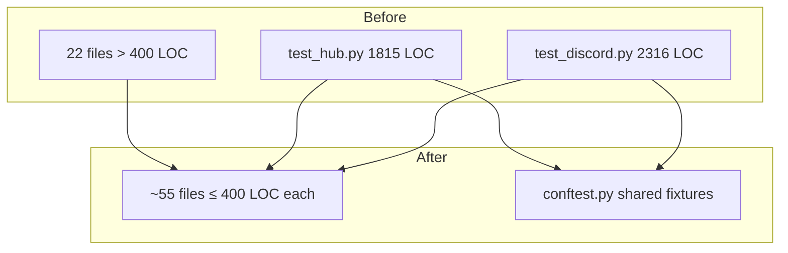

# Split Oversized Test Files to ≤400 LOC

## Goal

Every test file in `tests/` should be ≤400 LOC. Currently **22 files** exceed this limit (total: ~17,000 LOC over budget). Split them by logical theme while preserving all test coverage.

## Principles

1. **Logical cohesion** — group tests by feature, not alphabetically
2. **Fixture locality** — shared fixtures move to `conftest.py`; file-local helpers stay with their consumers
3. **No cross-file test imports** — each new file is self-contained (imports from `conftest.py` or source only)
4. **Naming convention** — `test_<module>_<theme>.py` (e.g., `test_discord_auth.py`)
5. **Zero test loss** — `pytest --co -q` count must be identical before and after each split

## Architecture

## File × Function Map

### Batch 1 — Largest files (>1000 LOC) — 5 files → ~24 new files

#### 1. `tests/adapters/test_discord.py` (2316 LOC) → 6 files

| New file | Classes / functions | Est. LOC |
|----------|-------------------|----------|
| `test_discord_normalize.py` | Top-level normalize tests (mention, display name, token) | ~350 |
| `test_discord_threads.py` | TestDiscordAutoThread + TestWatchChannels | ~400 |
| `test_discord_outbound.py` | TestDiscordOutboundMessage | ~200 |
| `test_discord_attachments.py` | TestDiscordAttachments | ~150 |
| `test_discord_auth.py` | TestDiscordAuth + typing cancellation tests | ~400 |
| `test_discord_edge.py` | Remaining edge-case tests (empty text, etc.) | ~200 |
| → `conftest.py` | `_attach_typing_cm`, `_make_open_registry`, `_make_discord_adapter`, `_make_discord_message`, `_make_discord_msg_ns` | ~80 |

#### 2. `tests/core/test_hub.py` (1815 LOC) → 6 files

| New file | Classes / functions | Est. LOC |
|----------|-------------------|----------|
| `test_hub_init.py` | MockAdapter, TestPool, TestAgent, TestHubInit, TestRegisterAdapter | ~200 |
| `test_hub_routing.py` | TestRoutingKey, TestUnmatchedRouting | ~150 |
| `test_hub_dispatch.py` | TestDispatchResponse, TestDispatchAttachment, TestDispatchAudio, TestDispatchAudioStream, TestDispatchVoiceStream | ~300 |
| `test_hub_streaming.py` | TestDispatchStreaming, TestHubRunStreaming | ~200 |
| `test_hub_scope.py` | TestScopeIdRouting, TestCrossScopeRateLimit, TestScopeIsolatedPools | ~250 |
| `test_hub_lifecycle.py` | TestPoolTTLEviction, TestHubMemoryFields, TestHubEvictFlushTask, TestRecordCircuitFailure | ~300 |
| → `conftest.py` | MockAdapter helper | ~50 |

#### 3. `tests/core/test_command_router.py` (1667 LOC) → 5 files

| New file | Classes / functions | Est. LOC |
|----------|-------------------|----------|
| `test_command_router_detection.py` | TestIsCommand + TestDispatchHelp + TestDispatchUnknownCommand + TestDispatchRoutesToPlugin | ~250 |
| `test_command_router_circuit.py` | TestCircuitCommand* + TestPluginsConfigFromToml | ~200 |
| `test_command_router_config.py` | TestConfigCommand + TestClearCommand + TestStopCommand | ~300 |
| `test_command_router_workspace.py` | TestWorkspaceCommands | ~350 |
| `test_command_router_special.py` | TestBangPrefixFallthrough, TestBareUrlDetection, TestSessionCommands | ~400 |
| → `conftest.py` | make_message, make_router, make_echo_plugin_dir and other helpers | ~100 |

#### 4. `tests/adapters/test_telegram.py` (1591 LOC) → 4 files

| New file | Classes / functions | Est. LOC |
|----------|-------------------|----------|
| `test_telegram_normalize.py` | All normalize top-level tests | ~400 |
| `test_telegram_outbound.py` | TestTelegramOutboundMessage | ~250 |
| `test_telegram_attachments.py` | TestTelegramAttachments | ~150 |
| `test_telegram_auth.py` | TestTelegramAuth | ~400 |
| → `conftest.py` | `_make_open_registry`, `_make_telegram_adapter`, `_make_telegram_message`, `_make_aiogram_msg` | ~80 |

#### 5. `tests/core/test_agent.py` (1216 LOC) → 4 files

| New file | Classes / functions | Est. LOC |
|----------|-------------------|----------|
| `test_agent_config.py` | TestModelConfig, TestLoadAgentConfig | ~300 |
| `test_agent_persona.py` | TestPersonaConfig, TestLoadPersona, TestComposeSystemPrompt, TestLoadAgentConfigWithPersona | ~200 |
| `test_agent_lifecycle.py` | TestAgentMemoryInjection, TestAgentEnsureSystemPrompt, TestAgentFlushSession, TestAgentCompact, TestAgentExtractionMethods | ~300 |
| `test_agent_conversion.py` | TestAgentRowToConfig*, TestPatternsParsedFromToml, TestAgentTTSConfig, TestApplyAgentSTTOverlay | ~400 |

### Batch 2 — Medium files (700–1000 LOC) — 6 files → ~18 new files

#### 6. `tests/core/test_cli_pool.py` (984 LOC) → 3 files

| New file | Classes / functions | Est. LOC |
|----------|-------------------|----------|
| `test_cli_pool_process.py` | TestCliPoolBuildCmd, TestCliPoolSend, TestReadUntilResult, TestCliPoolLifecycle, TestCliPoolIsAlive | ~360 |
| `test_cli_pool_state.py` | TestOnIntermediateException, TestCliPoolSpawnCwd, TestCliPoolResumeAndReset, TestCliPoolSwitchCwd, TestEagerCleanupOnTerminated | ~250 |
| `test_cli_pool_streaming.py` | TestOnReapCallback, TestCliPoolLastSweepAt, TestCliPoolSendStreaming, TestCliPoolSpawnEnv | ~350 |

#### 7. `tests/core/test_pool.py` (970 LOC) → 3 files

| New file | Classes / functions | Est. LOC |
|----------|-------------------|----------|
| `test_pool_tasks.py` | TestPoolSubmit, TestPoolTaskExitsOnIdle, TestPoolSequentialProcessing, TestPoolTimeout, TestPoolCancel, TestPoolExceptionHandling | ~350 |
| `test_pool_streaming.py` | TestPoolSwitchWorkspace, TestExtendSdkHistory, StreamingAgent, TestPoolResumeSession, TestPoolStreaming | ~350 |
| `test_pool_advanced.py` | TestPoolUnknownAgentDrain, TestPoolCancelInboxRace, TestPoolIdentity, TestPoolAppend, TestPoolSnapshot, TestTurnTimeoutCeiling | ~250 |

#### 8. `tests/adapters/test_discord_voice.py` (919 LOC) → 3 files

| New file | Classes / functions | Est. LOC |
|----------|-------------------|----------|
| `test_discord_voice_session.py` | TestPCMQueueSource, TestVoiceSession, TestVoiceDeps, TestVoiceSessionManager, TestOnVoiceStateUpdate | ~300 |
| `test_discord_voice_streaming.py` | TestVSMStream, TestRenderVoiceStream | ~300 |
| `test_discord_voice_commands.py` | TestHandleVoiceCommand, TestOnMessageVoiceCommandWiring | ~300 |

#### 9. `tests/core/test_agent_store.py` (791 LOC) → 2 files

| New file | Classes / functions | Est. LOC |
|----------|-------------------|----------|
| `test_agent_store_crud.py` | TestAgentStoreConnect, TestAgentCRUD, TestBotMap, TestBotSettings, TestRuntimeState, TestAgentStoreReconnect | ~350 |
| `test_agent_store_seed.py` | TestSeedFromToml, TestBotMapExtra, TestTTSSTTColumns | ~400 |

#### 10. `tests/llm/test_smart_routing.py` (732 LOC) → 2 files

| New file | Classes / functions | Est. LOC |
|----------|-------------------|----------|
| `test_smart_routing_classifier.py` | TestComplexityClassifier, TestSmartRoutingDecorator, TestRoutingCommand, TestSmartRoutingTomlConfig | ~400 |
| `test_smart_routing_estimator.py` | TestComplexityEstimator, TestSmartRoutingDecoratorWithMsg | ~300 |

#### 11. `tests/core/test_command_loader.py` (718 LOC) → 2 files

| New file | Classes / functions | Est. LOC |
|----------|-------------------|----------|
| `test_command_loader_discover.py` | TestDiscover, TestLoad | ~380 |
| `test_command_loader_runtime.py` | TestGetCommands, TestReload, TestPerAgentConfig | ~300 |

### Batch 3 — Smaller files (400–700 LOC) — 11 files → ~15 new files

#### 12. `tests/core/test_runtime_config.py` (706 LOC) → 2 files

| New file | Classes / functions | Est. LOC |
|----------|-------------------|----------|
| `test_runtime_config_overlays.py` | TestRuntimeConfigDefaults, TestOverlay* (all overlay classes), TestEffectiveConfigFrozen | ~250 |
| `test_runtime_config_persistence.py` | TestSaveLoad, TestSetParam, TestReset | ~400 |

#### 13. `tests/adapters/test_render_attachment.py` (682 LOC) → 2 files

| New file | Classes / functions | Est. LOC |
|----------|-------------------|----------|
| `test_render_attachment_telegram.py` | TestOutboundAttachment, TestTelegramRenderAttachment, TestSanitizeFilename, TestTruncateCaption, TestTelegramIntegration | ~350 |
| `test_render_attachment_discord.py` | TestDiscordRenderAttachment, TestDiscordIntegration | ~300 |

#### 14. `tests/core/test_pairing.py` (677 LOC) → 2 files

| New file | Classes / functions | Est. LOC |
|----------|-------------------|----------|
| `test_pairing_core.py` | TestPairingConfig, TestPairingManagerConnect, TestGenerateCode, TestValidateCode, TestGrantAfterPairing, TestRateLimiting | ~370 |
| `test_pairing_commands.py` | TestCmdInvite, TestCmdJoin, TestCmdUnpair | ~250 |

#### 15. `tests/core/test_messages.py` (611 LOC) → 2 files

| New file | Classes / functions | Est. LOC |
|----------|-------------------|----------|
| `test_messages_templates.py` | TestTemplateLoading, TestVariableSubstitution, TestNoRaiseGuarantee, TestResolutionOrder | ~250 |
| `test_messages_i18n.py` | TestFrenchLanguageResolution, TestAgentI18nLanguage, TestHotReloadPreservesMsgManager | ~350 |

#### 16. `tests/core/test_cli_protocol_streaming.py` (598 LOC) → 2 files

| New file | Classes / functions | Est. LOC |
|----------|-------------------|----------|
| `test_cli_streaming_parse.py` | TestStreamingIteratorYields, TestStreamingIteratorSessionId, TestStreamingIteratorNonJson | ~250 |
| `test_cli_streaming_lifecycle.py` | TestStreamingIteratorError, TestStreamingIteratorCleanup, TestStreamingIteratorTimeout, TestSendAndReadStream | ~300 |

#### 17. `tests/core/test_message_pipeline.py` (596 LOC) → 2 files

| New file | Classes / functions | Est. LOC |
|----------|-------------------|----------|
| `test_message_pipeline_guards.py` | TestPipelineGuardStages, TestPipelineTerminalStages, TestPipelineIntegration, TestGateMethodsRemoved | ~260 |
| `test_message_pipeline_context.py` | TestReplyToResumePipeline, TestResolveContextMessageIndex | ~300 |

#### 18. `tests/cli/test_agent_cli.py` (588 LOC) → 2 files

| New file | Classes / functions | Est. LOC |
|----------|-------------------|----------|
| `test_agent_cli_commands.py` | TestAgentInitCommand, TestAgentListCommand, TestAgentShowCommand, TestAgentValidateCommand, TestAgentDeleteCommand, TestAgentAssignCommand, TestAgentUnassignCommand | ~250 |
| `test_agent_cli_workflows.py` | TestAgentEditCommand, TestAgentDeleteHappyPath, TestAgentAssignHappyPath, TestAgentValidateDBPath, TestAgentEditTTS | ~300 |

#### 19. `tests/core/test_outbound_dispatcher.py` (575 LOC) → 2 files

| New file | Classes / functions | Est. LOC |
|----------|-------------------|----------|
| `test_outbound_dispatcher_queue.py` | TestOutboundDispatcherEnqueue, TestOutboundDispatcherCircuitBreaker | ~250 |
| `test_outbound_dispatcher_media.py` | TestOutboundDispatcherAudio, TestOutboundDispatcherAttachment, TestOutboundDispatcherAudioStream, TestOutboundDispatcherVoiceStream | ~300 |

#### 20. `tests/core/test_routing_context.py` (558 LOC) → 2 files

| New file | Classes / functions | Est. LOC |
|----------|-------------------|----------|
| `test_routing_context_basics.py` | TestRoutingContext, TestInboundMessageRouting, TestInboundAudioRouting, TestResponseRoutingPropagation, TestOutboundMessageRouting | ~200 |
| `test_routing_context_integration.py` | TestTelegramNormalizeRouting, TestDiscordNormalizeRouting, TestVerifyRoutingDirect, TestDispatcherRoutingIntegration, TestHubDispatchPropagation | ~350 |

#### 21. `tests/core/test_audio_pipeline.py` (556 LOC) → 2 files

| New file | Classes / functions | Est. LOC |
|----------|-------------------|----------|
| `test_audio_pipeline_constraints.py` | TestAudioPipelineTrustLevel, TestAudioPipelineRateLimit, TestAudioPipelineSlashInjection, TestAudioPipelineTranscriptCap, TestAudioPipelineBusFull | ~300 |
| `test_audio_pipeline_tts.py` | TestSynthesizeDispatchAgentTTS, TestResolveAgentTTS, TestDispatchResponseAgentTTSE2E | ~250 |

#### 22. `tests/test_health_endpoint.py` (512 LOC) → 2 files

| New file | Classes / functions | Est. LOC |
|----------|-------------------|----------|
| `test_health_endpoint_status.py` | TestHealthUnauthenticated, TestHealthEndpoint, TestHubTimestamps | ~300 |
| `test_health_endpoint_config.py` | TestConfigEndpoint, TestHealthReaperFields | ~200 |

## Execution order

Work batch-by-batch. Within each batch, files are independent — can be split in parallel.

| Step | Action | Verify |
|------|--------|--------|
| 0 | Capture baseline: `pytest --co -q \| tail -1` | Save test count |
| 1 | Batch 1: split 5 largest files (>1000 LOC) | `pytest --co -q` count unchanged |
| 2 | Batch 2: split 6 medium files (700–1000 LOC) | count unchanged |
| 3 | Batch 3: split 11 smaller files (400–700 LOC) | count unchanged |
| 4 | Run full suite: `uv run pytest` | All green |
| 5 | Delete original files, verify no orphan imports | `pytest` still green |

## Shared fixture extraction

When splitting, move helpers used by ≥2 new files into the directory's `conftest.py`:

| Directory | Fixtures to extract |
|-----------|-------------------|
| `tests/adapters/conftest.py` | `_make_open_registry`, adapter factories, message builders |
| `tests/core/conftest.py` | `MockAdapter`, `make_message`, `make_router` and other shared builders |
| `tests/llm/conftest.py` (new) | `make_model_cfg`, `make_ok_result` |
| `tests/cli/conftest.py` (new) | `_seed_agent` |

## Summary

- **22 files** over 400 LOC → **~57 files** each ≤400 LOC
- **3 batches** by size for incremental progress
- **Zero test loss** verified at each step
- Shared fixtures extracted to `conftest.py` per directory
