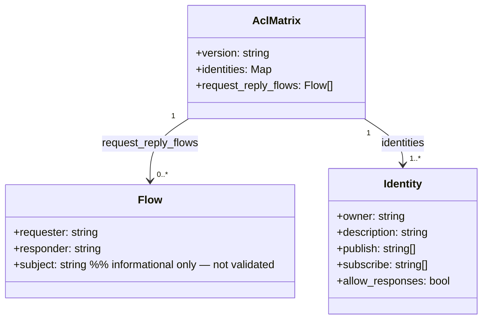

## Context

Five responder identities in `deploy/nats/acl-matrix.json` carry hand-written `"_inbox.hub.>"` publish grants. This was identified as the incident root cause (2026-04-27 outage, postmortem item 2): a new responder without this grant causes hub→responder requests to fail silently. The fix introduces a `request_reply_flows` section in `acl-matrix.json` so that `gen-nkeys.sh` derives the `_inbox.{requester}.>` publish grant for each responder automatically, eliminating the manual authoring step.

## Goal

Adding a new responder requires only a `request_reply_flows` entry. The `_inbox.{requester}.>` publish grant is derived and injected at `load_matrix()` time — no second string to update, no CI check to extend.

## Users

- **Primary:** developer adding a new Lyra worker — declare one flow entry, get the correct NATS grant for free.
- **Secondary:** ops/CI — `check-acl-matrix-spec.sh` loses the `_inbox.hub.>` PUB row (no longer asserted from raw JSON); `check-request-reply-flows.sh` owns the effective-grant invariant going forward.

## Expected Behavior

1. `acl-matrix.json` gains a top-level `request_reply_flows` array with one entry per hub→responder request-reply pair, each carrying `requester`, `responder`, and `subject` (informational — documents the triggering subject but is not validated by any check script in this issue).
2. Each of the five responder identities loses its hand-written `"_inbox.hub.>"` from its `publish` array in the raw JSON.
3. `gen-nkeys.sh` `load_matrix()` reads `request_reply_flows` after populating identity arrays. For each flow, it derives the required grant as the bare subject `_inbox.{flow.requester}.>` and checks whether this subject already exists in the raw JSON `.identities[responder].publish` array (before string-formatting). If absent, it appends the formatted entry `",\"_inbox.{requester}.>\""` to `PUB_ALLOW[responder]`. If `PUB_ALLOW[responder]` is empty at injection time (responder had no other publish subjects), the entry is appended without a leading comma.
4. All `gen-nkeys.sh` invocation paths call `load_matrix()` unconditionally at line 185 — derivation applies to full keygen, `--regen-authconf`, `--template-only`, and `--emit-merged-authconf` alike.
5. `render_auth_conf` and `emit_user` are unchanged — they continue consuming `PUB_ALLOW`; derived grants appear in `auth.conf` transparently.
6. `check-acl-matrix-spec.sh`: the `_inbox.hub.>` row is removed from the `ROWS` array. Raw JSON no longer carries the grant, so a `json_has()` lookup would return false for all five responders. The effective-grant invariant is owned entirely by `check-request-reply-flows.sh` (see below). This keeps the two scripts' scopes non-overlapping — `check-acl-matrix-spec.sh` remains a raw-JSON↔spec-table checker; `check-request-reply-flows.sh` validates derived topology.
7. A new `scripts/check-request-reply-flows.sh` validates the invariant: for each flow entry, the responder identity's raw JSON publish array combined with derived grants contains `_inbox.{requester}.>`. The regression-guard test is embedded in the script itself: it mutates a temp copy of `acl-matrix.json` using `jq del(.request_reply_flows[0])`, re-runs the check against it, and asserts exit code 1. The script is added to the CI pre-push hook alongside the existing checks.

**Ordering constraint:** S1 (JSON change) and S2 (`load_matrix()` change) must land in the same atomic commit or PR. S1 without S2 leaves `gen-nkeys.sh --template-only` producing auth.conf blocks missing `_inbox.hub.>` for all five responders — a live regression. S3 (test scripts) is safe to merge independently after S1+S2.

## Data Model & Consumers



```mermaid
flowchart LR
    JSON[acl-matrix.json\nrequest_reply_flows] -->|jq read after identity loop| LM[load_matrix\ngen-nkeys.sh]
    LM -->|injects _inbox.requester.> into PUB_ALLOW| RAC[render_auth_conf]
    RAC -->|auth.conf block| CONF[/etc/nats/nkeys/auth.conf]
    JSON -->|reads flows + publishes| CHECK[check-request-reply-flows.sh\nnew — this issue]
    CHECK -->|exit 0 / exit 1| CI[CI gate]
    JSON -->|_inbox.hub.> row removed from ROWS| SPEC[check-acl-matrix-spec.sh\nupdated — this issue]
    SPEC -->|exit 0 / exit 1| CI
```

| Consumer | Fields consumed | When | Status |
|----------|----------------|------|--------|
| `gen-nkeys.sh` `load_matrix()` | `request_reply_flows[].requester`, `.responder` | All keygen + regen paths | This issue |
| `check-request-reply-flows.sh` | `request_reply_flows[].requester`, `.responder`; `identities[].publish` | CI pre-push | This issue |
| `check-acl-matrix-spec.sh` | `_inbox.hub.>` row removed from ROWS (no longer consumed) | CI pre-push | This issue |
| Future linting | `request_reply_flows[].subject` vs `identities[responder].subscribe` | — | Future — not this issue |

## Breadboard

| Element | Handler | Data / Notes |
|---------|---------|------|
| `request_reply_flows` JSON key | `load_matrix()` — `jq -r '.request_reply_flows // [] | .[]'` after identity loop | `[{requester, responder, subject}]`; `// []` guards absent key |
| Bare-subject existence check | `jq` on raw `.identities[responder].publish` array before building `PUB_ALLOW` | Avoids quoting mismatch; idempotent |
| Grant injection | Append `",\"_inbox.{requester}.>\""` to `PUB_ALLOW[$responder]`; if `PUB_ALLOW[$responder]` is empty, append without leading comma | Handles responders with no other publish subjects |
| `emit_user` | Unchanged — consumes `PUB_ALLOW[$name]` | Derived grant appears in rendered auth.conf |
| `check-request-reply-flows.sh` | Standalone bash; reads flows, asserts effective coverage; inline regression-guard mutates temp copy + asserts exit 1 | Exit 0 = pass, exit 1 = drift |
| `check-acl-matrix-spec.sh` ROWS update | Remove `_inbox.hub.>` row entry from ROWS array | `bash scripts/check-acl-matrix-spec.sh` exits 0 post-S1+S2 |

## Slices

**Note:** S1 and S2 must be committed together (same PR). S1 alone is a regression (gen-nkeys.sh stops emitting the grants). S3 is independent.

| # | Name | Files changed | Demo-able result |
|---|------|--------------|-----------------|
| S1+S2 | JSON schema + derivation (atomic) | `deploy/nats/acl-matrix.json`, `deploy/nats/gen-nkeys.sh` | `jq .request_reply_flows acl-matrix.json` shows 5 flows; no responder has `_inbox.hub.>` in raw publish array; `./deploy/nats/gen-nkeys.sh --template-only` still emits `_inbox.hub.>` in each responder's publish ACL block |
| S3 | Test + CI check update | `scripts/check-request-reply-flows.sh` (new), `scripts/check-acl-matrix-spec.sh` (updated) | `bash scripts/check-request-reply-flows.sh` exits 0; regression guard passes; `bash scripts/check-acl-matrix-spec.sh` exits 0 |

## Success Criteria

- [ ] `acl-matrix.json` has a top-level `request_reply_flows` array with exactly 5 entries covering: hub→clipool-worker, hub→voice-tts, hub→voice-stt, hub→image-worker, hub→llm-worker.
- [ ] No responder identity (`voice-tts`, `voice-stt`, `llm-worker`, `image-worker`, `clipool-worker`) has `"_inbox.hub.>"` in its `publish` array in the raw JSON.
- [ ] `./deploy/nats/gen-nkeys.sh --template-only` output contains `"_inbox.hub.>"` in the publish allow-list for each of the 5 responder identity blocks.
- [ ] `bash scripts/check-request-reply-flows.sh` exits 0 on the current matrix.
- [ ] `bash scripts/check-request-reply-flows.sh` exits 1 when tested against a temp copy of `acl-matrix.json` with one flow removed via `jq del(.request_reply_flows[0])` (regression guard embedded in the script).
- [ ] `bash scripts/check-acl-matrix-spec.sh` exits 0 after the `_inbox.hub.>` row is removed from its ROWS array (no regression in existing CI check).
