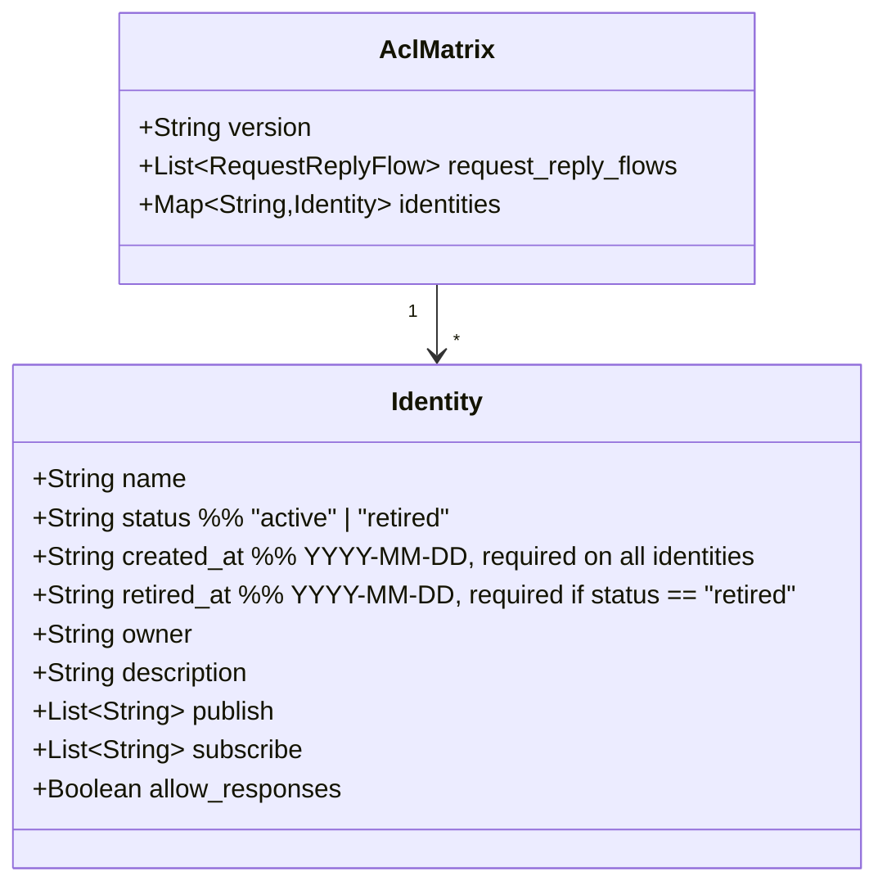
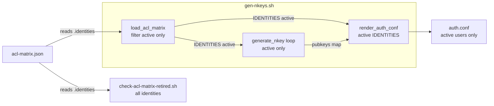

## Context

Derived from frame `artifacts/frames/1001-acl-matrix-status-field-frame.mdx`.

`acl-matrix.json` identities have no lifecycle field. Every identity in the JSON — regardless of whether the corresponding service exists — receives a seed file and an `auth.conf` users block on every `gen-nkeys.sh --regenerate` run. Retiring an identity today requires deleting it from the JSON (no audit trail) or leaving it in place (growing security surface). The `#690` comment in `gen-nkeys.sh` at line 279 documents the last manual retirement.

## Goal

Any operator can retire a NATS identity by setting `"status": "retired"` in `acl-matrix.json`. After re-running `gen-nkeys.sh --regen-authconf`, the retired identity receives no auth.conf entry and no new seed. The full identity record remains in the JSON as an audit trail. CI rejects any retired identity missing a `retired_at` date.

## Users

- **Primary:** operator managing NATS identities on `roxabituwer` (production) or locally.
- **Secondary:** security reviewer auditing `acl-matrix.json` — needs machine-readable distinction between active and retired identities.

## Expected Behavior

### Adding status to existing identities

All 9 current identities gain `"status": "active"` and `"created_at"` set to the earliest git-traceable date for that identity in `acl-matrix.json`:

| Identity | `created_at` |
|---|---|
| `hub` | `2026-04-21` |
| `telegram-adapter` | `2026-04-21` |
| `discord-adapter` | `2026-04-21` |
| `voice-tts` | `2026-04-21` |
| `voice-stt` | `2026-04-21` |
| `llm-worker` | `2026-04-21` |
| `image-worker` | `2026-04-21` |
| `monitor` | `2026-04-21` |
| `clipool-worker` | `2026-04-27` |

No behavior change — this is a data-only addition.

### Retiring an identity

1. Operator sets `"status": "retired"` and adds `"retired_at": "YYYY-MM-DD"` on the identity block in `acl-matrix.json`.
2. Operator removes the identity from any `request_reply_flows` entries (required — `load_acl_matrix()` validates flow participants against active identities).
3. Operator runs `sudo ./deploy/nats/gen-nkeys.sh --regen-authconf`.
4. `gen-nkeys.sh` loads only active identities into `IDENTITIES[]`; the retired identity is skipped.
5. `render_auth_conf` emits no `users[]` block for the retired identity.
6. No new seed is created or regenerated for the retired identity; the existing `.seed` file on disk is left in place.
7. NATS reloads `auth.conf`; the retired identity can no longer authenticate.

### gen-nkeys.sh default mode (--regenerate)

The hardcoded per-identity key-gen block (lines 648–672) is replaced with a loop over `IDENTITIES[]` (active only). This removes the need to manually update the script when adding or retiring identities.

### gen-nkeys.sh `--emit-merged-authconf` mode

This mode currently hardcodes `MERGED_LYRA_IDENTITIES=(hub telegram-adapter discord-adapter)` and `MERGED_VOICE_IDENTITIES=(voice-tts voice-stt)` directly, bypassing the `load_acl_matrix()` filter. Fix: derive both lists from `IDENTITIES[]` (already populated with active-only entries by `load_acl_matrix()`) filtered by owner — `lyra` owner → lyra list, `voicecli` owner → voicecli list. Retiring a lyra or voicecli identity is then reflected in this mode automatically.

### Sentinel-block auto-generation

`check-acl-matrix-spec.sh` gains a `--update` flag. When run with `--update`, it re-renders the ACL matrix table from `acl-matrix.json` and writes it back between the `<!-- acl-matrix:begin -->` / `<!-- acl-matrix:end -->` markers in `artifacts/specs/706-per-role-nkeys-acls-spec.mdx` in-place. CI continues to run in read-only diff mode (no flag). Operator runs `bash scripts/check-acl-matrix-spec.sh --update` after retiring an identity (documented in retirement procedure).

### gen-nkeys.sh warn for retired seed on disk

When `--regen-authconf` or default mode skips a retired identity, the script emits a `warn` line if `${SEEDS_DIR}/<name>.seed` exists on disk. The seed is not touched — this is informational only, prompting the operator to decide whether to shred it.

### CI check

A new script `scripts/check-acl-matrix-retired.sh` runs in CI and:
- Rejects any identity missing the `"status"` field.
- Rejects any identity missing the `"created_at"` field.
- Rejects any `"created_at"` value not matching `YYYY-MM-DD`.
- Rejects any identity with `"status": "retired"` that has no `"retired_at"` field.
- Rejects any `"retired_at"` value not matching `YYYY-MM-DD` (e.g. `"28-04-2026"` or `"today"` → exit 1).
- Rejects any identity with `"status": "retired"` that still appears in `request_reply_flows` as requester or responder.
- Uses `jq` + bash; no new dependencies.

`scripts/check-acl-matrix-spec.sh` is patched in S4 to derive its `IDENTITIES` column list from active entries in `acl-matrix.json` (`jq '.identities | to_entries[] | select(.value.status=="active") | .key'`) rather than a hardcoded bash array. This ensures the drift check column headers automatically exclude retired identities without manual edits to the script.

### Out of Scope

- Automatic seed deletion / `--retire` subcommand: seed on disk is preserved; `gen-nkeys.sh` warns when a retired identity's seed exists. Operator decides whether to shred it after verifying the identity is fully offline. Dedicated `--retire` subcommand is a future issue.

## Data Model & Consumers

| Consumer | Fields consumed | When | Status |
|---|---|---|---|
| `load_acl_matrix()` | `status`, `publish`, `subscribe`, `owner`, `allow_responses` | every `gen-nkeys.sh` run | this issue |
| `render_auth_conf()` | `IDENTITIES[]` (pre-filtered), `PUB_ALLOW`, `SUB_ALLOW` | every `gen-nkeys.sh` run | this issue |
| default key-gen loop | `IDENTITIES[]` (pre-filtered) | `gen-nkeys.sh` (no flags / `--regenerate`) | this issue |
| `check-acl-matrix-retired.sh` | `status`, `retired_at`, `request_reply_flows` refs | CI | this issue |
| `check-acl-matrix-spec.sh` | active identity names (derived from JSON) | CI | this issue — IDENTITIES column list + `--update` sentinel regen |
| `--emit-merged-authconf` mode | `IDENTITIES[]` filtered by owner (`lyra` / `voicecli`) | local dev | this issue — replaces hardcoded lists |

## Breadboard

| Affordance | Handler | Data |
|---|---|---|
| U1: `"status": "active"` on all identities | none (data only) | `acl-matrix.json` `.identities[].status` |
| U2: set `"status": "retired"` + `"retired_at"` | operator edits JSON | `acl-matrix.json` |
| N1: filter active identities | `load_acl_matrix()` | `IDENTITIES[]` populated with active only |
| N2: skip retired seed generation | default key-gen loop over `IDENTITIES[]` | no seed created for retired |
| N3: skip retired `users[]` block | `render_auth_conf()` iterates `IDENTITIES[]` | auth.conf omits retired |
| N4: CI validate status + created_at fields | `check-acl-matrix-retired.sh` | exits 1 if any identity missing `status` or `created_at`; invalid date format → exit 1 |
| N5: CI validate `retired_at` format | `check-acl-matrix-retired.sh` | `YYYY-MM-DD` pattern match via `jq test()` |
| N6: CI reject retired identity in flows | `check-acl-matrix-retired.sh` | exits 1 if retired identity appears in `request_reply_flows` |
| N7: warn for retired seed on disk | `gen-nkeys.sh` `warn` emission | emits warning when skipping a retired identity with an existing `.seed` file |
| N8: `check-acl-matrix-spec.sh` derives IDENTITIES | `check-acl-matrix-spec.sh` patch | reads active identities from JSON, no hardcoded array |
| N9: `--emit-merged-authconf` derives identity lists | `gen-nkeys.sh` `--emit-merged-authconf` block | filter `IDENTITIES[]` by owner instead of hardcoded arrays |
| N10: sentinel-block `--update` | `check-acl-matrix-spec.sh --update` | rewrites `<!-- acl-matrix:begin/end -->` block in 706 spec in-place |

## Slices

| # | Slice | Files | Demo |
|---|---|---|---|
| S1 | Add `status: active` + `created_at` to all 9 identities | `acl-matrix.json` | `jq '.identities[] | {status, created_at}' deploy/nats/acl-matrix.json` → all present |
| S2 | Filter `IDENTITIES[]` to active in `load_acl_matrix()` | `gen-nkeys.sh` | run `--template-only` with a retired identity — it is absent from auth.conf |
| S3 | Replace hardcoded key-gen block (lines 648–672, default/`--regenerate` mode only) with loop over `IDENTITIES[]`; add retired-seed warn; fix `--emit-merged-authconf` to derive lists from `IDENTITIES[]` by owner | `gen-nkeys.sh` | `--template-only` output unchanged; `--emit-merged-authconf` skips retired lyra/voicecli identities; warn emitted for retired identity with on-disk seed |
| S4 | Add `check-acl-matrix-retired.sh` + wire to CI; patch `check-acl-matrix-spec.sh` (IDENTITIES from JSON + `--update` flag) | `scripts/check-acl-matrix-retired.sh`, `scripts/check-acl-matrix-spec.sh`, `.github/workflows/ci.yml` | `bash scripts/check-acl-matrix-retired.sh` exits 0; fails on missing `status`, malformed `retired_at`, or retired identity in flows; `bash scripts/check-acl-matrix-spec.sh --update` rewrites sentinel block |
| S5 | Document retirement procedure | `docs/ops/nats-identity-retirement.md` | includes `check-acl-matrix-spec.sh --update` step; seed-shred decision note |

## Success Criteria

- [ ] All 9 current identities in `acl-matrix.json` have `"status": "active"` and `"created_at"` set to the git-derived date from the table above.
- [ ] A new identity added without `"created_at"` causes `check-acl-matrix-retired.sh` to exit 1.
- [ ] A new identity added without `"status"` causes `check-acl-matrix-retired.sh` to exit 1.
- [ ] An identity with `"status": "retired"` and no `"retired_at"` causes `check-acl-matrix-retired.sh` to exit 1.
- [ ] An identity with `"status": "retired"` and a valid `"retired_at"` causes `check-acl-matrix-retired.sh` to exit 0.
- [ ] `gen-nkeys.sh --template-only` output does not include a `users[]` block for a retired identity.
- [ ] `gen-nkeys.sh --regen-authconf` does not create a new seed for a retired identity.
- [ ] `gen-nkeys.sh --regen-authconf` does not delete or overwrite the existing `.seed` file for a retired identity.
- [ ] `gen-nkeys.sh` emits a `warn` line when it skips a retired identity that has an existing `.seed` file on disk.
- [ ] Adding a new identity to `acl-matrix.json` with `"status": "active"` does not require editing the hardcoded key-gen block in `gen-nkeys.sh`.
- [ ] An identity with `"status": "retired"` and `"retired_at": "28-04-2026"` (wrong format) causes `check-acl-matrix-retired.sh` to exit 1.
- [ ] An identity with `"status": "retired"` that appears as requester or responder in `request_reply_flows` causes `check-acl-matrix-retired.sh` to exit 1.
- [ ] `check-acl-matrix-spec.sh` derives its `IDENTITIES` column list from active entries in `acl-matrix.json` (no hardcoded array).
- [ ] `check-acl-matrix-spec.sh` continues to pass after all current identities gain `"status": "active"`.
- [ ] `bash scripts/check-acl-matrix-spec.sh --update` rewrites the `<!-- acl-matrix:begin/end -->` sentinel block in `706-per-role-nkeys-acls-spec.mdx` to match the current active identity set.
- [ ] `gen-nkeys.sh --emit-merged-authconf` does not include a retired `lyra`-owner or `voicecli`-owner identity in the merged auth.conf.
- [ ] `check-acl-matrix-retired.sh` runs as a CI step in `.github/workflows/ci.yml`.
