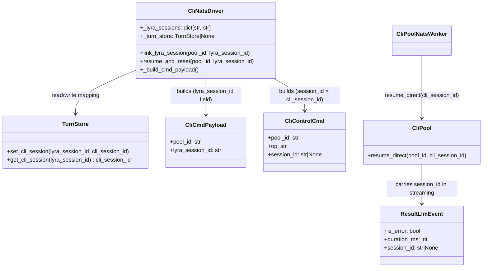

## Context

Promoted from frame `1008-nats-session-lifecycle-lyra-session-id-frame.mdx`.
Design was revised after architectural review: hub-side driver (`CliNatsDriver`) owns the
`lyra_session_id → cli_session_id` mapping; clipool worker is stateless (no TurnStore).
Follow-up cleanup tracked in #1009.

## Goal

Fix resume and `/clear` in the NATS clipool path by moving session persistence to the hub-side
driver. Clipool worker becomes a stateless CLI executor that receives `cli_session_id` directly
when a resume is needed.

## Users

- **Primary:** Telegram/Discord users who rely on session continuity (resume after bot restart,
  `/clear` to start a fresh Claude session).
- **Secondary:** Developers running `lyra adapter clipool` locally who observe silent session resets.

## Expected Behavior

### Normal turn (every message)

1. `SimpleAgent` calls `self._cli_pool.link_lyra_session(pool.pool_id, pool.session_id)` before
   sending — `pool.session_id` is the `lyra_session_id` UUID.
2. `CliNatsDriver.link_lyra_session` stores `_lyra_sessions[pool_id] = lyra_session_id` (was no-op).
3. `_build_cmd_payload` reads `_lyra_sessions.get(pool_id, pool_id)` for `lyra_session_id` field
   (was always `pool_id`).
4. Turn completes; driver receives `cli_session_id` in the result (`result.session_id` for blocking,
   `ResultLlmEvent.session_id` for streaming).
5. Driver writes `TurnStore.set_cli_session(lyra_session_id, cli_session_id)` — mapping now in hub's
   TurnStore.

### Resume path (reply-to-resume, fixed)

1. Hub resolves `lyra_session_id` from `MessageIndex`; `path_validation.py` calls
   `pool.resume_session(lyra_session_id)`.
2. Callback registered in `SimpleAgent._maybe_register_resume` fires:
   `CliNatsDriver.resume_and_reset(pool_id, lyra_session_id)`.
3. Driver looks up `cli_session_id = await _turn_store.get_cli_session(lyra_session_id)` — hub's
   TurnStore has the mapping.
4. Driver sends `CliControlCmd(op="resume_and_reset", session_id=cli_session_id)` — **note:** field
   now carries `cli_session_id`, not `lyra_session_id`.
5. Worker's `_dispatch_control` passes `cmd.session_id` directly to `pool.resume_direct(pool_id,
   cmd.session_id)` — no TurnStore lookup in worker.
6. `pool.resume_direct` kills the current process and stores `_resume_session_ids[pool_id] =
   cli_session_id` for next spawn.
7. Hub receives `resumed=True` in ACK; user sees continuation.

### /clear path (fixed)

1. `Pool.reset_session()` (`src/lyra/core/pool/pool.py`) generates a new `lyra_session_id` UUID.
2. Next turn: `SimpleAgent` calls `link_lyra_session(pool_id, new_uuid)` → driver stores it.
3. Turn completes; driver writes `set_cli_session(new_uuid, new_cli_session_id)`.
4. Future resume uses the new mapping.

## Data Model & Consumers



```mermaid
flowchart LR
    SA["SimpleAgent\nlink_lyra_session"] --> DRV["CliNatsDriver\n._lyra_sessions"]
    DRV -->|cmd: lyra_session_id\n(fixed)| NATS["NATS\nlyra.clipool.cmd"]
    NATS --> WKR["CliPoolNatsWorker"]
    WKR -->|result: cli_session_id| NATS2["NATS\nreply-to"]
    NATS2 --> DRV2["CliNatsDriver\nset_cli_session"]
    DRV2 --> TS["TurnStore\n(hub process)"]
    TS -->|get_cli_session\non resume| DRV3["CliNatsDriver\nresume_and_reset"]
    DRV3 -->|ctrl: cli_session_id\n(resolved)| WKR2["CliPoolNatsWorker\n._dispatch_control"]
    WKR2 -->|resume_direct| POOL["CliPool\n(no TurnStore)"]

    style TS fill:#d1fae5
    style POOL fill:#fef9c3
```

| Component | Reads from TurnStore | Writes to TurnStore | Status |
|---|---|---|---|
| `CliNatsDriver` (hub process) | `get_cli_session` on resume | `set_cli_session` after turn | This issue |
| `CliPoolNatsWorker` / `CliPool` | — | — | This issue (removed) |
| Telegram/Discord adapters | unchanged | unchanged | Not touched |

## Breadboard

| ID | Affordance | Handler | Data |
|---|---|---|---|
| N1 | `CliNatsDriver.__init__` | Add `_lyra_sessions: dict[str, str] = {}` and `_turn_store: TurnStore \| None = None`; add `set_turn_store(store)` method | Driver state |
| N2 | `CliNatsDriver.link_lyra_session(pool_id, uuid)` | Store `self._lyra_sessions[pool_id] = uuid` (remove no-op) | `_lyra_sessions` |
| N3 | `CliNatsDriver._build_cmd_payload` | Use `self._lyra_sessions.get(pool_id, pool_id)` for `lyra_session_id`. Fallback to `pool_id` only if `link_lyra_session` not yet called; must not raise. | `CliCmdPayload.lyra_session_id` |
| N4 | `CliNatsDriver.complete()` after result | If `result.session_id` and `_turn_store` and `pool_id in _lyra_sessions`: `create_task(_turn_store.set_cli_session(_lyra_sessions[pool_id], result.session_id))` | `TurnStore` |
| N5 | `CliNatsDriver._stream_gen_llm` after `ResultLlmEvent` | Same as N4 using `event.session_id` (requires `session_id` field on `ResultLlmEvent`) | `TurnStore` |
| N6 | `ResultLlmEvent` (events.py) | Add `session_id: str \| None = None` field | `LlmEvent` union |
| N7 | `CliPoolNatsWorker._handle_cmd_streaming` result chunk | Include `session_id=result_session_id` in `_make_chunk(event_type="result", ...)` | `CliChunkEvent` |
| N8 | `CliNatsDriver.resume_and_reset(pool_id, lyra_session_id)` | If `_turn_store`: `cli_sid = await _turn_store.get_cli_session(lyra_session_id)`; send `CliControlCmd(session_id=cli_sid)`. If no TurnStore or miss: send without session_id (cold start) | `CliControlCmd.session_id` = `cli_session_id` |
| N9 | `CliPoolNatsWorker._dispatch_control resume_and_reset` | Pass `cmd.session_id` directly to `pool.resume_direct(pool_id, cmd.session_id)` — no TurnStore lookup | `CliPool` |
| N10 | `CliPool.resume_direct(pool_id, cli_session_id)` | Kill process; store `_resume_session_ids[pool_id] = cli_session_id`; return `True`. No-op if process already on that session. | `_resume_session_ids` |
| N11 | Hub standalone bootstrap | After constructing `CliNatsDriver`, call `driver.set_turn_store(stores.turn)` | `CliNatsDriver._turn_store` |

## Slices

| # | Slice | Affordances | Demo-able outcome |
|---|---|---|---|
| S1 | Driver stores mapping + sends correct lyra_session_id | N1, N2, N3 | `CliCmdPayload.lyra_session_id` equals the linked UUID, not `pool_id` |
| S2 | Driver writes cli_session_id to hub TurnStore | N4, N5, N6, N7, N11 | After a turn, `TurnStore.get_cli_session(lyra_session_id)` returns the `cli_session_id` |
| S3 | Worker uses cli_session_id directly for resume | N8, N9, N10 | `resume_and_reset` returns `resumed=True` using hub's TurnStore; worker has no TurnStore |

All three slices ship together. S2 depends on S1 (correct `lyra_session_id` must be stored before it can be written). S3 depends on S2 (mapping must exist in hub's TurnStore before resume can work).

## Success Criteria

- [ ] `CliNatsDriver` has `_lyra_sessions: dict[str, str]` and `_turn_store: TurnStore | None`, both initialised in `__init__`.
- [ ] `CliNatsDriver.link_lyra_session(pool_id, uuid)` stores the mapping (no longer a no-op).
- [ ] `CliNatsDriver._build_cmd_payload` returns `pool_id` as fallback when dict is empty (no `KeyError`); returns the linked UUID when `link_lyra_session` has been called.
- [ ] `ResultLlmEvent` has a `session_id: str | None = None` field.
- [ ] `CliPoolNatsWorker._handle_cmd_streaming` includes `session_id` in the final result chunk.
- [ ] After a completed turn (blocking or streaming), `TurnStore.get_cli_session(lyra_session_id)` returns the `cli_session_id` (not `None`).
- [ ] `CliNatsDriver.resume_and_reset` sends `CliControlCmd.session_id` = the resolved `cli_session_id` (not `lyra_session_id`).
- [ ] `CliPoolNatsWorker._dispatch_control` passes `cmd.session_id` directly to `pool.resume_direct()` — no TurnStore in the worker code path.
- [ ] `CliPool.resume_direct(pool_id, cli_session_id)` exists and sets up `--resume` without TurnStore.
- [ ] Full round-trip: `link_lyra_session` → turn → `get_cli_session` returns mapping → `resume_and_reset` → `resumed=True`.
- [ ] No `TurnStore` import or usage in `clipool_standalone.py` or `clipool_worker.py`.
- [ ] No breaking contract changes to `CliCmdPayload` or `CliControlCmd` field names.
