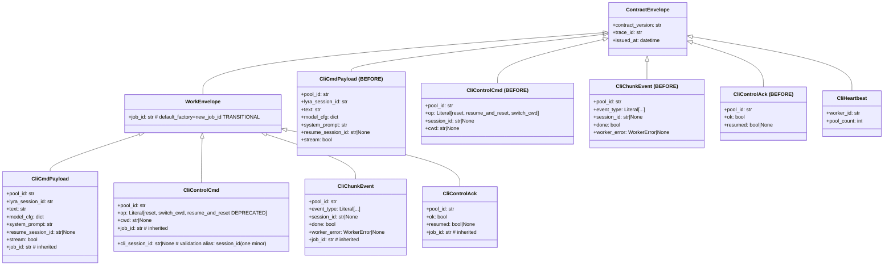
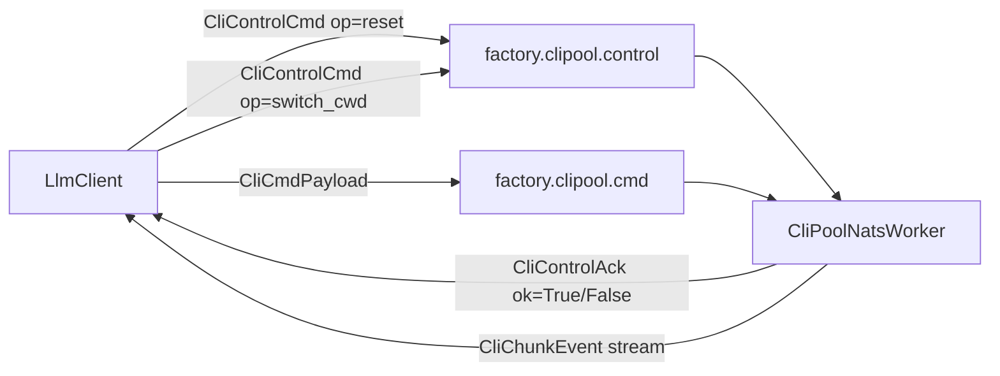

# Spec — cli session lifecycle cleanup + WorkEnvelope reparent

**Closes:** #1009 + #1838 · **Tier:** F-lite · **Target version:** rule — next minor above staging HEAD at rebase time (this lane merges AFTER #1793; if #1793 ships 0.10.0, this is 0.11.0)

---

## Context

Four cli contract models (`CliCmdPayload`, `CliControlCmd`, `CliChunkEvent`,
`CliControlAck`) are classified PENDING in `test_work_envelope_subjects.py`
because they still inherit `ContractEnvelope` instead of `WorkEnvelope`. This
blocks `job_id` invariant enforcement on the cli plane (Batch #2 of #1619
coordination).

Simultaneously, issue #1009 identified five hygiene defects on the cli control
surface:

1. `CliControlCmd.session_id` is ambiguously named — it holds the Claude CLI
   resume token, visually colliding with `CliCmdPayload.lyra_session_id`
   (conversation identity). ADR-084 §id-taxonomy names both explicitly; the
   wire field name has not yet been aligned.
2. `resume_and_reset` is a LIVE wire op that the issue intends to retire:
   `pool.resume_session()` is called from four production hub paths
   (`path_validation.py:88,140`, `pool_processor.py:51`,
   `session_commands.py:110`) → `simple_agent._maybe_register_resume` lambdas →
   `LlmClient.resume_and_reset` → wire op → functional worker branch
   (`clipool_worker.py:349` → `resume_direct`). The issue's premise ("resume
   embedded in the cmd payload via `resume_session_id`") refers to a DORMANT
   contract field: `CliCmdPayload.resume_session_id` exists (`cli/models.py:28`)
   but no producer sets it and the NATS worker never reads it. Retiring the op
   therefore means WIRING the embedded mechanism, not deleting dead code.
3. Resume outcome is not logged after `resume_direct()` completes.
4. `_lyra_sessions` dict is duplicated between `LlmClient` (`llm_client.py:62`)
   and `CliPoolSessionMixin` (`cli_pool_session.py`). On the NATS path,
   `LlmClient` should be the single owner.
5. ADR-084 Decision table lists 3 cli models (CliControlCmd, CliCmdPayload,
   CliHeartbeat) but is missing `CliChunkEvent` and `CliControlAck`, causing
   `doc_drift` CI to fire if the reparent lands without extending the table.

Because #1009 (rename + op removal) and #1838 (reparent) are both breaking cli
minor bumps, ADR-084 mandates co-landing them in a single bump to avoid two
satellite-coordination events.

---

## Goal

Deliver the cli-domain contracts minor (next minor above post-#1793 staging) by:
- Reparenting 4 PENDING models to `WorkEnvelope`
- Renaming `CliControlCmd.session_id` → `cli_session_id`
- Retiring the `resume_and_reset` wire op: producers stop sending (resume rides
  the dormant `CliCmdPayload.resume_session_id` field instead); consumer
  tolerance retained one minor per contracts deprecation policy
- Unifying `_lyra_sessions` ownership on the NATS path
- Extending ADR-084 table (doc_drift gate) and emitting a resume outcome log

**Out of scope (deferred):**
- Full `CliPool._lyra_sessions` removal: AC item 3 of #1009 specifies unification
  on the NATS path only; the local-path dict (`CliPoolSessionMixin._lyra_sessions`)
  is retained as required by `_persist_cli_session`. Complete removal would require
  refactoring the local path — deferred to a separate issue.
- `#1838` AC item: "ensure all cli job producers pass an explicit `job_id`" —
  this is tracked as a follow-up to the transitional `default_factory` shim
  retirement (#1841) and is NOT in scope here.

---

## Users

| User | Interaction |
|---|---|
| Agent pool (NATS path) | Sends `CliCmdPayload`, `CliControlCmd` via `LlmClient` |
| `CliPoolNatsWorker` | Receives contracts, routes to `CliPool`; returns `CliChunkEvent`, `CliControlAck` |
| `ClaudeCliDriver` (single-process) | Uses `CliPool` directly; not on NATS path |
| CI / quality gates | `test_work_envelope_subjects.py`, `doc_drift`, `str_exc_bus_bound` |

---

## Expected Behavior

### Wire-compat stance

`factory.clipool.{cmd,control,heartbeat}` are pure NATS request-reply (no
JetStream stream, no lock-pinned satellite consumer). But the op is LIVE and
factory containers update non-atomically on the M1 auto-update tick, so an
old hub can send `op="resume_and_reset"` / `session_id=` to a new worker for a
brief window. Per the contracts deprecation policy (deprecated one minor before
removal), this PR keeps CONSUMER tolerance:
- `"resume_and_reset"` STAYS in the `op` Literal, marked deprecated (docstring
  + CHANGELOG); the worker `_dispatch_control` branch is RETAINED functional.
- `cli_session_id` accepts the old wire name via
  `validation_alias=AliasChoices("cli_session_id", "session_id")`
  (serialization uses the new name).
- Producers stop sending the op NOW. Mechanical removal (Literal value, alias,
  worker branch) = follow-up issue created at ship time (sibling under epic
  #1044, blocked-by #1009).
`WorkEnvelope.job_id` retains its `default_factory` shim (CONTRACT_VERSION
stays `"1"`); hard-require is tracked in #1841.

### Rename resolution

Three distinct `session_id`-family fields exist across cli models:

| Field | Model | Rename? | Reason |
|---|---|---|---|
| `lyra_session_id` | `CliCmdPayload` | No | Conversation identity; explicit per ADR-084 |
| `session_id` | `CliControlCmd` | Yes → `cli_session_id` (+ one-minor `AliasChoices` tolerance for the old name) | Holds Claude CLI resume token; rename removes ambiguity |
| `session_id` | `CliChunkEvent` | No | Claude CLI stream event field; unambiguous in context |

### Live-op retirement — migration to embedded resume

The resume flow MUST keep working end-to-end; only its transport changes.

**Today (NATS path):** hub middleware (`path_validation.py:88,140`,
`pool_processor.py:51`, `session_commands.py:110`) → `pool.resume_session(sid)`
→ `_session_resume_fn` lambda (`simple_agent.py:192`) →
`ClaudeCliNatsDriver.resume_and_reset` (`drivers/cli.py:37`) →
`LlmClient.resume_and_reset` (turn-store lookup lyra→cli token, then wire op)
→ worker `_dispatch_control` → `pool.resume_direct(pool_id, cli_sid)` (queues
the token in `_resume_session_ids`, consumed at next spawn,
`cli_pool_spawn.py:131`).

**After (NATS path):** `LlmClient` keeps the turn-store lookup but, instead of
sending the control op, stashes the token in a pending-resume slot
(`self._pending_resume[pool_id] = cli_sid`) and returns `True` iff a token was
resolved. The next `CliCmdPayload` build (`llm_client.py:89,115`) carries
`resume_session_id=self._pending_resume.pop(pool_id, None)`. Worker-side, the
CMD handler reads `payload.resume_session_id` and, when set, seeds the pool via
the existing `pool.resume_direct(pool_id, cli_sid)` BEFORE dispatching the send
— reusing the queue-for-next-spawn mechanism the control op used.

**Semantics change (document in CHANGELOG):** the bool returned through
`pool.resume_session()` becomes "token resolved & queued" (application deferred
to next spawn) instead of "worker acknowledged resume". `CliControlAck.resumed`
stays for compat but is no longer produced by this flow.

**Local path:** behaviour unchanged — `CliPool.resume_and_reset`
(`cli_pool.py:155`, lambda at `simple_agent.py:186`) already queues for next
spawn in-process. Implementor MAY rename it (e.g. `queue_resume`) so the
`resume_and_reset` token disappears from producer paths; behaviour must not
change.

**Consumer tolerance (one minor):** the op Literal keeps
`"resume_and_reset"` (deprecated) and the worker control branch stays
functional — see Wire-compat stance.

### Session-dict unification (NATS path)

`LlmClient._lyra_sessions` remains the single owner for the NATS path.
`ClaudeCliDriver.link_lyra_session` delegates to `LlmClient` instead of
`CliPool` when in NATS mode. `CliPoolSessionMixin._lyra_sessions` is retained
for the local (single-process) path where `_persist_cli_session` uses it for
`TurnPublisher` lookup — full removal would break the local path.

### Resume outcome log

After `resume_direct()` completes in `clipool_worker.py`, emit:
`log.info("clipool: resume %s pool=%s", "ok" if resumed else "cold-start", pool_id)`.
This matches AC item 5 verbatim (`log.info`, `"ok"/"cold-start"` tokens, pool_id last).
Any exception path must use `type(exc).__name__`, never `str(exc)` or `f"{exc}"`
(`str_exc_bus_bound` gate).

---

## Data Model & Consumers

### Class diagram — before and after

**Diagram note:** unchanged fields are omitted for readability — `CliCmdPayload`
also preserves `agent_name: str|None` and `agent_email: str|None`
(`cli/models.py:30-31`); no field other than `CliControlCmd.session_id` is
renamed, none is removed.

### Control-plane flow

**Note:** flowchart shows NATS path only. Local path: `ClaudeCliDriver` → `CliPool`
(in-process; no NATS subjects involved).

### Consumer table

| Producer | Subject | Model(s) sent | Model(s) received |
|---|---|---|---|
| `LlmClient` | `factory.clipool.cmd` | `CliCmdPayload` (now carries `resume_session_id` when a resume is pending) | `CliChunkEvent` (stream) |
| `LlmClient` | `factory.clipool.control` | `CliControlCmd` | `CliControlAck` |
| `CliPoolNatsWorker` | `factory.clipool.heartbeat` | `CliHeartbeat` | — |
| `LlmClient` (Consumer) | NATS internal | — | `CliHeartbeat` (subscribe) |

**Note:** `CliHeartbeat` stays on `ContractEnvelope` (INFRA classification, no
job identity). All 4 PENDING models move to WORK; INFRA count stays at 9.

---

## Breadboard

### S1 affordances — contracts

| Affordance | Where | Input | Output |
|---|---|---|---|
| Reparent `CliCmdPayload` | `cli/models.py` | Class def | `(WorkEnvelope)` base |
| Reparent `CliChunkEvent` | `cli/models.py` | Class def | `(WorkEnvelope)` base |
| Reparent `CliControlCmd` | `cli/models.py` | Class def | `(WorkEnvelope)` base + rename `session_id`→`cli_session_id` with `AliasChoices` tolerance + deprecation note on `resume_and_reset` op literal (value retained one minor) |
| Reparent `CliControlAck` | `cli/models.py` | Class def | `(WorkEnvelope)` base |
| PENDING→WORK set move | `test_work_envelope_subjects.py` | 4 models in `PENDING_MODELS` | Moved to `WORK_MODELS`; `PENDING_MODELS = set()` |
| Count assertions | `test_work_envelope_subjects.py:124-129` | `WORK==13, PENDING==4` | `WORK==17, PENDING==0` |
| Parametrize narrow | `test_work_envelope_subjects.py:151` | `INFRA_MODELS \| PENDING_MODELS` | `INFRA_MODELS` only |
| Contract invariant test | new test in `test_work_envelope_subjects.py` | `CliCmdPayload(lyra_session_id=X, pool_id=Y)` | Assert `lyra_session_id != pool_id` |
| ADR-084 table extension | `docs/architecture/adr/084-workenvelope-job-id-invariant.mdx` | 3-row cli table | 5-row table (add `CliChunkEvent` → WORK, `CliControlAck` → WORK) |

**Wiring prose:** The 4 reparent edits and the test count/set updates must land
atomically — a partial reparent breaks CI on the
`test_non_work_model_not_subclass_of_work_envelope` parametrize. The ADR-084
table extension must land BEFORE or ATOMICALLY with the reparent to prevent
`doc_drift` CI from firing. Import of `WorkEnvelope` in `cli/models.py` comes
from `roxabi_contracts.envelope` (same module as `ContractEnvelope`).

### S2 affordances — src wiring (embedded-resume migration)

| Affordance | Where | Input | Output |
|---|---|---|---|
| Pending-resume slot | `llm_client.py` | `resume_and_reset` body (turn-store lookup RETAINED, ~line 160) | Lookup result stashed in `self._pending_resume[pool_id]`; control-op send + `CliControlCmd(... session_id=cli_sid)` construction (~line 183) deleted; returns True iff token resolved |
| Payload carries token | `llm_client.py:89,115` | `CliCmdPayload` builds | `+ resume_session_id=self._pending_resume.pop(pool_id, None)` |
| Worker reads embedded token | `clipool_worker.py` CMD handler | `payload.resume_session_id` | When set: `await self._pool.resume_direct(pool_id, cli_sid)` BEFORE dispatching the send |
| Producer purge | `src/factory/llm/drivers/cli.py:37`, `simple_agent.py` lambdas | `resume_and_reset` naming on producer paths | Renamed/rewired (behaviour preserved); no producer constructs `op="resume_and_reset"` |
| Local-path method rename (optional) | `src/factory/core/cli/cli_pool.py:155` | `CliPool.resume_and_reset` | MAY rename (e.g. `queue_resume`); behaviour unchanged |
| Worker control branch RETAINED | `clipool_worker.py` `_dispatch_control` | `if cmd.op == "resume_and_reset"` branch | Kept functional one minor; field access becomes `cmd.cli_session_id` (alias covers old-hub payloads) |
| Update `set_turn_store` docstring | `llm_client.py:130` | `"...in resume_and_reset"` | net removal of the `resume_and_reset` mention |
| Add resume outcome log | `clipool_worker.py` after `resume_direct()` (both control-branch and embedded paths) | completion point | `log.info("clipool: resume %s pool=%s", "ok" if resumed else "cold-start", pool_id)` |

**Wiring prose:** The turn-store lyra→cli token lookup currently inside
`LlmClient.resume_and_reset` is the part that SURVIVES — only the wire transport
changes (control op → embedded field). The `switch_cwd` construction (~line 200)
uses `cwd=str(cwd)` — no session field, no change. `pool.resume_session()`
callers in hub middleware are untouched: the lambda chain still resolves and
queues, it just no longer round-trips a control op. The `str_exc_bus_bound`
gate: any exception in the resume path must use `type(exc).__name__`, never
`str(exc)` or `f"{exc}"`.

### S3 affordances — unification + docs + version bump

| Affordance | Where | Input | Output |
|---|---|---|---|
| NATS-path session unification | `src/factory/core/cli/cli_pool_session.py` | `_lyra_sessions` dict usage on NATS path | `ClaudeCliDriver.link_lyra_session` delegates to `LlmClient`; mixin dict retained for local-path `_persist_cli_session` |
| CHANGELOG entry | `packages/roxabi-contracts/CHANGELOG.md` | post-#1793 head entry | next-minor section: rename (+alias), op deprecation + embedded-resume migration, reparent (breaking, cli minor) |
| Version bump | `packages/roxabi-contracts/pyproject.toml` | post-#1793 value | next minor above staging HEAD at rebase time |

**Wiring prose:** The `_lyra_sessions` mixin dict in `CliPoolSessionMixin` is
used by `_persist_cli_session` (line 46, `cli_pool_session.py`) to look up
`lyra_session_id` for TurnPublisher routing. On the local (single-process)
path, `ClaudeCliDriver` calls `pool.link_lyra_session(pool_id, lyra_session_id)`
which writes into the mixin dict — this path does NOT go through `LlmClient`.
Unification scope: only the NATS path call site (`simple_agent.py:226-228`)
must delegate through `LlmClient.link_lyra_session`; the mixin dict is not
removed. Landing order: rebase on top of #1793 (jobs minor) before pushing so
that `pyproject.toml` starts from #1793's version, then bump to the next minor
(rule, not a hardcoded number: 0.11.0 if #1793 shipped 0.10.0).

---

## Slices

### S1 — Contracts: rename + op removal + reparent + enforcement-test update

**Independently demo-able:** `uv run pytest packages/roxabi-contracts/tests/` passes green.

Files touched:
- `packages/roxabi-contracts/src/roxabi_contracts/cli/models.py`
- `packages/roxabi-contracts/tests/test_work_envelope_subjects.py`
- `docs/architecture/adr/084-workenvelope-job-id-invariant.mdx`

Changes:
1. `cli/models.py`: import `WorkEnvelope` from `roxabi_contracts.envelope`.
   Reparent `CliCmdPayload`, `CliChunkEvent`, `CliControlCmd`, `CliControlAck`
   from `ContractEnvelope` to `WorkEnvelope`. On `CliControlCmd`: rename field
   `session_id` → `cli_session_id` with
   `validation_alias=AliasChoices("cli_session_id", "session_id")` (one-minor
   tolerance; serialization uses the new name); KEEP
   `Literal["reset", "resume_and_reset", "switch_cwd"]` with a deprecation
   docstring on `resume_and_reset` (removal = follow-up issue at ship).
2. `test_work_envelope_subjects.py`: move the 4 cli models from `PENDING_MODELS`
   to `WORK_MODELS`; set `PENDING_MODELS = set()` (or remove the set entirely
   with comment noting graduation). Update count assertions:
   `WORK==17`, `PENDING==0`, `ALL==26`. Narrow `test_non_work_model_not_subclass_of_work_envelope`
   parametrize from `INFRA_MODELS | PENDING_MODELS` to `INFRA_MODELS`. Add
   `test_cli_cmd_payload_lyra_session_id_not_pool_id` asserting the two fields
   are distinct after construction (SC-6).
3. `084-workenvelope-job-id-invariant.mdx`: extend Decision table from 3 rows
   to 5 rows, adding `CliChunkEvent` (WORK — response side of work op) and
   `CliControlAck` (WORK — ack of work control op); `CliHeartbeat` keeps its
   explicit INFRA (excluded) row. Add a short note documenting the one-minor
   deprecation of `resume_and_reset` + the `session_id` validation alias. This
   must land BEFORE or atomically with the model reparent to keep `doc_drift`
   green.

**`cli/__init__.py` disposition:** `packages/roxabi-contracts/src/roxabi_contracts/cli/__init__.py`
is a 18-line re-export file; verified no-op — no change required (re-exports
remain valid after reparent, `WorkEnvelope` base is transparent to importers).

**Must NOT do in S1:** touch any `src/factory/` files — keeps the slice
reviewable in isolation.

---

### S2 — Src wiring: llm_client + clipool_worker cleanup

**Independently demo-able:** `uv run pytest tests/` passes green; resume works
end-to-end via the embedded field; `grep -rn "resume_and_reset" src/factory/llm/ src/factory/agents/`
returns empty (producer paths purged — the worker tolerance branch and the
optional local-pool rename are the only permitted survivors). **Note:** S1 must
land first — `cmd.cli_session_id` (renamed field) must exist in the contracts
package before `clipool_worker.py` compiles against it.

Files touched:
- `src/factory/llm/llm_client.py`
- `src/factory/llm/drivers/cli.py`
- `src/factory/core/cli/cli_pool.py`
- `src/factory/adapters/clipool/clipool_worker.py`
- `src/factory/agents/simple_agent.py`

Changes:
1. `llm_client.py`: REWIRE `resume_and_reset` (lines ~160–196) into the
   pending-resume mechanism — keep the turn-store lyra→cli lookup, replace the
   control-op send (and the `CliControlCmd(... session_id=cli_sid)` construction
   at ~line 183) with `self._pending_resume[pool_id] = cli_sid`; return True iff
   a token was resolved. Add `resume_session_id=self._pending_resume.pop(pool_id, None)`
   to both `CliCmdPayload` builds (lines 89/115). Rename the method so the
   `resume_and_reset` token leaves producer paths (suggestion: `queue_resume`).
   Update `set_turn_store` docstring (net removal of the `resume_and_reset`
   mention). The `switch_cwd` construction (~line 200) needs no change.
2. `drivers/cli.py`: keep the delegation but follow the rename; docstring
   updated (still: `pool.resume_session(sid)` → hub-side queue).
3. `cli_pool.py`: local-path `resume_and_reset` behaviour unchanged; MAY rename
   to match (update `simple_agent.py:186` lambda accordingly).
4. `clipool_worker.py`: (a) CMD handler reads `payload.resume_session_id` —
   when set, `await self._pool.resume_direct(pool_id, cli_sid)` before
   dispatching the send; (b) `_dispatch_control` `resume_and_reset` branch is
   RETAINED functional for one minor, field access updated to
   `cmd.cli_session_id` (alias covers old-hub payloads); (c) add resume outcome
   info log after `resume_direct()` (both paths — log level `info`, tokens
   `"ok"/"cold-start"`, field `pool_id`).
5. `simple_agent.py`: keep `_maybe_register_resume` and both
   `register_session_callbacks(resume_fn=...)` call sites — the resume chain is
   LIVE (hub middleware depends on it); only the method names it calls follow
   the renames from items 1–3.

**str_exc_bus_bound invariant:** any exception path in `_handle_control` must
use `type(exc).__name__`, not `str(exc)` — the existing `_classify_exception`
helper already follows this pattern (lines 56–77 of `clipool_worker.py`).

---

### S3 — Local-path unification + docs + version bump

**Independently demo-able:** `uv run pytest` full suite passes; `pyproject.toml` version reads the next minor above the post-#1793 staging value; CHANGELOG entry present.

Files touched:
- `src/factory/core/cli/cli_pool_session.py`
- `packages/roxabi-contracts/CHANGELOG.md`
- `packages/roxabi-contracts/pyproject.toml`

Changes:
1. `cli_pool_session.py`: verify `ClaudeCliDriver.link_lyra_session` delegates
   to `LlmClient` on the NATS path (`simple_agent.py:226-228`). The mixin's
   `_lyra_sessions` dict MUST be retained for `_persist_cli_session` (local
   path). The resume outcome log is part of S2 (`clipool_worker.py`) — no
   log change needed here.
2. `CHANGELOG.md`: add next-minor section before existing entries:
   - Breaking: `CliControlCmd.session_id` renamed to `cli_session_id`
     (old name accepted via validation alias for one minor)
   - Deprecated: `resume_and_reset` op — producers migrated to embedded
     `CliCmdPayload.resume_session_id`; worker tolerance retained one minor;
     removal tracked in the ship-time follow-up issue
   - Behaviour: resume acceptance semantics become "token resolved & queued"
     (applied at next spawn)
   - Breaking: `CliCmdPayload`, `CliChunkEvent`, `CliControlCmd`, `CliControlAck`
     reparented to `WorkEnvelope` (adds `job_id` field with transitional
     `default_factory` shim)
3. `pyproject.toml`: bump `version` to the next minor above the post-#1793
   staging value (rebase on #1793 first to avoid conflict).

---

## Success Criteria

All criteria are binary pass/fail. "Passes" = zero failures, zero warnings on
the gated check.

| # | Criterion | How to verify |
|---|---|---|
| SC-1 | `CliCmdPayload`, `CliChunkEvent`, `CliControlCmd`, `CliControlAck` all inherit `WorkEnvelope` | `issubclass(CliCmdPayload, WorkEnvelope)` → True (and peers) |
| SC-2 | `CliHeartbeat` still inherits `ContractEnvelope` (NOT `WorkEnvelope`) | `issubclass(CliHeartbeat, WorkEnvelope)` → False |
| SC-3 | `CliControlCmd.op` still accepts `"resume_and_reset"` (deprecated, one-minor tolerance) and its docstring carries the deprecation note | `CliControlCmd(op="resume_and_reset", ...)` validates; `grep -i "deprecated" cli/models.py` hits the op |
| SC-4 | `CliControlCmd` field is `cli_session_id`; old wire name still accepted via validation alias | `model_fields` contains `cli_session_id` not `session_id`; `CliControlCmd.model_validate({..., "session_id": "x"})` populates `cli_session_id == "x"`; serialization emits `cli_session_id` |
| SC-5 | `CliChunkEvent.session_id` is unchanged (field still named `session_id`) | `CliChunkEvent.model_fields["session_id"]` exists |
| SC-6 | `CliCmdPayload.lyra_session_id != pool_id` on construction (contract test) | `test_cli_cmd_payload_lyra_session_id_not_pool_id` passes |
| SC-7 | `WORK_MODELS` count == 17, `PENDING_MODELS` count == 0, `ALL_CLASSIFIED` count == 26 | `test_completeness_coverage` passes |
| SC-8 | `test_non_work_model_not_subclass_of_work_envelope` parametrize covers only INFRA (not PENDING) | Parametrize source = `INFRA_MODELS`; test passes for all 9 INFRA models |
| SC-9 | ADR-084 Decision table has 5 cli rows (CliControlCmd, CliCmdPayload, CliHeartbeat, CliChunkEvent, CliControlAck) | `grep -c "| CliChunk\|CliControlAck" docs/architecture/adr/084-workenvelope-job-id-invariant.mdx` ≥ 2 |
| SC-10 | `doc_drift` gate passes | `python3 tools/check_doc_drift.py` exits 0 |
| SC-11 | No PRODUCER references to `resume_and_reset` remain (only the retained worker tolerance branch may survive in `src/`) | `grep -rn "resume_and_reset" src/factory/llm/ src/factory/agents/ src/factory/core/` returns empty; remaining hits ⊆ `clipool_worker.py` `_dispatch_control` |
| SC-18 | Embedded resume works end-to-end: hub `pool.resume_session(sid)` → next `CliCmdPayload.resume_session_id` carries the resolved token → worker seeds `pool.resume_direct` before send | integration test in `tests/adapters/clipool/` asserts the chain with a fake pool |
| SC-19 | No in-repo producer constructs `CliControlCmd(op="resume_and_reset")` | `grep -rn 'op="resume_and_reset"' src/` returns empty (worker branch only READS the op) |
| SC-12 | No `str(exc)` / `f"{exc}"` / `repr(exc)` in NATS-bus-bound fields in touched files | `tools/check_str_exc_bus_bound.sh` exits 0 |
| SC-13 | `CliCmdPayload` with no `job_id` still deserializes (wire-compat, `default_factory` retained) | `CliCmdPayload.model_validate({...no job_id...})` → valid; `job_id` minted by factory |
| SC-14 | `packages/roxabi-contracts/pyproject.toml` version == next minor above the post-#1793 staging value | `grep '^version' packages/roxabi-contracts/pyproject.toml` vs `git show origin/staging:packages/roxabi-contracts/pyproject.toml` |
| SC-15 | CHANGELOG head section documents rename+alias, op deprecation + embedded migration, semantics change, reparent | `grep -c "cli_session_id\|resume_and_reset\|WorkEnvelope" packages/roxabi-contracts/CHANGELOG.md` ≥ 3 |
| SC-16 | `LlmClient.set_turn_store` docstring no longer references `resume_and_reset` (stale tail removed) | `grep "resume_and_reset" src/factory/llm/llm_client.py` returns empty |
| SC-17 | Resume outcome logged after `resume_direct()` in `clipool_worker.py` | Log line present; uses `type(exc).__name__` not `str(exc)` in any error path |

---

## Open Questions

None — all prior questions were resolved at lead arbitrage (2026-06-11):
landing order is a rule (merge after #1793, version = next minor); the
`simple_agent.py:226-228` dispatch seam was code-verified; the
`resume_and_reset` caller graph was fully enumerated (live op → migration, see
Live-op retirement section).

### Impl checklist notes (not blockers)

- **Pre-push gates are CI-only on lead worktree pushes**: run manually before
  push — `tools/check_architecture_snapshot.sh`, `tools/check_test_sleep.sh`,
  `tools/check_debt_expiry.sh`, import_layers, doc_drift (per memory note
  `feedback-prepush-gates-skip-on-lead-worktree-push`).
- **`file_length` gate**: `llm_client.py` ~212 lines pre-change; the rewire is
  roughly size-neutral — verify it and `cli_pool.py`/`clipool_worker.py` stay
  under 300 SLOC after edits.
- **Ship-time follow-up issue**: create the mechanical-removal sibling (Literal
  value + alias + worker branch) under epic #1044, blocked-by #1009, at ship.

---

## Pre-check

Self-run of the 5 mandatory checks before returning this spec:

1. **Testable criteria**: All 19 SC entries are binary pass/fail with a
   verifiable command or assertion. SC-6 names the test function. SC-9 gives a
   grep command. SC-11/SC-19 give scoped negative greps. SC-13 gives a Pydantic
   call. SC-18 names the integration-test location. All criteria are objective.
   (Revised at lead arbitrage 2026-06-11: live-op evidence reversed SC-3/SC-4
   semantics, added SC-18/SC-19.)

2. **Dangling refs**: Confirmed all file paths exist in the repo:
   `packages/roxabi-contracts/src/roxabi_contracts/cli/models.py` (71 lines,
   read), `tests/test_work_envelope_subjects.py` (204 lines, read),
   `src/factory/llm/llm_client.py` (212 lines, read),
   `src/factory/core/cli/cli_pool_session.py` (68 lines, read),
   `src/factory/adapters/clipool/clipool_worker.py` (read). Line numbers cited
   (160, 183, 130, 62, 92) verified against current file state. `084-workenvelope-job-id-invariant.mdx`
   path confirmed in frame.

3. **Ambiguity (max 5 open questions)**: Zero open questions remain (all
   resolved at lead arbitrage with code evidence). The 3-session-id field
   disambiguation is fully resolved inline in Expected Behavior and Data Model
   sections with a decision table — not deferred.

4. **Slice coverage**: S1 covers contracts/tests/docs (independently testable:
   contracts pytest suite). S2 covers src wiring (independently testable: full
   pytest + grep). S3 covers unification + CHANGELOG + version (independently
   testable: pyproject.toml + changelog review). All 11 frame files are covered
   across the 3 slices. Each slice produces a standalone green CI state.

5. **Edge completeness**: Wire-compat (no `job_id` in old messages → SC-13;
   old `session_id` wire name → SC-4 alias; old-hub `resume_and_reset` during
   deploy skew → SC-3 tolerance branch); `CliChunkEvent.session_id` NOT renamed
   (SC-5); `CliHeartbeat` stays ContractEnvelope (SC-2); embedded resume
   end-to-end (SC-18) + producer purge (SC-19); `str_exc_bus_bound` gate
   (SC-12); PENDING→WORK parametrize narrowing (SC-8); doc_drift pre-condition
   ordering (S1 lands ADR table before reparent).
