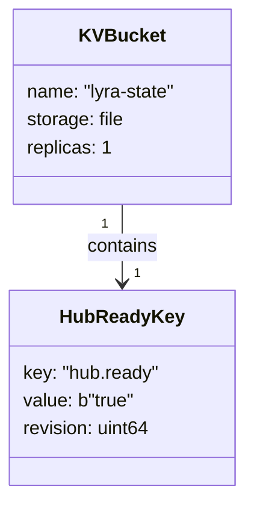
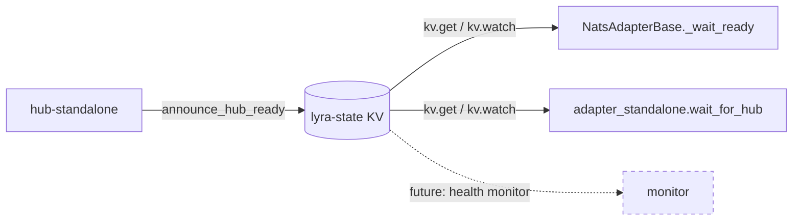

## Context

Promoted from `artifacts/frames/1012-nats-kv-readiness-probe-frame.mdx`.

Hub's NATS ACL enforces `allow_responses: false` (commit `5b3b6c4a`). Hub cannot
publish to dynamic inbox subjects, so the current req/reply readiness probe
(`wait_for_hub()` → `lyra.system.ready`) never receives a reply. Every adapter
restart stalls for up to 20 min and floods logs with 1200 ACL violations/sec.

## Goal

Replace the req/reply probe with a JetStream KV watch so hub announces readiness
by writing a persistent key, and adapters read it without any inbox or reply
subject — fully compatible with strict `allow_responses: false` ACLs.

## Users

- **Primary:** `lyra-clipool` adapter (`clipool-worker` identity) — stalls 20 min on restart
- **Secondary:** `lyra-telegram` (`telegram-adapter`) and `lyra-discord` (`discord-adapter`)
  adapters — same code path via `NatsAdapterBase._wait_ready()`, currently masked
  because they restart less often
- **Tertiary:** on-call / developer restarting any adapter on production

## Expected Behavior

### Hub startup

1. Hub connects to NATS, opens JetStream KV bucket `lyra-state` (creates if absent)
2. Hub writes key `hub.ready = b"true"` to `lyra-state` via `kv.put()` (idempotent)
3. Hub logs `"Hub KV ready announced"` at INFO
4. Hub proceeds with normal startup (inbound bus, readiness responder, etc.)

### Adapter startup — key already present (common path)

1. Adapter connects, opens KV bucket `lyra-state`
2. `kv.get("hub.ready")` returns entry with value `b"true"` → proceed immediately
3. Adapter logs `"Hub ready (KV immediate)"` at INFO

### Adapter startup — key absent (startup race path)

1. Adapter connects, opens KV bucket `lyra-state`
2. `kv.get("hub.ready")` returns `KeyNotFoundError` → start KV watch
3. Iterate watcher: skip `None` (init-done sentinel); act on entry with `value == b"true"`
4. Adapter logs `"Hub ready (KV watch)"` at INFO after key arrives
5. Default timeout: 30 s (matches existing `PROBE_TIMEOUT_S`); on expiry: log WARNING, return `False`, continue anyway

### Properties

- No inbox, no reply subject, no `allow_responses` dependency
- KV value is persistent — adapters starting after hub get it immediately with no race
- Zero probe loop → zero log flooding, zero 20-min startup delay
- Hub writes once; no heartbeat, no TTL

### `start_readiness_responder()` disposition

Keep as-is — it still works for identities with `allow_responses: true` and costs
nothing. Removal is a follow-on concern, not in scope.

### JetStream unavailable

If JetStream is not enabled on the NATS server:
- `announce_hub_ready(nc)`: log WARNING `"Hub KV unavailable — JetStream not enabled"`, return without writing key. Hub continues normally.
- `wait_for_hub(nc)`: log WARNING `"wait_for_hub: JetStream not enabled — skipping probe"`, return `False` immediately (same behavior as timeout).

Both functions degrade gracefully — startup continues rather than hard-failing.
Embedded NATS (unified mode) must have `jetstream: {}` enabled in server config.

## Data Model & Consumers





| Consumer | Fields read | When | Status |
|----------|------------|------|--------|
| `NatsAdapterBase._wait_ready()` | `hub.ready` value | adapter startup | this issue |
| `adapter_standalone` (direct calls, lines 139+275) | `hub.ready` value | adapter startup | this issue |
| `hub_standalone` | writes key | hub startup | this issue |
| health monitor | `hub.ready` existence + revision | periodic poll | future |

## Breadboard

| ID | Affordance | Handler | Data |
|----|-----------|---------|------|
| N1 | `announce_hub_ready(nc)` | `readiness.py` — hub side | Open bucket: `await js.key_value("lyra-state")` → on `BucketNotFoundError`: `await js.create_key_value(KeyValueConfig(bucket="lyra-state", storage=StorageType.FILE))`. Then `await kv.put("hub.ready", b"true")`. `kv.put()` is always idempotent (update semantics). Logs INFO on success, WARNING if JetStream unavailable. |
| N2 | `wait_for_hub(nc, timeout=30.0)` | `readiness.py` — adapter side | Open bucket; try `kv.get("hub.ready")` — if value `b"true"`: return `True` (immediate path). On `KeyNotFoundError`: watch with `kv.watch("hub.ready", deliver_last_per_subject=True)` → iterate: `if entry is None: continue` (skip init-done sentinel); `if entry.value == b"true": return True`. On timeout: log WARNING, return `False`. Signature retains `timeout` kwarg (default 30.0 s) — preserves existing call sites in `adapter_standalone.py` (lines 139, 275) that omit timeout. |
| N3 | KV bucket `lyra-state` | JetStream (NATS server) | Persistent, file-backed, replicas=1; survives NATS restart. Created by hub on first startup. |
| N4 | ACL — hub (`UDUMMYHUB`) | `deploy/nats/auth.conf` | **Add** `"$JS.API.>"` to `publish.allow`. Subscribe `_inbox.hub.>` already present — no change needed (JetStream API replies land there). Subscribe `$KV.lyra-state.>` not needed for writer path (put goes via JS API, response comes back on inbox). |
| N5 | ACL — adapters | `deploy/nats/auth.conf` | For each of `telegram-adapter`, `discord-adapter`, `clipool-worker`: **add** `"$JS.API.>"` to `publish.allow`; **add** `"$KV.lyra-state.>"` to `subscribe.allow`. Existing `_inbox.<identity>.>` subscribe grant already covers JS API reply delivery — no change needed. |
| N6 | Hub wiring | `hub_standalone.py` | Call `announce_hub_ready(nc)` after `nats_connect()`, before `start_readiness_responder()`. |

### Wiring

```
hub_standalone
  → nats_connect() [existing]
  → announce_hub_ready(nc)         [N1, N6] NEW — provisions bucket + writes key
  → start_readiness_responder()    [existing, unchanged]

NatsAdapterBase.run()
  → nats_connect() [existing]
  → _wait_ready()
      → wait_for_hub(nc, timeout)  [N2] REPLACED — KV get/watch instead of req/reply

adapter_standalone (direct callers, lines 139 + 275)
  → wait_for_hub(nc)               [N2] REPLACED — same function, updated internals
```

## Slices

| # | Slice | Files | Demo |
|---|-------|-------|------|
| S1 | KV probe — core logic | `roxabi-nats/readiness.py`, `test_readiness.py` | `wait_for_hub()` returns True via KV key (no req/reply); `announce_hub_ready()` is idempotent on second call; timeout path returns False |
| S2 | Hub announces ready | `hub_standalone.py` | Hub startup log shows `"Hub KV ready announced"` |
| S3 | ACL grants | `deploy/nats/auth.conf` | `nats kv get lyra-state hub.ready` succeeds with hub nkey; adapter identities connect and `wait_for_hub()` logs KV path (not timeout) |

**Development order:** S1 → S2 → S3 (S1 is testable without auth using plain `nats-server`).

**Production deployment order:** S3 first (ACL pre-grant — additive, safe before code uses it) → S2 → S1. If S1+S2 ship before S3, hub will log ACL errors on `$JS.API.*` publish until S3 is deployed. Deploying S3 first eliminates this window.

## Success Criteria

- [ ] `wait_for_hub(nc)` returns `True` when `lyra-state/hub.ready` key exists (KV immediate path)
- [ ] `wait_for_hub(nc)` returns `True` when key is written after probe starts (KV watch path); watcher skips `None` sentinel correctly
- [ ] `wait_for_hub(nc)` returns `False` and logs WARNING after 30 s timeout with key absent
- [ ] `wait_for_hub(nc)` returns `False` immediately and logs WARNING when JetStream is not enabled
- [ ] `announce_hub_ready(nc)` writes `hub.ready = b"true"` to `lyra-state` bucket; second call on same bucket is idempotent (uses `kv.put`, not `kv.create`)
- [ ] `announce_hub_ready(nc)` logs WARNING and returns without error when JetStream is not enabled
- [ ] Hub startup log contains `"Hub KV ready announced"` at INFO when JetStream is available
- [ ] Adapters log `"Hub ready (KV immediate)"` or `"Hub ready (KV watch)"` at INFO on startup
- [ ] `hub_standalone` calls `announce_hub_ready()` before `start_readiness_responder()`
- [ ] Adapters with `allow_responses: false` start within 5 s of hub ready when S3 (ACL) is deployed on production
- [ ] Zero NATS ACL violation logs during adapter startup in production after S3 is deployed (production-only check; no CI proxy)
- [ ] `start_readiness_responder()` remains in module and all existing tests pass unchanged
- [ ] Hub ACL includes `$JS.API.>` in `publish.allow`; each adapter ACL (`telegram-adapter`, `discord-adapter`, `clipool-worker`) includes `$JS.API.>` in `publish.allow` and `$KV.lyra-state.>` in `subscribe.allow`
