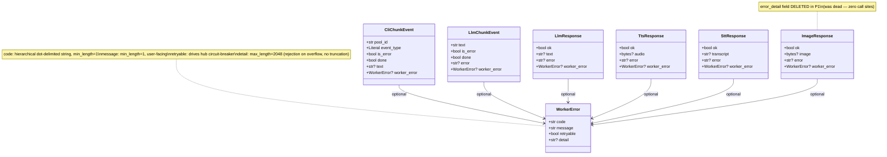
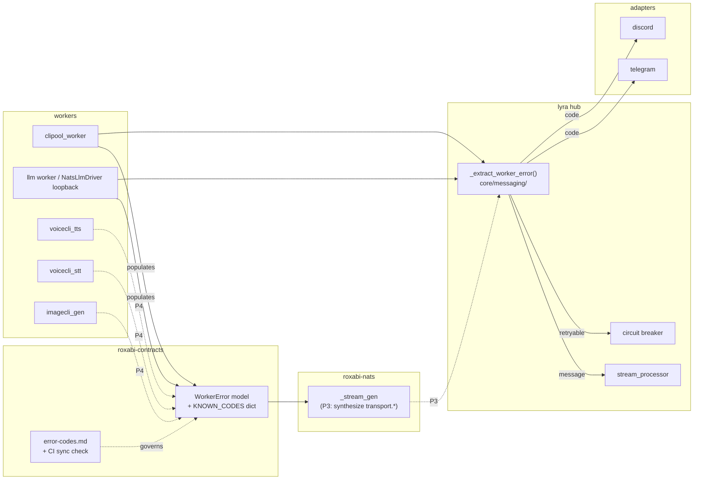

## Context

Promoted from: `artifacts/analyses/1016-worker-error-envelope-analysis.mdx`
Frame: `artifacts/frames/1016-worker-error-envelope-frame.mdx`
Decision: `docs/architecture/adr/066-unified-worker-error-envelope-nats-reply-contracts.mdx`

Six NATS reply envelopes carry four different error contracts. Three SDK silent-drop sites in `roxabi-nats` hide transport failures (timeout, parse, slow consumer). One driver (`NatsLlmDriver`) exposes two divergent error shapes (`LlmResult.error` vs `ResultLlmEvent.error_text`) for the same conceptual failure. Production has zero structured error telemetry — bare ❌ in Telegram is the only signal, and regressions are invisible.

ADR-066 selected the additive `WorkerError` envelope on 5 reply contracts (Option B), with open-string codes governed by a registry, driver-side SDK transport synthesis, and adoption telemetry as the gate metric for shim deletion. This spec pins acceptance criteria, locks the open questions from the analysis (helper location, telemetry log format, CI wiring, validation policy), defines slice boundaries between P1 and P2 (P3 + P4 deferred to child issues), and writes the 48h soak-gate condition as an executable check.

## Goal

A user whose worker fails sees a message that names what went wrong and whether to retry — driven by a single `WorkerError { code, message, retryable, detail? }` payload populated by every NATS reply path, observable via structured-log adoption counters, and additive per ADR-049 with no `CONTRACT_VERSION` bump.

## Users

- **End users (Telegram, Discord)** — replace bare ❌ / "Something went wrong" with actionable, error-specific messages.
- **Hub developers** — one `_extract_worker_error` helper instead of pattern-matching free-text; `retryable` drives circuit-breaker / retry-prompt policy.
- **Future worker authors (#988 harness, future agentic workers)** — single documented contract for "how do I report an error from my worker."
- **Operators / on-call** — structured `code` + `domain` counters for grouping, alerting, and adoption gating; replace ad-hoc string matching.
- **Adapter authors** — stable `code` lookup as the foundation for future i18n (out of scope of this issue).
- **QA / test authors (tester subagent for F-full)** — write the `tests/integration/test_worker_error_e2e.py` integration test asserted by C6; maintain it through P2 + cross-repo P4.

## Implementation Constraints / Guardrails

These are guardrails for `/implement` to prevent scope leak; they are not restated as criteria but apply throughout.

- **Touch `src/lyra/llm/drivers/nats_driver.py` for `worker_error` population only.** The known coupling between `NatsLlmDriver` and `NatsDriverBase` (duplicate heartbeat / `_any_worker_alive` logic, architect-flagged) is **explicitly deferred to P3**. Do not refactor toward `NatsDriverBase` in this issue.
- **Touch `src/lyra/core/processors/stream_processor.py` for hub fallback removal only.** Do not add retry policy, backoff schedules, or circuit-breaker decisions inline. `retryable` is exposed; consumer policy lives in a separate concern.
- **Driver-side `transport.*` codes (timeout, parse, no_responders) populated by drivers in P2 are temporary scaffolding.** P3's SDK synthesis must remove these driver-side population sites. Do not duplicate the synthesis logic in both layers when P3 lands.
- **Counter emissions use a fixed grep-stable log format** (pinned in C3 below). Do not invent a new format per process.
- **CI sync check `check_codes_sync.py` runs on every `lyra` PR** (since `roxabi-contracts` is a `packages/` workspace member). Do not assume a separate `roxabi-contracts` CI pipeline catches drift.
- **Additive-only.** No `CONTRACT_VERSION` bump. No removal of existing fields except `ImageResponse.error_detail` (audit-confirmed dead, zero call sites). `is_error` / `ok` retained alongside `worker_error`.

## Expected Behavior

**Today (broken):** A clipool session times out. `clipool_worker._handle_cmd_streaming` catches the exception and publishes `CliChunkEvent(is_error=True, done=True)` with no message field. The hub falls through to the hardcoded English string `"Something went wrong. Please try again."` Adapter prepends ❌. User sees `❌ Something went wrong. Please try again.` regardless of whether the cause is a session expiry, a quota hit, or a worker crash.

**After P1+P2:** The same clipool timeout produces `WorkerError(code="cli.session_lost", message="CLI session expired — please retry.", retryable=True)`. The hub extracts it via the single `_extract_worker_error` helper and renders `WorkerError.message`. User sees `❌ CLI session expired — please retry.` Operator dashboards show `worker_error_received_total{code="cli.session_lost", domain="cli"}` ticking up. The legacy `error_text` shim coexists transitionally; a follow-up child issue removes it once the 48h soak gate has returned `PASS` continuously.

## Data Model & Consumers

### `WorkerError` model



### Consumer flow (this issue: solid; future: dashed)



### Consumer summary

| Consumer | Fields used | When | Status |
|---|---|---|---|
| `_extract_worker_error` (hub helper) | all 4 | every reply / chunk | P2 (this issue) |
| `stream_processor` | `message` | rendering final text | P2 |
| Adapter renderer | `message`, `code` _(read but not yet keyed for i18n)_ | final text emit | P2 |
| Hub circuit breaker | `retryable` | open/half-open decisions | P2 |
| Operator dashboards | `code`, `domain` (label) | counter aggregation via journald grep | P1 |
| `clipool_worker` exception handlers | all 4 (constructs) | exception → reply | P2 |
| `NatsLlmDriver.complete()` / `.stream()` | all 4 (constructs) | timeout / parse / no-responders | P2 (driver-side); P3 will move to SDK |
| SDK `_stream_gen` (synthesizes transport.\*) | all 4 (constructs) | timeout / parse | _P3 child issue (out of scope)_ |
| `voicecli_tts` / `_stt` / `imagecli_gen` workers | all 4 (constructs) | exception → reply | _P4 child issue (out of scope)_ |
| Adapter i18n locale mapping | `code` | render | _P6 separate epic (out of scope)_ |

## Breadboard

### Affordances

| ID | Affordance | Handler | Data |
|---|---|---|---|
| **N1** | `WorkerError` Pydantic model | `packages/roxabi-contracts/src/roxabi_contracts/errors.py` (new) | `code: str (min_length=1)`, `message: str (min_length=1)`, `retryable: bool = True`, `detail: str \| None (max_length=2048, no truncation)` |
| **N2** | `KNOWN_CODES` dict | `packages/roxabi-contracts/src/roxabi_contracts/errors.py` | `dict[str, CodeMeta(domain, default_retryable, description)]` for all codes from ADR-066 |
| **N3** | `error-codes.md` table | `packages/roxabi-contracts/docs/error-codes.md` (new) | mirror of N2, human-readable Markdown |
| **N4** | `check_codes_sync.py` CI script | `packages/roxabi-contracts/scripts/check_codes_sync.py` (new dir + new file) | exit 0 on N2↔N3 parity, exit 1 on drift; invoked from existing `lyra` CI workflow (the workflow that runs `uv run pytest`) as `uv run python packages/roxabi-contracts/scripts/check_codes_sync.py` |
| **N5** | `worker_error: WorkerError \| None = None` field | each of 5 reply envelopes (`CliChunkEvent`, `LlmChunkEvent`, `LlmResponse`, `TtsResponse`/`SttResponse`, `ImageResponse`) | additive optional |
| **N6** | `error_detail` deletion | `ImageResponse` | remove dead field |
| **N7** | `roxabi_contracts.__version__` startup log | each process bootstrap (`src/lyra/cli/_bootstrap_*.py`) | one log line at startup, `INFO` level, format: `roxabi_contracts_version=<version>` |
| **N8** | `worker_error_populated_total{domain}` counter | shared metrics module at `src/lyra/core/messaging/metrics.py` (new); workers call on publish | structured-log emit, format: `METRIC worker_error_populated_total domain=<domain> count=1` (one log line per emission, `INFO` level, fixed `METRIC ` prefix) |
| **N9** | `worker_error_received_total{code,domain}` counter | same metrics module; hub calls on receive | structured-log emit, format: `METRIC worker_error_received_total code=<code> domain=<domain> count=1` |
| **N10** | clipool exception → `WorkerError` | `clipool_worker._handle_cmd_streaming` / `._handle_cmd_blocking` exception handlers | populate `worker_error` with appropriate `cli.*` or `worker.*` code from N2 |
| **N11** | LLM driver error → `WorkerError` | `NatsLlmDriver.complete()` + `.stream()` | converge on `WorkerError`-bearing replies; populate `transport.timeout` / `transport.parse` / `transport.no_responders` codes (P2 scaffolding; P3 moves these to SDK) |
| **N12** | CLI parser → `WorkerError` | `cli_streaming_parser` | two failure paths: (a) upstream CLI emitted an error event → translate to `WorkerError` with the right `cli.*` code, (b) parser encountered malformed JSON / unknown event → `worker.parse` |
| **N13** | `_extract_worker_error(reply)` helper | `src/lyra/core/messaging/error_extractor.py` (new) | one place hub reads error context; on `is_error=False ∧ worker_error is not None` contradiction, emit `log.warning()` so the inconsistency is visible (silent precedence is forbidden) |
| **N14** | Hub fallback removal | `stream_processor` | replace `"Something went wrong. Please try again."` with `WorkerError.message` from N13; legacy `error_text` shim still readable as fallback during P2 transitional window |
| **N15** | Soak gate one-liner | `tools/check_worker_error_soak_gate.sh` (new) | reads journald (`journalctl --since "<window>" --no-pager`); greps for `METRIC worker_error_populated_total` and `METRIC worker_error_received_total` log lines; aggregates by `domain` / `code`; greps for residual `error_text` shim hits; prints exactly `PASS` or `FAIL` to stdout, breakdown to stderr; default window `48h`, configurable via arg |

### Wiring

```
worker exception
  → N10/N11/N12 construct WorkerError (code from N2)
  → publish on reply envelope (N5)
  → emit N8 counter (METRIC worker_error_populated_total ...)
NATS hub-side receive
  → N13 extracts WorkerError (logs warning on is_error/worker_error contradiction)
  → emit N9 counter (METRIC worker_error_received_total ...)
  → N14 stream_processor renders WorkerError.message
  → adapter prepends ❌, sends to user
soak gate
  → N15 reads journald, greps METRIC lines, aggregates, prints PASS/FAIL
```

## Slices

| # | Slice | Phase | Demo-able outcome | Scope |
|---|---|---|---|---|
| **S1** | Contract foundation | P1 | `python -c 'from roxabi_contracts import WorkerError; print(WorkerError(code="cli.auth", message="x"))'` exits 0; `uv run python packages/roxabi-contracts/scripts/check_codes_sync.py` exits 0; pytest contract suite asserts all 5 envelopes accept the optional field; `ImageResponse.error_detail` removed; each process startup log shows `roxabi_contracts_version=<v>`; metrics module emits `METRIC ...` log lines on test invocation. | N1, N2, N3, N4, N5, N6, N7, N8, N9 |
| **S2** | Producers + consumers | P2 | Integration test (C6) passes: realistic clipool exception → user sees `WorkerError.message` instead of `"Something went wrong"`; `NatsLlmDriver.complete()` and `.stream()` produce `worker_error`-bearing replies; `_extract_worker_error` returns `WorkerError`; legacy `error_text` shim still readable as fallback when `worker_error is None`. | N10, N11, N12, N13, N14 |
| **S3** | Soak gate (script ships; deletion is follow-up) | P2 | `bash tools/check_worker_error_soak_gate.sh --fixture tests/fixtures/soak_gate_pass.log` prints `PASS`; same script with `--fixture tests/fixtures/soak_gate_fail.log` prints `FAIL`; documented in `docs/CONFIGURATION.md` with a journald retention pre-req note in `docs/DEPLOYMENT.md`. **Shim deletion (the actual `error_text` field removal) is NOT part of S3** — S3 closes a follow-up child issue tracking the deletion, gated on production soak. | N15 |

S1 ships first — contract-only, no behavior change, can survive 48h+ in production with zero impact on existing flows. S2 ships once S1 is merged. S3 is fixture-testable in CI and does not depend on production telemetry to demo.

## Success Criteria

- [ ] **C1** — `WorkerError` Pydantic model in `packages/roxabi-contracts/src/roxabi_contracts/errors.py` with `code: str (min_length=1)`, `message: str (min_length=1)`, `retryable: bool = True`, `detail: str | None (max_length=2048, raises ValidationError on overflow — no truncation)`. `KNOWN_CODES` dict populated with the initial set from ADR-066. `packages/roxabi-contracts/docs/error-codes.md` table mirrors `KNOWN_CODES`. `packages/roxabi-contracts/scripts/check_codes_sync.py` exits 0 on parity, exits 1 on drift. The script is invoked in the existing `lyra` CI workflow (the same workflow that runs `uv run pytest`) as a pre-test step: `uv run python packages/roxabi-contracts/scripts/check_codes_sync.py`. CI fails on drift.

- [ ] **C2** — All 5 reply envelopes (`CliChunkEvent`, `LlmChunkEvent`, `LlmResponse`, `TtsResponse`, `SttResponse`, `ImageResponse`) accept optional `worker_error: WorkerError | None = None`. `ImageResponse.error_detail` is removed. `CliControlAck` is unchanged. Existing test doubles (`FakeTtsWorker`, `FakeSttWorker`, etc.) compile and pass per ADR-049 §3-guards.

- [ ] **C3** — Each of the 4 production processes (`lyra-hub`, `lyra-telegram`, `lyra-discord`, `lyra-clipool`) logs exactly one line at startup (`INFO` level) of the form `roxabi_contracts_version=<version>`. Workers emit on every publish with populated `worker_error`: `METRIC worker_error_populated_total domain=<domain> count=1`. Hub emits on every receive with populated `worker_error`: `METRIC worker_error_received_total code=<code> domain=<domain> count=1`. Format is grep-stable: fixed `METRIC ` prefix, key=value pairs separated by single spaces, no spaces inside values. All emissions go through stdlib `logging` (no new dependency).

- [ ] **C4** — `clipool_worker._handle_cmd_streaming` and `._handle_cmd_blocking` exception paths construct and publish `WorkerError`. `NatsLlmDriver.complete()` and `.stream()` produce `WorkerError`-bearing replies and converge on the same shape (no more `LlmResult.error` vs `ResultLlmEvent.error_text` divergence at the call site). `cli_streaming_parser` populates `worker_error` from upstream CLI error events (case a) and from parser-internal failures (case b — `worker.parse`). Driver-side population of `transport.*` codes is acknowledged as P2 scaffolding to be removed by P3.

- [ ] **C5** _(user-observable gate)_ — `src/lyra/core/messaging/error_extractor.py` exports `_extract_worker_error(reply) -> WorkerError | None`. On the contradictory case (`is_error=False ∧ worker_error is not None`), the helper emits a `log.warning()` naming the envelope type and code. `stream_processor` calls this helper and renders `WorkerError.message`; the hardcoded `"Something went wrong. Please try again."` string is removed from the source. When `worker_error is None` and the legacy shim still exists, `error_text` continues to be read as a fallback (P2 transitional behavior).

- [ ] **C6** — Integration test (`tests/integration/test_worker_error_e2e.py`) with a realistic clipool exception scenario asserts: (a) `worker_error` is populated with the expected `code` and a non-empty `message`; (b) `_extract_worker_error` returns the same `WorkerError`; (c) the rendered `TextRenderEvent.text` equals `WorkerError.message` (not the hardcoded fallback); (d) `worker_error_populated_total{domain="cli"}` and `worker_error_received_total{code="<expected>", domain="cli"}` log lines emitted (asserted via captured log records, not journald).

- [ ] **C7** — `tools/check_worker_error_soak_gate.sh` is executable, accepts a window argument (default `48h`) and an optional `--fixture <path>` flag for fixture-based testing. Default mode reads `journalctl --since "<window>" --no-pager` and greps for the `METRIC ` log-line tokens defined in C3. Fixture mode reads from a file. Both modes print exactly `PASS` or `FAIL` to stdout with current readings on stderr. Gate condition: `worker_error_populated_total{domain="cli"} > 0` AND `worker_error_populated_total{domain="llm"} > 0` AND legacy `error_text` mention count == 0 over the window. Script is documented in `docs/CONFIGURATION.md`. Journald retention pre-requisite documented in `docs/DEPLOYMENT.md` (assumes journald `MaxRetentionSec` ≥ window; gate caller verifies before relying on result). CI test: `bash tools/check_worker_error_soak_gate.sh --fixture tests/fixtures/soak_gate_pass.log` prints `PASS`; `--fixture tests/fixtures/soak_gate_fail.log` prints `FAIL`.

## Edge Cases

| Case | Handling |
|---|---|
| Old voiceCLI / imageCLI worker publishes a reply with no `worker_error` field | `extra="ignore"` (ADR-049) — hub treats as legacy reply; falls back to `error_text` (P2 transitional) or the bare `is_error` flag. No crash. |
| `worker_error.code` is unknown to the registry (drift, future code, typo) | Hub still renders `WorkerError.message`. Counter labels by the literal code (no rejection). Adapter `code` lookup (future i18n) treats unknown codes as fallback. CI catches drift before merge via `check_codes_sync.py` (C1). |
| `worker_error.message` is empty | Pydantic `min_length=1` validator rejects construction at the worker call site, not at the wire. |
| `worker_error.detail` exceeds 2KB | Pydantic `max_length=2048` rejects construction (raises `ValidationError`); the worker fails fast with an obvious traceback. **No silent truncation** — silent loss of debug data is the failure mode the cap is meant to prevent, not enable. |
| Worker publishes `is_error=False` AND populated `worker_error` (contradictory) | `_extract_worker_error` emits `log.warning("envelope contradiction: is_error=False but worker_error populated (code=%s)", ...)`. The `worker_error is not None` branch is taken (overrides `is_error=False`). The contradiction is auditable; silent precedence is forbidden. |
| `_stream_gen` timeout (no SDK synthesis until P3) | Caller (driver, in `NatsLlmDriver`) catches the timeout exception and constructs `WorkerError(code="transport.timeout", …)` itself in P2. P3 moves this responsibility into the SDK and removes the driver-side construction site. |
| Test doubles (`FakeTtsWorker`, `FakeSttWorker`) on old version pinned by an external repo | Field absence is non-failure — test doubles updated independently in their repos. P4 covers cross-repo adoption. |
| Hub helper called on an envelope type that doesn't carry `worker_error` (e.g., `CliControlAck`) | `_extract_worker_error` returns `None` (`getattr(reply, "worker_error", None)` is the safe pattern). No crash. |
| Journald rotates / loses data within the 48h soak window | Gate caller verifies `journalctl --disk-usage` and `journalctl --since "<window>"` returns coverage of the full window before trusting `PASS`. Documented as a pre-requisite in `docs/DEPLOYMENT.md` (C7). |

## Out of Scope

| Item | Why excluded | Where it lives |
|---|---|---|
| OTel instrumentation | `WorkerError` is the transport contract; OTel wraps it later. Counter format (key=value `METRIC ` token) migrates trivially to OTel labels when the time comes. | #667 |
| Adapter i18n via `code` lookup | Foundation ships in P1 (`code` field exists); locale mapping is its own surface. | Separate epic / P6 |
| Retry orchestration at the hub | `retryable` is exposed; circuit-breaker policy + backoff schedules belong elsewhere. **Implementation guardrail:** do not add retry policy inline in `stream_processor`. | Future work |
| SDK driver-side transport synthesis (`_stream_gen` → `WorkerError`) | Different scope shape; deserves its own issue + review. P3 must also remove the `transport.*` driver-side population sites added in P2 (no double-write window). | Child issue (post-#1016) |
| `_dispatch` synthesis (worker-receive direction) | No reply subject available in the SDK code path. Documented constraint, not a goal. | Out of bounds |
| Deprecating `is_error` / `ok` flags (was Phase 5) | `@model_validator` invariants depend on `ok`. Removal forces coordinated cross-repo deploy for ~zero value. | **Struck** |
| `CliControlAck` adoption | No error path uses it. Speculative addition forbidden. | Excluded |
| voiceCLI / imageCLI worker adoption | Cross-repo PRs; coordinated upgrade. | Child issue (P4, post-#1016) |
| Legacy `error_text` field deletion | Gated on production soak (C7 PASS for 48h). Decoupled from #1016 close so the issue is closeable in CI. **Tracked as a child issue** that ships the deletion PR; child issue's spec must require pytest passes without skips/xfails after deletion. | Child issue (post-S2 merge) |
| Migrating non-NATS error paths (HTTP, internal exceptions) | Orthogonal; ADR-058 covers some of this. | Out of bounds |
| Refactoring `NatsLlmDriver` to use `NatsDriverBase` | Duplicate heartbeat / `_any_worker_alive` logic. **Implementation guardrail:** touch `nats_driver.py` for `worker_error` only. | Flagged for P3 |

## References

- Issue: #1016
- Frame: `artifacts/frames/1016-worker-error-envelope-frame.mdx`
- Analysis: `artifacts/analyses/1016-worker-error-envelope-analysis.mdx`
- ADR: `docs/architecture/adr/066-unified-worker-error-envelope-nats-reply-contracts.mdx`
- Builds on: ADR-049 (additive-only contracts, `extra="ignore"`), ADR-045 (roxabi-nats SDK), ADR-006 (extends worker→hub direction)
- Complementary: ADR-058 (typed error boundary, proposed; orthogonal boundary)
- Immediate fix that motivated the audit: commit `603c9472`
