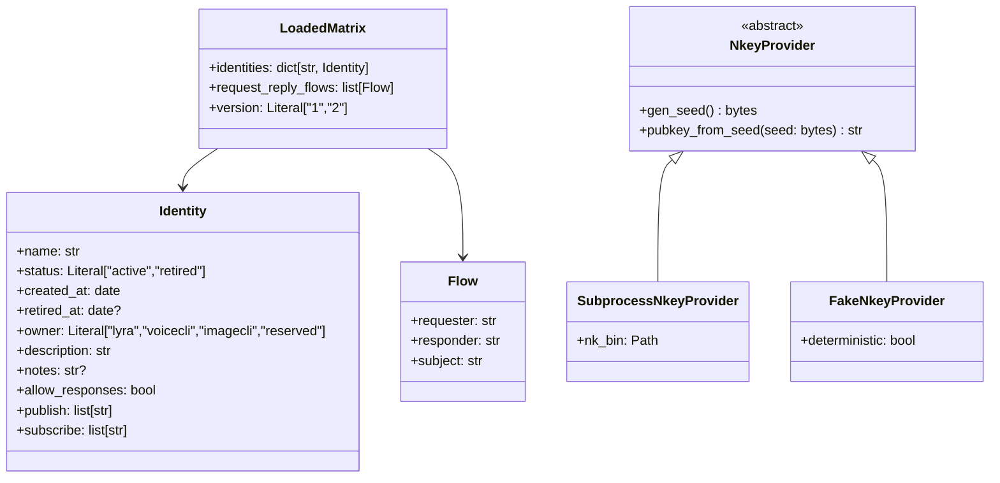
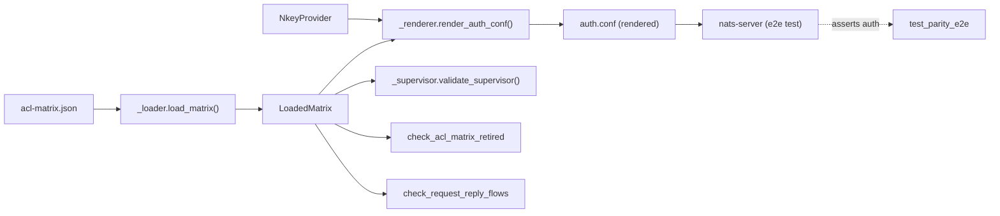

## Context

Promoted from `artifacts/analyses/1017-migrate-gen-nkeys-py-analysis.mdx`
(frame at `artifacts/frames/1017-migrate-gen-nkeys-py-frame.mdx`).

`deploy/nats/gen-nkeys.sh` (702 LOC bash) owns NATS ACL provisioning
for production. The 2026-05-01 audit named 11 distinct safety bugs in
this file; ~7 are jq-semantic / logic bugs invisible to shellcheck.
This spec defines the Python port (Shape C from the analysis):
argparse + structured emit + real-NATS e2e gate + umbrella `lyra-acl`
console with 3 thin aliases preserving operator typing.

## Goal

Replace `deploy/nats/gen-nkeys.sh`,
`scripts/check-acl-matrix-retired.sh`, and
`scripts/check-request-reply-flows.sh` with typed Python equivalents
under `scripts/`, with rule-level negative tests and a real-NATS
authorization e2e test required on every PR — then delete the bash
originals.

## Users

- **Primary:** Mickael (operator), running `lyra-acl <subcmd>` or
  `lyra-genkeys / lyra-check-acl-retired / lyra-check-flows` aliases
  locally and on prod (`roxabituwer`).
- **Secondary:** CI (`.github/workflows/ci.yml:70,73`), Makefile
  targets (`Makefile:197,271,331`), the runbook
  (`docs/ops/nats-identity-retirement.md`,
  `docs/ops/nkey-rotation.md`).
- **Tertiary:** future contributors editing
  `deploy/nats/acl-matrix.json` (typed errors via pyright instead of
  bash error messages).

## Expected Behavior

### Mode parity (drop-in)

Every flag of `gen-nkeys.sh` has a `lyra-acl` subcommand with
identical output and exit-code semantics. Stale `sudo` calls in the
runbook are corrected as part of the swap.

| Bash | Python (umbrella) | Python (alias) | Root? |
|---|---|---|:-:|
| `gen-nkeys.sh` | `lyra-acl genkeys` | `lyra-genkeys` | ✓ |
| `gen-nkeys.sh --show` | `lyra-acl genkeys --show` | `lyra-genkeys --show` | ✓ |
| `gen-nkeys.sh --fix-perms` | `lyra-acl genkeys --fix-perms` | `lyra-genkeys --fix-perms` | ✓ |
| `gen-nkeys.sh --regenerate [--yes]` | `lyra-acl genkeys --regenerate [--yes]` | `lyra-genkeys --regenerate` | ✓ |
| `gen-nkeys.sh --regen-authconf` | `lyra-acl genkeys --regen-authconf` | `lyra-genkeys --regen-authconf` | — |
| `gen-nkeys.sh --emit-merged-authconf` | `lyra-acl genkeys --emit-merged-authconf` | `lyra-genkeys --emit-merged-authconf` | — |
| `gen-nkeys.sh --template-only` | `lyra-acl genkeys --template-only` | `lyra-genkeys --template-only` | — |
| `gen-nkeys.sh --validate-supervisor` | `lyra-acl validate-supervisor` | `lyra-genkeys --validate-supervisor` | — |
| `gen-nkeys.sh --matrix <p>` | `lyra-acl genkeys --matrix <p>` (combinable) | `lyra-genkeys --matrix <p>` | — |
| `check-acl-matrix-retired.sh` | `lyra-acl check retired` | `lyra-check-acl-retired` | — |
| `check-request-reply-flows.sh` | `lyra-acl check flows` | `lyra-check-flows` | — |

### `nk` absence (ensure_nk dropped)

`nk` not on `$PATH` → exit 1 with:

```
error: nk binary not found on $PATH
hint: install nats-tools (apt install nats-tools), or download from
      https://github.com/nats-io/nkeys/releases and place at /usr/local/bin/nk
```

No auto-download. `docs/GETTING-STARTED.md` (or equivalent first-run
runbook) gets a one-line update naming the install command.

### `sudo` invocation

Root-required modes: documented in runbook + Makefile as
`sudo env "PATH=$PATH" lyra-acl <sub>`. Default `secure_path`
strips `~/.local/bin` and `.venv/bin`; the explicit env preservation
keeps the venv shim reachable. No sudoers edit required.

### `SUDO_USER` resolution

Under `sudo`, the operator's home is resolved via
`os.environ.get("SUDO_USER")` → `pwd.getpwnam(...).pw_dir`. Falls
back to `Path.home()` only when `SUDO_USER` is unset (non-sudo
invocation). Seeds and user `auth.conf` always land in the
operator's `~/.lyra/nkeys/`, never `/root/.lyra/nkeys/`.

### File modes

| Path | Mode | Owner |
|---|---|---|
| `~/.lyra/nkeys/<name>.seed` | 0600 | operator |
| `~/.lyra/nkeys/auth.conf` | 0600 | operator |
| `~/.lyra/nkeys/auth.conf.bak.<ts>` | 0600 | operator |
| `/etc/nats/nkeys/auth.conf` | 0640 | root:nats |
| `/etc/nats/nkeys/auth.conf.bak.<ts>` | 0640 | root:nats |

Atomicity: `tempfile.NamedTemporaryFile(delete=False)` →
`os.chmod(tmp, mode)` → `os.replace(tmp, dest)`.

### Default-mode dual-write

The default (no-flag, full provisioning) mode writes
`/etc/nats/nkeys/auth.conf` (system) **and** mirrors a copy to
`~/.lyra/nkeys/auth.conf` (`gen-nkeys.sh:681`). Python preserves
both writes; each gets a parity test.

### Real-NATS e2e gate

A pytest test boots `nats-server 2.10.22` (already pinned in
`ci.yml:29-41`, sha256-verified, installed at
`/usr/local/bin/nats-server`) against a rendered `auth.conf`, then
asserts publish/subscribe authorization for one identity per
role-class:

- one operator (`hub`)
- one adapter (`telegram-adapter`)
- one worker (`clipool-worker` or `voice-tts`)
- one retired identity (must be absent — connect attempt rejected)

Test is REQUIRED in CI (no `--nats-e2e` opt-in marker).

### `acl-matrix.json` versioning

Both `version: "1"` and `"2"` parse. Production is on `"2"`;
`"1"` parsing is preserved for fixture parity.

## Data Model & Consumers





### Consumer summary

| Consumer | Reads | When | Status |
|---|---|---|---|
| `_renderer.render_auth_conf` | identities (active only), pub/sub allow-lists, `allow_responses` | every render mode | this issue |
| `_supervisor.validate_supervisor` | identities where `owner == "lyra"` | `--validate-supervisor` mode | this issue |
| `check_acl_matrix_retired` | identities (status, created_at, retired_at) + flows | CI step | this issue |
| `check_request_reply_flows` | flows (requester, responder, subject) + identities | CI step | this issue |
| `_renderer` (inbox grants) | flows → derives `_inbox.<requester>.>` to responder's publish allow | every render mode | this issue |
| `lyra` runtime (`src/lyra/*`) | none — must NOT import from `scripts/` | — | invariant |

## Breadboard

### Places (CLI surface)

| ID | Surface | What |
|---|---|---|
| U1 | `lyra-acl genkeys` | umbrella subcommand for full/regen/show/fix-perms/regenerate/template-only/emit-merged-authconf |
| U2 | `lyra-acl validate-supervisor` | supervisor/quadlet wiring assertion |
| U3 | `lyra-acl check {retired,flows}` | sibling validator subcommands |
| U4 | `lyra-genkeys` | thin alias → `lyra-acl genkeys $@` |
| U5 | `lyra-check-acl-retired` | thin alias → `lyra-acl check retired $@` |
| U6 | `lyra-check-flows` | thin alias → `lyra-acl check flows $@` |

### Affordances

| ID | Affordance | Handler | Notes |
|---|---|---|---|
| A1 | argparse subcommand router | `gen_nkeys.main()` | dispatches to per-subcommand handlers |
| A2 | matrix loading | `_loader.load_matrix(path)` → `LoadedMatrix` | replaces 65-line bash `load_matrix` |
| A3 | auth.conf rendering | `_renderer.render_auth_conf(matrix, pubkeys)` → `str` | structured emit |
| A4 | NATS conf parsing (test only) | `_renderer.parse_auth_conf(text)` → `ParsedAuthConf` | recursive-descent parser |
| A5 | nkey provisioning | `NkeyProvider.gen_seed()` / `pubkey_from_seed()` | ABC + Subprocess + Fake impls |
| A6 | supervisor wiring check | `_supervisor.validate(matrix, repo_root)` → `list[str]` errors | reads `deploy/conf.d/`, `deploy/quadlet/` |
| A7 | sibling validator: retired | `check_acl_matrix_retired.main(matrix)` → exit 0/1 | replaces 33-LOC bash |
| A8 | sibling validator: flows | `check_request_reply_flows.main(matrix)` → exit 0/1 | replaces 125-LOC bash |
| A9 | atomic write w/ mode | `_io.atomic_write(path, content, mode)` | (small helper, may inline) |
| A10 | `SUDO_USER` resolver | `_io.operator_home()` → `Path` | mirrors bash `LYRA_USER` resolution |

### Wiring

```
U1 (genkeys subcmd) → A1 → A2 → A3 ── (write) ──> filesystem (modes via A9)
                              └──── (key gen) ─── A5
U2 → A1 → A2 → A6
U3 → A1 → A2 → A7 / A8
U4..U6 → sys.argv.insert(1, "<sub>") → U1/U3 dispatch
```

## Slices

Three vertical, independently demo-able increments. Each is a CI-green
checkpoint within the same PR.

| # | Slice | Demonstrates | Affordances |
|--:|---|---|---|
| 1 | **Read-only Python + console-script wiring** — models + loader + renderer + sibling validators + supervisor wiring check; uses `FakeNkeyProvider` for any pubkey-shaped output. **All 4 `pyproject.toml [project.scripts]` entries land here** (umbrella + 3 aliases as 3-line `sys.argv.insert(1,"<sub>"); main()` stubs). | `lyra-acl genkeys --template-only` produces `auth.conf` parity-equivalent (modulo header) to bash; `lyra-acl check retired` and `check flows` exit-code-equivalent for fixtures; `lyra-acl validate-supervisor` reports identical errors to bash. | A1, A2, A3, A4, A6, A7, A8, A10 + alias dispatchers |
| 2 | **Key-aware modes** — `SubprocessNkeyProvider` + write modes (`--regen-authconf`, `--emit-merged-authconf`, `--regenerate`, `--show`, `--fix-perms`, full default mode + dual-write). | `lyra-acl genkeys --regen-authconf` writes a working `auth.conf` parity-equivalent to bash for fixtures; `nk` absence yields the exact error string from spec; `SUDO_USER` resolution test passes; file modes (0600/0640) verified by stat. | A1, A2, A3, A5, A9, A10 |
| 3 | **Parity gate + caller swap + bash deletion** — `test_parity_e2e.py` (boots `nats-server` against rendered conf, asserts authorization); CI step adds `nk` install; Makefile + CI + runbook updates; bash files deleted. Stale-sudo cleanup folded in. **Internal sequencing within Slice 3 (enforced by plan task ordering, audited at PR review):** (3a) parity gate green → (3b) caller swap committed → (3c) bash files deleted. Each sub-step is a separate commit; bash deletion is the last commit and lands only after CI passes on the Python-only path. | Real-NATS e2e green in CI; CI runs Python-only; bash files absent from `git ls-files`; `make remote nats-regen-authconf` succeeds. | (no new affordances; integration only) |

Slice 1 is intentionally pubkey-free — it can be merged-equivalent to
green CI even without `nk` installed in the test env, which is the
fastest path to a working renderer + falsification gate.

## Success Criteria

- [ ] `scripts/_acl_models.py`, `scripts/_loader.py`,
      `scripts/_renderer.py`, `scripts/_nk.py`,
      `scripts/_supervisor.py`, `scripts/gen_nkeys.py`,
      `scripts/check_acl_matrix_retired.py`,
      `scripts/check_request_reply_flows.py` exist; each ≤300 LOC.
- [ ] `pyproject.toml [project.scripts]` exposes `lyra-acl`,
      `lyra-genkeys`, `lyra-check-acl-retired`, `lyra-check-flows`.
- [ ] Every flag in the Mode parity table works under `lyra-acl`
      and (where applicable) under the alias.
- [ ] `lyra-acl genkeys --template-only --matrix
      tests/scripts/fixtures/v2-prod.json` output is semantically
      equivalent (parsed `ParsedAuthConf`) to the bash original on
      the same fixture.
- [ ] `lyra-acl genkeys --regen-authconf` writes
      `~/.lyra/nkeys/auth.conf` with mode `0600` and content
      semantically equivalent to bash.
- [ ] Default-mode (no flag) dual-write: `/etc/nats/nkeys/auth.conf`
      (mode `0640`, root:nats) **and** `~/.lyra/nkeys/auth.conf`
      (mode `0600`, operator) both written and parity-equivalent to
      bash.
- [ ] Under `sudo` (simulated via `os.environ` patch in tests),
      seed paths resolve to operator's home (not `/root/.lyra/...`).
- [ ] `nk` absent → exit 1 with the install hint string from spec.
- [ ] `acl-matrix.json` `version: "1"` and `"2"` both parse
      identically to bash for paired fixtures.
- [ ] Every validation rule in `_loader` has a paired negative test
      that mutates the parsed `LoadedMatrix` (not the JSON file)
      and asserts `SystemExit(1)` with a guard-naming docstring.
- [ ] **PR-review gate (manual, not CI-automated):** each negative
      test is verified by the author to fail when its guard is
      removed; verification recorded in the test's docstring as
      `# verified: removing <guard> on <date>`. Reviewer spot-checks
      one or two during code review.
- [ ] `ParsedAuthConf` is a `dataclass(eq=True, frozen=True)` —
      field-equality `__eq__` is the parity primitive.
- [ ] `tests/scripts/test_parity_e2e.py` boots `nats-server` against
      a rendered `auth.conf` and asserts publish/subscribe
      authorization for one identity per role-class (operator,
      adapter, worker, retired-must-be-absent).
- [ ] Real-NATS e2e test runs on every PR in CI (no opt-in marker).
- [ ] CI workflow installs `nk` as an explicit setup step
      (downloads from `nats-io/nkeys` releases, sha256-verified, placed
      at `/usr/local/bin/nk`) — pinned to a specific version per the
      project standard for binary deps.
- [ ] `.github/workflows/ci.yml:70,73` invoke Python entry points
      (umbrella or alias).
- [ ] `Makefile:197,271,331` invoke Python entry points.
- [ ] `docs/ops/nats-identity-retirement.md:49,111` and
      `docs/ops/nkey-rotation.md:105` no longer prefix
      `--regen-authconf` with `sudo`.
- [ ] `deploy/nats/gen-nkeys.sh`,
      `scripts/check-acl-matrix-retired.sh`,
      `scripts/check-request-reply-flows.sh` deleted.
- [ ] No `src/lyra/*` module imports any `scripts/*` module
      (enforced by importlinter contract or focused test).
- [ ] All `scripts/*.py` files under the 300-line cap; no addition
      to `tools/file_exemptions.txt`.
- [ ] `uv run pyright` clean across `scripts/` and `tests/scripts/`.
- [ ] `uv run ruff check .` and `uv run ruff format --check .` clean.
- [ ] PR includes `Closes #1017`.

## Open ambiguities

- [NEEDS CLARIFICATION] Should `_io.atomic_write` and
  `_io.operator_home` live in their own `scripts/_io.py` module, or
  inline into `gen_nkeys.py` / `_renderer.py`? Both are <30 LOC.
  Default: inline unless a third caller emerges.
- [NEEDS CLARIFICATION] `mutation-survives-removal` mechanism:
  pytest meta-suite that strips guards via AST mutation, or a
  manual checklist in test docstrings reviewed at PR time? Default:
  manual checklist for v1 (the gate has caught zero issues
  currently because no automation exists; manual is strictly
  better than nothing).
<!-- nk-in-CI: resolved → install via dedicated workflow step (see Success Criteria). -->

