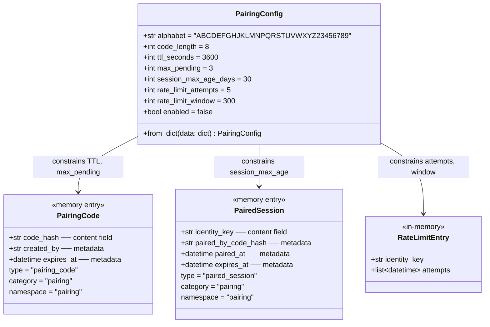

## Context

Promoted from [frame #103](../frames/103-unified-pairing-system-frame.mdx). Part of epic #101 (Phase 0 — Bot core parity).

Lyra currently trusts any message sender on Telegram/Discord. The pairing system adds invite-code-based access control, adapted from 2ndBrain's production implementation to fit Lyra's plugin architecture, TOML config, and `roxabi-memory` storage.

## Goal

Allow admins to gate access to Lyra via pairing codes — generate, redeem, and revoke — across all supported channels, using a single hub-level `PairingManager` with platform-agnostic identity keys.

## Users

- **Admin (Mickael):** generates invite codes (`/invite`), revokes users (`/unpair`), manages access.
- **Invited users:** redeems codes (`/join <CODE>`), gets paired session (30-day expiry).

## Expected Behavior

1. Admin sends `/invite` on Telegram or Discord. Lyra generates an 8-char code (from safe alphabet, no `0/O/I/1`), stores the SHA-256 hash with 1h TTL, and replies with the plaintext code. `max_pending` check counts only non-expired codes for the requesting admin (filtering by `created_by` and `expires_at`).
2. Admin shares the code out-of-band (e.g., verbally, SMS).
3. New user sends `/join ABCD1234` from any platform. Lyra hashes the input, matches against pending codes, and if valid: creates a paired session entry, deletes the code, replies with success. If the user is already paired, the existing session is replaced (expiry resets).
4. On subsequent messages, the hub gate checks the sender's identity key (format: `{adapter_prefix}:user:{id}`, e.g., `tg:user:123456`, `discord:user:789012`) against paired sessions. Paired → proceed. Unpaired → reject with "You are not paired" message via `dispatch_response`. The gate allows `/join` through for unpaired users (it is the pairing entry point). `/invite` and `/unpair` are admin-only, and admins bypass the gate entirely.
5. Admin sends `/unpair tg:user:123456` — Lyra deletes the session, user loses access immediately. If the identity key has no active session, returns "not found" message.
6. Rate limiting: after 5 failed `/join` attempts within 300s, further attempts are blocked for the remainder of the window. Rate limiting is enforced inside `cmd_join`, not in the hub gate.
7. Sessions expire after 30 days. Expired sessions are rejected and lazily deleted on next `is_paired()` check. Note: orphaned expired codes are not eagerly cleaned up — acceptable trade-off for simplicity; a background sweeper can be added later if needed.
8. Admin users (from `[admin].user_ids` in `lyra.toml`) always have access — they bypass pairing checks entirely, even if they have no paired session.
9. Pairing is per-user, not per-chat. The identity key uses `msg.from_user.id` (not `msg.chat.id`), so a user paired in a DM is also paired in any group the bot is in, and vice versa. Unpaired users' messages in groups are silently dropped (no rejection reply to avoid spam).
10. When `pairing.enabled = false` (the default), the hub gate is inactive — all messages pass through as today. Pairing commands (`/invite`, `/join`, `/unpair`) return "Pairing is not enabled" when disabled.

## Data Model & Consumers

### Data Structure



### Consumer Map

```mermaid
flowchart LR
    subgraph Storage["roxabi-memory (namespace: pairing)"]
        PC[PairingCode entries]
        PS[PairedSession entries]
    end

    subgraph Core
        PM[PairingManager]
        HUB[Hub.run loop]
    end

    subgraph Plugin
        INV[/invite handler]
        JOIN[/join handler]
        UNP[/unpair handler]
    end

    INV -->|generate_code| PM
    PM -->|save_entry type=pairing_code| PC
    JOIN -->|validate_code| PM
    PM -->|search + delete| PC
    PM -->|save_entry type=paired_session| PS
    UNP -->|revoke_session| PM
    PM -->|delete| PS
    HUB -->|is_paired?| PM
    PM -->|search type=paired_session| PS
```

### Consumer Summary

| Consumer | Fields consumed | When | Status |
|----------|----------------|------|--------|
| `/invite` handler | `PairingConfig.max_pending`, `code_hash`, `expires_at` | Admin generates code | This issue |
| `/join` handler | `code_hash`, `identity_key`, rate limit state | User redeems code | This issue |
| `/unpair` handler | `identity_key` (session lookup) | Admin revokes access | This issue |
| Hub run loop | `identity_key`, `expires_at` (session validity) | Every incoming message | This issue |
| Future: `/users` command | `identity_key`, `paired_at` (list paired users) | Admin lists users | Future |

## Breadboard

### Affordances

| ID | Element | Type | Location |
|----|---------|------|----------|
| U1 | `/invite` command | input | Telegram / Discord |
| U2 | `/join <CODE>` command | input | Telegram / Discord |
| U3 | `/unpair <identity_key>` command | input | Telegram / Discord |
| U4 | Pairing response messages | output | Telegram / Discord |

### Handlers

| ID | Handler | Reads | Writes |
|----|---------|-------|--------|
| N1 | `cmd_invite` | admin_user_ids, PairingConfig, pending codes count | PairingCode entry |
| N2 | `cmd_join` | rate limit state, PairingCode entries | PairedSession entry, deletes PairingCode |
| N3 | `cmd_unpair` | admin_user_ids, PairedSession entries | deletes PairedSession entry |
| N4 | `PairingManager.is_paired` | PairedSession entries, admin_user_ids | deletes expired sessions (lazy cleanup) |

### Storage

| ID | Store | Type |
|----|-------|------|
| S1 | `roxabi-memory` entries (namespace=`pairing`, type=`pairing_code`) | SQLite |
| S2 | `roxabi-memory` entries (namespace=`pairing`, type=`paired_session`) | SQLite |
| S3 | In-memory dict `{identity_key: [timestamps]}` | RAM (rate limiting — resets on process restart, by design) |

### Wiring

| From | To | Data |
|------|----|------|
| U1 | N1 | msg.user_id |
| N1 | S1 | SHA-256(code), created_by, expires_at |
| N1 | U4 | plaintext code |
| U2 | N2 | msg.user_id, code arg |
| N2 | S3 | attempt timestamp (rate limit check) |
| N2 | S1 | SHA-256(code) lookup → match |
| N2 | S2 | identity_key, paired_at, expires_at |
| N2 | U4 | success / failure message |
| U3 | N3 | target identity_key arg |
| N3 | S2 | delete by identity_key |
| N3 | U4 | confirmation message |
| Hub.run | N4 | msg.user_id → identity_key (skip if admin or `/join`) |
| N4 | S2 | search by identity_key, check expiry |
| N4 | U4 | rejection message (via Hub `dispatch_response`) |

## Slices

| # | Slice | Demo | Acceptance criteria |
|---|-------|------|-------------------|
| 1 | Core PairingManager + config | Unit tests pass: generate, validate, expire codes | AC1–AC4 |
| 2 | Plugin commands + rate limiting (`/invite`, `/join`, `/unpair`) | Admin invites user via Telegram, user joins; rate limit blocks after 5 fails | AC5–AC7, AC9, AC10 |
| 3 | Hub access gate + admin bypass | Unpaired user rejected; admin always passes; disabled mode passes all | AC8, AC11, AC12 |

## Success Criteria

- [ ] AC1: `PairingManager.generate_code()` returns 8-char code from safe alphabet, stores SHA-256 hash in `roxabi-memory` with 1h TTL
- [ ] AC2: `PairingManager.validate_code()` matches hashed input, creates paired session, deletes used code. Already-paired user gets session replaced (expiry resets)
- [ ] AC3: Expired codes (>1h) are rejected; expired sessions (>30d) are rejected and the expired record is deleted from storage (lazy cleanup)
- [ ] AC4: `PairingConfig` loads from `[pairing]` section in `lyra.toml` with sensible defaults when section is absent
- [ ] AC5: `/invite` is admin-only — non-admin gets "admin-only" response
- [ ] AC6: `/join <CODE>` creates paired session on valid code, returns error on invalid/expired/missing code. `/join` with no arguments returns usage message
- [ ] AC7: `/unpair <identity_key>` is admin-only, deletes target session, confirms removal. Returns "not found" if identity key has no session
- [ ] AC8: Hub run loop checks `is_paired()` before processing messages; unpaired non-admin users get rejection message in DMs, silently dropped in groups. `/join` is exempt from the gate (allows unpaired users to pair)
- [ ] AC9: Rate limiting blocks `/join` after 5 failed attempts within 300s window per identity key. Enforced inside `cmd_join`, not in the hub gate
- [ ] AC10: `max_pending` enforced — `/invite` refuses if 3 non-expired codes already pending for that admin
- [ ] AC11: Admin users listed in `[admin].user_ids` bypass `is_paired()` checks and always receive responses, even without a paired session
- [ ] AC12: When `pairing.enabled = false` (default), the hub gate is inactive and all messages pass through; pairing commands return "Pairing is not enabled"
