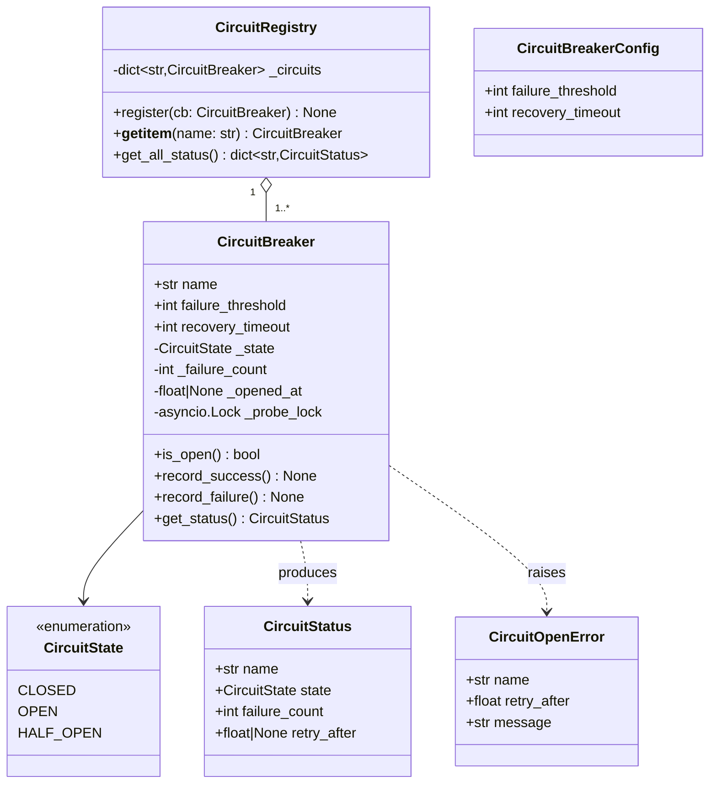
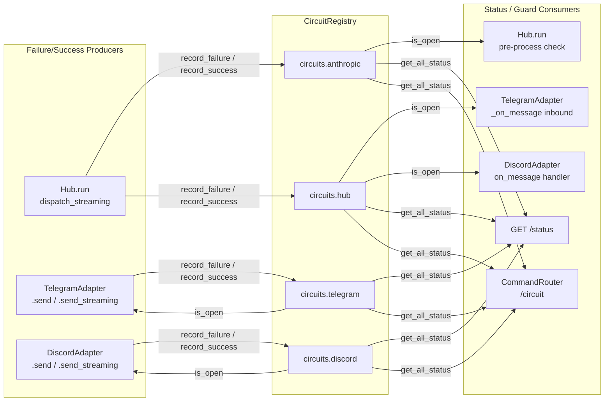

## Context

Promoted from [analysis](../analyses/104-llm-circuit-breaker-analysis.mdx) for issue #104.
Shape chosen: **Shape 2 — Generic `CircuitBreaker` + `CircuitRegistry`**.

When Anthropic API, Telegram, or Discord fail, Lyra currently has no recovery mechanism. Errors cascade silently. This spec defines a service-level circuit breaker system covering all four integration points: Anthropic API, Telegram Bot API, Discord API, and Hub internal processing.

## Goal

Introduce a generic async-native `CircuitBreaker` class and a `CircuitRegistry` that wraps all external and internal service calls — so failures open a fast-fail circuit instead of cascading, all circuits are queryable via `/circuit` command and HTTP endpoint, and the system recovers automatically.

## Users

- **Lyra users (Telegram/Discord):** When the Anthropic API is degraded, they receive an immediate *"Service unavailable — try again in Xs"* reply instead of hanging or seeing a generic error. When Telegram/Discord outbound API fails or hub circuit is open, their message is silently dropped (accepted MVP gap — no fallback channel).
- **Admins:** Can type `/circuit` in any Lyra chat to see the live state of all circuits. Can also `GET /status` from the internal network.
- **Hub process:** When consecutive processing failures accumulate, the hub circuit opens and adapters drop incoming messages before enqueuing.

## Expected Behavior

**Normal operation (all circuits CLOSED):**
1. User sends message → Telegram `_on_message()` checks `circuits["hub"]` (CLOSED ✓) → `bus.put(msg)`
2. Hub dequeues, checks `circuits["anthropic"]` (CLOSED ✓), calls `agent.process(msg, pool)`
3. Agent streams response → Hub `dispatch_streaming()` yields chunks → `record_success()` on completion
4. Adapter `send_streaming()` checks `circuits["telegram"]` (CLOSED ✓) → sends reply

**Anthropic API degraded (circuit OPEN after 3 failures):**
1. User sends message → Hub checks `circuits["anthropic"]`: OPEN
2. Hub immediately sends: *"Lyra is currently unavailable. Please try again in 42s."* (no LLM call made)
   - `retry_after = max(0, recovery_timeout − (now − _opened_at))`, rounded to nearest second
3. Messages already in the bus queue when the circuit opens also receive the fast-fail reply — the hub checks the circuit at dequeue time, not at enqueue time
4. After `recovery_timeout` elapses → circuit enters HALF_OPEN
5. Next message: probe attempt — if `_probe_lock.locked()`: fast-fail with same `retry_after` message. Else: acquire lock, run the LLM call, release on completion.
6. Probe succeeds → `record_success()` → CLOSED (lock released). Probe fails → OPEN (timer resets, lock released).

**Mid-stream Anthropic failure:**
1. Stream opens, partial tokens arrive, connection drops mid-stream
2. `AnthropicAgent.process()` re-raises after logging (exception is not swallowed — see breadboard N0)
3. `dispatch_streaming()` catches the exception → `circuits["anthropic"].record_failure()`
4. If `failure_count ≥ threshold` → circuit opens for subsequent requests

**Hub processing overloaded (circuit OPEN after 10 consecutive failures):**
1. Telegram `_on_message()` checks `circuits["hub"]`: OPEN → logs structured event, returns without calling `bus.put()`. Webhook still returns `{"ok": True}` to Telegram (HTTP 200) — Telegram must not receive 5xx or it will retry delivery indefinitely.
2. Discord `on_message()` checks `circuits["hub"]`: OPEN → logs structured event, returns early

**Outbound adapter circuit OPEN (accepted MVP gap):**
- `TelegramAdapter.send()` / `send_streaming()` checks `circuits["telegram"]`: OPEN → logs structured event, returns without sending. User receives no reply. No fallback channel for this release.
- Same for Discord.

**Admin checking circuit health (`/circuit` command):**
1. Admin sends `/circuit` in any Lyra chat
2. CommandRouter matches, checks sender user_id against `[admin] user_ids` config
3. Non-admin → replies: *"This command is admin-only."*
4. Admin → replies with status table:
   ```
   Circuit Status
   ──────────────────────────────────
   anthropic   OPEN      retry in 38s
   telegram    CLOSED    (ok)
   discord     CLOSED    (ok)
   hub         CLOSED    (ok)
   ──────────────────────────────────
   ```

**GET /status:**
```json
{
  "services": {
    "anthropic": {"state": "open", "retry_after": 38.0},
    "telegram":  {"state": "closed", "retry_after": null},
    "discord":   {"state": "closed", "retry_after": null},
    "hub":       {"state": "closed", "retry_after": null}
  },
  "timestamp": "2026-03-09T14:23:01Z"
}
```

## Data Model & Consumers





| Consumer | Fields read | When | Status |
|----------|-------------|------|--------|
| `Hub.run()` — pre-process | `circuits["anthropic"].is_open()`, `retry_after` | Before every LLM call | This issue |
| `Hub.dispatch_streaming()` | `circuits["anthropic"].record_failure/success()` | After stream completes or errors | This issue |
| `Hub.run()` — hub failure tracking | `circuits["hub"].record_failure/success()` | On every message processing outcome | This issue |
| `TelegramAdapter._on_message()` | `circuits["hub"].is_open()` | On every inbound message | This issue |
| `TelegramAdapter.send/send_streaming()` | `circuits["telegram"].is_open()`, `record_*()` | On every outbound call | This issue |
| `DiscordAdapter.on_message()` | `circuits["hub"].is_open()` | On every gateway event | This issue |
| `DiscordAdapter.send/send_streaming()` | `circuits["discord"].is_open()`, `record_*()` | On every outbound call | This issue |
| `GET /status` | `registry.get_all_status()` | On HTTP request | This issue |
| `CommandRouter` (`/circuit`) | `registry.get_all_status()` | On admin command | This issue |
| External monitoring dashboard | `CircuitStatus.*` | Future | Future |

## Breadboard

### Pre-requisite: fix AnthropicAgent exception handling (N0)

| Affordance | Handler | Change |
|-----------|---------|--------|
| N0: Re-raise after logging | `AnthropicAgent.process()` — narrow broad `except Exception` | Must **not** swallow exceptions; re-raise after `log.exception()` so `dispatch_streaming()` can catch and record failure. `CircuitOpenError` must also propagate (never caught here). |

### CB core (N1–N4)

| Affordance | Handler | Data in | Data out |
|-----------|---------|---------|---------|
| N1: Check if open | `CircuitBreaker.is_open()` | `_state`, `_opened_at`, `recovery_timeout`, `now` | `bool`; side-effect: if OPEN and `now − _opened_at ≥ recovery_timeout` → transition to HALF_OPEN |
| N2: Record failure | `CircuitBreaker.record_failure()` | `_failure_count`, `failure_threshold`, `_state` | increment `_failure_count`; if `_failure_count ≥ failure_threshold` and CLOSED → OPEN, set `_opened_at = now`; if OPEN → reset `_opened_at = now` (timer restart) |
| N3: Record success | `CircuitBreaker.record_success()` | `_state` | HALF_OPEN → CLOSED, reset `_failure_count = 0`; CLOSED → reset `_failure_count = 0` (no-op for OPEN) |
| N4: HALF_OPEN probe slot | `_probe_lock` (asyncio.Lock) | concurrent callers | `if _probe_lock.locked(): fast-fail (raise CircuitOpenError with retry_after)`; else `await _probe_lock.acquire()`, run probe, `_probe_lock.release()` in finally |

### Hub integration (N5–N7)

| Affordance | Handler | Data in | Data out |
|-----------|---------|---------|---------|
| N5: Pre-process LLM check | `Hub.run()` before `agent.process()` | `circuits["anthropic"].is_open()`, `retry_after` | if OPEN: `dispatch_response(msg, Response(f"Lyra is currently unavailable. Please try again in {retry_after}s."))`, `continue` (skip agent) |
| N6: Post-stream failure | `Hub.dispatch_streaming()` except block | exception from async iterator | `circuits["anthropic"].record_failure()`; log; send `GENERIC_ERROR_REPLY` if possible |
| N7: Hub failure tracking | `Hub.run()` main loop — after `pool.lock` block | exception or clean completion | `record_failure()` on any unhandled exception in the processing block; `record_success()` on clean completion |

### Adapter inbound (N8–N9)

| Affordance | Handler | Data in | Data out |
|-----------|---------|---------|---------|
| N8: Telegram hub-circuit guard | `TelegramAdapter._on_message()` before `bus.put()` | `circuits["hub"].is_open()` | if OPEN: log structured event (`{"event": "hub_circuit_open", "user_id": ..., "dropped": true}`), return early. **Always return normally to aiogram** — never raise; webhook continues to return `{"ok": True}` (HTTP 200) to Telegram. |
| N9: Discord hub-circuit guard | `DiscordAdapter.on_message()` before `bus.put()` | `circuits["hub"].is_open()` | if OPEN: log structured event, return early |

### Adapter outbound (N10–N13)

| Affordance | Handler | Data in | Data out |
|-----------|---------|---------|---------|
| N10: Telegram send guard | `TelegramAdapter.send()` entry | `circuits["telegram"].is_open()` | if OPEN: log structured event, return. Else: call aiogram send; on success `record_success()`; on exception in outer except `record_failure()` |
| N11: Telegram stream guard | `TelegramAdapter.send_streaming()` entry + inner stream exception hook | `circuits["telegram"].is_open()` at entry; exception in inner `async for` loop | Check at entry (same as N10); also `record_failure()` inside the inner `except Exception` block at line ~262 (stream interruption). `record_success()` after successful stream completion. |
| N12: Discord send guard | `DiscordAdapter.send()` entry | `circuits["discord"].is_open()` | if OPEN: log structured event, return. Else: call discord.py send; on success `record_success()`; on exception `record_failure()` |
| N13: Discord stream guard | `DiscordAdapter.send_streaming()` entry + inner exception hook | same pattern as N11 | Same as N11 for Discord |

### Status surfaces (N14–N15)

| Affordance | Handler | Data in | Data out |
|-----------|---------|---------|---------|
| N14: GET /status | FastAPI route added to `TelegramAdapter._register_routes()` | `registry.get_all_status()` | JSON (see Expected Behavior). No auth. Note: absent when Telegram adapter not active — acceptable for MVP. |
| N15: /circuit command | `CommandRouter` handler; admin guard checks sender user_id against `config["admin"]["user_ids"]` list | `registry.get_all_status()` | formatted table (see Expected Behavior) or "This command is admin-only." |

### Config wiring (N16)

| Affordance | Handler | Data in | Data out |
|-----------|---------|---------|---------|
| N16: Load CB config + admin config | `__main__.py` startup | TOML sections (see below) | `CircuitRegistry` with 4 `CircuitBreaker` instances + admin user_ids list; inject into Hub and adapters |

**Config structure:**

```toml
[circuit_breaker.anthropic]
failure_threshold = 3
recovery_timeout = 60

[circuit_breaker.telegram]
failure_threshold = 5
recovery_timeout = 30

[circuit_breaker.discord]
failure_threshold = 5
recovery_timeout = 30

[circuit_breaker.hub]
failure_threshold = 10
recovery_timeout = 60

[admin]
user_ids = ["telegram:123456789", "discord:987654321"]
# Format: "{platform}:{user_id}" — matched against Message.user_id + Message.platform
```

**Startup behavior:** missing `[circuit_breaker.*]` section → use defaults (`failure_threshold=5`, `recovery_timeout=60`). Missing `[admin]` section → `/circuit` command returns "Admin access not configured." for all users.

## Slices

| # | Slice | Affordances | Demo |
|---|-------|------------|------|
| S1 | Core `CircuitBreaker` + `CircuitRegistry` + `CircuitOpenError` | N1–N4 | `pytest tests/test_circuit_breaker.py` — all state transitions + HALF_OPEN lock test pass |
| S2 | AnthropicAgent exception fix + Hub Anthropic circuit | N0, N5, N6 | Mock Anthropic API to fail 3× → hub sends fast-fail reply; mock success → circuit closes |
| S3 | Hub circuit + adapter inbound guards | N7, N8, N9 | Inject shared `CircuitRegistry` in test; call `record_failure()` 10× on hub CB → Telegram `_on_message` logs drop + returns; Discord same |
| S4 | Adapter outbound circuits: Telegram + Discord | N10–N13 | Mock aiogram/discord.py send to fail → `circuits["telegram"]` opens; outbound calls skipped; log asserted |
| S5 | Status surfaces + config wiring | N14, N15, N16 | `curl /status` returns correct JSON; send `/circuit` as admin → table; send as non-admin → denied |

## Success Criteria

- [ ] `CircuitBreaker` CLOSED → OPEN after `failure_threshold` consecutive `record_failure()` calls
- [ ] `CircuitBreaker` OPEN → HALF_OPEN after `recovery_timeout` seconds (detected on next `is_open()` call)
- [ ] `CircuitBreaker` HALF_OPEN → CLOSED on `record_success()`; `_failure_count` resets to 0
- [ ] `CircuitBreaker` HALF_OPEN → OPEN on `record_failure()`; `_opened_at` resets (timer restart)
- [ ] HALF_OPEN concurrent callers: second caller while probe in flight receives fast-fail (not suspended waiting for lock)
- [ ] HALF_OPEN probe in-flight: other callers receive fast-fail reply with correct `retry_after`
- [ ] Hub sends `"Lyra is currently unavailable. Please try again in Xs."` when `circuits["anthropic"]` is OPEN (X = `max(0, recovery_timeout − elapsed)` rounded to nearest second)
- [ ] Messages already in the hub bus queue when `circuits["anthropic"]` opens receive the fast-fail reply (not silent drop)
- [ ] Mid-stream Anthropic failure (exception from async iterator in `dispatch_streaming`) increments `circuits["anthropic"]` failure count
- [ ] Hub processing failure increments `circuits["hub"]` failure count; clean completion calls `record_success()`
- [ ] `circuits["hub"]` OPEN → Telegram `_on_message()` drops message and logs structured event; webhook returns HTTP 200 to Telegram
- [ ] `circuits["hub"]` OPEN → Discord `on_message()` drops event and logs structured event
- [ ] `circuits["telegram"]` or `circuits["discord"]` OPEN → outbound send skipped; structured log event emitted; no exception raised
- [ ] `GET /status` returns JSON with all 4 circuit states and `retry_after` (float seconds or null)
- [ ] `/circuit` command returns formatted status table to admin users; non-admins receive "This command is admin-only."
- [ ] All thresholds, timeouts, and admin user_ids are config-driven via TOML; missing sections use documented defaults
