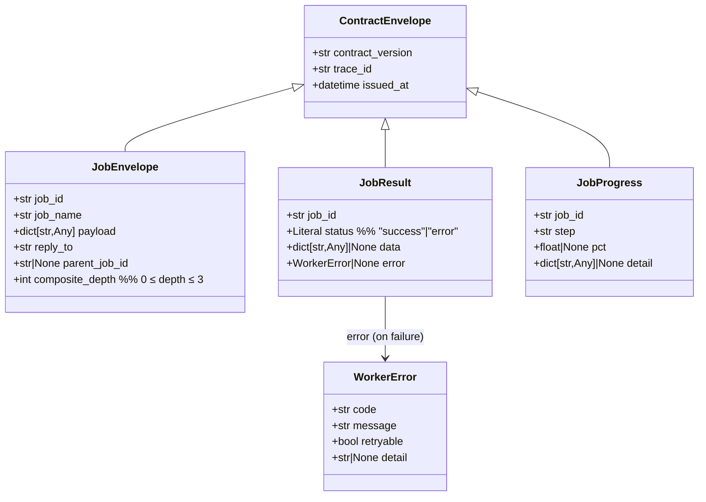
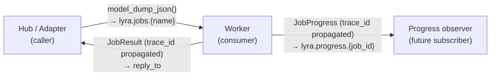

## Context

Derived from approved frame `artifacts/frames/1045-job-envelope-result-progress-frame.mdx`.
Part of epic #1044 (lyra-worker fleet). Adds the shared wire-format contracts for the
`lyra.jobs.*` / `lyra.results.*` / `lyra.progress.*` NATS subjects before any worker
implementation can proceed.

## Goal

Publish `JobEnvelope`, `JobResult`, and `JobProgress` from `roxabi-contracts` so that
hub, adapters, and workers share a single source of truth for the job-bus wire format.

## Out of Scope

- Worker SDK consumption of `JobEnvelope` (epic issue #3).
- JetStream stream / consumer configuration (epic issue #2).
- Hub dispatch routing — epic #1044 owns that.
- Any changes to `WorkerError` or existing domain contracts.

## Users

- **Primary:** Python code importing from `roxabi_contracts.jobs` — hub dispatch,
  worker SDK (epic #1044 chain), adapter bridges.
- **Secondary:** Developers writing new workers who depend on these types being stable
  before implementing JetStream consumers (epic issue #2) and the worker SDK (epic issue #3).

## Expected Behavior

### Submit path

A caller (hub or adapter) creates a `JobEnvelope`, stamps `contract_version`, `trace_id`,
`issued_at`, a UUID `job_id`, the target `job_name` (e.g. `vault.add-from-url`), a
`reply_to` inbox subject, and the job-specific `payload: dict[str, Any]`. It publishes to
`lyra.jobs.<job_name>` via JetStream. The worker deserializes using `JobEnvelope`.

### Reply path

On completion the worker publishes a `JobResult` to `reply_to`. The worker MUST
propagate `trace_id` from the inbound `JobEnvelope` into both `JobResult` and
`JobProgress` to maintain distributed-tracing correlation.

`status` is either `"success"` (with optional `data`) or `"error"` (with a `WorkerError`).
The two fields are mutually exclusive — enforced by a `model_validator(mode="after")`:
- `status == "success"` → `error is None` (data may be present or absent)
- `status == "error"` → `error is not None`

### Progress path

During long-running jobs the worker MAY publish `JobProgress` events to
`lyra.progress.<job_id>` (best-effort pub/sub, non-durable). Each event carries a
human-readable `step` label and optional `pct` (0–100, not validated by the model —
bound enforcement is the worker's responsibility) + freeform `detail: dict[str, Any]`.
Callers subscribe before submitting; absence of progress events is not an error.

### Composite jobs

`composite_depth` tracks job nesting so workers can refuse to spawn sub-jobs past
depth 3. The model validates `0 ≤ composite_depth ≤ 3` — construction fails with
`ValidationError` if violated (not silently clamped).

## Data Model & Consumers

| Consumer | Models consumed | Fields used | Status |
|----------|----------------|-------------|--------|
| Worker (epic #1044) | `JobEnvelope` | all | this issue (models only; SDK in #1044 chain) |
| Caller (hub dispatch) | `JobResult` | `job_id`, `status`, `data`, `error` | this issue (models only) |
| Progress subscriber | `JobProgress` | `job_id`, `step`, `pct`, `detail` | future (epic chain) |

## Breadboard

| Affordance | Subject | Model | Producer → Consumer |
|-----------|---------|-------|---------------------|
| N1 — submit job | `lyra.jobs.<job_name>` | `JobEnvelope` | caller → worker (JetStream durable) |
| N2 — reply result | `reply_to` (ephemeral inbox) | `JobResult` | worker → caller (core req-reply) |
| N3 — stream progress | `lyra.progress.<job_id>` | `JobProgress` | worker → subscriber (pub/sub, best-effort) |
| N4 — resolve subjects | `jobs_submit(name)` / `jobs_result(id)` / `jobs_progress(id)` | — | `subjects.py` helper functions |

**Subject validation:** `job_name` and `job_id` use a **jobs-specific** character class
`[A-Za-z0-9._-]+` (dots allowed for namespacing, e.g. `vault.add-from-url`; `*` and `>`
rejected to prevent wildcard injection). This diverges from `validate_worker_id`
(`[A-Za-z0-9_-]+`, dots rejected) — a new `validate_job_token(token)` is added to
`_nats_utils.py` and re-exported from `jobs/subjects.py`.

A `SUBJECTS` frozen dataclass is present in `subjects.py` for structural consistency with
other domain modules. It is empty at this tier (no static subjects yet); callers use the
helper functions exclusively.

## Slices

| # | Slice | Files | Demo |
|---|-------|-------|------|
| S1 | Module scaffold + models | `jobs/models.py`, `jobs/subjects.py`, `jobs/fixtures.py`, `jobs/__init__.py`, `_nats_utils.py` (add `validate_job_token`) | `from roxabi_contracts.jobs import JobEnvelope, JobResult, JobProgress` imports cleanly |
| S2 | Validation + invariants + tests | `jobs/models.py` (validators), `tests/test_jobs_models.py` | Round-trip JSON passes; `composite_depth=4` raises `ValidationError`; `status="error"` without `WorkerError` raises |
| S3 | Top-level re-export + README + version bump | `src/roxabi_contracts/__init__.py` (add `jobs.*`), `README.md`, `pyproject.toml` version `0.3.0 → 0.4.0` | `import roxabi_contracts; roxabi_contracts.JobEnvelope` resolves |

## Success Criteria

- [ ] `roxabi_contracts.jobs` module exists: `models.py` + `subjects.py` + `fixtures.py` + `__init__.py`
- [ ] `JobEnvelope`, `JobResult`, `JobProgress` extend `ContractEnvelope` (`contract_version`, `trace_id`, `issued_at` inherited)
- [ ] `JobEnvelope.composite_depth` validated `0 ≤ depth ≤ 3`; `ValidationError` on `4`
- [ ] `JobResult`: `status="success"` → `error is None`; `status="error"` → `error is not None`; enforced via `model_validator(mode="after")`
- [ ] `JobEnvelope.payload` and `JobResult.data` and `JobProgress.detail` typed as `dict[str, Any] | None` (not bare `dict`)
- [ ] `WorkerError` reused unchanged from `roxabi_contracts.errors` — no new error model
- [ ] `_nats_utils.py` gains `validate_job_token(token: str)` accepting `[A-Za-z0-9._-]+`; re-exported from `jobs/subjects.py`
- [ ] `subjects.py` exports `jobs_submit(job_name)`, `jobs_result(job_id)`, `jobs_progress(job_id)`; each calls `validate_job_token` and rejects `*` and `>`
- [ ] `subjects.py` contains a `SUBJECTS` frozen dataclass (structurally consistent; empty body acceptable at this tier)
- [ ] Round-trip JSON test for all three models (`model_dump_json` → `model_validate_json` → equal)
- [ ] `test_jobs_models.py` covers: valid construction, composite_depth boundary (0, 3, 4), `JobResult` status/error invariant, extra-field ignore
- [ ] `roxabi_contracts.__init__` re-exports `JobEnvelope`, `JobResult`, `JobProgress` in `__all__`
- [ ] `README.md` documents `jobs/` domain with subject table
- [ ] `pyproject.toml` version bumped `0.3.0 → 0.4.0`
