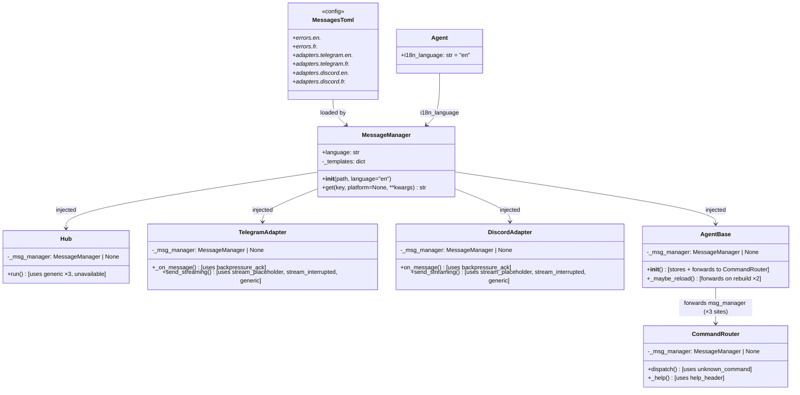
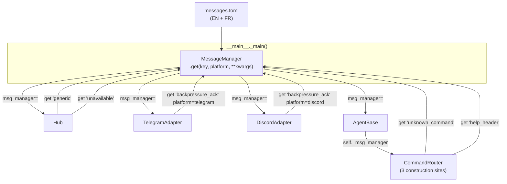

## Context

Part of Epic #101 (Phase 0 — Bot core parity). Promoted from analysis in `artifacts/analyses/105-toml-message-template-system-analysis.mdx`. Recommended shape: **Shape 1 — Constructor injection via AgentBase**, following the `circuit_registry` pattern.

## Goal

Centralize all user-facing strings in a TOML file so that translations and phrasing changes require no Python code changes.

## Users

- **Developers:** No longer need to hunt down hardcoded strings across 4+ files to change a phrase or add a language.
- **Translators (future):** Can add a new language by editing `messages.toml` and setting a config key — no Python knowledge needed.
- **End users (Telegram / Discord):** Receive messages in the configured language (EN or FR); adapter-appropriate phrasing (e.g., "réponse interrompue" in French Telegram sessions).

## Expected Behavior

At startup, `__main__._main()` reads `messages.toml` (resolution order: `LYRA_MESSAGES_CONFIG` env var → `messages.toml` in cwd → bundled `src/lyra/config/messages.toml`). It instantiates a `MessageManager` with the resolved path and the language from the active agent's TOML config (`[i18n] default_language`, defaulting to `"en"`). The `Agent` dataclass gains an `i18n_language: str = "en"` field populated by `load_agent_config()`. This single `MessageManager` instance is injected as `msg_manager=` into `Hub`, `TelegramAdapter`, `DiscordAdapter`, and `AgentBase`.

`AgentBase.__init__` stores `self._msg_manager` and forwards it to `CommandRouter` at construction. Because `AgentBase._maybe_reload()` rebuilds `CommandRouter` on both config change and plugin hot-reload, all three `CommandRouter(...)` call sites inside `agent.py` receive `self._msg_manager` — ensuring the correct `MessageManager` survives every hot-reload cycle.

When the Telegram adapter's bus is full, it calls `self._msg_manager.get("backpressure_ack", platform="telegram")`. When a stream is interrupted, it calls `get("stream_interrupted", platform="telegram")`. The `get()` method resolves keys in order:
1. `adapters.{platform}.{lang}.{key}` — platform + language match
2. `adapters.{platform}.en.{key}` — platform match, EN fallback
3. `errors.{lang}.{key}` — global key, active language
4. `errors.en.{key}` — global key, EN fallback
5. Hardcoded English literal — final safety net, never raises

Keys such as `"unknown_command"` and `"help.header"` are defined only in `[errors.*]` sections (no per-platform section). Resolution for those keys starts at step 3 — `adapters.{platform}.*` lookups always miss.

`get()` is guaranteed never to raise — if TOML is malformed, a key is missing at all levels, or `str.format_map` fails, it returns the hardcoded fallback.

When `msg_manager is None` (e.g., in existing tests), all call sites fall back to the existing hardcoded English strings — no behavior change for existing code paths.

The `GENERIC_ERROR_REPLY` constant remains in `core/message.py` as a string-literal alias for backward compatibility and is not removed in this issue.

---

## Data Model & Consumers

**Consumer summary** — keys shown as passed to `get()`:

| Consumer | Key | When | Status |
|----------|-----|------|--------|
| `Hub` | `"generic"` | Command dispatch failure (`hub.py:278`) | This issue |
| `Hub` | `"generic"` | Streaming path `BaseException` handler (`hub.py:341`) | This issue |
| `Hub` | `"generic"` | Non-streaming `agent.process()` failure (`hub.py:368`) | This issue |
| `Hub` | `"unavailable"` | Circuit breaker open reply | This issue |
| `TelegramAdapter` | `"backpressure_ack"` + `platform="telegram"` | Bus full ack | This issue |
| `TelegramAdapter` | `"stream_placeholder"` + `platform="telegram"` | Streaming placeholder send | This issue |
| `TelegramAdapter` | `"stream_interrupted"` + `platform="telegram"` | Stream error append | This issue |
| `DiscordAdapter` | `"backpressure_ack"` + `platform="discord"` | Bus full ack | This issue |
| `DiscordAdapter` | `"stream_placeholder"` + `platform="discord"` | Streaming placeholder send | This issue |
| `DiscordAdapter` | `"stream_interrupted"` + `platform="discord"` | Stream error append | This issue |
| `CommandRouter` | `"unknown_command"` + `command_name=` | Unknown command dispatch | This issue |
| `CommandRouter` | `"help_header"` | /help response | This issue |

**Out of scope for this issue:** Admin/diagnostic strings in `CommandRouter._circuit_status()` (`"Circuit Status"`, `"This command is admin-only."`, `"Circuit breaker not configured."`). These are not user-facing chat messages.

---

## Breadboard

### MessageManager API

| Affordance | Handler | Data in | Data out |
|------------|---------|---------|---------|
| `MessageManager(path, language)` | `core/messages.py:__init__` | TOML path + lang string | `MessageManager` instance |
| `.get(key)` | `core/messages.py:get` | dotted key string | Resolved template string (never raises) |
| `.get(key, platform="telegram")` | `core/messages.py:get` | key + platform hint | Platform-specific resolved string |
| `.get(key, command_name="foo")` | `core/messages.py:get` | key + substitution kwargs (`{command_name}`, `{retry_secs}`, etc.) | Rendered template |

### Startup wiring

| Affordance | Handler | Data in | Data out |
|------------|---------|---------|---------|
| `_resolve_messages_path()` | `__main__.py` | `LYRA_MESSAGES_CONFIG` env → cwd → bundled | Resolved `Path` |
| `MessageManager(path, lang)` | `__main__._main()` | resolved path + `agent_config.i18n_language` | `msg_manager` |
| Inject `msg_manager=` | `Hub.__init__`, `TelegramAdapter.__init__`, `DiscordAdapter.__init__`, `AgentBase.__init__` | `msg_manager` | Stored as `self._msg_manager` |
| Forward `self._msg_manager` to CommandRouter | `AgentBase.__init__` (site 1), `_maybe_reload()` config branch (site 2), `_maybe_reload()` plugin branch (site 3) | `self._msg_manager` | Passed to `CommandRouter(...)` |

### TOML config file

| Affordance | Handler | Data in | Data out |
|------------|---------|---------|---------|
| `[errors.{lang}]` section | `messages.toml` | — | Global strings (no platform prefix) |
| `[adapters.{platform}.{lang}]` section | `messages.toml` | — | Platform+language-specific strings |
| Substitution placeholders (`{command_name}`, `{retry_secs}`, etc.) | `str.format_map` | kwargs dict | Rendered string |

---

## Slices

| # | Slice | Deliverable | Depends on | Demo |
|---|-------|-------------|-----------|------|
| 1 | `MessageManager` core + bundled EN `messages.toml` | `core/messages.py`, `config/messages.toml` (EN), `tests/core/test_messages.py` | — | `mm.get("generic")` returns correct string; `mm.get("missing.key")` returns fallback, does not raise |
| 2 | FR translations + `[i18n]` language config | Add FR section to `messages.toml`; add `i18n_language: str = "en"` to `Agent` dataclass; parse `[i18n] default_language` in `load_agent_config()` | Slice 1 | `MessageManager("…", language="fr").get("generic")` returns French string; FR strings load from TOML |
| 3 | Hub + adapter injection | Wire `msg_manager` into `Hub`, `TelegramAdapter`, `DiscordAdapter`; replace all hardcoded strings in those files; update `__main__._main()` to create + inject `MessageManager` using `agent_config.i18n_language` | **Slice 2** (requires `agent_config.i18n_language`) | Bot replies localized strings; no hardcoded strings in `hub.py`/`telegram.py`/`discord.py` |
| 4 | AgentBase → CommandRouter injection | Add `msg_manager` to `AgentBase.__init__`; store + forward to all 3 `CommandRouter(...)` sites in `agent.py`; replace hardcoded strings in `command_router.py` | Slice 3 | `/unknown_command` returns localized reply; string survives config hot-reload and plugin hot-reload |

---

## Success Criteria

- [ ] `src/lyra/config/messages.toml` exists with all user-facing keys (as listed in the consumer summary table) in EN and FR sections.
- [ ] `src/lyra/core/messages.py` exports `MessageManager` with `.get(key, platform=None, **kwargs) -> str`.
- [ ] `MessageManager.get()` never raises — returns hardcoded English fallback on any error (missing key at all resolution levels, malformed template, type mismatch in substitution).
- [ ] A test asserts that each of the four fallback resolution steps is reachable independently: (a) platform+lang match returns the platform+lang value; (b) platform+en fallback triggers when lang is not `"en"` and no platform+lang entry exists; (c) global+lang fallback triggers when no platform entry exists; (d) global+en fallback triggers when no global+lang entry exists; (e) hardcoded fallback triggers when key is absent from TOML entirely.
- [ ] `MessageManager` is injected as `msg_manager=` into `Hub`, `TelegramAdapter`, `DiscordAdapter`, and `AgentBase` in `__main__._main()`.
- [ ] A `MessageManager` injected at startup is present on the `CommandRouter` instance after both a config-change hot-reload and a plugin hot-reload cycle (i.e., the rebuilt `CommandRouter` receives the same `msg_manager`, not `None`).
- [ ] All keys listed in the consumer summary table are served via `MessageManager.get()`. Admin/diagnostic strings in `CommandRouter._circuit_status()` are out of scope and may remain hardcoded.
- [ ] The `Agent` dataclass has an `i18n_language: str` field; `load_agent_config()` reads `[i18n] default_language` from the agent TOML and populates it (defaults to `"en"` if absent).
- [ ] `msg_manager=None` is preserved — all 19 existing tests pass without modification.
- [ ] `GENERIC_ERROR_REPLY` constant remains in `core/message.py` as a string-literal alias (not removed in this issue).
- [ ] Tests cover:
    - [ ] a. Template loading from a TOML file
    - [ ] b. Key resolution order (all four fallback steps — see SC-4 above)
    - [ ] c. Variable substitution (`{command_name}`, `{retry_secs}`)
    - [ ] d. No-raise guarantee on missing key, malformed template, and wrong kwargs
    - [ ] e. FR language resolution (`language="fr"` returns the FR string)
    - [ ] f. Reading `[i18n] default_language` from agent TOML and constructing `MessageManager` with that language
