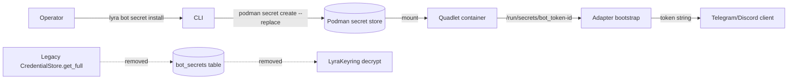

## Context

Promoted from [frame #1057](../frames/1057-bot-token-podman-secrets-frame.mdx). Phase 3 of Epic #1049 (shared-state migration); absorbs #1056. Aggregated-container mode resolved 2026-05-18: one `.container` per platform, N `Secret=` lines per container.

## Goal

Bot tokens reach the Telegram/Discord adapter processes via `/run/secrets/bot_token` (Podman secrets) instead of the `bot_secrets` table in `~/.lyra/config.db`. `CredentialStore` + `LyraKeyring` + the `config.db` mount on adapter containers are deleted.

## Users

- **Primary:** Lyra operators on deploy hosts (M₁). Lifecycle: `lyra bot secret install <platform> <bot_id>` → edit Quadlet `.container` (or run installer) → `make <svc> restart`.
- **Secondary:** Adapter processes (Telegram, Discord). Read `/run/secrets/bot_token` once at bootstrap; never touch `config.db` for credentials.

## Expected Behavior

1. **Operator provisions a bot token.**
   `lyra bot secret install telegram bot42` → prompts for token (or reads `--from-env LYRA_BOT_TOKEN`) → calls `podman secret create --replace lyra-bot-telegram-bot42 <stdin>`. Idempotent: re-running overwrites.

2. **Operator migrates existing rows.**
   `lyra bot secret migrate` reads every `(platform, bot_id, token, webhook_secret)` row from `~/.lyra/config.db:bot_secrets`, decrypts via the existing `LyraKeyring`, then issues `podman secret create --replace` per row. Idempotent by construction (`--replace` overwrites). On success, prints a per-row table `PLATFORM BOT_ID TOKEN_OK WEBHOOK_OK` and a summary line `Migrated N tokens, M webhook secrets; safe to drop bot_secrets table.` Re-runs reproduce the same output (operator must read the summary, not the exit code, to know whether work happened).

3. **Quadlet wiring is updated.**
   `deploy/quadlet/lyra-telegram.container` and `lyra-discord.container` carry two `Secret=` lines per bot — one for the token, one for the optional webhook secret (per χ-1 resolution → option **(b)**, two single-purpose secrets):

   ```
   Secret=lyra-bot-telegram-<bot_id>,type=mount,target=bot_token-<bot_id>,mode=0400,uid=1500,gid=1500
   Secret=lyra-bot-telegram-<bot_id>-webhook,type=mount,target=bot_webhook-<bot_id>,mode=0400,uid=1500,gid=1500
   ```

   `uid=1500,gid=1500` mirrors the existing `lyra-nkey-*` mount pattern at `deploy/quadlet/lyra-telegram.container:28` (the adapter container runs under user-NS keep-id with uid 1500; without these the file is owned by uid 0 inside the namespace and unreadable). The webhook line is omitted when no webhook secret is configured for that bot.

4. **Adapter bootstrap reads from `/run/secrets/`.**
   `adapter_standalone.py:75-93,178-197` is rewritten: instead of `cred_store.get_full(platform, bot_id)`, it reads the mounted file. No fallback to `config.db` — boot fails loud if the expected file is missing.

5. **`CredentialStore` + `bot_secrets` are deleted.**
   After migration is run on prod (M₁), the DDL is dropped from `CredentialStore.connect`, the class file removed, and the `~/.lyra/config.db` mount stripped from adapter `.container` files. `LyraKeyring` is retained iff other consumers remain in `config.db`'s sibling stores (agent/prefs); if only the adapter path consumed it, the class is deleted entirely and `~/.lyra/keyring.key` documented as safe to remove.

## Data Model & Consumers

### Data structure

```mermaid
classDiagram
    class BotSecret_Legacy {
        <<table: config.db>>
        string platform
        string bot_id
        string token "Fernet-encrypted"
        string webhook_secret "Fernet-encrypted, nullable"
        datetime updated_at
    }
    class PodmanTokenSecret {
        <<podman secret>>
        string name "lyra-bot-{platform}-{bot_id}"
        bytes content "raw token bytes"
    }
    class PodmanWebhookSecret {
        <<podman secret, optional>>
        string name "lyra-bot-{platform}-{bot_id}-webhook"
        bytes content "raw webhook secret bytes"
    }
    class QuadletMount {
        <<.container directive>>
        string Secret "lyra-bot-{p}-{id} or -webhook"
        string target "bot_token-{id} or bot_webhook-{id}"
        int mode "0400"
        int uid "1500"
        int gid "1500"
    }
    BotSecret_Legacy --> PodmanTokenSecret : migrate
    BotSecret_Legacy --> PodmanWebhookSecret : migrate (if non-null)
    PodmanTokenSecret <-- QuadletMount : ref by name
    PodmanWebhookSecret <-- QuadletMount : ref by name
    QuadletMount --> AdapterProcess : /run/secrets/{target}
```

### Consumer map



### Consumer summary

| Consumer | Reads | When | Status |
|---|---|---|---|
| CLI `lyra bot secret install` | platform, bot_id, token (operator input) | Operator action | **this issue** |
| CLI `lyra bot secret migrate` | `bot_secrets` rows + `LyraKeyring` | One-shot at deploy | **this issue** |
| Telegram/Discord adapter bootstrap | `/run/secrets/bot_token-<bot_id>` | Process start | **this issue** |
| `CredentialStore.get_full` | `bot_secrets` table | ~previously: process start~ | **removed** |
| `LyraKeyring.load_or_create` (adapter path) | `~/.lyra/keyring.key` | ~previously: process start~ | **removed (adapter path)** |
| `LyraKeyring` (other consumers, e.g. `auth.db`) | `~/.lyra/keyring.key` | Process start | **verify before deletion** |

## Breadboard

### Affordances

| ID | Affordance | Surface |
|---|---|---|
| U1 | `lyra bot secret install <platform> <bot_id> [--from-env VAR] [--webhook-from-env VAR]` | CLI |
| U2 | `lyra bot secret rm <platform> <bot_id>` | CLI |
| U3 | `lyra bot secret list` | CLI |
| U4 | `lyra bot secret migrate` | CLI (one-shot) |
| N1 | Adapter bootstrap reads `/run/secrets/bot_token-<bot_id>` (+ optional `bot_webhook-<bot_id>`) | bootstrap path |
| N2 | Quadlet `Secret=` line(s) per bot in `.container` | deploy/quadlet |
| S1 | Drop `bot_secrets` DDL from `CredentialStore.connect` | schema |
| S2 | Delete `CredentialStore` class file | code |
| S3 | Delete `LyraKeyring` iff no `config.db` sibling-store consumer remains; otherwise retain + document scope | code |
| S4 | Strip `~/.lyra/config.db` mount from adapter `.container` | deploy/quadlet |

**Precondition (U1, U2, N1, N2):** `<bot_id>` must match `^[A-Za-z0-9_-]+$` (Podman secret names and tmpfs mount targets disallow slashes and most punctuation). Validated at install time; install rejects unsafe IDs.

### Wiring

- **U1** → `echo -n "$TOKEN" | podman secret create --replace lyra-bot-<platform>-<bot_id> -` ; if `--webhook-from-env` provided, also `echo -n "$WEBHOOK" | podman secret create --replace lyra-bot-<platform>-<bot_id>-webhook -`. `--replace` makes it inherently idempotent.
- **U2** → `podman secret rm lyra-bot-<platform>-<bot_id> lyra-bot-<platform>-<bot_id>-webhook` (second is best-effort; absence is OK).
- **U3** → `podman secret ls --filter name=lyra-bot- --format json` — single source of truth for "which bots are provisioned" after `bot_secrets` is dropped.
- **U4** → for each `bot_secrets` row → decrypt via existing `LyraKeyring` → invoke U1 path → exit non-zero on any failure.
- **N1** → `Path("/run/secrets/bot_token-" + bot_id).read_text().strip()` at bootstrap; webhook is `Path("/run/secrets/bot_webhook-" + bot_id)` if present (`.exists()` check, then read). Token-file absence raises `BootstrapError`; webhook absence is silent (matches today's nullable behavior).
- **N2** → new Makefile target `quadlet-bot-secrets-render` (separate from `quadlet-secrets-install`, which handles nkeys/auth/gh-pem). It calls `podman secret ls --filter name=lyra-bot- --format '{{.Name}}'`, emits the corresponding `Secret=` lines into `deploy/quadlet/lyra-<platform>.container`, then prompts the operator to `make <svc> restart`. The active bot list source is **Podman's own secret store** — never `config.db`, which is the entire point of the migration.

## Slices

| # | Title | Demo |
|---|---|---|
| 1 | CLI + Quadlet plumbing (additive) | `lyra bot secret install telegram demo` works; `podman secret ls` shows the new secret; `lyra bot secret list` matches. No adapter or DDL change. |
| 2 | Migration command | `lyra bot secret migrate` copies all `bot_secrets` rows to Podman secrets; re-run is no-op; decrypted Podman-secret content matches DB content. `bot_secrets` table still present (not yet dropped). |
| 3 | Adapter cutover + cleanup | Telegram + Discord `.container` files updated; adapter reads `/run/secrets/bot_token-<bot_id>`; `CredentialStore` class deleted; `bot_secrets` DDL removed; `config.db` mount stripped; multi-bot config verified. |

Slice ordering keeps each step independently demonstrable and rolls back cleanly: slice 1 is purely additive, slice 2 only writes new secrets, slice 3 is the destructive cutover.

**Slice coverage of affordances:**
- Slice 1: U1, U2, U3, N2 (install/rm/list + Quadlet templating)
- Slice 2: U4
- Slice 3: N1, S1, S2, S3, S4

## Success Criteria

**Joint premise (frame falsifiable failure):** CR-1 + CR-2 together encode the frame's failure signal. Either one failing = migration incomplete.

- [ ] **CR-1** `grep -rF "CredentialStore" src/lyra/bootstrap/ src/lyra/adapters/ src/lyra/cli_setup.py src/lyra/cli_bot.py` returns no matches (joint with CR-2 — see premise note above).
- [ ] **CR-2** `sqlite3 ~/.lyra/config.db ".tables"` does not list `bot_secrets` after slice 3 (joint with CR-1).
- [ ] **CR-3** `lyra bot secret install telegram demo` followed by `podman secret inspect lyra-bot-telegram-demo` returns a secret whose decoded content equals the supplied token bytes.
- [ ] **CR-4** `lyra bot secret migrate` exit code is 0 after both first run and second run. First-run summary line matches regex `^Migrated [0-9]+ tokens, [0-9]+ webhook secrets`. Second-run summary line shows the same counts (because `--replace` is idempotent by construction — no skip-on-match logic required).
- [ ] **CR-5** Adapter bootstrap code does not reference `config.db` for credential reads: `grep -rF "config.db" src/lyra/bootstrap/ src/lyra/adapters/ | grep -v test` returns no matches related to bot tokens. Adapter container boot log contains a line matching `read token from /run/secrets/bot_token-<bot_id>` and the bot completes a round-trip test message end-to-end on M₁.
- [ ] **CR-6** Multi-bot config (≥2 bots per platform) works end-to-end: each bot reads its own `/run/secrets/bot_token-<bot_id>`; adapter log emits one `read token from /run/secrets/bot_token-<bot_id>` line per bot at startup.
- [ ] **CR-7** `grep -rF "LyraKeyring" src/lyra/bootstrap/ src/lyra/adapters/ src/lyra/cli_setup.py src/lyra/cli_bot.py` returns no matches. If `LyraKeyring` is retained for `config.db` sibling stores, its scope is documented in `src/lyra/infrastructure/CLAUDE.md` (verified by `grep -F "LyraKeyring scope:" src/lyra/infrastructure/CLAUDE.md` returning a match).
- [ ] **CR-8** `docs/CONFIGURATION.md` contains: (a) a `## Bot credentials` section with the `lyra bot secret install/rm/list/migrate` CLI table, AND (b) a fenced `Secret=lyra-bot-` example block matching the wiring in this spec, AND (c) the literal string `webhook_secret packing: separate secret` documenting the χ-1 resolution. Verified by 3 grep commands in CI.

## Edge Cases

| Edge case | Handling |
|---|---|
| Adapter starts but `/run/secrets/bot_token-<bot_id>` missing | Fail loud at bootstrap with `BootstrapError` naming the expected path; ¬fallback to `config.db`. |
| Token rotation | Operator runs `lyra bot secret install <platform> <bot_id>` (replaces) then `make <svc> restart` — covered by [feedback_nats_runbook_restart_not_hup] equivalent (mount-secret refresh requires restart). |
| Migration: row decrypts but `podman secret create` fails | Log row, exit non-zero, don't drop table. Operator retries after fixing root cause. |
| Multi-bot container: one bot's secret missing | Quadlet fails to start the container (Podman validates `Secret=` references at start). Operator sees a clear error per missing secret. |
| `LyraKeyring` still consumed by other `config.db` sibling stores (agent/prefs) | Retain `LyraKeyring` class, document the surviving scope in `src/lyra/infrastructure/CLAUDE.md` (`LyraKeyring scope: <consumers>`). Adapter-path imports removed regardless. |
| webhook_secret missing for a bot | Quadlet mounts only the present secrets; bot operates without webhook (today's behavior). |
| Existing `~/.lyra/keyring.key` after migration | Migration command prints `keyring.key safe to delete (only consumer was bot_secrets)` iff `LyraKeyring` fully removed; otherwise prints retention reason. |

## Open Questions

**χ-1 resolved (during spec review):** webhook_secret packing → **option (b), two separate Podman secrets per bot**. Rationale: matches the project's raw-bytes single-purpose convention (every existing secret in `Makefile:181-200` is raw bytes); avoids introducing a JSON parser in the failure-loud bootstrap path; allows independent rotation of token vs. webhook; cleanly expresses nullable webhook by omitting the secret (option (a) would require sentinel values). Documented in CR-8 (c).

_No open χ remaining._
