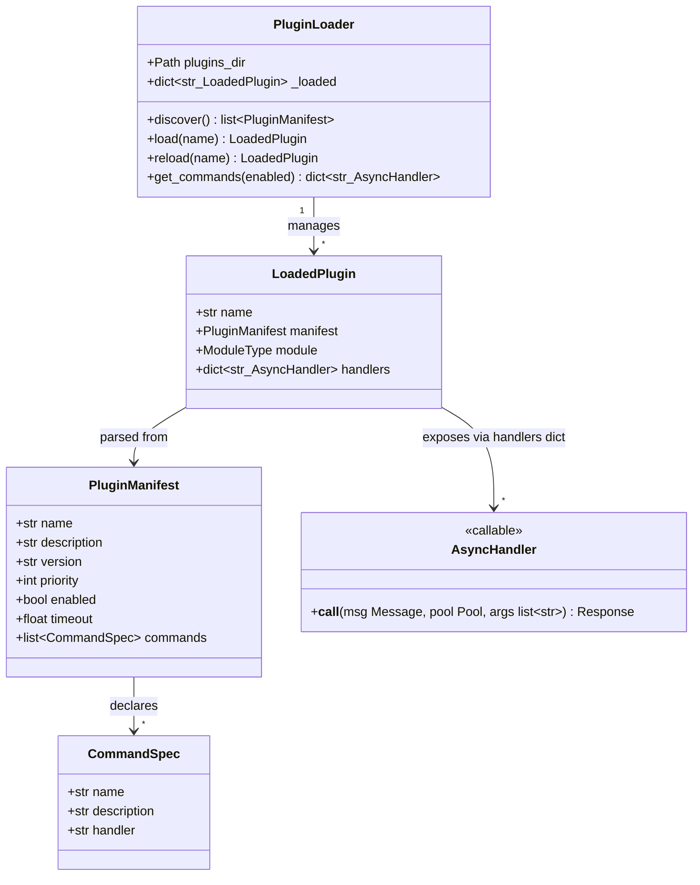
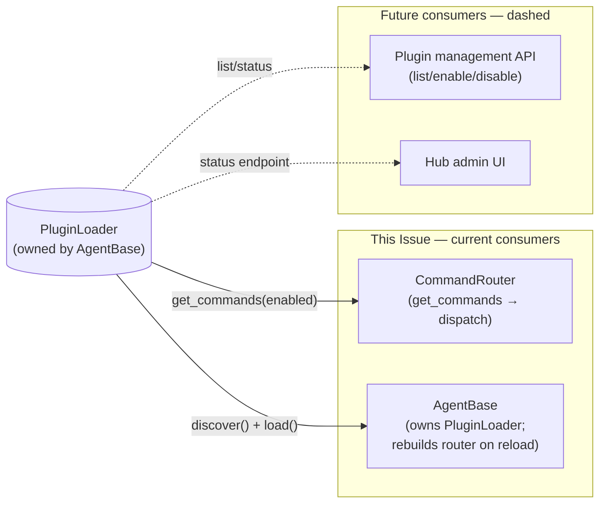

## Context

Promoted from: `artifacts/frames/106-plugin-system-mvp-frame.mdx`

`SKILL_REGISTRY` in `src/lyra/core/command_router.py` is a hardcoded dict mapping `(skill, action)` tuples to CLI argv prefixes. `SkillHandler` runs them as subprocesses. Every new capability requires: (1) edit Python source, (2) restart hub, (3) applies globally to all agents. This spec replaces both with a directory-based plugin system using TOML manifests and async Python handlers.

## Goal

Enable new Lyra skills to be added by dropping a folder into `src/lyra/plugins/` and editing a TOML manifest — no core code changes, no restart required (after initial boot).

## Users

- **Primary:** Hub developer (Mickael) — adds/updates skills without touching `command_router.py`
- **Secondary:** Future contributors — each plugin is a self-contained folder

## Out of Scope

- Marketplace sync / remote plugin distribution
- Remote plugins (fetched from URL)
- Sandboxing / isolation
- NATS plugin workers (#59 — different scope, Phase 5)
- Subprocess skill execution model (replaced entirely by async handlers)

## Expected Behavior

### Adding a plugin (developer walkthrough)

1. Create `src/lyra/plugins/my-skill/plugin.toml` and `handlers.py`
2. Define commands in the manifest; implement async handler functions
3. Enable the plugin in the agent TOML (`[plugins] enabled = ["my-skill"]`)
4. Hub discovers and loads on startup — or call `PluginLoader.reload("my-skill")` at runtime

### Command dispatch (runtime)

1. Message `/echo hello` arrives at `CommandRouter`
2. Router calls `PluginLoader.get_commands(enabled)` → `dict[str, AsyncHandler]` keyed by slash-command (e.g. `"/echo"`)
3. Router looks up `handlers["/echo"]` and calls `handler(msg, pool, ["hello"])`
4. Returns `Response`; adapter sends it back

### Per-agent enable/disable

Agent TOML declares which plugins are active. The `[commands]` section (currently used for skill mapping) is replaced entirely:
```toml
[plugins]
enabled = ["echo", "calendar"]
```
If `[plugins]` is absent, all discovered plugins with `enabled = true` in their manifest are loaded. `enabled = false` in `plugin.toml` prevents loading regardless of agent config.

### Hot-reload

`PluginLoader.reload("echo")` re-reads `plugin.toml` and re-imports `handlers.py` via `importlib.reload()`. **Important:** `AgentBase` reconstructs its `CommandRouter` after every reload (same pattern as the existing `_maybe_reload()` flow), so the router always holds a fresh handler snapshot — no stale-reference hazard.

Reload happens between messages. The Pool lock (in `Hub.run()`) serialises access, so no in-flight command is interrupted.

---

## Data Model & Consumers





| Consumer | Fields consumed | When | Status |
|----------|----------------|------|--------|
| `CommandRouter` | `get_commands(enabled)` → `dict[str, AsyncHandler]` | Every command dispatch | This issue |
| `AgentBase` | `discover()` on init; `load(name)` per plugin; `reload(name)` on mtime change | Agent init + hot-reload | This issue |
| Plugin management API | `discover()`, `reload()`, `_loaded` dict | Future `/plugins` command | Future |
| Hub admin UI | `discover()`, `_loaded`, `manifest.enabled` | Future dashboard | Future |

---

## Breadboard

### Affordance table

| ID | Element | Handler | Data in | Data out |
|----|---------|---------|---------|---------|
| N1 | `/echo hello` slash command | `CommandRouter.dispatch()` | `Message` | `Response` |
| N2 | `PluginLoader.get_commands(enabled)` | `PluginLoader` | `list[str]` enabled plugin names | `dict[str, AsyncHandler]` keyed by `"/cmd-name"` |
| N3 | `handlers.py::cmd_echo(msg, pool, args)` | async handler | `msg: Message`, `pool: Pool`, `args: list[str]` | `Response` |
| N4 | `plugin.toml` manifest | `tomllib.load()` | file path | `PluginManifest` |
| N5 | `[plugins] enabled = [...]` in agent TOML | `load_agent_config()` | TOML file | `list[str]` plugin names |
| N6 | `PluginLoader.reload("echo")` | `PluginLoader.reload()` | plugin name str | `LoadedPlugin` (updated) |
| N7 | `PluginLoader.discover()` | dir scan + manifest parse | `plugins_dir: Path` (anchored to package root) | `list[PluginManifest]` |

### Plugin name → command key mapping

`get_commands(enabled)` iterates `_loaded` plugins whose names are in `enabled`. For each plugin, it iterates `manifest.commands` and resolves `handlers[f"/{cmd.name}"]` (slash-prefixed). The returned dict is keyed by `"/cmd-name"` matching `CommandRouter`'s `command_name` format.

### SkillHandler and SKILL_REGISTRY disposal

`SkillHandler` and `SKILL_REGISTRY` are **deleted** in Slice 2. The `echo` and `google-workspace` handlers in their new `handlers.py` files implement their own subprocess calls inline (or via `asyncio.create_subprocess_exec`) — keeping the behavior identical but removing the centralized registry.

`CommandConfig` is **simplified**: `skill`, `action`, `cli` fields removed. Only `description`, `builtin`, `timeout` survive for the `/help` builtin. The `[commands]` section in agent TOML is replaced by `[plugins]`.

### Wiring

```
Message("/echo hello")
  → Hub.run() → resolve_binding → Pool → agent.command_router
  → CommandRouter.is_command() ✓
  → CommandRouter.dispatch()
      → self._plugin_loader.get_commands(self._enabled_plugins)
      → handlers["/echo"](msg, pool, ["hello"])   # async call
      → Response("hello")
  → Hub.dispatch_response()
```

```
Hub startup / AgentBase.__init__:
  → PluginLoader(plugins_dir=Path(__file__).parent / "plugins")  # absolute, package-relative
  → loader.discover()  → scan dirs → parse plugin.toml → skip invalid dirs silently
  → for name in enabled_plugins: loader.load(name)
  → CommandRouter receives loader.get_commands(enabled) on each dispatch
```

```
Hot-reload (AgentBase._maybe_reload):
  → mtime check on agent.toml ∨ plugin files changed
  → loader.reload(name) → importlib.reload(module) → fresh handlers dict
  → self.command_router = CommandRouter(loader.get_commands(enabled))  # router rebuilt, no stale refs
```

---

## Slices

| # | Slice | Delivers | Entry point demo |
|---|-------|---------|-----------------|
| 1 | **PluginLoader foundation (isolated)** | `PluginLoader.discover()`, `load()`, `get_commands()`. Unit-tested in isolation. No router changes yet. Echo plugin exists at `src/lyra/plugins/echo/`. SKILL_REGISTRY and SkillHandler still present. | Unit tests pass: discover finds echo, load resolves handler, get_commands returns `{"/echo": <fn>}` |
| 2 | **Router integration + echo migration** | Remove `SKILL_REGISTRY` and `SkillHandler`. Wire `PluginLoader` into `CommandRouter`. `CommandConfig` simplified. Echo fully migrated — agent TOML gains `[plugins]` section, `[commands."/echo"]` removed. | `/echo hello` works end-to-end via async handler; all existing tests pass |
| 3 | **google-workspace migration + per-agent config** | `google-workspace` migrated to plugin folder. `load_agent_config()` reads `[plugins]` section. Two agents with different enabled sets route to different handlers. | Agent without google-workspace in `[plugins]` returns unknown-command for `/calendar-today` |
| 4 | **Hot-reload** | `PluginLoader.reload(name)` reimports module. `AgentBase._maybe_reload()` detects plugin file mtime changes and rebuilds CommandRouter. | Edit `handlers.py`, trigger reload, behavior changes without restart |

---

## Success Criteria

- [ ] `PluginLoader.discover()` scans `src/lyra/plugins/` and returns one `PluginManifest` per valid plugin directory; silently skips directories without a valid `plugin.toml`
- [ ] `PluginLoader.load(name)` dynamically imports `handlers.py` and resolves handler callables by name via `getattr`; raises `ValueError` if a declared handler name is not found or not callable
- [ ] `PluginLoader.get_commands(enabled)` returns a `dict[str, AsyncHandler]` keyed by `"/cmd-name"`, containing only handlers for plugins in the `enabled` list
- [ ] `SKILL_REGISTRY` dict is removed from `command_router.py`
- [ ] `SkillHandler` class is removed from `command_router.py`
- [ ] `CommandRouter.dispatch()` calls `PluginLoader.get_commands(enabled)` to resolve handlers
- [ ] A command registered in plugin X is not dispatched for an agent whose `[plugins]` enabled list excludes X — router returns the unknown-command response for that agent
- [ ] Absent `[plugins]` section in agent TOML → all discovered plugins with `manifest.enabled = true` are loaded
- [ ] `plugin.toml` with `enabled = false` → plugin not loaded regardless of agent config
- [ ] `echo` plugin lives at `src/lyra/plugins/echo/plugin.toml` + `handlers.py` with `async def cmd_echo(msg: Message, pool: Pool, args: list[str]) -> Response`
- [ ] `google-workspace` plugin lives at `src/lyra/plugins/google-workspace/plugin.toml` + `handlers.py`
- [ ] `PluginLoader.reload(name)` re-reads manifest and re-imports module; `AgentBase` reconstructs `CommandRouter` after reload
- [ ] All existing tests pass after migration
- [ ] Unit tests exist and pass for: `discover()`, `load()`, `get_commands()`, `reload()`, invalid manifest (missing handler), and malformed `plugin.toml`
