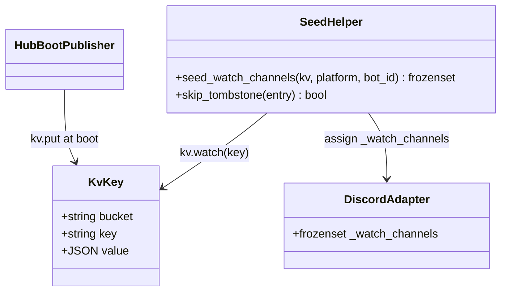
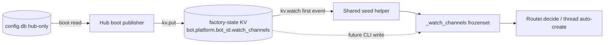

## Context

Source: `artifacts/frames/1060-discord-watch-channels-via-nats-frame.mdx`. Phase 6 of epic #1049.

**Scope correction (expert-reviewed 2026-06-03).** The original issue conflated two deliverables;
evidence shows only one is doable now:

- ✅ **Close the last `config.db` read** — the standalone Discord adapter reads each bot's
  `watch_channels` from `config.db` at boot (`standalone_discord.py:_bootstrap_discord_setup`, 46-69).
  This is the genuine Phase-6 deliverable and is fully achievable.
- ⛔ **Drop `factory-data.volume` from the adapters** — **NOT** doable in #1060. The same volume still
  backs `turns.db` (Discord+Telegram, `standalone_discord.py:79` / `standalone_telegram.py:45`) and
  `discord.db` (`standalone_discord.py:77`). Containers are `ReadOnly=true` with no tmpfs → dropping
  the volume crashes both adapters at store-connect. `turns.db`→KV is epic **Phase 4** and `discord.db`
  is its own phase — **neither is done**. The volume-drop therefore **defers to a follow-up gated on
  Phase 4 + the discord.db phase** (see Deferred Follow-ups).

Architect confirmed the increment is clean: `_bootstrap_discord_setup` (config.db, this issue) and
`_create_dc_stores` (turns.db/discord.db, Phase 4) are separate functions with no shared state; closing
config.db now **reduces** Phase 4's blast radius (no overlapping code, no merge surface).

## Goal

Move the Discord standalone adapter's `watch_channels` source from `config.db` to NATS JetStream KV,
eliminating the last `config.db` open in any standalone adapter process — via a **cross-platform**
helper and a **platform-agnostic** KV key, so the pattern extends to other adapters with zero
duplication when they later need `watch_channels`.

## Users

- **Primary:** Operator (Mickael) — severs the adapter's read-write SQLite handle on the whole config
  store at boot (blast-radius reduction); lays the live-update groundwork.
- **Secondary:** Future adapters — a shared KV-state-seed primitive instead of per-platform copies.

## Design Decisions (forks resolved + axial corrections)

**D1 — Bucket: reuse `factory-state` (B2).** Adapter already holds `subscribe: $KV.factory-state.>` +
`$JS.API.CONSUMER.CREATE.*` + `STREAM.INFO.KV_factory-state`; hub holds `publish: $KV.factory-state.>`
(`deploy/nats/acl-matrix.json`). → **no new ACL identity, no auth.conf/706/fixture/CURRENT regen**.

**D2 — Key schema: platform-agnostic `bot.<platform>.<bot_id>.watch_channels`** → JSON int[].
(Axial: a `discord`-literal key bakes the non-primary axis into the wire contract; the key doesn't
exist in prod yet so there's zero migration cost to making it generic now.)

**D3 — Read via `kv.watch()` first-event, NOT `kv.get()`.** The adapter's `DIRECT.GET` grant is
key-scoped to `.hub.ready`, so a `kv.get()` of a new key is **denied** on the direct path. `kv.watch()`
delivers the current value as its first event and rides the bucket-wide subscribe + `CONSUMER.CREATE.*`
grants the adapter already has → **zero new ACL**. (This is the primary justification — independent of
live-update.) The running watch also makes the adapter live-update-ready for the deferred CLI writer.
Edge handling (architect): the first event is `None` if the key was never written (→ `frozenset()`);
entries with `entry.operation` ∈ {`DEL`,`PURGE`} are tombstones → treat as absent (`frozenset()`),
never `json.loads(b"")`.

**D4 — Shared cross-platform helper (axial N×M fix).** The KV-watch seed/live logic lives in a shared
module (e.g. `bootstrap/wiring/kv_watch_channels.py`), NOT inlined in `standalone_discord.py`. Discord
calls it now; Telegram (`watch_channels=None` today, `telegram_inbound.py:109,275`) reuses it verbatim
when it needs the feature — no duplication.

**D5 — Publisher: hub at boot.** The hub (still owns `config.db`/the volume) mirrors each configured
bot's `watch_channels` into KV after KV provisioning and **before `announce_hub_ready`**
(`hub_standalone.py`, after line ~170, before line 180), so the key exists when adapters attach.
Parameterized by platform (not discord-hardcoded). The runtime write path (CLI) is **deferred**.

## Expected Behavior

1. **Hub boot:** after KV provisioning, before `announce_hub_ready`, hub reads `config.db` for every
   configured bot with `watch_channels` and `kv.put("bot.<platform>.<bot_id>.watch_channels", json(ids))`.
2. **Adapter boot:** after `wait_for_hub(nc)`, for each Discord bot the shared helper starts
   `kv.watch("bot.discord.<bot_id>.watch_channels")`; the first delivered entry seeds the frozenset
   (`None`/tombstone/timeout → `frozenset()`). **No `config.db` open occurs in the adapter.**
3. **Live-ready:** the watch keeps running; a future KV write reassigns `adapter._watch_channels`
   (atomic ref-swap, asyncio single-thread — safe). No runtime writer ships in #1060.
4. **Volume:** unchanged — still mounted (turns.db/discord.db tenants). Docs + lint reflect reality.

## Data Model & Consumers

| Consumer | Fields | When | Status |
|---|---|---|---|
| Hub boot publisher | watch_channels per bot | hub boot, pre-announce_hub_ready | this issue |
| Shared seed helper (Discord) | watch_channels | boot first-event (+ live-ready) | this issue |
| Shared seed helper (Telegram) | watch_channels | n/a today (watch_channels=None) | future, reuses helper |
| Router / thread auto-create | `_watch_channels` | every inbound message | existing (unchanged) |
| CLI runtime writer | watch_channels | operator change | deferred follow-up |

## Breadboard

| ID | Affordance | Handler | Data |
|----|-----------|---------|------|
| N1 | KV key `bot.<platform>.<bot_id>.watch_channels` | `factory-state` bucket | JSON int[] |
| N2 | Hub boot publish loop | new helper in hub bootstrap, pre-`announce_hub_ready` | hub `AgentStore.get_bot_settings` → `kv.put` |
| N3 | Shared seed helper `seed_watch_channels(kv, platform, bot_id)` | new module `bootstrap/wiring/kv_watch_channels.py` | `kv.watch` first-event + tombstone skip → frozenset |
| N4 | Wire Discord to N3 | edit `standalone_discord.py` (post-`wait_for_hub`) | replace `_bootstrap_discord_setup` config.db block |
| N5 | Remove `config.db` open | edit `_bootstrap_discord_setup` | drop `AgentStore(config.db)` |
| D1 | Falsification lint (docs Volumes table ↔ Quadlet `Volume=`) | `tools/check_*.sh` + `stack.yml` quality_gate | — |
| D2 | Fix existing doc drift | `docs/architecture/deployment.md:146` (claims per-file binds; quadlets mount whole volume) | — |

Wiring: N2 publishes N1 → N3 consumes N1 (shared) → N4 wires Discord to N3, replacing N5. D1 enforces
the Volumes table; D2 makes the current table truthful so D1 passes. Volume stays mounted (out of scope).

## Slices

| # | Slice | Affordances | Demo |
|---|-------|-------------|------|
| 1 | **config.db read → KV (shared, platform-agnostic)** | N1,N2,N3,N4,N5,D1,D2 | Boot hub+adapter; assert Discord filters watch channels seeded from KV via the shared helper; `grep AgentStore.*config.db` in standalone adapters = 0; `acl-matrix.json` untouched; lint green |

Single slice (config.db-only scope) → no smart-split. Live-write + volume-drop are separate follow-ups.

## Success Criteria

- [ ] `grep -rn 'AgentStore.*config.db' src/factory/bootstrap/wiring/standalone_discord.py src/factory/bootstrap/wiring/standalone_telegram.py` → **0 matches** (config.db no longer opened in any standalone adapter).
- [ ] Discord adapter seeds `watch_channels` from KV via the shared helper: unit test mocks `kv.watch()` yielding one entry and asserts `adapter._watch_channels == frozenset({<seeded ids>})`.
- [ ] Shared helper handles edges: unit tests assert `None` first-event → `frozenset()`, and a `DEL`/`PURGE` tombstone entry → `frozenset()` (no `json.loads(b"")` crash).
- [ ] KV key is platform-agnostic `bot.<platform>.<bot_id>.watch_channels` (asserted in helper + publisher tests; no `discord`-literal in the key string).
- [ ] Helper lives in a shared module callable by both `standalone_discord.py` and `standalone_telegram.py` (import-site test or grep: the watch logic is not duplicated inline in either adapter).
- [ ] Hub publishes each configured bot's `watch_channels` to KV before `announce_hub_ready` (test asserts ordering / publish call).
- [ ] `deploy/nats/acl-matrix.json` unchanged (`git diff --stat` shows the file untouched).
- [ ] Falsification lint installed in pre-push (`stack.yml` quality_gates) asserting the docs Volumes table matches Quadlet `Volume=` lines; exits non-zero on an injected mismatch; `deployment.md:146` drift fixed so the gate is green.

## Deferred Follow-ups (siblings of #1060 under epic #1049)

1. **CLI live-write** (#1720) `factory bot set-watch-channels <platform> <bot> <ids…>` — writes config.db
   (wires the currently-dead `set_bot_settings`) + `kv.put` via hub creds → running adapter updates
   without restart. `blocked-by #1060`, `parent #1049`. (Product-lead: split now, don't cut at impl.)
2. **Volume-drop** (#1721) from `factory-discord`/`factory-telegram` `.tmpl` — gated on Phase 4 (turns.db→KV)
   + the discord.db phase. Only after no adapter file-opens the volume.

## Out of Scope

- Dropping `factory-data.volume` from any adapter (blocked — see Context).
- Migrating `turns.db` (Phase 4) or `discord.db` (own phase).
- Wiring Telegram `watch_channels` (stays `None`; helper is reuse-ready only).
