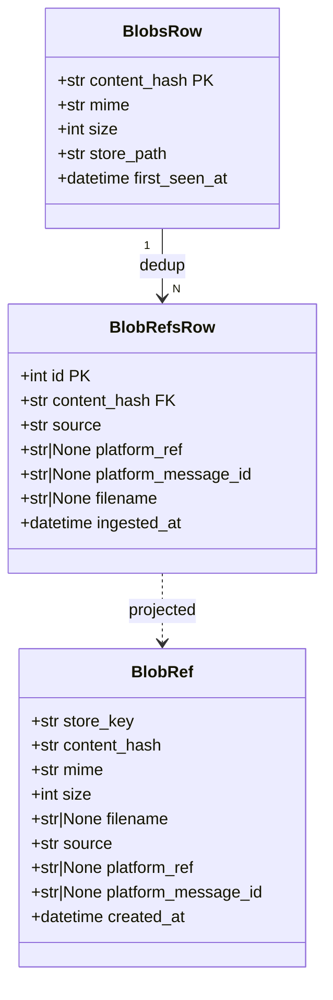
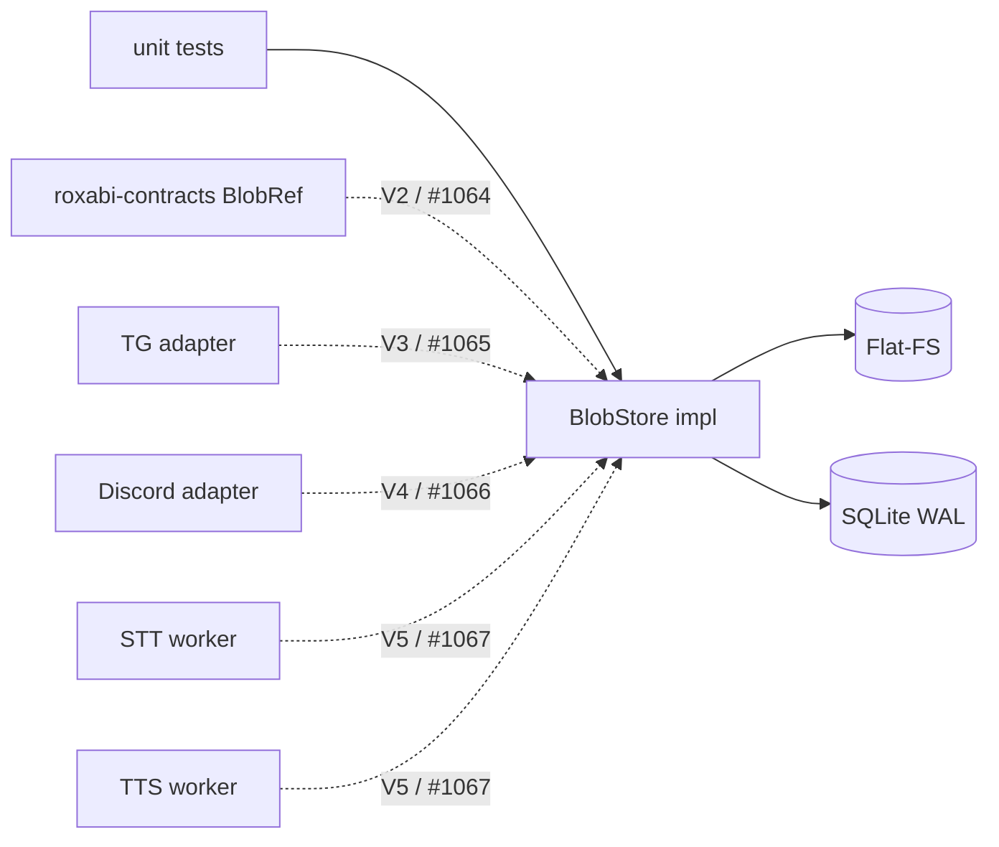

## Context

**Promoted from:** [Frame: #1063 — roxabi-blobs package](../frames/1063-roxabi-blobs-package-frame.mdx)
**Parent spec:** [Spec: #1061 — BlobStore for large binary payloads](./1061-blobstore-spec.mdx) (epic; V1 = this issue)
**Decision of record:** [ADR-067 — BlobStore abstraction (content-addressed flat-FS v1)](../../docs/architecture/adr/067-blobstore-abstraction-flat-fs-content-addressed.mdx)
**Issue:** [#1063](https://github.com/Roxabi/lyra/issues/1063)

V1 of epic [#1061](https://github.com/Roxabi/lyra/issues/1061) ships **only the package** — the foundation that V2 (#1064 contracts), V3/V4 (#1065/#1066 adapters), V5 (#1067 workers, cross-repo with voiceCLI), V6 (#1068 ops) build on. No consumer changes in this slice.

## Goal

`packages/roxabi-blobs/` exists as a uv workspace member exposing a `BlobStore` Protocol (`put` / `get` / `exists` + designed-but-not-called `delete`) implemented over a content-addressed Flat-FS + SQLite store, with ≥90% public-API unit-test coverage and clean imports from any other workspace member.

## Users

- **Primary:** lyra hub/adapters/workers (V2+) — call `BlobStore` for ingress/egress
- **Secondary:** voiceCLI STT/TTS workers (V5) — cross-repo consumer of the same package
- **Tertiary:** ML/debug operator (Mickael) — direct SQLite queries on `index.sqlite` for training-data extraction

> **V1 delivers no user-visible behaviour.** All primary/secondary users become active at V2+ (#1064 contracts, #1065/#1066 adapters, #1067 workers). V1 is a prerequisite, not a standalone deliverable.

## Expected Behavior

### Happy path — round-trip put/get/exists

1. Consumer calls `await store.put(data, mime="audio/ogg", source="telegram", platform_ref="tg:42", platform_message_id="100")`.
2. `put` computes `sha256(data)`.
3. `put` SELECTs `blobs` WHERE `content_hash = ?`. Hit → skip file write. Miss → write file `<root>/<sha[:2]>/<sha>` → `fsync` on the blob file → `fsync` on the shard directory `<root>/<sha[:2]>/` (otherwise the directory entry may be lost on crash even with file data flushed) → INSERT `blobs(content_hash, mime, size, store_path, first_seen_at)`.
4. `put` always INSERTs a new `blob_refs(content_hash, source, platform_ref, platform_message_id, filename, ingested_at)` row.
5. `put` returns a `BlobRef` envelope `{store_key, content_hash, mime, size, filename, source, platform_ref, platform_message_id, created_at}`.
6. Later: `await store.get(ref.store_key)` opens the FS path and returns bytes; raises `BlobNotFoundError` if missing.
7. `await store.exists(content_hash)` returns the latest `BlobRef` for that hash, or `None`.

### Edge cases

| Case | Handling |
|---|---|
| Same content put 5× from 5 sources | 1 file on FS · 1 `blobs` row · 5 `blob_refs` rows |
| Crash between file `fsync` and `blobs` INSERT | Orphan file on FS; recoverable by V6 reconciler (out of scope here — benign for V1) |
| Crash between `blobs` INSERT and `blob_refs` INSERT | `blobs` row without refs; benign — next `put` reuses it |
| `get` on missing `store_key` | Raise `BlobNotFoundError` (typed) |
| `exists` on unknown `content_hash` | Return `None` |
| SQLite locked (inter-process) | `BUSY_TIMEOUT=5000` — covers OS-level contention only |
| Concurrent `put` from multiple coroutines (same process) | `FsBlobStore` holds an `asyncio.Lock` over the write path (sha-compute + file write + fsync + INSERT) — single-writer-per-instance enforced at the asyncio layer, not just documented |
| Disk full on `put` | Surface OS error as typed `BlobWriteError` |
| sha-256 collision | Operationally impossible; ¬handled |

## Data Model & Consumers

### Data structure

### Consumer map (V1 scope = solid; future = dashed)

### Consumer summary

| Consumer | Surface used | When | Status |
|---|---|---|---|
| unit tests | full public API + both SQLite rows | V1 (this issue) | this issue |
| `roxabi-contracts` `BlobRef` | mirror envelope | V2 / #1064 | future |
| TG adapter | `put` ingress, `get` egress | V3 / #1065 | future |
| Discord adapter | `put` ingress, `get` egress | V4 / #1066 | future |
| voiceCLI STT/TTS | `get` (STT), `put` (TTS) | V5 / #1067 | future |

## Breadboard

### API affordances (V1 = package only — no UI)

| ID | Affordance | Wiring | Logic |
|----|---|---|---|
| N1 | `async put(data, *, mime, source, filename=None, platform_ref=None, platform_message_id=None) → BlobRef` | tests → N1 → S1, S2, S3 | sha256; SELECT S1; miss → write S3 → fsync → INSERT S1; INSERT S2; return BlobRef |
| N2 | `async get(store_key) → bytes` | tests → N2 → S3 | open(store_key, "rb").read(); raise `BlobNotFoundError` if missing |
| N3 | `async exists(content_hash) → BlobRef \| None` | tests → N3 → S1, S2 | SELECT S1; build BlobRef from `S2 WHERE content_hash=? ORDER BY ingested_at DESC LIMIT 1` (deterministic "latest"); None if absent |
| N4 | `async delete(blob_ref_id) → None` | designed; ¬called in V1 paths | DELETE S2 row; if no remaining refs → DELETE S1 row + unlink S3 file |
| N5 | `FsBlobStore(root: Path, *, db_path: Path \| None = None)` + `__aenter__/__aexit__` | factory | open SQLite WAL, ensure schema (incl. index `blob_refs(content_hash, ingested_at DESC)`), ensure root dir, set `BUSY_TIMEOUT=5000`, instantiate `asyncio.Lock` for write-path serialisation |

### Data stores

| ID | Store | Type | Accessed by |
|---|---|---|---|
| S1 | `blobs(content_hash PK, mime, size, store_path, first_seen_at)` | SQLite WAL | N1, N3, N4 |
| S2 | `blob_refs(id PK, content_hash FK, source, platform_ref, platform_message_id, filename, ingested_at)` + index on `(content_hash, ingested_at DESC)` | SQLite WAL | N1, N3, N4 |
| S3 | Flat-FS: `<root>/<sha[:2]>/<sha>` | tmpdir in tests; bind-mount in prod (V6) | N1 (write), N2 (read), N4 (unlink) |

## Slices

| Slice | Description | Affordances | Demo |
|---|---|---|---|
| V1a | Package skeleton — `pyproject.toml`, `src/roxabi_blobs/__init__.py`, workspace member, `BlobStore` Protocol type, `BlobRef` Pydantic model (internal envelope — see note below), typed errors (`BlobNotFoundError`, `BlobWriteError`) | type stubs | `uv sync` succeeds; `from roxabi_blobs import BlobStore, BlobRef, BlobNotFoundError, BlobWriteError` works (import-level demo only; full round-trip lands in V1b) |
| V1b | `FsBlobStore` impl — N5 factory + N1/N2/N3/N4 methods + WAL schema bootstrap + sha256 dedup + write ordering (file → fsync → INSERT) | N1, N2, N3, N4, N5, S1, S2, S3 | tmpdir round-trip; put same blob 5× → 1 file + 1 `blobs` row + 5 `blob_refs` rows |
| V1c | Test suite — ≥90% line+branch coverage on public API (`delete` covered by direct unit tests even though no production caller in V1); crash-injection test for write ordering; concurrent-put smoke test (asserts `asyncio.Lock` serialises) | (test module) | `pytest packages/roxabi-blobs --cov` shows ≥90% on public API |

> **`BlobRef` ownership note:** V1 defines `BlobRef` internally in `roxabi-blobs` (package-local envelope). V2 (#1064) mirrors `BlobRef` in `roxabi-contracts` as the on-wire type. The two coexist intentionally — `roxabi-blobs` does **not** import from `roxabi-contracts` (avoids cyclic dependency between storage and transport layers). Field shapes are kept identical by spec, not by import.

## Success Criteria

- [ ] `packages/roxabi-blobs/` exists as uv workspace member; `uv sync` resolves clean; `from roxabi_blobs import BlobStore, BlobRef, BlobNotFoundError, BlobWriteError` imports work
- [ ] `BlobStore` is a `typing.Protocol` with 4 async methods (`put` / `get` / `exists` / `delete`) matching ADR-067 §Interface; `FsBlobStore` implements all 4 + async context manager
- [ ] SQLite WAL mode enabled; `BUSY_TIMEOUT=5000` set; schema (split `blobs` + `blob_refs`) created at bootstrap
- [ ] `put` sha256 dedup verified — same blob put 5× → 1 file on FS + 1 `blobs` row + 5 `blob_refs` rows
- [ ] `put` write order is `file → fsync(file) → fsync(shard dir) → INSERT` — crash-injection test passes (process-kill between fsync and INSERT leaves recoverable state; missing dir-fsync is a regression)
- [ ] Concurrent `put` from N coroutines in one process is serialised via `asyncio.Lock` (smoke test: 50 coroutines, same blob → 1 file, 1 `blobs` row, 50 `blob_refs` rows, no `OperationalError`)
- [ ] `get` returns exact bytes for a known `store_key`; raises `BlobNotFoundError` on missing key
- [ ] `exists(content_hash)` returns the latest `BlobRef` (deterministic via `ORDER BY ingested_at DESC LIMIT 1`) or `None`
- [ ] `delete(blob_ref_id)` signature is defined on the Protocol and implemented on `FsBlobStore` per ADR-067 §Interface; behaviour unit-tested in V1b (2 refs → delete 1 → file remains; delete 2 → file + `blobs` row gone); not called from any production path in V1
- [ ] ≥90% line + branch coverage on public API (`pytest-cov`) — `delete` included in the coverage target
- [ ] No file in `packages/roxabi-blobs/src/` exceeds 300 LOC (`quality_gates.file_length` from `stack.yml`)
