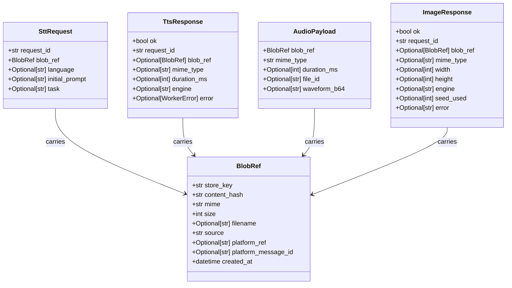
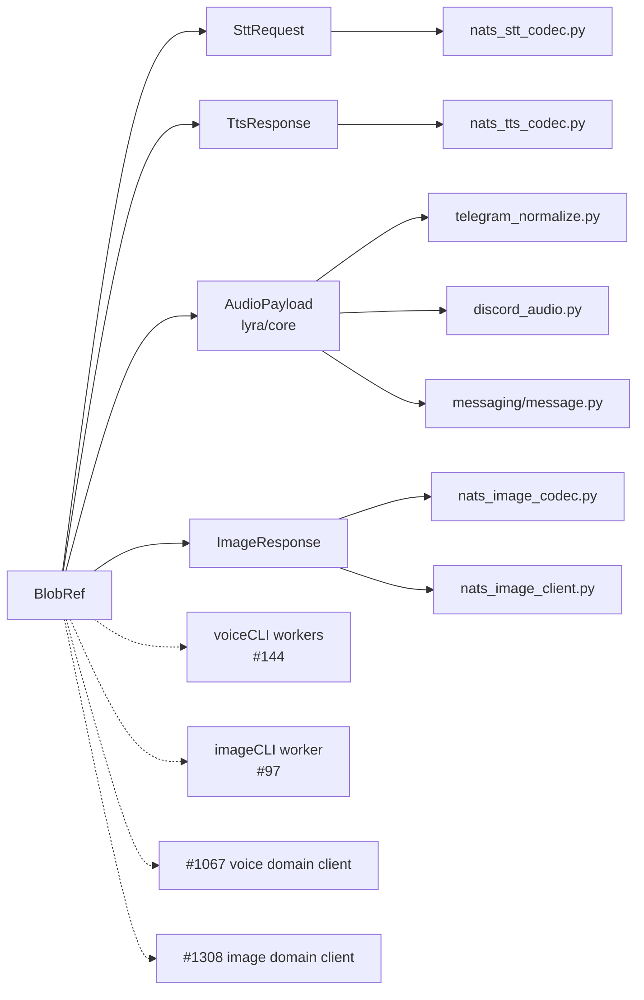

## Context

Slice V2 of BlobStore epic #1061. ADR-067 (accepted 2026-05-09) replaces inline-bytes payloads in NATS messages with a content-addressed BlobRef carrying `(store_key, content_hash, mime, size, source, …)`. V1 (`packages/roxabi-blobs/`, #1063) shipped the BlobStore primitive. This slice updates the wire contracts so adapters, workers, and the hub can begin propagating BlobRef instead of inline bytes.

Q4 of parent spec #1061 is binding: **atomic migration, no DeprecationWarning shim**. Cross-repo couples voiceCLI#144 + imageCLI#97 merge together (GitHub native deps already wired ✓).

## Goal

Replace `audio_b64` / `audio_bytes` / `image_b64` / `file_path` inline-bytes fields with a typed `BlobRef` reference in `SttRequest`, `TtsResponse`, `AudioPayload`, and `ImageResponse`, atomically — no shim, no deprecation window — and update the 5 lyra wire-codec / adapter consumer files in the same PR.

## Users

| Actor | Role |
|---|---|
| Hub (`lyra-hub`) | Routes `BlobRef` between adapters/workers; never reads/writes blob bytes |
| Telegram adapter | Creates `AudioPayload(blob_ref=...)` on inbound voice; receives `blob_ref` on outbound voice |
| Discord adapter | Symmetric with Telegram |
| voiceCLI workers (STT/TTS) | Consume `SttRequest(blob_ref)`; produce `TtsResponse(blob_ref)` — coordinated via voiceCLI#144 |
| imageCLI worker | Produces `ImageResponse(blob_ref)` — coordinated via imageCLI#97 |
| ML/debug operator | Queries BlobStore manifest by `content_hash` — schema unchanged |

## Expected Behavior

### Happy path — STT request (hub → STT worker)

1. Hub builds `SttRequest(request_id="r1", blob_ref=BlobRef(store_key=..., content_hash=..., mime="audio/ogg", size=12345, source="telegram", …))`.
2. NATS publishes envelope to `lyra.voice.stt.request`. Wire payload is small (no inline bytes).
3. voiceCLI worker decodes via Pydantic → reads blob bytes via `BlobStore.get(store_key)` → transcribes → replies `SttResponse(text=...)` (unchanged).

### Happy path — TTS response (TTS worker → hub)

1. Worker synthesises → `BlobStore.put(bytes, mime="audio/ogg", source="tts-worker", …)` → gets `BlobRef`.
2. Replies `TtsResponse(ok=True, blob_ref=BlobRef(...))`.
3. Hub publishes `lyra.outbound.<platform>` with `OutboundMessage(audio=AudioPayload(blob_ref=...))`.

### Happy path — image generation (imageCLI worker → hub)

1. Worker generates bytes → `BlobStore.put(...)` → `BlobRef`.
2. Replies `ImageResponse(ok=True, blob_ref=BlobRef(...), mime_type="image/png", width=..., height=..., engine=..., seed_used=...)`.
3. The old XOR validator (`image_b64 XOR file_path`) collapses — single source of truth.

### Edge cases

| Case | Handling |
|---|---|
| `SttRequest` constructed with old `audio_b64` kwarg | Pydantic ValidationError (extra field rejected via ConfigDict `extra="ignore"` for forward-compat, but `blob_ref` required → falsy → validation fails on missing required field). Tests assert this. |
| `TtsResponse(ok=True)` without `blob_ref` | `_enforce_success_invariant` raises — same shape as previous `audio_b64` rule, just renamed |
| `ImageResponse(ok=True)` without `blob_ref` | Same — replaces XOR validator with simpler "blob_ref required when ok=True" check |
| `AudioPayload` constructed with old `audio_bytes` kwarg | Dataclass TypeError (frozen, positional fields) — test covers |
| Consumer site imports unchanged | Field names change; consumer reads `blob_ref` not `audio_b64`; mypy/pyright catches drift |
| Cross-repo couple not yet merged (voiceCLI#144 still open) | This PR ships `roxabi-contracts` change → voiceCLI build (PR #144) is blocked-by, fails CI until rebased on new contracts version |

## Data Model & Consumers

### Data structure (after migration)



### Consumer map



Solid = this issue. Dashed = downstream (out of scope this PR, but BlobRef fields must be addressable).

### Consumer summary

| Consumer | Surface | Fields read/written | When | Status |
|---|---|---|---|---|
| `nats_stt_codec.py` | encode/decode `SttRequest` | `blob_ref` | hub → STT | this issue |
| `nats_tts_codec.py` | encode/decode `TtsResponse` | `blob_ref` | TTS → hub | this issue |
| `nats_image_codec.py` | encode/decode `ImageResponse` | `blob_ref` | image → hub | this issue |
| `nats_image_client.py` | build/parse image flow | `blob_ref` | hub callsite | this issue (conservative edit) |
| `telegram_normalize.py` | builds `AudioPayload` on inbound voice | `blob_ref` | TG inbound | this issue (field-rename only; no eager-ingest logic here) |
| `discord_audio.py` | builds `AudioPayload` on inbound voice | `blob_ref` | Discord inbound | this issue (field-rename only) |
| `messaging/message.py` | hosts `InboundMessage.audio: AudioPayload` | none changed | hub routing | this issue (compile check only) |
| voiceCLI workers | consume `SttRequest(blob_ref)`, produce `TtsResponse(blob_ref)` | `blob_ref` | STT/TTS | future (voiceCLI#144) |
| imageCLI worker | produce `ImageResponse(blob_ref)` | `blob_ref` | image gen | future (imageCLI#97) |
| #1067 voice domain client | end-to-end voice via BlobRef | `blob_ref` | lyra-side | future |
| #1308 image domain client | end-to-end image via BlobRef; replaces `nats_image_client.py` | `blob_ref` | lyra-side | future |

## Breadboard

### Code Affordances

| ID | Handler | Wiring | Logic |
|---|---|---|---|
| N1 | `BlobRef` Pydantic model | top-level export from `roxabi_contracts` | 9 fields per ADR-067; frozen via `model_config = ConfigDict(frozen=True, extra="forbid")` (defensive — BlobRef is a primitive value) |
| N2 | `SttRequest.blob_ref: BlobRef` | replaces `audio_b64` | required field; ContractEnvelope `extra="ignore"` keeps forward-compat for unknown wire fields |
| N3 | `TtsResponse.blob_ref: BlobRef \| None` | replaces `audio_b64` | optional shape; `_enforce_success_invariant` raises when `ok=True` ∧ `blob_ref` is None |
| N4 | `ImageResponse.blob_ref: BlobRef \| None` | replaces `image_b64 + file_path` | optional shape; XOR validator collapses to simple "required when ok=True" |
| N5 | `AudioPayload.blob_ref: BlobRef` | replaces `audio_bytes` | frozen dataclass field; positional argument |
| N6 | voice/builders.py `make_tts_response(blob_ref=...)` | mirrors model rename | helper signature updated |
| N7 | `nats_stt_codec.py` encode/decode | sites using `audio_b64` | swap to `blob_ref` |
| N8 | `nats_tts_codec.py` encode/decode | sites using `audio_b64` | swap to `blob_ref` |
| N9 | `nats_image_codec.py` encode/decode | sites using `image_b64`/`file_path` | swap to `blob_ref` |
| N10 | `nats_image_client.py` (conservative edit) | hub callsite for image flow | field-rename only, no structural refactor |
| N11 | `telegram_normalize.py` inbound voice builder | constructs `AudioPayload` | swap `audio_bytes=...` to `blob_ref=...` — sentinel BlobRef (see [Transitional Shape](#transitional-shape)) |
| N12 | `discord_audio.py` inbound voice builder | constructs `AudioPayload` | symmetric with N11 |
| N13 | `PENDING_STORE_KEY` named constant | exported from `roxabi_contracts` (top-level) | string literal `"__pending__"`; workers detect via `blob_ref.store_key == PENDING_STORE_KEY` to trigger legacy fetch path |

### Data Stores

| ID | Store | Type | Accessed by |
|---|---|---|---|
| S1 | NATS messages carrying `BlobRef` (no inline bytes) | transient (NATS) | adapters, hub, workers |
| S2 | BlobStore Flat-FS + SQLite manifest (#1063 — already shipped) | persistent | adapters + workers (this PR doesn't touch — consumers will in V3/V4/V5) |

## Transitional Shape

This PR does **not** add eager-ingest logic to TG/Discord adapters (that is parent #1061 V3/V4). To keep `AudioPayload.blob_ref` non-null without forcing the adapter to put bytes into BlobStore, the adapter constructs a **sentinel BlobRef** identified by a named constant exported from `roxabi_contracts`:

```python
PENDING_STORE_KEY = "__pending__"

# in telegram_normalize.py / discord_audio.py:
audio = AudioPayload(
    blob_ref=BlobRef(
        store_key=PENDING_STORE_KEY,
        content_hash="",
        mime="audio/ogg",
        size=raw_byte_count,
        source="telegram",
        platform_ref=telegram_file_id,
        ...
    ),
    ...
)

# in voiceCLI STT worker:
if request.blob_ref.store_key == PENDING_STORE_KEY:
    bytes_ = _legacy_fetch(request.blob_ref.platform_ref)  # platform API fallback
else:
    bytes_ = blob_store.get(request.blob_ref.store_key)
```

**Why a named constant, not `store_key=""`:**
- Grep-auditable: `grep -r PENDING_STORE_KEY` surfaces every transitional callsite — clear inventory for V3/V4 removal.
- Type-safe-ish: workers check against the exported constant, not an empty string, eliminating `if store_key == ""` magic.
- Wire-detectable: voiceCLI / imageCLI workers (PRs #144 / #97) have a contracted detection point, not an informal convention.

**Alternative rejected:** `AudioPayload.blob_ref: BlobRef | None` (optional). Opens a second null path, defeats Q4 atomic, and makes downstream consumers `if blob_ref is None: ...` branchy.

**Lifetime:** the sentinel is removed by V3/V4 once eager-ingest lands. Until then, every `PENDING_STORE_KEY` callsite is a TODO marker for that follow-up.

## Slices

| Slice | Description | Affordances | Demo |
|---|---|---|---|
| W1 | `BlobRef` primitive + `PENDING_STORE_KEY` constant in `roxabi-contracts` + voice contracts updated (`SttRequest`, `TtsResponse`, voice/builders) + voice tests | N1, N2, N3, N6, N13 | `pytest packages/roxabi-contracts/tests/test_voice_*.py` green; `grep -rE "audio_b64" packages/roxabi-contracts/src/roxabi_contracts/voice/{models,builders}.py` returns 0 |
| W2 | Image contract updated (`ImageResponse`) + XOR validator collapse + image tests | N4 | `pytest packages/roxabi-contracts/tests/test_image_*.py` green; `grep -E "image_b64\|file_path" packages/roxabi-contracts/src/roxabi_contracts/image/models.py` returns 0 |
| W3 | Lyra-side: `AudioPayload`, adapters (TG normalize + Discord audio, using `PENDING_STORE_KEY` sentinel), 3 NATS codecs + `nats_image_client` conservative edit, `messaging/message.py` compile check | N5, N7–N12 | `uv run pyright src/lyra/core/ src/lyra/nats/ src/lyra/adapters/` clean (incl. `src/lyra/core/messaging/`); `pytest src/lyra/` exits 0; `grep -rE "audio_b64\|audio_bytes\|image_b64" src/lyra/{nats,adapters,core}` returns 0 |

## Success Criteria

- [ ] **BlobRef model + `PENDING_STORE_KEY` constant added** — `from roxabi_contracts import BlobRef, PENDING_STORE_KEY` works; BlobRef has 9 fields per ADR-067, frozen + extra="forbid"; `PENDING_STORE_KEY == "__pending__"`; unit tests cover BlobRef round-trip + sentinel detection
- [ ] **Voice contracts purged** — `grep -rE "audio_b64\|audio_bytes" packages/roxabi-contracts/src/roxabi_contracts/voice/` returns 0 hits; `SttRequest(audio_b64=...)` raises `ValidationError`; `TtsResponse(ok=True)` without `blob_ref` raises
- [ ] **Image contract purged** — `grep -rE "image_b64\|file_path" packages/roxabi-contracts/src/roxabi_contracts/image/models.py` returns 0 hits; XOR validator removed; `ImageResponse(ok=True)` without `blob_ref` raises
- [ ] **AudioPayload purged** — `grep "audio_bytes" src/lyra/core/audio_payload.py` returns 0 hits; `AudioPayload(audio_bytes=...)` raises TypeError; test covers
- [ ] **Lyra wire codecs + adapters updated** — `grep -rE "audio_b64\|audio_bytes\|image_b64" src/lyra/{nats,adapters,core}/` returns 0 hits; sentinel callsites use `PENDING_STORE_KEY` not magic-string `""`
- [ ] **No shim introduced (Q4 verified)** — `grep -rE "DeprecationWarning\|legacy_audio" packages/roxabi-contracts/src/` returns 0 hits
- [ ] **Quality gates green** — `pytest packages/roxabi-contracts/` exits 0; `pytest src/lyra/` exits 0; `uv run pyright packages/roxabi-contracts/ src/lyra/core/ src/lyra/nats/ src/lyra/adapters/` returns 0 errors
- [ ] **Cross-repo atomicity (Q4 cross-cut)** — voiceCLI#144 and imageCLI#97 are merged before (or simultaneously with) lyra#1064 landing on `staging`. Verified by `gh issue view Roxabi/voiceCLI#144 --json state` and `gh issue view Roxabi/imageCLI#97 --json state` both returning `"CLOSED"` at lyra-merge time
