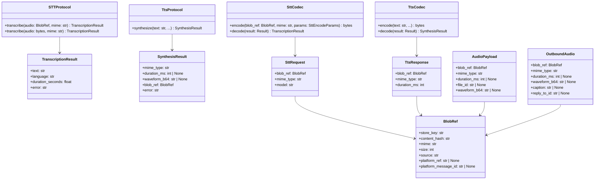
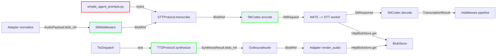

## Context

Slice V5 of epic #1061. The Lyra hub currently passes audio to STT workers as inline bytes (`b""` placeholder in `middleware_stt.py` line 117) and receives TTS output as `audio_bytes` in `SynthesisResult`. The V8 HttpBlobStore service (#1330) is landed and provides the Protocol for cross-host BlobRef exchange. Telegram eager-ingest (#1065) is partially landed — image/document attachments are BlobRef-native, but voice/audio paths in both Telegram and Discord adapters still emit `PENDING_STORE_KEY` (transitional state). This slice updates the hub-side contract (ports, middleware, codecs) to be BlobRef-ready so that when adapter eager-ingest completes, the pipeline is already native.

**Before/After:**
- Before: `STTProtocol.transcribe(audio: bytes, mime)` → middleware passes `b""`
- After: `STTProtocol.transcribe(audio: BlobRef, mime)` → middleware passes `msg.audio.blob_ref`
- Before: `SynthesisResult(audio_bytes=bytes, blob_ref=BlobRef | None)` → TTS dispatch reads `blob_ref`
- After: `SynthesisResult(blob_ref=BlobRef)` → no `audio_bytes` field

## Goal

STT and TTS ports exchange audio exclusively via `BlobRef` — no inline bytes, no FS-direct coupling.

## Users

- **Primary:** Lyra hub voice pipeline (middleware_stt, ports, NATS codecs)
- **Secondary:** voiceCLI workers (STT/TTS) — they consume the stable contract produced by this slice

## Constraints

- Workers are co-located on M₁ today, but MUST use HttpBlobStore Protocol regardless (ADR-068 conscious design decision, NOT a performance optimization to defer)
- `BlobRef` wire format already landed in contracts via #1064 / PR #1329
- Exception co-located writer applies to adapters/middleware only — NOT to workers
- Attachment path (`simple_agent_prompts.py` reads local file → bytes → STT) must not break — STT port needs backward-compatible overload
- Audit α/β (time-window forensic scans) will need an α-index dependency; precise schema TBD during implementation

## Out of Scope

- voiceCLI worker implementation → voiceCLI#144
- Adapter eager-ingest for voice/audio (removing `PENDING_STORE_KEY` from `telegram_normalize.py` / `discord_audio.py`) → #1065 continuation
- Any new HttpBlobStore service or Protocol changes → V8 #1330 (already closed)
- Telegram image/document eager-ingest changes → #1065 (already closed)

## Expected Behavior

1. **STT inbound path:** `SttMiddleware` passes `msg.audio.blob_ref` (a `BlobRef` pointer to the audio payload in BlobStore) to `STTProtocol.transcribe()`.
2. **STT port:** `STTProtocol.transcribe()` primary signature accepts `BlobRef`. A backward-compatible overload accepts `bytes` for the attachment path (`simple_agent_prompts.py`).
3. **STT codec:** `SttCodec.encode()` accepts `BlobRef` and embeds it directly in the `SttRequest` wire payload (no `PENDING_STORE_KEY` reconstruction from bytes).
4. **TTS port:** `SynthesisResult` no longer carries `audio_bytes` as a field; `blob_ref` is the canonical and required audio output.
5. **TTS codec:** `TtsCodec.decode()` removes `audio_bytes` from `SynthesisResult` construction — already sets `blob_ref` from `TtsResponse`.

## Data Model & Consumers

### Class Diagram

### Consumer Map

### Consumer Summary

| Consumer | Fields | When | Status |
|---|---|---|---|
| SttMiddleware | `audio.blob_ref` | voice modality inbound | **this issue** |
| STTProtocol | `audio: BlobRef` | transcription call | **this issue** |
| STTProtocol | `audio: bytes` | attachment path (backward compat) | **this issue** |
| SttCodec | `blob_ref` | encode request | **this issue** |
| TTSProtocol | `SynthesisResult.blob_ref` | synthesis return | **this issue** |
| TtsDispatch | `result.blob_ref` | dispatch audio | already uses |
| Adapter render_audio | `OutboundAudio.blob_ref` | outbound voice | already uses |

## Breadboard

| Affordance | ID | Handler | Data | Notes |
|---|---|---|---|---|
| STT port transcribe (BlobRef) | S1 | `STTProtocol.transcribe` | `BlobRef, mime` | Primary signature |
| STT port transcribe (bytes) | S1b | `STTProtocol.transcribe` | `bytes, mime` | Backward-compat overload for attachment path |
| STT codec encode | S2 | `SttCodec.encode` | `BlobRef, mime, params` | Signature change |
| STT middleware pass | S3 | `SttMiddleware.__call__` | `msg.audio.blob_ref` | Replace `b""` placeholder |
| NatsSttClient transcribe | S6 | `NatsSttClient.transcribe` | `BlobRef, mime` | Passes through to codec |
| TTS result shape | S4 | `SynthesisResult` dataclass | `blob_ref` (required) | Remove `audio_bytes` |
| TTS codec decode | S5 | `TtsCodec.decode` | `resp.blob_ref` | Remove `audio_bytes` from constructor |

## Slices

| # | Slice | Files | Acceptance Criteria |
|---|---|---|---|
| 1 | STT port + middleware | `ports/stt.py`, `middleware/middleware_stt.py` | `STTProtocol.transcribe` accepts `BlobRef` (primary) and `bytes` (overload); middleware passes `msg.audio.blob_ref` |
| 2 | STT codec + client | `nats/nats_stt_codec.py`, `nats/nats_stt_client.py` | `SttCodec.encode` accepts `BlobRef`; `NatsSttClient.transcribe` accepts `BlobRef` and passes it to codec |
| 3 | TTS result | `ports/tts.py` | `SynthesisResult` removes `audio_bytes`; `blob_ref` is non-optional |
| 4 | TTS codec | `nats/nats_tts_codec.py` | `TtsCodec.decode` removes `audio_bytes` from `SynthesisResult` constructor |
| 5 | Test fixtures | `tests/fixtures/fake_drivers.py`, `tests/fixtures/test_fake_drivers.py`, `tests/nats/test_nats_stt_client.py`, `tests/nats/test_nats_tts_client.py`, `tests/core/test_audio_pipeline_tts.py`, `tests/factories/agents.py` | All test fixtures updated to use new signatures |
| 6 | Docstrings | `nats/stt_helpers.py` | Docstring references to `STTProtocol.transcribe(audio, mime)` updated |

**Slice ordering:**
- Slices 1 & 2 are coupled (port signature change → `NatsSttClient` won't compile without both). Merge together.
- Slices 3 & 4 are coupled (`SynthesisResult` field removal → `TtsCodec.decode` won't compile without both). Merge together.
- Slice 5 depends on 1-4 (test fixtures reflect the new signatures).
- Slice 6 is independent (documentation only).

## Edge Cases

| Edge | Handling |
|---|---|
| `msg.audio` is None | Guarded by `modality != "voice"` in middleware (existing) |
| `msg.audio.blob_ref` is None | Middleware should log warning and drop with `stt_invalid` (new guard) |
| `blob_ref.store_key == PENDING_STORE_KEY` | Out of scope — worker handles or fails gracefully; adapter eager-ingest is #1065 continuation |
| `SynthesisResult.blob_ref` is None in TTS | Impossible after Slice 3 (required field). `TtsCodec.decode` error paths must supply a sentinel `BlobRef` (e.g., `BlobRef(store_key="", content_hash="", mime="", size=0, source="")`) or raise `TtsUnavailableError` before constructing result |
| `resp.blob_ref` is None in `TtsCodec.decode` | `TtsResponse` enforces non-null `blob_ref` on `ok=True` via `_enforce_success_invariant`. If bypassed, `TtsCodec.decode` should treat as worker error and return `SynthesisResult(error="tts.missing_blob_ref", blob_ref=sentinel)` |
| Attachment path (bytes) | `simple_agent_prompts.py` calls `stt.transcribe(audio_bytes, mime)`. Overload preserves this path. Long-term: attachment path should also ingest to BlobStore and pass `BlobRef` — deferred to voiceCLI#144 or future slice |

## Success Criteria

- [ ] `STTProtocol.transcribe` primary signature is `transcribe(self, audio: BlobRef, mime: str) -> TranscriptionResult`
- [ ] `STTProtocol.transcribe` backward-compat overload exists: `transcribe(self, audio: bytes, mime: str) -> TranscriptionResult`
- [ ] `ports/stt.py` imports `BlobRef` from `roxabi_contracts`
- [ ] `NatsSttClient.transcribe` signature updated to accept `BlobRef` and passes it to `SttCodec.encode`
- [ ] `SttMiddleware` passes `msg.audio.blob_ref` to `hub._stt.transcribe` (line 117 placeholder removed)
- [ ] `SttCodec.encode` signature is `encode(self, blob_ref: BlobRef, mime: str, params: SttEncodeParams) -> bytes`
- [ ] `SttCodec.encode` embeds the passed `BlobRef` directly in `SttRequest` (no `PENDING_STORE_KEY` reconstruction)
- [ ] `SynthesisResult` no longer has `audio_bytes` field
- [ ] `SynthesisResult.blob_ref` is required (`BlobRef`, not `BlobRef | None`)
- [ ] `TtsCodec.decode` removes `audio_bytes` from returned `SynthesisResult` constructor
- [ ] `TtsCodec.decode` error paths supply a sentinel `BlobRef` or raise before constructing result
- [ ] All test fixtures updated to use new signatures (Slice 5 files)
- [ ] All existing tests pass after changes
- [ ] No `bytes` or `audio_b64` paths remain in voice pipeline (attachment path excluded — tracked separately)
