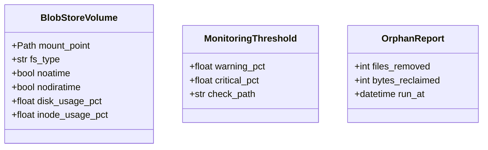
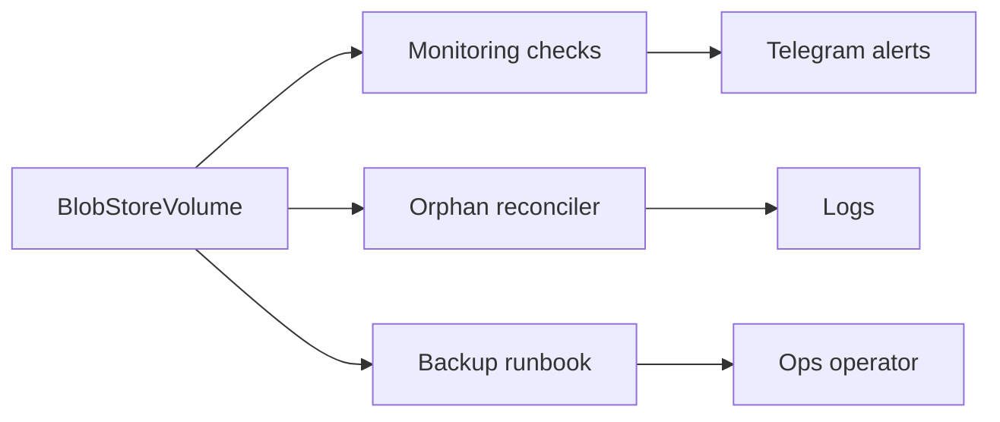

## Context

Promoted from `artifacts/frames/1068-blob-mount-noatime-inode-df-alerts-orphan-reconciler-backup-runbook-frame.mdx` (approved 2026-05-28).

Predecessors: `artifacts/specs/1330-v8-http-fronted-blobstore-spec.mdx` (approved 2026-05-25) — V8 service code is complete; this spec operationalizes the deploy-side plumbing.

The existing `lyra-blobstore.container` (V8) already has:
- `After=lyra-nats.service`, `Wants=lyra-nats.service`
- `PublishPort=${TAILSCALE_IPV4}:8449:8449`
- Health check via `grep -q blobstore /proc/1/cmdline`
- Bearer token secret (`type=mount`)
- NATS nkey secret (`type=mount`)
- `lyra blobstore serve` entry point
- `deploy/quadlet.toml` manifest entry for `[component.blobstore]`

What is **missing** and in scope for #1068:
- Persistent volume mount at `/data/lyra/blobs` (host) mapped to `~/.lyra/blobstore` (container) with `noatime`/`nodiratime` at host level
- `lyra-hub` startup ordering: `After=lyra-blobstore.service`
- Disk/inode utilization alerts (60% warning, 70% critical)
- Orphan blob reconciler script (checks `blobs` table, age-gated)
- Backup runbook update in `docs/QUADLET-DEPLOYMENT.md`
- Syncthing exclusion documentation in `docs/data-dirs.md`
- `systemctl --user enable lyra-blobstore.service` in install script

## Goal

Operationalize the BlobStore HTTP service on M1 so it survives host restarts, warns before disk exhaustion, self-cleans orphaned blobs, and has a tested recovery procedure.

## Users

- **Primary:** M1 host operator — deploys, monitors, recovers from disk issues
- **Secondary:** Developers running `deploy/install.sh` — need idempotent, documented procedures
- **Tertiary:** Automated monitoring cron — runs checks and escalates anomalies

## Expected Behavior

### Boot (M1, systemd `--user`)

1. `lyra-nats.service` is up.
2. `lyra-blobstore.service` starts (after nats).
3. Host filesystem `/data/lyra/blobs` is mounted with `noatime` + `nodiratime` (host-level fstab or systemd `.mount` unit).
4. Container bind-mounts host `/data/lyra/blobs` → container `~/.lyra/blobstore` (matches V8 service default, no code changes needed).
5. `lyra-blobstore.service` publishes `blobstore.ready=true` to `lyra-state` KV bucket (already implemented by V8 #1330 — prerequisite).
6. `lyra-hub.service` starts (after blobstore process). Note: `After=` orders systemd start sequence, but does not wait for KV readiness publish. Hub retry logic handles transient unavailability.

### Disk/ inode monitoring (cron, every 5 min)

Layer 1 monitoring (`python -m lyra.monitoring`) checks:
- `disk_usage_pct` on `/data/lyra/blobs` — warning at 60%, critical at 70%
- `inode_usage_pct` on `/data/lyra/blobs` — warning at 60%, critical at 70%
- Both use the same two-tier escalation (Layer 1 → Layer 2 LLM → Telegram alert)
- Thresholds apply to the blobstore partition (dedicated or shared rootfs — documented in deploy config).

### Orphan reconciliation (weekly cron)

1. Script walks `/data/lyra/blobs` filesystem.
2. Compares files against `blobs` SQLite table (`store_path` column).
3. Skips files with `mtime < 1 hour` (race guard: in-progress writes may exist on disk before DB commit).
4. Deletes orphaned content-addressed shards (sha256 files with no matching `blobs` row).
5. Logs count and bytes reclaimed.

### Backup (ops, manual or daily cron)

1. SQLite `.backup`: `sqlite3 ~/.lyra/blobstore/index.sqlite ".backup to backup.bak"` — produces a consistent snapshot.
2. `sync` the filesystem.
3. Optional: `tar czf` the backup + snapshot of `/data/lyra/blobs`.
4. Restore: verify backup integrity, validate sha256 of a sample blob.
5. Documented in `docs/QUADLET-DEPLOYMENT.md` §BlobStore backup (amend existing V8 section).

## Data Model & Consumers

### Type relationships

### Consumer map

### Consumer summary

| Consumer | Fields consumed | When | Status |
|---|---|---|---|
| Monitoring | `disk_usage_pct`, `inode_usage_pct` | Every 5 min | This issue |
| Orphan reconciler | Files on disk, `blobs` table `store_path` | Weekly | This issue |
| Backup runbook | Full volume + `index.sqlite` | Daily / manual | This issue |

## Breadboard

| ID | Affordance | Handler | Data | Notes |
|---|---|---|---|---|
| N1 | Host volume mount | Host fstab or systemd `.mount` unit | `/data/lyra/blobs` | `noatime` + `nodiratime` are host filesystem options, not container options |
| N1b | Quadlet bind mount | `lyra-blobstore.container` `[Container] Volume=` | `/data/lyra/blobs:/home/lyra/.lyra/blobstore:z` | Maps host path to container default (no code changes) |
| N2 | Startup ordering | `lyra-hub.container` `[Unit] After=` | `lyra-blobstore.service` | Orders systemd start sequence; KV readiness is separate health signal |
| N3 | Disk check | `src/lyra/monitoring/checks.py` `check_disk_pct()` | `shutil.disk_usage()` | New percentage-based check |
| N4 | Inode check | `src/lyra/monitoring/checks.py` `check_inode_pct()` | `os.statvfs()` | New inode check |
| N5 | Orphan reconciler | `scripts/blob-reconcile.py` | Walk FS + `blobs` table | Age-gated (skip `mtime < 1h`) to avoid race with in-progress writes |
| N6 | Backup runbook | `docs/QUADLET-DEPLOYMENT.md` §BlobStore backup | `index.sqlite` `.backup` | Amends existing V8 backup section |
| N7 | Syncthing exclusion | `docs/data-dirs.md` | Syncthing ignore list | Single-host backend, must not sync |
| N8 | Enable on boot | `deploy/install.sh` | `systemctl --user enable lyra-blobstore.service` | Ensures survival across host restarts |

## Slices

| Slice | Deliverable | Files | Depends on | Notes |
|---|---|---|---|---|
| S1 | Volume mount + mount options | `lyra-blobstore.container`, host fstab | — | Foundation: determines path used by all downstream slices |
| S2 | Hub startup ordering | `lyra-hub.container` | S1 | Ordering change only; safe to deploy independently |
| S3 | Monitoring: disk/inode % checks | `src/lyra/monitoring/checks.py`, `config.py` | S1 | Adds new checks; path configured to match S1 mount |
| S4 | Orphan reconciler script | `scripts/blob-reconcile.py` | S1 | Standalone script; path matches S1 mount point |
| S5 | Backup runbook | `docs/QUADLET-DEPLOYMENT.md` | S1 | Amends existing V8 section; path matches S1 mount |
| S6 | Syncthing exclusion + deploy enable | `docs/data-dirs.md`, `deploy/install.sh` | S1 | Docs + install script changes |

## Success Criteria

- [ ] Host filesystem `/data/lyra/blobs` is mounted with `noatime` + `nodiratime` (fstab or systemd `.mount` unit)
- [ ] `lyra-blobstore.container` bind-mounts host `/data/lyra/blobs` → container `~/.lyra/blobstore`
- [ ] `lyra-hub.container` has `After=lyra-blobstore.service` in `[Unit]`
- [ ] `deploy/install.sh` idempotently creates host directory `/data/lyra/blobs` (if not a mount point) and documents fstab requirement
- [ ] `deploy/install.sh` runs `systemctl --user enable lyra-blobstore.service`
- [ ] Monitoring `check_disk_pct` reports `disk_usage_pct` with warning at 60% and critical at 70%
- [ ] Monitoring `check_inode_pct` reports `inode_usage_pct` with warning at 60% and critical at 70%
- [ ] `scripts/blob-reconcile.py` walks `/data/lyra/blobs`, checks `blobs` table, skips files with `mtime < 1h`, deletes orphaned sha256 files
- [ ] `docs/QUADLET-DEPLOYMENT.md` §BlobStore backup documents `index.sqlite` `.backup` + FS snapshot procedure
- [ ] `docs/data-dirs.md` lists `/data/lyra/blobs/` as Syncthing-excluded
- [ ] All criteria verified on M1 (or equivalent test environment) before PR merge
