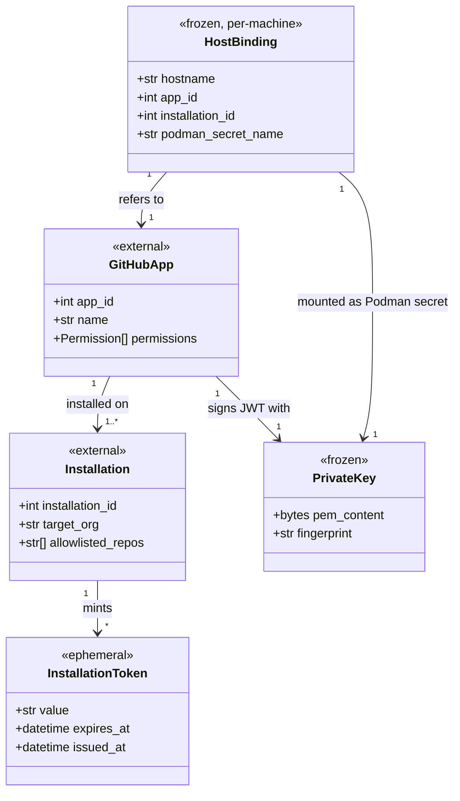
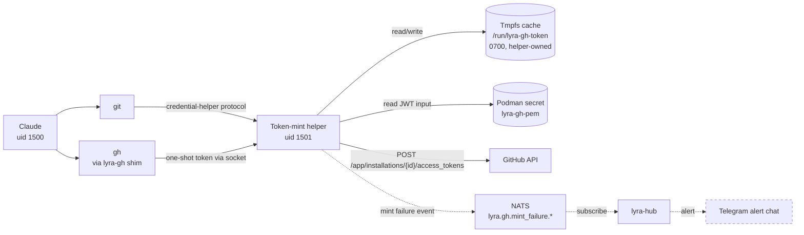

## Context

**Promoted from:** [Consensus: Lyra GitHub App Identity — Expert Consensus](../analyses/lyra-github-app-identity-consensus.mdx) (commit `e5e931a7`)
**Issue:** [#1078](https://github.com/Roxabi/lyra/issues/1078) — `feat: GitHub App identity for Lyra clipool — v1`
**Tier:** F-lite (κ=6)
**Boundary preserved:** [issue #941](https://github.com/Roxabi/lyra/issues/941) — hub does NOT mount Claude credentials or PEM

Today, the `lyra-clipool` container runs `claude` (Claude Code CLI) but has no GitHub auth — no `gh`, no `~/.gitconfig`, no SSH keys, no token. Any `git push` / `gh issue create` from inside Claude fails. The 3-expert panel (architect + security-auditor + devops) rejected the original plan over 3 independent hard blocks (`GH_TOKEN` in env → prompt-injection exfiltration; stateless mint → rate-limit 429s under crash-loop; `gh` CLI vs `ReadOnly=true`). This spec encodes the agreed alternative.

## Goal

Lyra clipool acquires a usable GitHub identity (`lyra[bot]`) such that Claude can `git push` and `lyra-gh issue/pr/...` transparently — while the installation token never reaches Claude's environment, and the host preserves its existing security posture (`ReadOnly=true`, `keep-id` UID mapping, issue #941 boundary).

## Users & Use Cases

### Primary actors

| Actor | Role |
|---|---|
| Claude (subprocess inside `lyra-clipool`) | Runs git/gh commands; should never see raw tokens |
| Token-mint helper (process inside container, distinct uid) | Holds PEM, mints JWT + installation tokens, dispenses on demand |
| Mickael (operator) | Receives Telegram alerts on mint failure; runs `rotate-gh-key.sh` for key rotation |
| Roxabi org admin | Approves `lyra[bot]` PRs (no auto-merge), maintains branch protection |
| GitHub | Issues installation tokens at `POST /app/installations/{id}/access_tokens`, rate-limited to 1 req/min |

### Use cases

- **UC1 — Transparent `git push`.** Claude runs `git push origin feat/x` from `~/projects/<repo>`. Git invokes `git-credential-lyra-gh`; helper returns one-shot token via Unix socket; HTTPS push succeeds; token stays in helper memory.
- **UC2 — `lyra-gh` shim invocation.** Claude runs `lyra-gh issue create --title "..." --repo Roxabi/lyra`. Shim fetches one-shot token via socket, sets `GH_TOKEN` only in the `gh` child process env, runs `gh`, exits. After exit, no env var trace.
- **UC3 — Cold start of clipool.** Container boots, `Restart=on-failure RestartSec=5`. Helper spawns first, reads PEM from Podman secret, primes tmpfs cache. Claude starts. Single mint, no rate-limit hit.
- **UC4 — Token near-expiry.** Helper background task detects token expiring in <5 min (issued for 1h). Mints new token; atomically swaps cache file. Concurrent git ops keep working.
- **UC5 — Mint failure (e.g. revoked installation).** Helper API call returns 401/404. Helper emits structured event on NATS subject `lyra.gh.mint_failure.<machine>`. Hub's subscriber forwards Telegram alert to operator.
- **UC6 — Key rotation.** Operator runs `deploy/scripts/rotate-gh-key.sh new.pem`. Script removes old Podman secret, creates new from `new.pem`, restarts `lyra-clipool`. Healthcheck recovers within 10s.
- **UC7 — Env parity.** Same image runs on M₁ (prod) and M₂ (dev) but with **different** `app_id` / `installation_id` / PEM. Quadlet `Environment=` is host-keyed; `provision.sh` writes the right values per machine.

## Expected Behavior

### Happy path — UC1 (transparent push)

1. Claude (uid 1500, inside clipool) runs `git push origin feat/x` from `/home/lyra/projects/lyra`.
2. Git resolves credential helper from `/home/lyra/.config/git/config`: `helper = lyra-gh`.
3. Git executes `git-credential-lyra-gh get` via stdin protocol.
4. Helper script connects to `/run/lyra-gh-token/dispenser.sock`.
5. Dispenser (running as helper uid, e.g. 1501) reads `token.json` from tmpfs cache. Cache valid → return token. Cache stale (≤5 min to expiry) → block while minting, **internal lock+mint capped at ≤10s** (kept under git's 15s credential-helper default); on timeout, return last cached token if any, else `helper-mint-timeout` error.
6. `git-credential-lyra-gh` writes `username=x-access-token\npassword=<token>\n` on stdout.
7. Git uses HTTPS auth → push succeeds.
8. The git process exits. The token never appeared in any env var Claude could read. The credential-helper's stdout pipe was closed.

### Happy path — UC2 (`lyra-gh` shim)

1. Claude runs `lyra-gh issue create --repo Roxabi/lyra --title "..."`.
2. `lyra-gh` (a shell script on PATH) connects to dispenser socket → receives one-shot token.
3. Shim does `exec env GH_TOKEN=<token> gh issue create --repo Roxabi/lyra --title "..."`.
4. `gh` runs as a fresh child process; its env contains `GH_TOKEN`. Claude's parent process env is unchanged.
5. After `gh` exits, the shim exits. Token is gone from process tree.
6. Plain `gh` does NOT exist on PATH inside the container — only `lyra-gh`.

### Edge cases

| Case | Handling |
|---|---|
| Helper not yet ready when Claude runs first git op | Dispenser socket waits up to 5s; if helper still cold, errors with `helper-not-ready`. Quadlet `After=` ordering keeps helper before Claude tools. |
| GitHub API outage during mint | Helper retries 3× with exponential backoff (1s, 2s, 4s). On final failure: emit `lyra.gh.mint_failure.<machine>` event, return error to caller. Cached token kept usable until expiry. |
| Cached token reaches expiry while a long `git push` is in flight | Token used was valid at handshake start; GitHub honours full request. Next call mints new token. |
| Container crash-loop (`RestartSec=5`) | Tmpfs cache wiped between restarts. Worst case: 1 mint per 5s = 12/min, **exceeds** GitHub's 1 req/min limit on `/app/installations/{id}/access_tokens` → 429 storm. **Mitigation (decided pre-approval, was χ-1)**: ① Slice 3 ADDS `StartLimitIntervalSec=60` + `StartLimitBurst=5` to `lyra-clipool.container` — currently **absent** from clipool unit (only `lyra-hub.container` has them). After 5 restarts/60s, systemd holds the unit. ② Helper hard-caps mint attempts at 1 per 45s (process-level guard against compounding storms during transient outages). |
| Host day-zero (`provision.sh` never run; secret `lyra-gh-pem` does not exist) | Quadlet refuses to start container — `Secret=` reference fails fast with clear error. Operator runs `provision.sh` first; documented in §Slices row 4 ordering. M₂ first-time setup → §Slice 8 calls `provision.sh` before `systemctl restart`. |
| Concurrent git ops both trigger near-expiry refresh | Helper mints once with internal lock; both calls served the same fresh token. |
| Claude tries to `cat /run/lyra-gh-token/token.json` (prompt-injection) | Returns "Permission denied" — file is mode 0600 owned by helper uid, Claude is uid 1500. |
| Claude tries to read `/proc/<helper-pid>/environ` | Returns "Permission denied" — `hidepid=2` would be ideal but not strictly needed: process owned by different uid, `/proc` access is uid-restricted by default for non-root. **(See χ-2.)** |
| Operator runs rotate script while a mint is in flight | Mint uses old PEM mounted at start; succeeds with old token. Container restart picks up new PEM. ≤10s gap window where in-flight ops may fail; documented in runbook. |
| GitHub revokes installation (e.g. App uninstalled by org admin) | Mint returns 404; helper emits `mint_failure` event; Telegram alert; Claude git ops fail with clear "installation revoked" error. |
| Both M₁ and M₂ try to install the SAME App on Roxabi org | App registration enforces only one Lyra App. **Mitigation:** 2 distinct Apps registered (`Lyra-prod`, `Lyra-dev`) with different App IDs. |

## Data Model & Consumers

### Identity model



### Consumer map



### Consumer summary

| Consumer | Reads | When | Status |
|---|---|---|---|
| Claude (via git) | one-shot token via credential-helper stdin/stdout | every git op needing auth | this issue |
| Claude (via `lyra-gh`) | one-shot token via env scoped to `gh` child | every `lyra-gh` invocation | this issue |
| Helper | PEM (one-shot at start), cache (every mint), GitHub API | continuously | this issue |
| Hub mint-failure subscriber | NATS event | on mint failure | this issue (slice 6) |
| Telegram alert | formatted message | on event | this issue (slice 6) |
| Future: 2nd bot helper | own PEM, own cache | when registered | future (out of scope) |

## Breadboard

### Affordances

| ID | Type | Owner | Description |
|---|---|---|---|
| N1 | external | github.com | GitHub App `Lyra-prod` (M₁) and `Lyra-dev` (M₂), permissions `contents:write`, `pull-requests:write`, `issues:write` |
| N2 | host artifact | M₁/M₂ | Podman secret `lyra-gh-pem` (mode 0400, mounted RO into clipool at `/run/secrets/gh-app.pem`, owned by helper uid) |
| N3 | container users + group | clipool image | Helper user `lyra-gh` (uid 1501, distinct from `lyra` uid 1500). Group `lyra-tokenuser` (gid 1502) with members `lyra` + `lyra-gh` — owns the dispenser socket so both uids can connect. Created in `Dockerfile`: `groupadd -g 1502 lyra-tokenuser && useradd -u 1501 -G lyra-tokenuser lyra-gh && usermod -aG lyra-tokenuser lyra`. **Verify**: subuid map permits uid 1501 inside the rootless `keep-id:uid=1500` namespace (existing `keep-id` only maps invoking host user → 1500; 1501 must resolve via the subuid range — slice 3 adds the verification step). |
| N4 | helper process | clipool | `src/lyra/tools/gh_token/helper.py` — Python daemon: reads PEM, mints JWT + installation token, listens on Unix socket, manages cache + near-expiry refresh, **internal lock+mint capped ≤10s**, **hard-caps mint attempts at 1/45s** |
| N5 | cache file | clipool tmpfs | `/run/lyra-gh-token/token.json` (mode 0600, helper-owned) |
| N6 | dispenser socket | clipool tmpfs | `/run/lyra-gh-token/dispenser.sock` (mode 0660, helper-owned, group `lyra-tokenuser` allows both `lyra` + `lyra-gh` to connect) |
| N7 | git credential helper | clipool | `src/lyra/tools/gh_token/git-credential-lyra-gh` — shell script implementing git's `get` operation via socket |
| N8 | gh shim | clipool | `src/lyra/tools/gh_token/lyra-gh` — shell script: socket → one-shot token → exec `env GH_TOKEN=… gh "$@"` |
| N9 | NATS subject + envelope | hub | `lyra.gh.mint_failure.<machine>` — envelope **extends `ContractEnvelope`** (per ADR-049, defined in `packages/roxabi-contracts/`): `{contract_version, trace_id, issued_at, machine, reason, http_status, retries}`. (Locked pre-approval, was χ-4.) |
| N10 | branch protection | github.com | Roxabi/lyra: required PR reviewers ≥1, no auto-merge for `lyra[bot]`, no force-push from App, no org-owner bypass on `lyra[bot]` PRs |
| S1 | Quadlet unit | `deploy/quadlet/lyra-clipool.container` | Adds: `Tmpfs=/run/lyra-gh-token:mode=0700,uid=1501,gid=1501`; **EITHER** `Tmpfs=/home/lyra/.config/git:mode=0755,uid=1500,gid=1500` + `ExecStartPre=/bin/sh -c 'cat /etc/lyra/git.config.tmpl > /home/lyra/.config/git/config'` **OR** `Environment=GIT_CONFIG_GLOBAL=/etc/lyra/git.config.tmpl` (bypass tmpfs entirely — implementer chooses, second option is simpler); `Secret=lyra-gh-pem,...,mode=0400,uid=1501,gid=1501`; `Environment=LYRA_GH_APP_ID=…`, `Environment=LYRA_GH_INSTALLATION_ID=…`; **`StartLimitIntervalSec=60` + `StartLimitBurst=5`** (currently absent from clipool — was χ-1 mitigation) |
| S2 | Quadlet unit | `deploy/quadlet/lyra-hub.container` | Verified: NO `lyra-gh-pem` secret, NO `LYRA_GH_*` env, NO PEM mount |
| S3 | provisioning script | `deploy/provision.sh` | Idempotent block: `podman secret inspect lyra-gh-pem &>/dev/null \|\| podman secret create lyra-gh-pem $PEM_PATH`. Host-keyed via `$(hostname)` switch |
| S4 | rotation script | `deploy/scripts/rotate-gh-key.sh` | `secret rm` → `secret create` → `systemctl restart lyra-clipool` → wait healthy. Args: path to new PEM |
| S5 | hub subscriber | hub event-bus wiring | NATS subscription on `lyra.gh.mint_failure.*` → format → Telegram send |
| U1 | git config | `/etc/lyra/git.config.tmpl` (image-baked, **outside tmpfs**) → activated at `/home/lyra/.config/git/config` (via S1 `ExecStartPre` copy) **OR** referenced directly via `GIT_CONFIG_GLOBAL` env | `[credential]\n  helper = lyra-gh`. Image-baked location is *outside* the `Tmpfs=/home/lyra/.config/git` overlay so the file survives the tmpfs shadow at container start. (Without this, the tmpfs would empty `~/.config/git/` and silently break the credential helper — caught by architect+devops review.) |
| U2 | PATH | `/usr/local/bin/lyra-gh` | Symlink/copy of N8; ensures `lyra-gh` resolves; `gh` does NOT |

### Wiring

```
Container boot (Quadlet)
  → S1 mounts: Secret(N2) RO, Tmpfs(N5,N6) helper-owned, Env(LYRA_GH_*)
  → systemd starts helper as N3 (uid 1501)
  → N4 reads N2, primes N5, opens N6
  → claude subprocess starts as uid 1500
    ├── git op → U1 → N7 → N6 (socket) → N4 → returns token
    │     └── N4 cache hit on N5 OR mint via GitHub API → on failure → N9 → S5 → Telegram
    └── lyra-gh op → U2 → N8 → N6 → N4 → exec gh with scoped env

Host bootstrap (per machine)
  M₁: provision.sh → N1.app_id (prod) → S3 creates N2 (prod PEM)
  M₂: provision.sh → N1.app_id (dev)  → S3 creates N2 (dev PEM)

Rotation
  operator → S4 → secret rm + create → systemctl restart → healthcheck
```

## Slices

| # | Slice | Touches | Demo |
|---|---|---|---|
| 1 | Token-mint helper (N4 + cache N5 + socket N6) — Python daemon, JWT mint + installation-token exchange, tmpfs cache, near-expiry refresh, Unix socket dispenser, internal lock+mint cap ≤10s, hard-cap mint at 1/45s | `src/lyra/tools/gh_token/helper.py` (new), `pyproject.toml` (already has `cryptography`), `packages/roxabi-contracts/` mint-failure envelope schema (extends `ContractEnvelope`) | Unit tests against GitHub API stub; manual `socat - UNIX-CONNECT:dispenser.sock` poke returns a valid GitHub installation token; envelope schema validated against `roxabi-contracts` |
| 2 | Credential helper (N7) + `lyra-gh` shim (N8) | `src/lyra/tools/gh_token/git-credential-lyra-gh` (new), `src/lyra/tools/gh_token/lyra-gh` (new), `/usr/local/bin/lyra-gh` symlink in image | Integration test with mock dispenser; `git push` against test repo using fake token issued by mock |
| 3 | Image + Quadlet wiring (S1, U1, U2, N3) + hub-clean verification (S2) | `Dockerfile` (drop `gh`; create group `lyra-tokenuser` gid 1502; create user `lyra-gh` uid 1501 in that group; add `lyra` to it; copy `src/lyra/tools/gh_token/*` into image; bake `/etc/lyra/git.config.tmpl`), `deploy/quadlet/lyra-clipool.container` (adds Tmpfs/Secret/Environment lines; **adds `StartLimitIntervalSec=60` + `StartLimitBurst=5`**; chooses `ExecStartPre` populate OR `GIT_CONFIG_GLOBAL` env strategy), grep check on `deploy/quadlet/lyra-hub.container`. **Verify** subuid map permits uid 1501 inside `keep-id:uid=1500` namespace. | `make lyra-clipool restart` on M₁; smoke `git push` from inside container succeeds; verify `which gh` empty, `which lyra-gh` resolves; verify `git config --global --get credential.helper` returns `lyra-gh`; verify hub container has no PEM/gh references; force 5 quick failures and verify systemd holds the unit (StartLimit applied) |
| 4 | `provision.sh` extension (S3 + creates N2) | `deploy/provision.sh` — declares `GH_PEM_PATH` env with input-validation guard matching existing `USER_RE` pattern; idempotent block `podman secret inspect lyra-gh-pem &>/dev/null \|\| podman secret create lyra-gh-pem $GH_PEM_PATH`; placed **after** the agent-user section (host-keyed via `$(hostname)` switch is the first such block in the script — note in PR description) | Run twice on a clean host: secret `lyra-gh-pem` created once, no error/diff on 2nd run (`podman secret inspect lyra-gh-pem` identical); missing/invalid `GH_PEM_PATH` exits with clear error |
| 5 | Rotation automation (S4) | `deploy/scripts/rotate-gh-key.sh` (new) — script header documents that rotation is a **hard restart**, not graceful drain → in-flight `git push`/`gh` ops get TCP reset. Operator drains manually if needed. | Rotate PEM on M₁: measure wall-clock downtime ≤10s; `lyra-clipool` healthcheck back to ✓; in-flight ops note documented |
| 6 | Hub mint-failure alert (N9, S5) | hub NATS subscriber wiring (location follows hub event-bus convention — slice 6 implementer locates the existing pattern), envelope schema already in `packages/roxabi-contracts/` from slice 1 | Revoke installation token via GitHub UI → observe NATS event on `nats sub lyra.gh.mint_failure.>` carrying `trace_id` AND Telegram alert arrives in staging chat within 30s |
| 7 | App registration (N1 prod) + branch protection (N10) | github.com/settings/apps (`Lyra-prod`), Roxabi/lyra repo settings (manual + documented in this spec) | App ID + installation ID recorded in M₁ Quadlet env; `gh api /apps/<slug>` shows expected permissions; `gh api repos/Roxabi/lyra/branches/main/protection` shows required-reviewer ≥1 + auto-merge disabled for `lyra[bot]` + force-push rejected |
| 8 | M₂ Lyra-dev parallel deployment **(configuration repeat — no new code, leverages slices 1–5)** | M₂ host: register `Lyra-dev` App (N1 dev) on github.com **scoped to dev/test repos only** (NOT org-wide; limits blast radius of M₂ misconfig), run `provision.sh` on M₂ first, then `systemctl restart lyra-clipool` | Smoke `git push` from M₂ clipool against a dev/test repo; M₁ unaffected; M₁ and M₂ have distinct app_id + installation_id in Quadlet env; verify `Lyra-dev` install scope ≠ Roxabi/lyra production |

Slice ordering rationale:
- 1→2→3 unlocks the core path (slices 1+2 testable in isolation before container wiring)
- 4 needs 3 (Quadlet must reference the secret)
- 5 needs 4 (rotation script invokes the same secret name)
- 6 is independent of 1–5 wiring but needs N9 envelope decided in slice 1
- 7 is one-time manual setup, can land any time after the App is registered
- 8 repeats 1 + 3 + 4 on M₂ with different env values

## Success Criteria

**North star (single observable for "this shipped")**: from Claude's Bash tool inside `lyra-clipool` on M₁, `git push origin <branch>` against Roxabi/lyra succeeds AND `env | grep -iE 'gh_token|github_token'` returns empty in the same shell.

### Identity & permissions
- [ ] Single GitHub App `Lyra-prod` registered on M₁ + `Lyra-dev` on M₂ with **distinct** `app_id` and `installation_id`. App-only — **no** `lyra-bot` machine user account exists or is referenced
- [ ] App permissions on both Apps = exactly `contents:write`, `pull-requests:write`, `issues:write`. Verified via `gh api /apps/<slug>` showing no other permission keys
- [ ] M₁ clipool `Environment=` shows prod values; M₂ clipool `Environment=` shows dev values; `app_id` values are non-equal

### Token isolation (token never reaches Claude)
- [ ] From inside `lyra-clipool` as user `lyra` (uid 1500): `cat /run/lyra-gh-token/token.json` exits non-zero with "Permission denied"
- [ ] From inside Claude's Bash tool: `env | grep -iE 'gh_token|github_token'` returns empty AND no env var contains a value matching `^ghs_[A-Za-z0-9]{36,}$`
- [ ] `findmnt /run/lyra-gh-token` reports `tmpfs`; `stat -c '%a %u' /run/lyra-gh-token` reports `700 <helper-uid>` where `<helper-uid> ≠ 1500`

### Functional behavior
- [ ] `git push` from a clone under `~/projects` succeeds against Roxabi/lyra (HTTPS auth via credential helper)
- [ ] `git config --global --get credential.helper` inside the container returns `lyra-gh` (config survived the tmpfs overlay)
- [ ] `lyra-gh issue list --repo Roxabi/lyra` succeeds from Claude's Bash tool
- [ ] Plain `gh` does NOT exist on PATH: `which gh` returns non-zero inside the container

### Container hardening
- [ ] `lyra-clipool.container` is `ReadOnly=true` AND contains no writable `Volume=` for credentials — only `Tmpfs=` for `/run/lyra-gh-token` and (`/home/lyra/.config/git` OR equivalent strategy via `GIT_CONFIG_GLOBAL`)
- [ ] `lyra-clipool.container` includes `StartLimitIntervalSec=60` + `StartLimitBurst=5` (added by slice 3, was absent)
- [ ] `grep -iE 'pem|gh_app|gh-app|lyra-gh' deploy/quadlet/lyra-hub.container` returns empty (hub excluded from GitHub auth — preserves issue #941 boundary)

### Branch protection (3 separate facts)
- [ ] Roxabi/lyra `main`: auto-merge disabled for PRs authored by `lyra[bot]` (verified via `gh api repos/Roxabi/lyra/branches/main/protection`)
- [ ] Roxabi/lyra `main`: required reviewer count ≥ 1
- [ ] Roxabi/lyra `main`: force-push from `lyra[bot]` is rejected (test by attempting and observing the rejection)

### Mint-failure alert (2 separate facts)
- [ ] Mint failure simulation (revoke installation token via API): structured event observed on `nats sub lyra.gh.mint_failure.>` carrying valid `ContractEnvelope` fields (`contract_version`, `trace_id`, `issued_at`)
- [ ] Same simulation: Telegram alert arrives in the staging alert chat within 30 s

### Ops automation
- [ ] `provision.sh` is idempotent: running twice on a clean host produces zero error and zero state diff (verified via `podman secret inspect` before/after); missing/invalid `GH_PEM_PATH` exits with clear error
- [ ] `deploy/scripts/rotate-gh-key.sh new.pem` rotates PEM with ≤ 10 s downtime (wall-clock from `secret rm` to `lyra-clipool` healthcheck pass); script header documents the in-flight `git push`/`gh` TCP-reset behavior

## Open Questions (NEEDS CLARIFICATION)

Only **χ-2** remains open after expert review. χ-1 and χ-4 were decided pre-approval (recorded below).

- **χ-2**: `/proc` hardening. Default `procfs` mount inside Podman with `keep-id` already restricts `/proc/<pid>/environ` to same uid. **Open**: add `hidepid=2` mount option to fully hide other-uid processes from Claude? Tradeoff: ops introspection (`ps` from inside container during debug) becomes harder. Decide at slice 3 implementation.

### Resolved during expert review

- **χ-1 — Crash-loop rate-limit guard.** Slice 3 ADDS `StartLimitIntervalSec=60` + `StartLimitBurst=5` to clipool unit (currently absent — only hub has them). Helper additionally hard-caps mint attempts at 1 per 45 s. Both layers active.
- **χ-4 — NATS envelope schema.** `lyra.gh.mint_failure.*` extends `ContractEnvelope` (per ADR-049, defined in `packages/roxabi-contracts/`). Fields: `{contract_version, trace_id, issued_at, machine, reason, http_status, retries}`. Schema added in slice 1.

### Deferred operational config (set at deploy time, not spec decisions)

- Telegram alert chat ID for mint-failure events: use the existing staging alert chat (already wired for other ops alerts). Confirm exact chat ID with operator at slice 6.

## Out of Scope (per consensus migration triggers)

| Out-of-scope item | Reactivation trigger |
|---|---|
| `BotIdentity` registry generalization across N platforms | 2nd platform OR 2nd bot needs identity |
| Sandbox `lyra-sandbox` GitHub org | PR cherry-pick friction in Roxabi org > onboarding friction of separate org |
| OIDC federation | GitHub Actions becomes primary CI for Roxabi |
| Podman secret → Vault / age-encrypted secrets manager | Multi-user host on M₁ OR M₁ exposed on public IP without bastion |
| 2nd App per bot (currently 1 App per env) | 2nd bot arrives — register additional App per bot per env |
