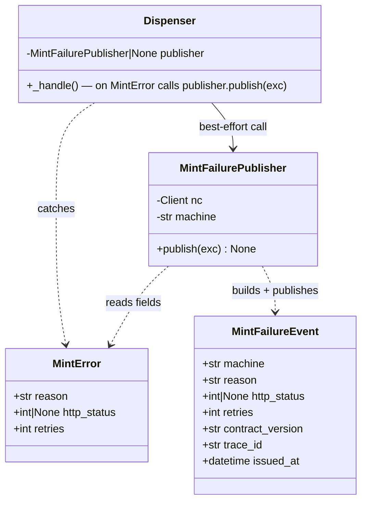
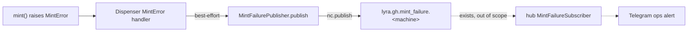

## Context

Promoted from [frame](../frames/1082-helper-mint-failure-publish-frame.mdx). The token-mint
helper (`factory.tools.gh_token`, uid 1501) raises `MintError` on every mint failure but has no
way to surface it: it owns no NATS identity. The consumer side is fully built and inert — the
`MintFailureEvent` contract, `gh_mint_failure(machine)` subject helper, and hub
`MintFailureSubscriber → Telegram` path all exist (#1078 T17 / #1545). This spec wires the producer.

> **Naming:** the issue body (2026-05-18 update) refers to the new identity as `lyra-gh` /
> `lyra-gh.seed`. Post lyra→factory rename the authoritative names used throughout this spec are
> identity **`gh-helper`** → seed file **`gh-helper.seed`** → podman secret **`factory-nats-gh-helper`**.

## Goal

On any `MintError`, the helper publishes a `MintFailureEvent` on `lyra.gh.mint_failure.<machine>`
using a dedicated **publish-only** nkey identity — lighting up the existing Telegram alert path —
without ever letting a NATS problem degrade token minting.

## Users

- **Primary:** Roxabi operators — gain a proactive Telegram alert on GitHub credential/API failure.
- **Secondary:** clipool / `/dev` token consumers — degraded mint surfaces as an ops signal.

## Expected Behavior

1. Helper boots (`python -m factory.tools.gh_token.daemon`). If `NATS_URL` is **unset** → log one
   **INFO** ("mint-failure publishing disabled — no NATS_URL"), run with `publisher=None`. If
   `NATS_URL` is set → attempt `nats_connect(...)` (seed auto-read from `NATS_NKEY_SEED_PATH` by
   the `roxabi-nats` SDK). On success → build `MintFailurePublisher`. On connect **failure** → log
   one **WARNING**, run with `publisher=None`. **The connect attempt MUST be wrapped so no
   exception escapes `run_daemon`** (see N2 — a propagated exception reaches `_amain`, which only
   catches `CancelledError`, exits the process, and `BindsTo=factory-gh-pod.service` tears down the
   whole pod incl. clipool).
2. A token request triggers `mint()`. On success → token dispensed as today (no change).
3. On `MintError`, the dispenser's existing handler (`dispenser.py:161`) logs the warning and
   returns `error=mint failed` to the socket caller **byte-for-byte as today**, then — if a
   publisher exists — fires a best-effort publish.
4. `MintFailurePublisher.publish(exc)` builds a `MintFailureEvent` (`machine`, mapped `reason`,
   `http_status`, `retries`), serializes it, and publishes to `gh_mint_failure(machine)`. **Any**
   error inside publish (connection lost, serialize, publish raise) is caught, logged at WARNING,
   and swallowed — control returns normally.
5. The hub `MintFailureSubscriber` (already running) receives the event and forwards a Telegram
   alert to the ops chat. *(out of scope — exists.)*

### reason-label mapping (no `MintError` signature change)

| `MintError` raise site | `http_status` | event `reason` |
|---|---|---|
| GitHub API non-201 (`helper.py:236`) | set (e.g. 401/404) | `github_api_<status>` |
| response parse failure (`helper.py:249`) | set (resp status) | `github_api_<status>` |
| `httpx.ConnectError` / `TransportError` (`helper.py:223/229`) | `None` | `network_error` |

`http_status` + `retries` pass through verbatim; the verbose `MintError.reason` string stays in the
local log only. Note `ConnectError` ⊂ `TransportError` (both → `http_status=None`) — they share the
single `network_error` label; do **not** split into per-branch labels.

## Data Model & Consumers

| Consumer | Fields consumed | When | Status |
|---|---|---|---|
| `MintFailurePublisher` | `reason`, `http_status`, `retries` (+ `machine` from env) | on every `MintError` | **this issue** |
| `lyra.gh.mint_failure.>` subject | full `MintFailureEvent` | publish-time | subject exists in hub *subscribe* ACL (#1545); **publisher ACL added here** |
| hub `MintFailureSubscriber` | full event → Telegram | on receipt | existing (#1078 T17) |

## Breadboard

### Infrastructure affordances

| ID | Place | Action | Data |
|----|-------|--------|------|
| I1 | `deploy/nats/acl-matrix.json` | add `gh-helper` identity: `status:active`, `publish:["lyra.gh.mint_failure.>"]`, `subscribe:[]`, `allow_responses:false`, `deploy:{type:container,secret:factory-nats-gh-helper}`, `created_at`/`owner`/`description`; **and** update the hub `notes` inert-grant clause (TODO T4 → "publisher declared by #1082") | drives `gen_nkeys` |
| I2 | `scripts/gen_nkeys.py` | no edit — `_mode_full_provision` + `render_auth_conf` auto-derive seed+pubkey from `active` identities. Verify `--template-only` emits `gh-helper`. Seed file is auto-created on next run (none exists yet — expected). | `gh-helper.seed`, pubkey |
| I2b | `scripts/check_grants.py` | `RESOURCES` is a **static** list — add a `gh-helper → lyra.gh.mint_failure.>` coverage entry so the publish path is gate-asserted (else the new grant is unguarded) | gate coverage |
| I3 | `Makefile` `quadlet-secrets-install` | add `podman secret create --replace factory-nats-gh-helper "$(FACTORY_NKEYS_DIR)/gh-helper.seed"` after the clipool line. (Target already omits `turn-writer`/`blobstore` — pre-existing gap; add **only** `gh-helper`, do not fix the others here.) | podman secret |
| I4 | `deploy/quadlet/factory-gh-helper.container` | `Secret=factory-nats-gh-helper,type=mount,target=factory-nats-gh-helper.seed,uid=1501,gid=1501,mode=0400` + `Environment=NATS_URL=nats://factory-nats:4222` + `Environment=NATS_NKEY_SEED_PATH=/run/secrets/factory-nats-gh-helper.seed` + `Environment=FACTORY_MACHINE=roxabituwer` | container env |

### Code affordances

| ID | Place | Handler | Data |
|----|-------|---------|------|
| N1 | `src/factory/tools/gh_token/mint_failure_publisher.py` (new) | `MintFailurePublisher(nc, machine).publish(exc)` — build event, serialize, publish; one `except Exception` catch+log(WARNING)+swallow with inline justification (best-effort) | `MintFailureEvent` |
| N2 | `daemon.py` `run_daemon` | read `NATS_URL`/`FACTORY_MACHINE`; if URL → **`try: nc = await nats_connect(...) except Exception: log.warning(...); nc=None`** (guard so nothing propagates to `_amain`); build publisher iff connected; inject into `Dispenser`; drain/close on shutdown | `nc`, publisher |
| N3 | `dispenser.py` `Dispenser` | new `publisher: MintFailurePublisher\|None=None` ctor param; in `except MintError` block (`_handle` is already `async`) call `await publisher.publish(exc)` if set, after the existing log + socket reply | — |
| N4 | `helper.py:11` + `:55` | remove the module-docstring `TODO(T4)` line (line 11) and the `MintError` docstring "T4's failure-event path" reference (line 55) | — |

`FACTORY_MACHINE` is set explicitly to `roxabituwer` (M₁) in I4; if ever unset at runtime the code
falls back to `socket.gethostname()`, and if that fails the contract's job-token charset validation
(`validate_job_token`), to the safe literal `"unknown"` (a valid job-token) + WARNING.

## Slices

| Slice | Affordances | Independently demo-able |
|-------|-------------|--------------------------|
| **S1 — Identity + provisioning (infra)** | I1, I2, I2b, I3, I4 | `gen_nkeys --template-only` lists `gh-helper`; `check_grants.py` green; ACL test confirms publish-only on `lyra.gh.mint_failure.>`; Makefile names the secret |
| **S2 — Publisher + wiring + tests (code)** | N1, N2, N3, N4 | unit/integration test: forced `MintError` → `MintFailureEvent` captured on a fake NC at the exact subject the subscriber binds; NATS-down → token still served + publish swallowed; `TODO(T4)` gone; gates green |

(2 slices, 8 criteria → Gate 2.5 not triggered; one indivisible vertical — splitting infra from
wiring would leave a non-functional half.)

## Success Criteria

- [ ] **Identity** — `acl-matrix.json` declares `gh-helper` with `publish:["lyra.gh.mint_failure.>"]`, `subscribe:[]`, and `deploy:{type:container,secret:factory-nats-gh-helper}`; `gen_nkeys --template-only` emits its pubkey; the hub `notes` inert-grant clause is updated.
- [ ] **Provisioning** — `Makefile:quadlet-secrets-install` creates `factory-nats-gh-helper` from `gh-helper.seed`; `factory-gh-helper.container` mounts it (`mode=0400,uid=1501`) and sets `NATS_URL`, `NATS_NKEY_SEED_PATH`, `FACTORY_MACHINE=roxabituwer`.
- [ ] **Publish on failure** — every `MintError` yields exactly one `MintFailureEvent` on `lyra.gh.mint_failure.<machine>` with `reason` (mapped label), `http_status`, and `retries` from the exception.
- [ ] **Subject match (integration smoke)** — a local test (forced `MintError` → publisher → in-memory/stub NC) asserts the published subject is exactly what `MintFailureSubscriber` binds to (`lyra.gh.mint_failure.>` prefix via `gh_mint_failure()`); no real GitHub revocation needed. Closes the producer↔subscriber wire gap that full RED-GATE V6 (#1078 T18) would otherwise be first to catch.
- [ ] **Best-effort isolation** — publisher errors (connect lost, publish raises, NATS down) are logged + swallowed; the dispenser's socket response and token-mint path are byte-for-byte unchanged; the helper boots and serves tokens with `NATS_URL` unset or unreachable (no pod teardown).
- [ ] **Least privilege** — a **unit test parsing `acl-matrix.json`** asserts `gh-helper` holds no publish/subscribe grant beyond `lyra.gh.mint_failure.>`; `check_grants.py` passes.
- [ ] **Cleanup** — the `TODO(T4)` line and the `line 55` T4 reference are removed from `helper.py`.
- [ ] **Gates** — new unit tests + the ACL gates (`check_grants.py`, `tests/nats/test_gen_nkeys_acls.sh`) pass; `ruff`, `pyright`, `pytest`, and `import-linter` are green.

## Edge Cases

| Edge | Handling |
|------|----------|
| `NATS_URL` unset | publisher=None; helper serves tokens; one **INFO** "publishing disabled — no NATS_URL" |
| NATS connect fails at boot | `try/except` in `run_daemon` → **WARNING**; publisher=None; do **not** propagate (else `_amain` exits → `BindsTo` pod teardown) |
| NATS drops after boot / publish raises | `publish()` catches+logs+swallows; mint path unaffected |
| `FACTORY_MACHINE` unset/invalid | `gethostname()` → if invalid per contract charset, safe literal `"unknown"` + WARNING |
| import-linter | `factory.tools` is outside all `.importlinter` contracts; `roxabi_nats`/`roxabi_contracts` are external packages → the import is **ungated** by absence. Verify `import-linter` still passes in the worktree; no allowance edit expected. |

## Docs to update on ship

- `src/factory/tools/CLAUDE.md` — note the publish-only NATS identity + `MintFailurePublisher`.
- `docs/QUADLET-DEPLOYMENT.md` — add `factory-nats-gh-helper` to the secret table + diagnostics.
- `deploy/nats/acl-matrix.json` hub `notes` — clear the TODO T4 inert-grant clause (part of I1).

## Out of Scope / Follow-up

- Subscriber, Telegram formatting, ops routing (#1078 T17 — done).
- Full RED-GATE V6 / T18 e2e (real token revocation) — tracked under #1078 T18.
- `lyra.*` → `roxabi.*` subject-namespace rename.
- **Three-strikes (axial):** `except Exception + log + swallow` around `nc.publish` now exists in 3
  places (`transport/typing_publisher.py:80`, `adapters/nats/mint_failure_subscriber.py:129`, and N1).
  Extract a shared `best_effort_publish(nc, subject, payload, *, log_tag)` into `transport/` —
  **follow-up issue**, not this scope (two of the three are cross-process).
