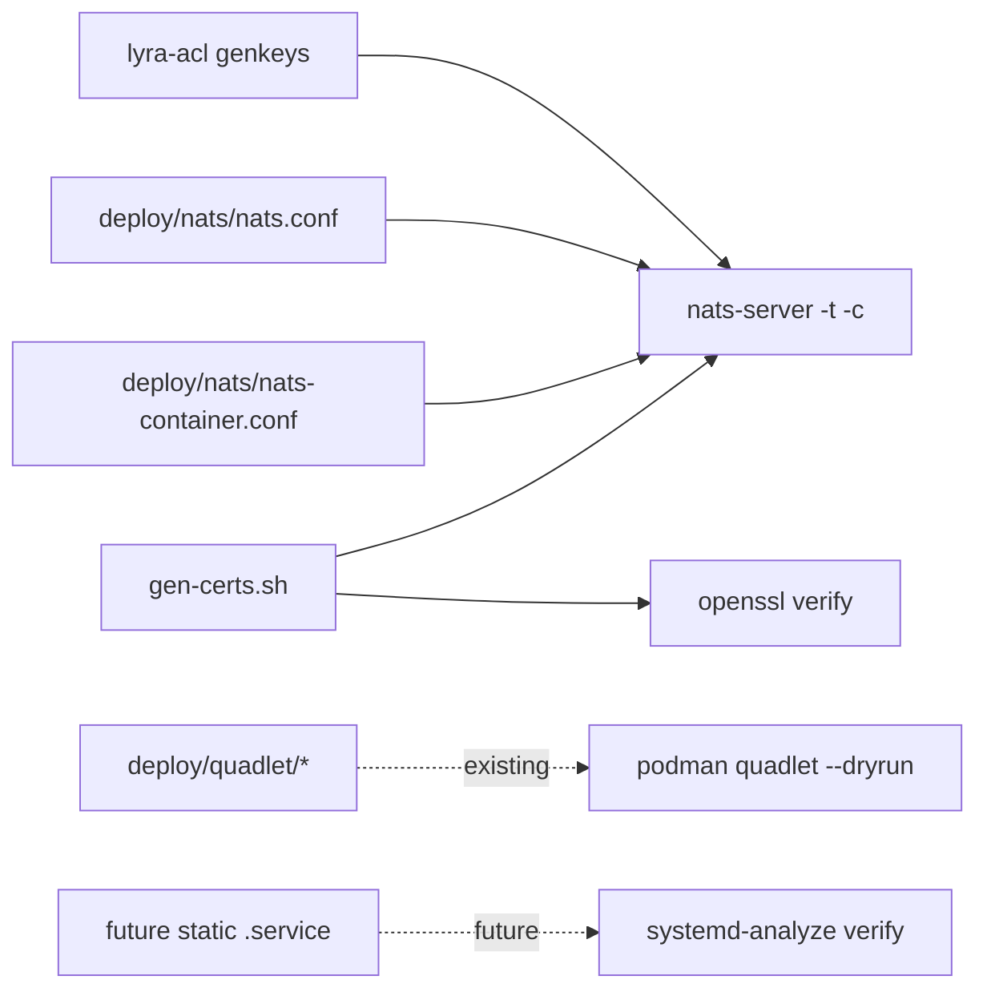

## Context

Promoted from [frame](../frames/1091-renderer-roundtrip-tests-frame.mdx). Two prod incidents (#1083, #1089) shared one pattern: a renderer produces output accepted at write-time, rejected by the downstream consumer at next restart. The roundtrip pattern already exists in 3 isolated silos but is not generalized, not documented, and not applied to all known renderers.

Audit (see frame) identified 2 uncovered renderers: `deploy/nats/nats.conf` (+ container variant), `deploy/nats/gen-certs.sh`. Plus a missing fast `nats-server -t -c` parse-gate for `lyra-acl genkeys` output (current coverage is the slow live-server e2e in `test_parity_e2e.py`).

Static systemd units in `deploy/` (`lyra-monitor.{service,timer}`, `nats/nats.service`) are NOT covered here — they are all retired (lyra-monitor by #1035; host `nats.service` replaced by `lyra-nats.container` per `deploy/CLAUDE.md`). Active systemd is generated at runtime by Podman Quadlet and already validated by `.github/workflows/quadlet-lint.yml` (#1086). `systemd-analyze verify` is documented in the standards doc as a canonical consumer for any future static unit, but no current target exists to wire into CI.

## Goal

Every config-generating tool (and every static config consumed by an external binary) is validated by that binary in CI before merge, following a documented pattern future contributors can reuse.

## Users

- **Primary:** Lyra ops/on-call — bears the cost of reboot-time failures on M₁ (prod hub).
- **Secondary:** Future contributors adding new config renderers — get a documented pattern + working CI scaffold to copy.

## Expected Behavior

1. Contributor opens PR touching `lyra-acl/**`, `deploy/nats/**`, or the workflow/helper script itself.
2. CI workflow `renderer-roundtrip` triggers, runs one job per affected renderer (3 jobs), in parallel (no `needs:` chain).
3. Each job: renders (or reads) the config → invokes the consumer in check/dry-run mode → asserts semantic invariants.
4. Any failure surfaces a clear diff (e.g. `nkey expected 56 chars, got 62`) and blocks merge.
5. Clean staging: all jobs green.
6. Contributor adding a new renderer reads `docs/standards/renderer-roundtrip.md`, copies the worked example (J1), adapts.

## Data Model & Consumers

| Consumer | Binary | Check invocation | Renderers it gates | Status |
|---|---|---|---|---|
| nats-server | `nats-server` | `-t -c <file>` | lyra-acl, nats.conf, nats-container.conf, gen-certs (TLS stanza) | this issue |
| openssl | `openssl` | `verify -CAfile ca.crt server.crt` | gen-certs.sh | this issue |
| podman | `podman` | `quadlet --dryrun --user` | deploy/quadlet/* | existing (#1086) |
| systemd-analyze | `systemd-analyze` | `verify <unit>` | future static .service units | documented (standards doc), no current target |

## Breadboard

### Affordances

| ID | Name | Type | Where | Notes |
|---|---|---|---|---|
| W1 | `renderer-roundtrip` workflow | GHA workflow | `.github/workflows/renderer-roundtrip.yml` | Path-filtered, parallel jobs; SHA-pinned actions; `concurrency` block; `permissions: contents: read`; `timeout-minutes: 10` |
| J1 | `lyra-acl-parse` job | GHA job | W1 | Generates auth.conf then parses with `nats-server -t -c` |
| J2 | `nats-conf-parse` job | GHA job | W1 | Static parse of `nats.conf` + `nats-container.conf` against a stub `nkeys/auth.conf` |
| J3 | `gen-certs-roundtrip` job | GHA job | W1 | openssl verify + nats-server -t with TLS stanza |
| T1 | `tools/check_renderer_roundtrip.sh` | helper script | `tools/` | Per-renderer subcommands (lyra-acl, nats-conf, gen-certs); `set -euo pipefail`; exit non-zero on consumer failure or invariant violation; extensible — adding a new subcommand is the canonical way to register a new renderer |
| F1 | nats-server install step | composite step (reused) | W1 | Pinned tarball + SHA256 verify, mirrors `.github/workflows/ci.yml` (`NATS_VERSION=2.10.22`); cache keyed on `NATS_VERSION` |
| F2 | gen-certs `CERT_DIR` override | script change | `deploy/nats/gen-certs.sh` | One-line: `CERT_DIR="${CERT_DIR:-/etc/nats/certs}"` to allow CI override without sudo |
| D1 | standards doc | doc | `docs/standards/renderer-roundtrip.md` | Sections: Pattern · When to apply · Required shape · Worked example (J1) · Failure modes · Reviewer checklist |
| L1 | testing.md cross-link | doc edit | `docs/standards/testing.md` | Insert under existing "Integration tests" heading (or add a "Config validation" subsection if absent) |

### Wiring

| Affordance | Calls/Reads | Asserts |
|---|---|---|
| J1 | `lyra-acl genkeys --regen-authconf` → `nats-server -t -c $TMPDIR/auth.conf` (via T1) | exit 0 ∧ ∀ nkey: `len==56` ∧ `pubkey(seed)==nkey` ∧ no embedded `\n` in `"…"` |
| J2 | `printf '%s\n' 'authorization {\nusers = []\n}' > $TMPDIR/nkeys/auth.conf` (stub) → `nats-server -t -c deploy/nats/nats.conf` (and `nats-container.conf`) | exit 0 |
| J3 | `CERT_DIR=$TMPDIR gen-certs.sh` → `openssl verify -CAfile $TMPDIR/ca.crt $TMPDIR/server.crt` → `nats-server -t -c <tls-cfg referencing $TMPDIR>` | exit 0 (both) |
| T1 | dispatches `lyra-acl | nats-conf | gen-certs` subcommands; sources nats-server install via F1 | invariant errors print `expected X, got Y` style diff |
| D1 | references T1 worked-example invocation verbatim | — |

## Slices

| # | Slice | Affordances | Demo |
|---|---|---|---|
| 1 | lyra-acl parse-gate | W1 skeleton + F1 + T1 (lyra-acl subcommand) + J1 | Inject 62-char nkey into renderer output → J1 fails with `expected 56, got 62` |
| 2 | static nats.conf validation | T1 (nats-conf subcommand) + J2 | Inject stray `}` in `nats.conf` → J2 fails |
| 3 | gen-certs roundtrip | F2 + T1 (gen-certs subcommand) + J3 | Produce an invalid leaf cert → J3 fails (openssl or nats-server step) |
| 4 | standards doc + cross-link | D1 + L1 | Doc renders; testing.md links to it; reviewer-checklist section present |

All 4 slices ship in one PR — they share `W1` + `T1`. Slicing orders implementation; rolling each as a separate PR would create merge conflicts on the same workflow file.

## Success Criteria

- [ ] `.github/workflows/renderer-roundtrip.yml` exists, uses SHA-pinned `actions/checkout`, declares `concurrency` with `cancel-in-progress: true`, `permissions: contents: read`, `timeout-minutes: 10`, and triggers on paths: `lyra-acl/**`, `deploy/nats/**`, `tools/check_renderer_roundtrip.sh`, `.github/workflows/renderer-roundtrip.yml`
- [ ] Injecting a 62-char nkey into `lyra-acl genkeys` output (matching the pre-#1089 bug state) → J1 fails with output containing `expected 56` and `got 62`
- [ ] Injecting a stray `}` into `deploy/nats/nats.conf` → J2 exits non-zero
- [ ] Removing `-subj` from `gen-certs.sh` (or producing an invalid cert chain) → J3 exits non-zero from either `openssl verify` or `nats-server -t`
- [ ] Clean staging branch: all 3 jobs (J1–J3) pass on CI
- [ ] `docs/standards/renderer-roundtrip.md` exists with non-empty sections — Pattern, When to apply, Required shape, Worked example, Failure modes, Reviewer checklist — and Worked example contains the verbatim T1 lyra-acl invocation
- [ ] `docs/standards/testing.md` contains a link to renderer-roundtrip.md (under "Integration tests" heading, or new "Config validation" subsection)
- [ ] D1 reviewer checklist includes: "Does this PR add or modify a config renderer? If yes, verify a roundtrip test in `renderer-roundtrip.yml` covers it."
