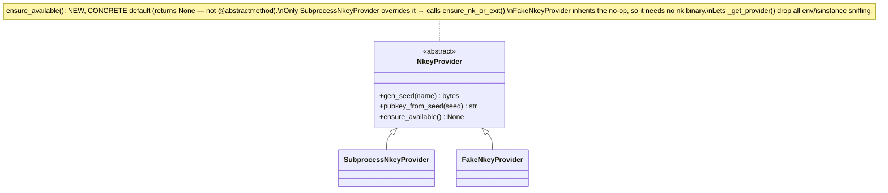

## Context

Source: [frame](../frames/1093-isolate-test-fakes-frame.mdx) (analyze skipped — F-lite).

PR #1283 already moved all fakes to `tests/fakes/` and added the `.importlinter`
`tests-fakes-isolation` contract. But it shipped the exact band-aid #1093 rejected:
`scripts/_modes.py::_get_provider` branches on `NKEY_PROVIDER == "fake"` (runtime-guarded
by `LYRA_TEST_MODE`) and the contract carries an `ignore_imports` exemption
`scripts._modes -> tests.fakes.nkey_provider`. That env-branch is load-bearing: it is the
**subprocess test-injection seam** (3 test run-helpers exec the real CLI via `subprocess.run`
+ `NKEY_PROVIDER=fake`). This spec relocates that seam into `tests/` so the env-branch and
the exemption can be removed without losing subprocess E2E coverage.

## Goal

Make it **structurally impossible** to reach a test fake from production code:
zero fake/env-branch in `scripts/_modes.py`, zero `ignore_imports` holes in the isolation
contract, with subprocess test fidelity preserved via a `tests/`-resident dependency-injection
entry point (AC #5: "gate via DI at test entry points only").

## Users

- **Primary:** Production NATS provisioning path on M₁ — `scripts/gen_nkeys.py` renders
  `auth.conf`; a reachable fake here is the #1089 liability class.
- **Secondary:** Devs — the `ignore_imports` exemption is a hole in the CI recurrence gate.

## Expected Behavior

| Invocation | Today | After |
|---|---|---|
| `python scripts/gen_nkeys.py genkeys …` (prod) | `_get_provider` reads env; `NKEY_PROVIDER=fake`+`LYRA_TEST_MODE=1` selects fake | env ignored; always real `SubprocessNkeyProvider`; `nk` precondition enforced via `provider.ensure_available()` |
| Subprocess test | `subprocess.run([py,"scripts/gen_nkeys.py","genkeys",…], env=NKEY_PROVIDER=fake)` | `subprocess.run([py,"tests/scripts/_fake_genkeys.py","genkeys",…])` — shim bootstraps `sys.path`, sets `_provider_factory=FakeNkeyProvider`, delegates to `gen_nkeys.main` |
| In-process test | `monkeypatch.setenv("NKEY_PROVIDER","fake")` then call `_mode_*` | `monkeypatch.setattr(_modes,"_provider_factory",FakeNkeyProvider)` then call `_mode_*` |
| `lint-imports` | passes *because* of the exemption | passes with **no** exemption; forbids all `tests.*` from `lyra`+`scripts` |
| Reintroduce `from tests.fakes import …` in `scripts/` | passes (exemption) | **fails CI** (proven by planted-violation verify-test) |

Safety property: prod can never select a fake (no env path exists at all) — strictly
stronger than the `LYRA_TEST_MODE` runtime refusal it replaces.

## Data Model & Consumers

### Provider seam (class diagram)

### Injection map (who selects the provider)

```mermaid
flowchart LR
    subgraph prod["scripts/ (production)"]
        GP["_get_provider():<br/>p = _provider_factory()<br/>p.ensure_available()<br/>return p"]
        PF["_provider_factory<br/>= SubprocessNkeyProvider (default)"]
        GP --> PF
    end
    subgraph tests["tests/ (test-only seam)"]
        SHIM["tests/scripts/_fake_genkeys.py<br/>sys.path += repo-root<br/>_modes._provider_factory = FakeNkeyProvider<br/>gen_nkeys.main()"]
        IP["in-process tests<br/>monkeypatch.setattr(_modes,_provider_factory,Fake)"]
    end
    SHIM -.overrides.-> PF
    IP -.overrides.-> PF
    style prod fill:#1b2a1b
    style tests fill:#2a1b2a
```

### Consumer summary

| Consumer | Selects fake via | When | Status |
|---|---|---|---|
| prod CLI (`gen_nkeys.py`) | nothing — always real | always | this issue (env path deleted) |
| 3 subprocess run-helpers (`test_file_modes`, `test_genkeys_modes`, `test_genkeys_modes_add_identity`) | `_fake_genkeys.py` shim (out-of-process DI) | test | this issue |
| 2 in-process tests (`test_genkeys_modes`: `_mode_full_provision`, `_mode_regenerate` cases) | `monkeypatch.setattr` on `_provider_factory` | test | this issue |
| direct-instantiation tests (`test_nk`, `test_parity_e2e`) | `FakeNkeyProvider()` directly (no factory involved) | test | unchanged — no edit needed |
| `tests/nats/test_gen_nkeys_acls.sh` | `--template-only`, never calls `_get_provider` | test | unchanged — verified not provider-dependent |

## Breadboard

| ID | Seam (affordance) | Handler / change | Effect |
|---|---|---|---|
| N1 | `NkeyProvider.ensure_available()` (`scripts/_nk.py`) | add **concrete** no-op (`def ensure_available(self) -> None: return None`) to the ABC; `SubprocessNkeyProvider` overrides → `ensure_nk_or_exit()` | per-provider precondition; `_get_provider` becomes provider-agnostic; `FakeNkeyProvider` inherits no-op (needs no `nk`) |
| N2 | `_modes._get_provider()` | delete env-branch + lazy fake import + `LYRA_TEST_MODE` check; body = `p=_provider_factory(); p.ensure_available(); return p` | zero fake/env ref in prod; nk-absent still exits 1 with hint, enforced **at `_get_provider`**, the sole prod entry |
| N3 | `tests/scripts/_fake_genkeys.py` (new) | `sys.path.insert(0, parents[2])` **first** (mirror `gen_nkeys.py:14-17`); then `import scripts._modes as _modes`; `from scripts.gen_nkeys import main`; `from tests.fakes.nkey_provider import FakeNkeyProvider`; `_modes._provider_factory = FakeNkeyProvider`; `if __name__=="__main__": main()` | out-of-process DI seam; resolves `scripts`/`tests` imports regardless of cwd; module-global set before any `_get_provider` call → all 4 call sites see override |
| N4 | 3 subprocess run-helpers (`_run_genkeys` in the 3 files) | swap script path `scripts/gen_nkeys.py` → `tests/scripts/_fake_genkeys.py`; drop `NKEY_PROVIDER`/`LYRA_TEST_MODE` env lines | subprocess tests inject via DI shim, not env |
| N5 | 2 in-process tests (`test_genkeys_modes`, the `_mode_full_provision` + `_mode_regenerate` cases that call `monkeypatch.setenv("NKEY_PROVIDER",…)`) | replace the 2 `setenv` lines with `monkeypatch.setattr(_modes,"_provider_factory",FakeNkeyProvider)` | in-process tests use DI |
| N6 | `.importlinter` `tests-fakes-isolation` | remove `ignore_imports` block; change `forbidden_modules` from `tests.fakes` to `tests` (forbids all `tests.*`) | no holes; forbids every `tests.*` import from `lyra`+`scripts` |
| N7 | `tests/scripts/test_fake_isolation.py` (new) | verify-tests: (a) regression guard, (b) planted-violation — see §Verify-test design | CI proves reintroduction fails + band-aid cannot return |

## Verify-test design (N7)

Three unconditional tests (no `@skip`/`xfail`; run in the default `pytest tests/scripts/`):

1. **Regression guard — prod path** (cheap, deterministic): read `scripts/_modes.py` source;
   assert it contains no `NKEY_PROVIDER`, no `env_provider`, no `tests.fakes` import.
2. **Regression guard — contract** (cheap, deterministic): parse `.importlinter`; assert the
   `tests-fakes-isolation` contract has **zero** `ignore_imports` entries and
   `forbidden_modules` includes `tests`.
3. **Planted-violation — AC #4 literal** (proves the mechanism bites). Constraints (from devops review):
   - Build a **minimal stub tree** in `tmp_path`: `scripts/__init__.py`, `scripts/_violation.py`
     (`from tests.fakes import nkey_provider`), `tests/__init__.py`, `tests/fakes/__init__.py`,
     `tests/fakes/nkey_provider.py`.
   - Write a `tmp_path/.importlinter` with `root_packages = scripts, tests` **only** (NOT `lyra`
     — keeps grimp's graph tiny and avoids evaluating the real tree), `source_modules = scripts`,
     `forbidden_modules = tests`.
   - Run `lint-imports --config <tmp>/.importlinter` with `cwd=tmp_path` so cwd is prepended to
     `sys.path` and `find_spec("scripts")` resolves to the stub (do **not** rely on `source_roots`,
     which import-linter does not add to `sys.path`). Scrub `PYTHONPATH` from the subprocess env so
     the real `scripts` package cannot shadow the stub.
   - Assert exit code ≠ 0 and the planted module is named in the report.

## Slices

| # | Slice | Affordances | Demo-able green state |
|---|-------|-------------|-----------------------|
| 1 | **Relocate injection seam** (prod + tests land in ONE commit — atomic to stay green) | N1, N2, N3, N4, N5 | `grep NKEY_PROVIDER scripts/_modes.py` = 0; full `tests/scripts/` suite green |
| 2 | **Seal the contract** (commit **after** Slice 1 — pre-commit `import-layers` runs every commit; removing the exemption before N2 lands fails the hook) | N6 | `lint-imports` green, zero `ignore_imports`, forbids `tests` |
| 3 | **Prove + audit** | N7 + audit pass | verify-tests pass; PR body carries fakes/stubs audit log |

> Slice 1's prod + test edits are coupled by construction: deleting the env-branch (N2)
> breaks the subprocess + in-process tests until N3–N5 migrate them, so they ship together.
> Slice 2 **must not** be cherry-picked/rebased ahead of Slice 1. Slices 2 and 3 are
> independently revertible after Slice 1.

## Success Criteria

- [ ] `scripts/_modes.py` contains no `NKEY_PROVIDER`, no `env_provider`, no `tests.fakes` import (`grep -c` each → 0)
- [ ] `_get_provider()` body is pure factory dispatch + `ensure_available()` (no `if env…`, no lazy fake import)
- [ ] `NkeyProvider.ensure_available()` exists as a **concrete no-op** default; `SubprocessNkeyProvider` overrides it to call `ensure_nk_or_exit()`; a real prod run still exits 1 with the nk install hint when `nk` is absent (enforced via `_get_provider`, the sole prod entry — direct `SubprocessNkeyProvider()` construction in `test_nk` is `@skipif`-guarded, no regression)
- [ ] `tests/scripts/_fake_genkeys.py` exists, bootstraps repo-root onto `sys.path` before importing `scripts`/`tests`, sets `_modes._provider_factory = FakeNkeyProvider`, delegates to `gen_nkeys.main`
- [ ] The 3 subprocess run-helpers invoke the shim and set neither `NKEY_PROVIDER` nor `LYRA_TEST_MODE`
- [ ] The 2 in-process tests inject via `monkeypatch.setattr(_modes, "_provider_factory", …)`
- [ ] No `NKEY_PROVIDER` or `LYRA_TEST_MODE` remains under `tests/scripts/` (`grep -rc` → 0) — scoped to this domain, not the whole `tests/` tree
- [ ] `.importlinter` `tests-fakes-isolation` has **zero** `ignore_imports` and `forbidden_modules = tests`, `source_modules = lyra, scripts` (`src.*` = `lyra` exhaustively — `src/` holds only the `lyra` package; verified)
- [ ] Verify-test (planted): a `tmp_path` stub `scripts`→`tests.fakes` import makes `lint-imports` exit ≠ 0, per §Verify-test design constraints
- [ ] Verify-tests (regression guards) assert `_modes.py` has no env-branch AND the real contract has no `ignore_imports`; both are unconditional (no `@skip`/`xfail`) and run in `uv run pytest tests/scripts/`
- [ ] No new fake/mock/stub escaped into prod paths: `grep -rilE 'fake|mock|stub' src/ scripts/ --include='*.py' -l` reviewed → only legitimate (non-test-double) matches remain
- [ ] `uv run lint-imports` exits 0 on the tree; `uv run pytest tests/scripts/` fully green
- [ ] PR body contains an audit log: every fake/mock/stub + its location, confirming none sit in a prod-importable path; notes the retired `ignore_imports` quality-debt entry (**manual gate** — reviewer-verified, not CI-enforced)

## Out of Scope

- The fakes *move* (done #1283); other env-driven flags; additional runtime guards.

## Gate 2.5 — Splitting

|criteria| > 8 trips the dev-core splitting trigger (`|acceptance criteria| > 8 ∨ |slices| > 3`,
per spec Gate 2.5), but **splitting is declined**: this is one cohesive atomic refactor
(≤7 files, single domain). The real reason is atomicity — any split creates a broken
intermediate (env-branch gone but tests still env-driven, or contract sealed before the seam
moves). Ship as a single PR with 3 internal slices.

## Review notes (resolved)

- **architect:** shim `sys.path` bootstrap added (N3); `ensure_available()` concrete-default clarified (N1); module-global timing + nk-absent guarantee documented; all subprocess callers audited (3 need migration; `.sh` `--template-only` + conftest cleared).
- **devops:** planted-violation mechanism fully specified (root_packages=scripts+tests only, cwd=tmp_path, scrub PYTHONPATH, no source_roots reliance); Slice 2-after-Slice-1 ordering made explicit; PR audit log notes retired debt entry.
- **product-lead:** `src.*`=`lyra` rationale added; no-new-fakes regression-grep criterion added; verify-tests required unconditional + in default run; audit-log flagged manual gate.
- **doc-writer:** N5 keyed to test functions not line numbers; criterion split; N6 notation disambiguated; consumer table annotated.
