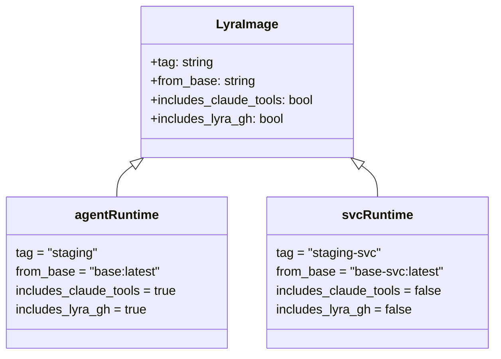
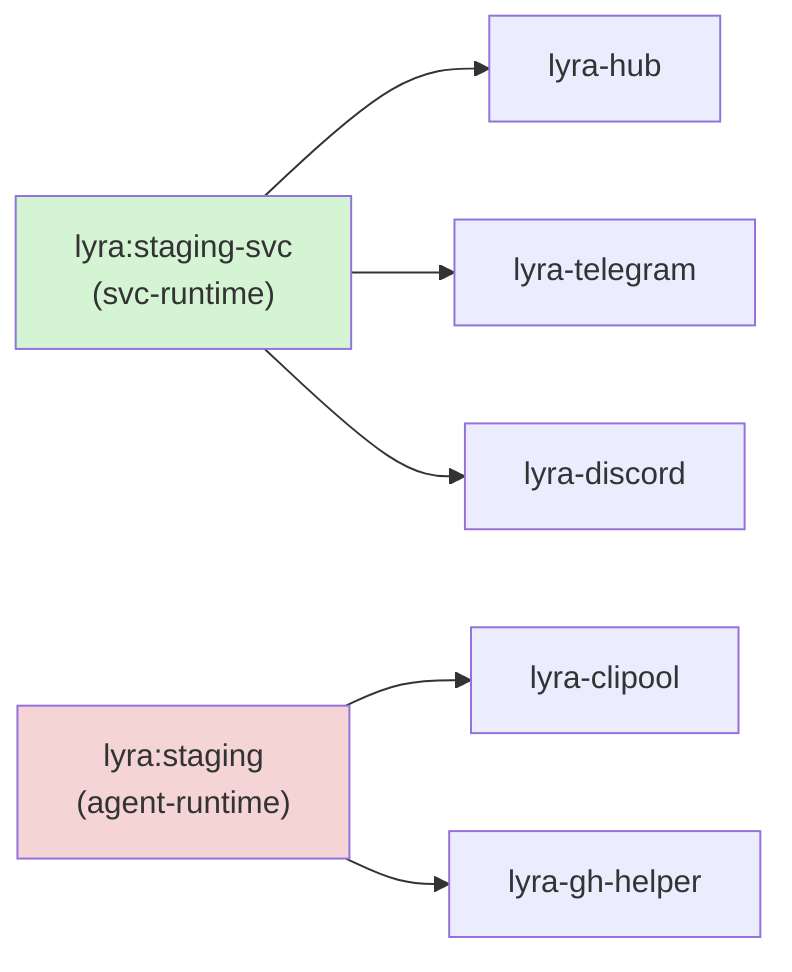

## Context

Promoted from frame `1095-slim-non-clipool-services-frame.mdx`. Analysis phase skipped (F-lite).

`lyra-hub`, `lyra-telegram`, and `lyra-discord` currently pull `ghcr.io/roxabi/lyra:staging`,
which is built `FROM ghcr.io/roxabi/base:latest` — a Claude Code agent base that includes `bun`
(573 MB), `claude-code` CLI (323 MB), `corepack`, the `lyra-gh` credential helper, and the full
gh-token toolchain. Only `lyra-clipool` and `lyra-gh-helper` actually use these. The other three
services carry ~1.7 GB of dead weight each and share their CVE surface area with tools they never
run.

**Upstream gate:** `ghcr.io/roxabi/base-svc:latest` must be published from `roxabi-container`
before any slice can land on `staging`. The entire PR (S1 + S2 + S3) should merge as a unit once
the upstream image is available. The Dockerfile split (S1) may be written on the feature branch
before then, but merging to `staging` before S2 would cause the svc CI job to fail on
`docker pull ghcr.io/roxabi/base-svc:latest`.

## Goal

Publish a slim lyra image variant (`:staging-svc`) built from `ghcr.io/roxabi/base-svc:latest`
that excludes all Claude-agent tooling, and point `lyra-hub`, `lyra-telegram`, and
`lyra-discord` at it. `lyra-clipool` and `lyra-gh-helper` stay on `:staging` (agent-heavy,
unchanged).

## Users

- **Ops / self:** provisions M₁, manages Quadlet units, rotates images on CVE alerts
- **CI runners:** pay image pull cost on every push to staging

## Expected Behavior

### Dockerfile split

The single `runtime` stage becomes two named stages:

- `agent-runtime`: `FROM ghcr.io/roxabi/base:latest` — keeps all existing content (lyra-gh user
  UID 1501, lyra-tokenuser group, gh-token tools, LYRA_GH_BIN env, socat if present in
  base:latest). Positioned last in the file so the existing reusable publish workflow builds it
  without needing `--target`.
- `svc-runtime`: `FROM ghcr.io/roxabi/base-svc:latest` — omits the lyra-gh user (UID 1501),
  lyra-tokenuser group, and gh-token tool copy steps. Does not install socat (lyra layer choice;
  whether base-svc includes it is a roxabi-container decision out of scope here). Retains: `lyra`
  user (UID 1500), Python venv (`COPY --from=builder /app /app`), PATH, HEALTHCHECK.

Both stages share the same `builder` stage. Each does an independent `COPY --from=builder /app
/app`; this is standard multi-stage Docker behaviour — the builder layers are cached per stage.

### CI: two variants published

`publish.yml` gains a second job that:
- runs **in parallel** with the existing reusable-workflow call (no `needs:` dependency)
- includes its own `docker/login-action` step for GHCR authentication
- includes `permissions: packages: write`
- builds `--target svc-runtime` and pushes as `ghcr.io/roxabi/lyra:staging-svc` on every push
  to `staging`
- uses GHA cache key scope `lyra-svc` (`cache-from: type=gha,scope=lyra-svc` / `cache-to:
  type=gha,mode=max,scope=lyra-svc`) to avoid colliding with the reusable workflow's default
  cache key

The existing reusable-workflow call continues to publish `ghcr.io/roxabi/lyra:staging`
(agent-heavy, `agent-runtime` final stage) without modification.

### Quadlet updates

| Container | Before | After | Rationale |
|---|---|---|---|
| `lyra-hub.container` | `ghcr.io/roxabi/lyra:staging` | `ghcr.io/roxabi/lyra:staging-svc` | no claude/bun/gh-tools needed |
| `lyra-telegram.container` | `ghcr.io/roxabi/lyra:staging` | `ghcr.io/roxabi/lyra:staging-svc` | no claude/bun/gh-tools needed |
| `lyra-discord.container` | `ghcr.io/roxabi/lyra:staging` | `ghcr.io/roxabi/lyra:staging-svc` | no claude/bun/gh-tools needed |
| `lyra-clipool.container` | `ghcr.io/roxabi/lyra:staging` | unchanged | runs `claude` subprocess |
| `lyra-gh-helper.container` | `ghcr.io/roxabi/lyra:staging` | unchanged | is the gh-token dispenser |

`Label=io.containers.autoupdate=registry` is retained on all containers. The first
`podman auto-update` cycle after S3 deploys will pull `:staging-svc` and restart hub, telegram,
and discord. **Pre-condition for S3 deploy:** verify `ghcr.io/roxabi/lyra:staging-svc` is
pullable from GHCR before copying Quadlet files to M₁, to avoid a noisy pull-failure in the
autoupdate cycle.

### Runtime behaviour

Hub, telegram, and discord containers start normally. `lyra config validate` passes (HEALTHCHECK).
The containers cannot access `claude`, `bun`, or any gh-token tooling — that code path is never
reached from these services. clipool and lyra-gh-helper behaviour is unchanged.

## Data Model & Consumers

### Image variants (classDiagram)

### Consumer map (flowchart)

### Consumer summary

| Consumer | Image tag | Needs claude/bun/lyra-gh | Status |
|---|---|---|---|
| `lyra-hub` | `:staging-svc` | No | this issue |
| `lyra-telegram` | `:staging-svc` | No | this issue |
| `lyra-discord` | `:staging-svc` | No | this issue |
| `lyra-clipool` | `:staging` | Yes (runs claude) | unchanged |
| `lyra-gh-helper` | `:staging` | Yes (is the dispenser) | unchanged |

## Breadboard

| Affordance | Handler | Data |
|---|---|---|
| B1 `svc-runtime` Dockerfile stage | `Dockerfile` | `FROM base-svc:latest`, no lyra-gh user/tools |
| B2 `agent-runtime` Dockerfile stage | `Dockerfile` | `FROM base:latest`, all existing tooling, positioned last |
| B3 svc image build + push | `publish.yml` second job (inline, parallel) | `--target svc-runtime`, tag `:staging-svc`, own `docker/login-action`, `permissions: packages: write`, cache scope `lyra-svc` |
| B4 agent image build + push | `publish.yml` reusable call (unchanged) | default final stage = `agent-runtime` |
| B5 Quadlet Image= (hub/telegram/discord) | `deploy/quadlet/lyra-{hub,telegram,discord}.container` | `ghcr.io/roxabi/lyra:staging-svc` |
| B6 Quadlet Image= (clipool + gh-helper) | `deploy/quadlet/lyra-{clipool,gh-helper}.container` | `ghcr.io/roxabi/lyra:staging` (no change) |

## Slices

| # | Slice | Affordances | Demo-able? | Gate |
|---|---|---|---|---|
| S1 | Dockerfile: split `runtime` into `svc-runtime` + `agent-runtime` stages | B1, B2 | `docker build --target svc-runtime` locally | ¬blocked (can write on feature branch) |
| S2 | CI: add second publish job for `:staging-svc` | B3, B4 | CI push produces both tags | blocked: merge to staging only after `base-svc` upstream published |
| S3 | Quadlets: flip hub/telegram/discord to `:staging-svc` | B5, B6 | containers start with slim image on M₁ | blocked: verify `:staging-svc` pullable from GHCR before deploying |

## Success Criteria

- [ ] `docker build --target svc-runtime .` succeeds locally once `ghcr.io/roxabi/base-svc:latest` is available in GHCR
- [ ] `docker build --target agent-runtime .` succeeds and produces a container with identical runtime behaviour to pre-change `:staging`
- [ ] `svc-runtime` image does not contain `bun`, `claude`, `corepack`, `node`, or `lyra-gh` binary (verify with `docker run --rm <image> which bun claude node lyra-gh || true`)
- [ ] `svc-runtime` image uncompressed size ≤ 800 MB (verify: `docker inspect --format='{{.Size}}' <image>` → value ≤ 838860800)
- [ ] Push to `staging` branch publishes both `ghcr.io/roxabi/lyra:staging` and `ghcr.io/roxabi/lyra:staging-svc` to GHCR (verify via `gh api /orgs/Roxabi/packages/container/lyra/versions`)
- [ ] `lyra-hub`, `lyra-telegram`, `lyra-discord` Quadlets reference `ghcr.io/roxabi/lyra:staging-svc`
- [ ] `lyra-clipool` and `lyra-gh-helper` Quadlets unchanged — still reference `ghcr.io/roxabi/lyra:staging`
- [ ] Cold-pull of `:staging-svc` × 3 containers totals ≤ 1 GB on a fresh M₁ provision (deployment-time verification)
- [ ] `lyra hub`, `lyra adapter telegram`, `lyra adapter discord` pass `lyra config validate` (HEALTHCHECK) with the svc image
- [ ] `lyra adapter clipool` and `lyra-gh-helper` pass smoke test (unchanged behaviour)
