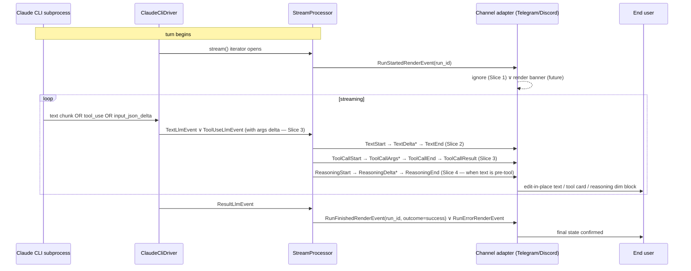
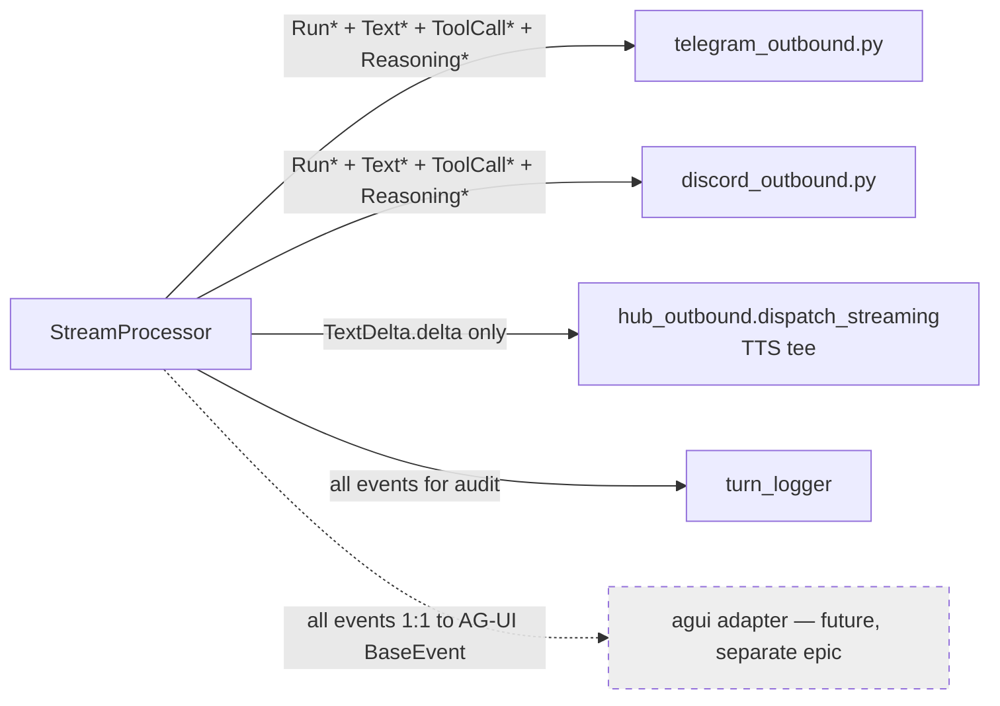

## Context

Promoted from analysis #1096 (Shape 2 — slice-by-slice with v1/v2 coexistence). Frame, analysis, and 6 child issues already filed: ADR (#1097), 4 implementation slices (#1098 Run lifecycle, #1099 Text triplet, #1100 ToolCall split, #1101 Reasoning typed), and Slice 5 cleanup (#1102).

This is an **umbrella spec**. Each child issue carries its own slice-level acceptance criteria. The epic-level spec defines:

- Cross-cutting contracts that every slice must respect
- The v1 ↔ v2 coexistence dispatch design
- Schema-bump cadence and coordinated-deploy discipline
- Slice ordering invariant
- Umbrella-level success criteria (the epic is "done" when all 5 invariants hold)

## Goal

Lyra's internal `RenderEvent` hierarchy expands from 2 types to ~12 types — adding Run lifecycle, Text Start/Delta/End triplet, ToolCall Start/Args/End/Result split, and typed Reasoning streams — without adopting AG-UI as a wire format and without regressing user-visible behavior on Telegram or Discord.

## Users

- **Primary:** Lyra hub developers maintaining `core/messaging/`, `core/processors/`, `core/cli/`, `llm/drivers/`, and channel adapters
- **Secondary:** Telegram + Discord end users (gain real-time tool-call args + cleaner reasoning rendering once adapters opt in)
- **Tertiary:** future roxabi-dashboard consumers, future AG-UI HTTP/SSE adapter implementor

## Expected Behavior



User-visible parity (Telegram + Discord) MUST be preserved through all slices. Adapters MAY render richer where it's natural (Discord could stream tool args inline), but MUST NOT regress the existing edit-in-place text experience.

## Data Model & Consumers

### v2 RenderEvent hierarchy (target)

```mermaid
classDiagram
  class RenderEvent {
    <<union>>
  }
  class RunStartedRenderEvent {
    +run_id: str
    +schema_version: int
  }
  class RunFinishedRenderEvent {
    +run_id: str
    +outcome: Literal["success","interrupt"]
    +schema_version: int
  }
  class RunErrorRenderEvent {
    +run_id: str
    +message: str
    +code: str | None
    +schema_version: int
  }
  class TextStartRenderEvent {
    +message_id: str
    +role: Literal["assistant"]
    +schema_version: int
  }
  class TextDeltaRenderEvent {
    +message_id: str
    +delta: str
    +schema_version: int
  }
  class TextEndRenderEvent {
    +message_id: str
    +schema_version: int
  }
  class TextChunkRenderEvent {
    +message_id: str
    +delta: str
    +role: Literal["assistant"]
    +schema_version: int
  }
  class ToolCallStartRenderEvent {
    +tool_call_id: str
    +tool_name: str
    +schema_version: int
  }
  class ToolCallArgsRenderEvent {
    +tool_call_id: str
    +delta: str
    +schema_version: int
  }
  class ToolCallEndRenderEvent {
    +tool_call_id: str
    +schema_version: int
  }
  class ToolCallResultRenderEvent {
    +tool_call_id: str
    +content: str
    +is_error: bool
    +schema_version: int
  }
  class ReasoningStartRenderEvent {
    +message_id: str
    +schema_version: int
  }
  class ReasoningDeltaRenderEvent {
    +message_id: str
    +delta: str
    +schema_version: int
  }
  class ReasoningEndRenderEvent {
    +message_id: str
    +schema_version: int
  }

  RenderEvent <|-- RunStartedRenderEvent
  RenderEvent <|-- RunFinishedRenderEvent
  RenderEvent <|-- RunErrorRenderEvent
  RenderEvent <|-- TextStartRenderEvent
  RenderEvent <|-- TextDeltaRenderEvent
  RenderEvent <|-- TextEndRenderEvent
  RenderEvent <|-- TextChunkRenderEvent
  RenderEvent <|-- ToolCallStartRenderEvent
  RenderEvent <|-- ToolCallArgsRenderEvent
  RenderEvent <|-- ToolCallEndRenderEvent
  RenderEvent <|-- ToolCallResultRenderEvent
  RenderEvent <|-- ReasoningStartRenderEvent
  RenderEvent <|-- ReasoningDeltaRenderEvent
  RenderEvent <|-- ReasoningEndRenderEvent
```



All events are `frozen=True` per the existing immutability contract (`render_events.py:8-15`).

### v1 hierarchy (sunset by Slice 5)

- `TextRenderEvent(text, is_final, is_error)` — kept during Slices 1-4 coexistence
- `ToolSummaryRenderEvent(files, bash_commands, web_fetches, agent_calls, silent_counts, is_complete)` — kept during Slices 1-4

### Consumer map



### Consumer summary

| Consumer | Fields consumed | When | Status |
|---|---|---|---|
| Telegram outbound | TextDelta.delta (collapse to edit-in-place), ToolCall* (collapse to summary line for parity), Reasoning* (dim/italic), Run* (ignored Slice 1) | every turn | this epic |
| Discord outbound | Same as Telegram + optional ToolCallArgs streaming inline (richer rendering opt-in) | every turn | this epic |
| TTS tee | TextDelta.delta only | every turn | this epic |
| Turn logger | All events for audit trail | every turn | follow-up (out of scope here) |
| AG-UI HTTP/SSE adapter | All events translated 1:1 to AG-UI BaseEvent | future | out of scope (separate epic) |

## Breadboard

### Affordance table — internal API surface

| ID | Affordance | Handler | Data |
|---|---|---|---|
| U1 | New event types in `render_events.py` | dataclass definitions | per slice 1/2/3/4 |
| U2 | StreamProcessor emits Run* at boundaries | `process()` start/end | run_id from trace_id |
| U3 | StreamProcessor splits text into triplet | `_handle_text_event()` (new) | per-text-block message_id |
| U4 | CLI parser surfaces InputJsonDelta as ToolUse args delta | `cli_streaming_parser.py` | tool_call_id correlation |
| U5 | StreamProcessor maps tool args delta to ToolCall* events | `_handle_tool_event()` extension | tool_call_id passthrough |
| U6 | StreamProcessor distinguishes reasoning from final text | `_route_text_block()` (new) | positional heuristic — pre-first-tool / post-last-tool |
| U7 | Coexistence dispatch in StreamingSession | `dispatch(event)` (new isinstance ladder) | both v1 + v2 events accepted |
| U8 | Schema floor enforcement on receive | `_version_check.check_schema_version()` | per-event SCHEMA_VERSION_* |
| N1 | New `core/messaging/render_events.py` constants | per-slice schema bumps | 1 new constant per new event family |
| N2 | New `LlmEvent` shape for tool args streaming (or new event type) | extend `ToolUseLlmEvent` ∨ add `ToolUseDeltaLlmEvent` | tool_call_id + delta |
| S1 | Slice 1: Run* added, additive, adapters ignore | StreamProcessor emit at process() entry/exit | run_id |
| S2 | Slice 2: Text triplet replaces single TextRenderEvent | StreamProcessor accumulator → triplet emitter | message_id |
| S3 | Slice 3: ToolCall split + CLI args streaming | parser + StreamProcessor + adapters | tool_call_id, args delta |
| S4 | Slice 4: Reasoning typed | StreamProcessor routes pre-tool text to Reasoning* | message_id |
| S5 | Slice 5: cleanup + schema floor bump | delete legacy types | — |

### Wiring

```
LlmEvent stream  ──►  StreamProcessor  ──►  RenderEvent stream  ──►  StreamingSession.dispatch
                          (v2 emit)                                      (v1 + v2 isinstance ladder)
                                                                              │
                                          ┌───────────────────────────────────┼───────────────────────────────────┐
                                          ▼                                   ▼                                   ▼
                                   telegram_outbound                   discord_outbound                       TTS tee
                                   (collapse → edit-in-place)          (rich render opt-in)                   (delta only)
```

## Slices

The 5 child issues already define the slice plan. This table is the umbrella view.

| Slice | Issue | Tier | Blocks | Adds | Removes | Schema bump |
|---|---|---|---|---|---|---|
| ADR | #1097 | XS | — | decision doc | — | n/a |
| 1 — Run lifecycle | #1098 | S | #1097 | RunStarted/Finished/Error events; StreamProcessor emit at entry/exit; adapters ignore | — | new constants only |
| 2 — Text triplet | #1099 | F-lite | #1098 | TextStart/Delta/End/Chunk; StreamingSession dispatch shim; coexistence with v1 TextRenderEvent | — | new constants |
| 3 — ToolCall split | #1100 | F-lite | #1098 | ToolCallStart/Args/End/Result; CLI parser InputJsonDelta support; LlmEvent extension | — | new constants |
| 4 — Reasoning typed | #1101 | F-lite | #1098 | ReasoningStart/Delta/End; StreamProcessor positional heuristic | — | new constants |
| 5 — Cleanup + floor | #1102 | S | #1099, #1100, #1101 | — | TextRenderEvent (v1), ToolSummaryRenderEvent | floor raise on legacy versions |

### Slice ordering invariant

```
ADR ──► S1 ──► {S2, S3, S4 in any order — independent} ──► S5
```

S2/S3/S4 are independent because they touch disjoint subsystems:
- S2 = text accumulator refactor (StreamProcessor `_pending_text` path)
- S3 = tool accumulator refactor + parser extension (StreamProcessor `_handle_tool_event` + `cli_streaming_parser`)
- S4 = reasoning routing (StreamProcessor `_route_text_block`, new method)

S1 is the canary — its Run lifecycle events are pure additive surface; if the schema-bump + coordinated-deploy mechanics break, S1 catches it before any semantic refactor lands.

S5 must run last because the v1 type deletions only become safe after every dependent has migrated to v2.

## Coexistence dispatch

`StreamingSession.dispatch(event: RenderEvent)` becomes an `isinstance` ladder during Slices 2-4. Each adapter receives both v1 and v2 events; the dispatch routes to the correct handler.

```python
# Conceptual; lives in adapters/shared/_shared_streaming_emitter.py
async def dispatch(self, event: RenderEvent) -> None:
    if isinstance(event, RunStartedRenderEvent | RunFinishedRenderEvent | RunErrorRenderEvent):
        await self._on_run(event)            # Slice 1 — initially no-op
    elif isinstance(event, TextStartRenderEvent | TextDeltaRenderEvent | TextEndRenderEvent | TextChunkRenderEvent):
        await self._on_text_v2(event)        # Slice 2
    elif isinstance(event, ToolCallStartRenderEvent | ToolCallArgsRenderEvent | ToolCallEndRenderEvent | ToolCallResultRenderEvent):
        await self._on_toolcall_v2(event)    # Slice 3
    elif isinstance(event, ReasoningStartRenderEvent | ReasoningDeltaRenderEvent | ReasoningEndRenderEvent):
        await self._on_reasoning(event)      # Slice 4
    elif isinstance(event, TextRenderEvent):
        await self._on_text_v1(event)        # legacy, sunset in S5
    elif isinstance(event, ToolSummaryRenderEvent):
        await self._on_toolsummary_v1(event) # legacy, sunset in S5
    else:
        raise TypeError(f"Unknown RenderEvent: {type(event).__name__}")
```

**Coexistence policy:** within a slice, both v1 and v2 events MAY be emitted by StreamProcessor for the same source `LlmEvent`. Adapters receive both, render whichever they've migrated, ignore the other. Per-slice acceptance criteria pin which side is authoritative for user-visible output.

**End-state (post-S5):** v1 events deleted; the legacy `_on_text_v1` / `_on_toolsummary_v1` branches removed; ladder simplified.

## Schema-bump cadence

```
SCHEMA_VERSION_TEXT_RENDER_EVENT       = 1   (v1, sunset S5)
SCHEMA_VERSION_TOOL_SUMMARY_RENDER_EVENT = 1 (v1, sunset S5)
SCHEMA_VERSION_RUN_STARTED_RENDER_EVENT = 1  (S1, new)
SCHEMA_VERSION_RUN_FINISHED_RENDER_EVENT = 1 (S1, new)
SCHEMA_VERSION_RUN_ERROR_RENDER_EVENT   = 1  (S1, new)
SCHEMA_VERSION_TEXT_START_RENDER_EVENT  = 1  (S2, new)
SCHEMA_VERSION_TEXT_DELTA_RENDER_EVENT  = 1  (S2, new)
SCHEMA_VERSION_TEXT_END_RENDER_EVENT    = 1  (S2, new)
SCHEMA_VERSION_TEXT_CHUNK_RENDER_EVENT  = 1  (S2, new)
SCHEMA_VERSION_TOOL_CALL_START_RENDER_EVENT = 1 (S3, new)
SCHEMA_VERSION_TOOL_CALL_ARGS_RENDER_EVENT  = 1 (S3, new)
SCHEMA_VERSION_TOOL_CALL_END_RENDER_EVENT   = 1 (S3, new)
SCHEMA_VERSION_TOOL_CALL_RESULT_RENDER_EVENT = 1 (S3, new)
SCHEMA_VERSION_REASONING_START_RENDER_EVENT = 1 (S4, new)
SCHEMA_VERSION_REASONING_DELTA_RENDER_EVENT = 1 (S4, new)
SCHEMA_VERSION_REASONING_END_RENDER_EVENT   = 1 (S4, new)
```

Each slice that adds new event types adds new constants; existing constants stay at 1 unless their wire shape changes. Slice 5 deletes legacy constants and their event types together.

**Coordinated deploy rule:** any slice that introduces new event types requires `lyra_hub` + `lyra_telegram` + `lyra_discord` to be deployed together. Receivers reject (loud-fail per `_version_check.check_schema_version`) any payload with a newer schema_version than their compiled-in floor.

## Success Criteria

Umbrella-level. Each `- [ ]` is binary pass/fail at the **end of the epic** (after Slice 5 merges).

- [ ] All 5 child issues (#1097-#1102) closed via merged PRs to staging
- [ ] `RenderEvent` union in `core/messaging/render_events.py` contains exactly the v2 types listed in the class diagram (no v1 leftovers, no extras)
- [ ] `LlmEvent` union extended (or augmented) to surface tool args streaming via InputJsonDelta — verified by a test that captures a real CLI tool-using turn and asserts non-empty args delta sequence
- [ ] StreamProcessor unit tests cover: Run lifecycle ordering, Text triplet ordering with message_id consistency, ToolCall args streaming order with tool_call_id consistency, Reasoning routing positional heuristic
- [ ] Telegram + Discord parity test: same input message produces same final user-visible output before vs after the epic (golden-file or snapshot test)
- [ ] `_version_check.check_schema_version` rejects pre-v2 schema versions on all v2-only consumers (loud-fail confirmed in test)
- [ ] CHANGELOG entry documents the coordinated deploy requirement for Slice 5
- [ ] ADR-032 carries a "superseded-in-part by ADR-NNN (#1097)" banner pointing to the new ADR
- [ ] No regression in existing import-linter checks (hexagonal boundary preserved: `core/` does not import `llm/` or `adapters/`)
- [ ] No regression in coverage gate

## Cross-slice invariants

These are tested at every slice merge, not just at epic close:

1. **Hexagonal boundary preserved.** Every new event type lives in `core/messaging/render_events.py`. No platform imports leak in. Verified by `import-linter`.
2. **All event classes are `frozen=True`.** Per `render_events.py:8-15` immutability contract.
3. **No silent event drop.** `StreamingSession.dispatch` raises `TypeError` on unknown event types. No fall-through `pass` allowed.
4. **Per-event schema constant.** Every new event type has its own `SCHEMA_VERSION_*` constant; the event's `schema_version` field defaults to that constant. (Same pattern as `render_events.py:22-23`.)
5. **Coexistence is the default.** Within a slice, v1 paths must keep working. v1 deletion only in Slice 5.

## Resolved decisions

6. **Dual emission during coexistence.** Within slices 2-4, StreamProcessor emits BOTH the v1 event and the new v2 events for the same source `LlmEvent`. Doubles wire traffic temporarily; gives ironclad parity test ground truth (v2 receivers compared against v1 baseline edit-in-place output, byte-for-byte). Slice 5 removes v1 emission and the dual-write path.

7. **`runId` == `trace_id` verbatim.** Simplest mapping, aligned with existing observability. No fresh UUID, no `metadata.trace_id` indirection. Re-visit only if interrupt+resume becomes a concrete requirement (out of scope for this epic).

8. **`message_id` per text block.** New id per `TextStart` (not per turn). Supports interleaved `text → tool → text` patterns natural to agentic flows and matches AG-UI's modeling. Slice 3 sub-analysis (`artifacts/analyses/NNN-toolcall-streaming-cli-instrumentation.mdx`) must capture Claude CLI text-block boundary semantics (U2) and confirm; if CLI emits a single block per turn, the per-block id collapses harmlessly to per-turn behavior.

## Pre-check

| Check | Result |
|---|---|
| Testable criteria (each `- [ ]` binary) | ✓ all binary |
| No dangling refs (U*/N*/S* IDs in slices) | ✓ U1-U8, N1-N2 mapped to S1-S5 in Slices table |
| Ambiguity budget (≤5 χ items) | ✓ 0 χ items (3 resolved 2026-05-07) |
| Slice coverage (every affordance in ≥1 slice) | ✓ |
| Edge completeness | ✓ coexistence + sunset path documented |

Pre-check: 5 of 5 passed.

## Smart splitting (Gate 2.5)

Triggered: |slices| > 3 (5 slices).

**Outcome:** already split — 5 child issues #1098-#1102 + ADR #1097 filed pre-spec. No further split needed; the umbrella spec is precisely the cross-slice contract that the children inherit. Each child runs its own `/spec` cycle when `/dev` is invoked on it (sub-issue acceptance criteria already in issue body).

## Unresolved expert concerns

- **Architect review pending.** This spec was authored without parallel expert review. Recommend at least one architect pass before `/plan` to validate (a) the StreamingSession coexistence dispatch design, (b) the `runId` / `message_id` decisions, (c) the Slice 3 LlmEvent extension shape (extend `ToolUseLlmEvent` vs add `ToolUseDeltaLlmEvent`).
- **Slice 3 sub-analysis still mandatory.** Per analysis U1, real Claude CLI NDJSON capture for tool-use turn is required before `/spec` can run on #1100.
