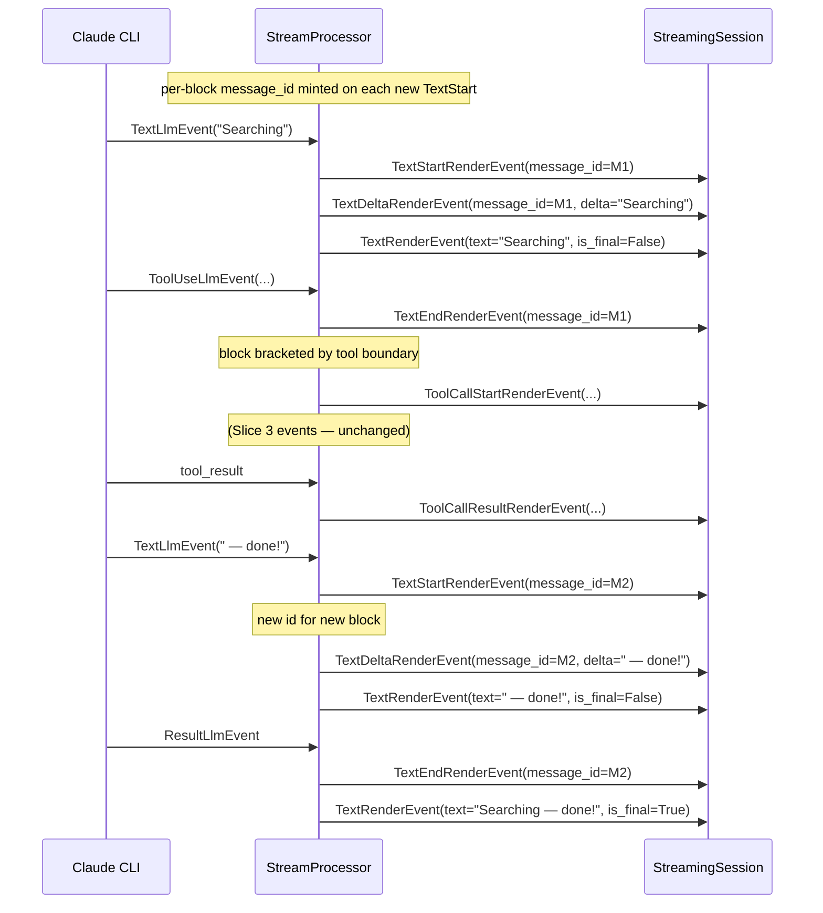
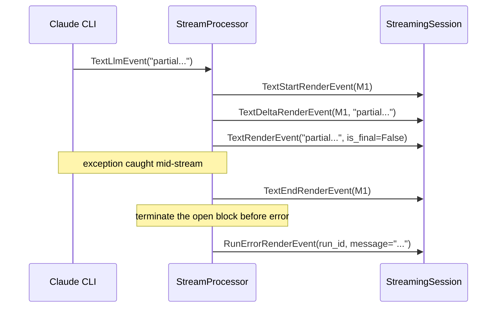
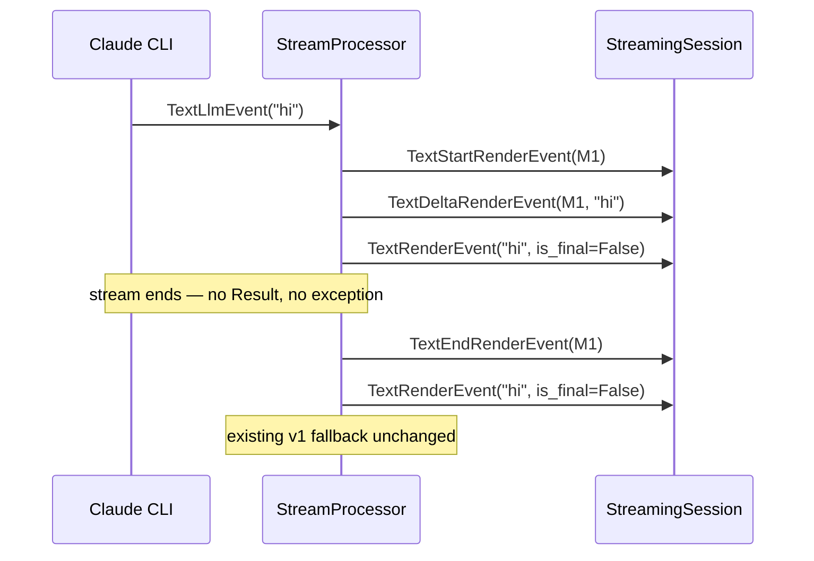
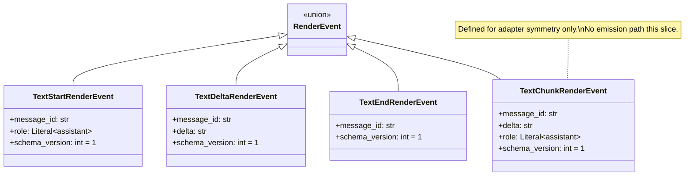
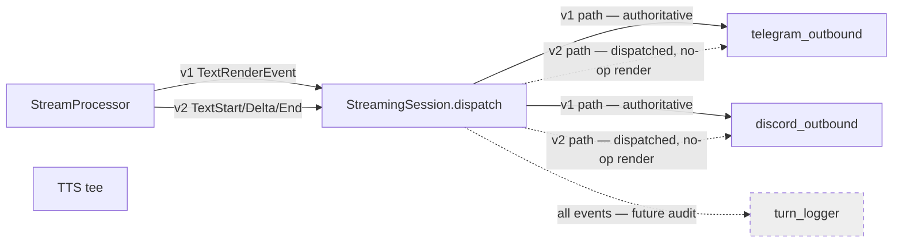

## Context

Promoted from frame `artifacts/frames/1099-text-render-event-triplet-frame.mdx`. This is Slice 2 of epic #1096 (RenderEvent v2 — AG-UI modeling back-port). All cross-slice invariants, schema-bump cadence, dispatch-ladder design, and resolved decisions (#6 dual-emission, #7 `runId`==`trace_id`, #8 per-block `message_id`) are pinned in the umbrella spec at `artifacts/specs/1096-render-event-v2-agui-modeling-spec.mdx`. This spec narrows to the Text family only.

Prerequisites already shipped:

- **#1098 (Slice 1, Run lifecycle)** — established the `run_id = TraceContext.get_trace_id() or f"synthetic-{TraceContext.generate()}"` minting pattern (`stream_processor.py:195`). v2 `message_id` mirrors the synthesizing fallback.

Peer slice for pattern consistency (not a blocker — independent per epic ordering invariant):

- **#1100 (Slice 3, ToolCall split)** — uses the same dispatch-ladder extension pattern in `_shared_streaming_emitter.py`. Slice 2 wires `_on_text_v2` next to the existing `_on_run`/`_on_toolcall_v2` branches. Implementations remain consistent in shape.

In-code anchors confirming the wire-in points:

- `src/lyra/adapters/shared/_shared_streaming_emitter.py:134` — `# (#1099) must extend this branch when TextDeltaRenderEvent lands`
- `src/lyra/adapters/shared/_shared_streaming_emitter.py:230` — `# (#1099) extends RenderEvent with TextStart/Delta/End, pyright …`

## Goal

`StreamProcessor` emits a v2 Text triplet (`TextStart` → `TextDelta*` → `TextEnd`) per assistant text block alongside the existing v1 `TextRenderEvent` stream, without changing user-visible behavior on Telegram or Discord and without regressing the existing progressive-flush UX shipped in commits 1cde9d51/40b3ea87/4249f7bd.

## Users

- **Primary:** Lyra hub developers — gain a per-block, role-typed text surface that lets adapters bracket UI state, pre-allocate containers, and distinguish stream begin/end from turn begin/end. Unblocks Slice 4 (#1101 Reasoning typed) which reuses the same per-block `message_id` mechanic.
- **Secondary:** Telegram + Discord end users — observe **zero** behavior change. Parity is a binary success criterion of this slice.
- **Tertiary:** Future Slice 5 (#1102 cleanup) author — removing v1 emission becomes mechanical because v2 already carries the full information.

## Expected Behavior

### Single-block turn (typical case — pre-tool text only or post-tool text only)

```mermaid
sequenceDiagram
  participant LLM as Claude CLI
  participant SP as StreamProcessor
  participant Adp as StreamingSession (adapter)
  participant Usr as End user

  LLM->>SP: ResultLlmEvent stream opens
  SP->>Adp: RunStartedRenderEvent(run_id)
  Note over SP,Adp: existing — Slice 1

  LLM->>SP: TextLlmEvent("Hel")
  SP->>Adp: TextStartRenderEvent(message_id=M1, role="assistant")
  SP->>Adp: TextDeltaRenderEvent(message_id=M1, delta="Hel")
  SP->>Adp: TextRenderEvent(text="Hel", is_final=False)
  Note over SP,Adp: v2 triplet first (Start+Delta), then v1 — dual emission

  LLM->>SP: TextLlmEvent("lo!")
  SP->>Adp: TextDeltaRenderEvent(message_id=M1, delta="lo!")
  SP->>Adp: TextRenderEvent(text="lo!", is_final=False)

  LLM->>SP: ResultLlmEvent(is_error=False)
  SP->>Adp: TextEndRenderEvent(message_id=M1)
  SP->>Adp: TextRenderEvent(text="Hello!", is_final=True)
  SP->>Adp: RunFinishedRenderEvent(run_id, outcome="success")

  Adp->>Usr: (drives existing edit-in-place from v1; v2 dispatched but no-op)
```

### Multi-block turn (interleaved text → tool → text)



### Error turn (exception caught)



### Truncated stream (no ResultLlmEvent, no exception)

`stream_processor.py:269-285` handles the path where the upstream iterator terminates without emitting a `ResultLlmEvent` (truncation, upstream death). On this path, an open text block MUST be closed with `TextEnd` before the existing v1 fallback emit fires:



Soft errors (`ResultLlmEvent.is_error=True` w/o exception): `TextEnd` then `RunFinishedRenderEvent(outcome="success")` per epic spec §"Run lifecycle". v1 path emits `TextRenderEvent(is_final=True, is_error=True)` unchanged.

### Parity contract

For every input `LlmEvent` sequence, the **set of v1 events emitted** is byte-for-byte unchanged from staging baseline. The **set of v2 Text events** is additive only. Test asserts both halves: (a) capture v1 stream pre-slice, compare to v1 portion post-slice; (b) capture v2 stream, assert structural correctness (Start before any Delta with same id, End after last Delta with same id, no orphan ids).

## Data Model & Consumers

### v2 Text family (new — this slice)



All four classes are `frozen=True`. `role` is fixed to `"assistant"` for both `TextStart` and `TextChunk` this slice — `role` evolves to a wider Literal in Slice 4 (#1101) when `ReasoningStart` adds its own role channel; here we keep it pinned for type-narrowing safety.

**TextChunk experimental marker (until first emitter lands).** `TextChunkRenderEvent` is defined and routed by dispatch but has no emission path this slice. Until any code path emits it, its field shape MAY be revised in-place (additive widening, field rename, default-value change) without a new schema version — `schema_version: int = 1` is meaningful only once consumers depend on it. The dataclass docstring carries this marker. Once any path emits `TextChunk` (likely the future AG-UI HTTP/SSE adapter, a non-streaming driver, or system-message injection), the shape is frozen per the standard schema-version discipline and the marker is removed.

### v1 (unchanged — coexistence)

`TextRenderEvent(text, is_final, is_error)` continues to be emitted exactly as it does on staging today. No fields, no schema_version, no behavior changes.

### Schema constants added

```python
SCHEMA_VERSION_TEXT_START_RENDER_EVENT = 1
SCHEMA_VERSION_TEXT_DELTA_RENDER_EVENT = 1
SCHEMA_VERSION_TEXT_END_RENDER_EVENT = 1
SCHEMA_VERSION_TEXT_CHUNK_RENDER_EVENT = 1
```

Existing `SCHEMA_VERSION_TEXT_RENDER_EVENT = 1` is untouched. Slice 5 (#1102) removes both v1 type and constant together.

### Consumer map



### Consumer summary

| Consumer | Fields consumed (this slice) | When | Status |
|---|---|---|---|
| `telegram_outbound._on_text_v2` | message_id (dispatched, ignored for render) | every text block | this slice — branch added; no UX change |
| `discord_outbound._on_text_v2` | message_id (dispatched, ignored for render) | every text block | this slice — branch added; no UX change |
| `telegram_outbound._on_text_v1` (existing) | text, is_final, is_error | every text chunk + final | unchanged this slice |
| `discord_outbound._on_text_v1` (existing) | text, is_final, is_error | every text chunk + final | unchanged this slice |
| TTS tee | (taps upstream of StreamProcessor — does not flow through dispatch) | unchanged | out of scope this slice |
| Turn logger | n/a | n/a | follow-up (out of scope) |
| Slice 4 (#1101) Reasoning typed | message_id correlation pattern | future | future use of this slice's mechanic |

## Breadboard

### Affordance table — internal API surface

| ID | Affordance | Handler | Data |
|---|---|---|---|
| U1 | Add 4 v2 dataclasses + 4 schema constants in `render_events.py` | dataclass definitions | per class diagram above |
| U2 | Extend `RenderEvent` union with the 4 new types | type alias addition | — |
| U3 | Mint `message_id` per text block in StreamProcessor | `_mint_message_id()` helper | `f"text-{uuid4().hex[:12]}"` |
| U4 | Emit `TextStart` on first text token of a new block | `_handle_text_event()` (extended) | message_id from U3 |
| U5 | Emit `TextDelta` per `TextLlmEvent` (alongside existing v1 emit) | `_handle_text_event()` (extended) | message_id, event.text |
| U6 | Emit `TextEnd` at block close (tool boundary OR ResultLlmEvent OR exception) | `process()` (extended at boundary points) | message_id |
| U7 | Block boundary detection: tool start, result, exception, **stream truncation** | existing dispatch in `process()` — flag track | `_open_text_block_id: str \| None` |
| U8 | Dispatch ladder: add v2 Text branch to `StreamingSession.dispatch` | `_shared_streaming_emitter.py:dispatch` | isinstance check against 4 new types (incl. `TextChunk`) |
| U9 | `_on_text_v2` no-op handler in `OutboundAdapterBase` | `_base_outbound.py` (new method) | accept event, return — no platform call |
| U10 | Telegram + Discord inherit `_on_text_v2` from base — no override this slice | inherited | — |
| U11 | `_drain_fallback` accumulates `TextDeltaRenderEvent.delta` so partial text is not lost on placeholder-send failure | `_shared_streaming_emitter.py:128-145` (the `# (#1099)` anchor at L134) | reuse existing fallback buffer; append v2 deltas alongside v1 fragments |
| N1 | StreamProcessor state: `_open_text_block_id` | instance attribute | mints on first delta, clears on End |
| N2 | Slice unit tests: triplet ordering, message_id correlation | `tests/core/test_stream_processor.py` (new tests) | — |
| N3 | Adapter dispatch tests: v2 events accepted, no platform call; `_drain_fallback` recovers v2 delta text (U11 coverage) | `tests/adapters/test_shared.py` (new tests) | — |
| N4 | Parity test: v1 baseline byte-identical | `tests/core/test_stream_processor.py` (new parity test) | golden capture vs current |
| N5 | Golden v1 fixture committed BEFORE any code change in P2 | `tests/core/fixtures/v1_text_stream_baseline.json` (new) | captured from current staging; pinned and read-only this slice |

### Wiring

```
TextLlmEvent ──► StreamProcessor._handle_text_event ──► (in order)
                                                        │
                                                        ├─► [if _open_text_block_id is None]
                                                        │     mint id → yield TextStartRenderEvent
                                                        │
                                                        ├─► yield TextDeltaRenderEvent
                                                        │
                                                        ├─► [existing v1 path]
                                                        │     accumulate _total_text
                                                        │     [if show_intermediate] yield TextRenderEvent(is_final=False)
                                                        ▼
                                                  StreamingSession.dispatch
                                                        │
                                                        ├─► isinstance(TextStart|Delta|End|Chunk)? → _on_text_v2 (no-op)
                                                        ├─► isinstance(TextRenderEvent)? → _on_text_v1 (existing edit-in-place)
                                                        └─► (existing branches for Run* / ToolCall*)

Block close (any of), GUARDED by `if _open_text_block_id is not None:`:
  • ToolUseLlmEvent at top of loop → yield TextEnd → clear _open_text_block_id → proceed with tool handling
  • ResultLlmEvent → yield TextEnd → clear → emit v1 final + RunFinished
  • Exception in process() → yield TextEnd → clear → emit RunError
  • Stream truncation (iterator ends without ResultLlmEvent at `stream_processor.py:269-285`) → yield TextEnd → clear → fall through to existing v1 fallback emit

Fallback path (placeholder-send failure, `_shared_streaming_emitter.py:128-145`):
  • Existing v1 harvest collects `TextRenderEvent.text` for the fallback message
  • U11: also accumulate `TextDeltaRenderEvent.delta` so v2-only consumers (future, post-Slice-5) retain partial text
  • Dual emission means this slice is neutral to ordering in the fallback path; recorded for Slice 5 author
```

## Slices

F-lite — single slice, internally phased for review tractability:

| Phase | Affordance IDs | Surface | Files | Tests |
|---|---|---|---|---|
| P0 — Golden baseline | N5 | Capture v1 text-stream output from current staging into a committed fixture before any code change | `tests/core/fixtures/v1_text_stream_baseline.json` (new) | — (fixture only; consumed by N4) |
| P1 — Types + schema | U1, U2 | Add 4 dataclasses, 4 constants, extend union, extend `__all__`. `TextChunkRenderEvent` docstring includes the experimental marker (Resolved decision 6). | `render_events.py` | `tests/core/messaging/test_render_events.py` (N2 subset) — instantiation, frozen-ness, schema_version defaults |
| P2 — StreamProcessor emission | U3, U4, U5, U6, U7, N1, N2, N4 | Mint id, emit triplet, track open block, handle all four boundary types (tool / Result / exception / truncation) | `stream_processor.py` | `tests/core/test_stream_processor.py` — triplet ordering, multi-block ids, parity-vs-v1 (uses N5 fixture), error path, truncation path |
| P3 — Dispatch shim | U8, U9, U11, N3 | Add v2 Text branch to dispatch (all 4 types incl. `TextChunk`); add `_on_text_v2` no-op on base; extend `_drain_fallback` to harvest v2 deltas; resolve `# (#1099)` anchors | `_shared_streaming_emitter.py`, `_base_outbound.py` | `tests/adapters/test_shared.py` — dispatch routes v2, no platform call, fallback recovers v2 delta |
| P4 — Adapter parity check | U10 | Verify Telegram + Discord inherit `_on_text_v2` without override; user-visible parity preserved | `telegram_outbound.py`, `discord_outbound.py` (inspection — no edits expected) | snapshot test (Tg + Dc) reading goldens for single-block, multi-block, error from N5-style fixtures |

P0 lands first as a fixture-only commit (no production code change). P1–P4 land in one PR to staging. Phases exist for review clustering and for the `/plan` agent assignment grouping.

## Success Criteria

- [ ] `TextStartRenderEvent`, `TextDeltaRenderEvent`, `TextEndRenderEvent`, `TextChunkRenderEvent` exist in `core/messaging/render_events.py`, all `frozen=True`, fields exactly per data-model class diagram
- [ ] `SCHEMA_VERSION_TEXT_{START,DELTA,END,CHUNK}_RENDER_EVENT = 1` constants exist; each event class defaults its `schema_version` field to its corresponding constant
- [ ] `RenderEvent` union in `render_events.py` includes the 4 new types; `__all__` updated
- [ ] `SCHEMA_VERSION_TEXT_RENDER_EVENT` and `TextRenderEvent` are unchanged
- [ ] StreamProcessor emits `TextStart` exactly once per text block, with a freshly-minted `message_id` per block (per-block, not per-turn)
- [ ] StreamProcessor emits one `TextDelta` per source `TextLlmEvent`, with the same `message_id` as the bracketing `TextStart`
- [ ] StreamProcessor emits `TextEnd` exactly once per text block at any of: tool boundary, `ResultLlmEvent`, caught exception, OR stream truncation (iterator ends w/o Result at `stream_processor.py:269-285`) — `message_id` matches the open block; emission is guarded by `if _open_text_block_id is not None`
- [ ] StreamProcessor v1 emission (`TextRenderEvent` per chunk when `show_intermediate=True` + final `TextRenderEvent(is_final=True)`) produces output equal to the committed `tests/core/fixtures/v1_text_stream_baseline.json` golden (captured from staging in P0) for the three scenarios single-block / multi-block / error
- [ ] `StreamingSession.dispatch` routes all 4 new types (`TextStart`, `TextDelta`, `TextEnd`, `TextChunk`) to `_on_text_v2` via `isinstance` ladder; the existing loud-fail behavior on unknown types is preserved
- [ ] `OutboundAdapterBase._on_text_v2` exists as a no-op coroutine; Telegram + Discord inherit it without override
- [ ] `_drain_fallback` in `_shared_streaming_emitter.py` accumulates `TextDeltaRenderEvent.delta` (U11) — verified by a test where placeholder-send fails and the fallback message includes text that was emitted only via v2 deltas
- [ ] Telegram + Discord user-visible output is equal to the golden fixtures captured in P0 for the three scenarios single-block, multi-block, error
- [ ] No existing test under `tests/core/test_stream_processor.py` or `tests/adapters/test_shared.py` is modified to accommodate v2 — new tests are additive only
- [ ] `import-linter` passes — no new platform imports leak into `core/messaging/`
- [ ] `pyright` passes — adding the 4 new types to the `RenderEvent` union without adding matching `isinstance` branches will produce a pyright error at the existing `assert_never(event)` call site (`_shared_streaming_emitter.py:232`); slice satisfies pyright by adding the branches
- [ ] `# (#1099)` anchor comments at `_shared_streaming_emitter.py:134` and `:230` are resolved (replaced with the concrete dispatch and fallback logic from U8/U11)

## Resolved decisions (inherited from epic spec #1096)

1. **Dual emission during coexistence.** StreamProcessor emits BOTH v1 and v2 for every text chunk. Authoritative side this slice = v1. Removed in Slice 5. (Epic spec §"Resolved decisions" item 6.)
2. **`message_id` per text block, not per turn.** New id minted on `TextStart`. Multi-block turns produce distinct ids. Single-block turns degenerate harmlessly. (Epic spec §"Resolved decisions" item 8.)
3. **`message_id` format.** `f"text-{uuid4().hex[:12]}"` — 17-char short id (prefix + 12 hex). Mirrors the `synthetic-{...}` pattern from `run_id`. Distinguishable from `run_id` via prefix.
4. **Block boundary semantics.** A block opens on the first `TextLlmEvent` received while `_open_text_block_id is None` (i.e., at turn start or after the previous block's `TextEnd`). A block closes (emits `TextEnd`, clears `_open_text_block_id`) on any of: next `ToolUseLlmEvent` (interleaved tool), `ResultLlmEvent` (turn end, including soft errors with `is_error=True`), caught exception in `process()`, or stream truncation (iterator ends without `ResultLlmEvent`). All close paths emit `TextEnd` *before* the corresponding `RunFinished`/`RunError` or v1 fallback. All close transitions are guarded by `if _open_text_block_id is not None` to handle streams that start with a tool call (no text block open).
5. **Role is `Literal["assistant"]` this slice.** Reasoning will widen this in Slice 4 — not here. Slice 4 adds a NEW `ReasoningStartRenderEvent` with its own `role` channel; it does NOT widen `TextStartRenderEvent.role`. Pinning is migration-safe (additive change in Slice 4, not modification).
6. **`TextChunk` ships with the family, marked experimental.** Per long-term strategic analysis (schema completeness + coordinated-deploy economics > YAGNI for ~15 lines of code): all 4 v2 Text types ship as one schema unit. `TextChunk` carries an explicit experimental docstring marker permitting in-place shape revision until the first emitter wires up. This avoids a separate coordinated deploy of `lyra_hub + lyra_telegram + lyra_discord` when the eventual consumer (AG-UI HTTP adapter, non-streaming driver, or system-message injection) arrives.

## Pre-check

| Check | Result |
|---|---|
| Testable criteria (each `- [ ]` binary) | ✓ — 14 of 14 binary |
| No dangling refs (U*/N* IDs in slices) | ✓ — U1–U11 + N1–N5 all referenced in §"Slices" P0–P4 (Affordance IDs column) |
| Ambiguity budget (≤5 χ items) | ✓ — 0 χ items |
| Slice coverage (every affordance in ≥1 phase) | ✓ — see Slices table |
| Edge completeness (single-block, multi-block, error, soft error) | ✓ — all four covered in §"Expected Behavior" |

Pre-check: 5 of 5 passed.

## Smart splitting (Gate 2.5)

|slices| = 1, |criteria| = 13. Triggers only on slices > 3 or criteria > 8. |criteria| > 8 → smart-splitting consideration.

**Outcome:** ¬split. The criteria are tightly coupled around a single dual-emission contract — splitting would create orphan PRs (e.g., "add types, never emit them" violates "no types-only slices" from the epic frame). The criteria count is inflated because slice-wide invariants (parity, dispatch loud-fail, lint/typecheck) are restated for testability, not because the work is plural. Phased internal review (P1–P4) provides the granularity smart-splitting would otherwise enforce.

## Unresolved expert concerns

- **Architect review pending.** Slice spec authored without parallel expert review. `/dev` invokes `/spec` with architect + doc-writer + product-lead parallel review per Step 4 of the spec skill — concerns flagged there feed back here before approval.
