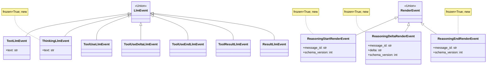
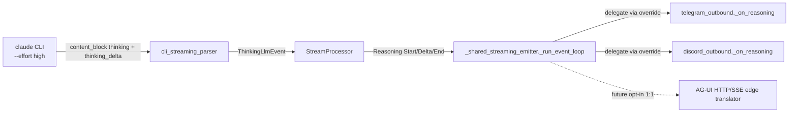

## Context

- **Promoted from:** `artifacts/frames/1101-typed-reasoning-events-frame.mdx` (approved 2026-05-13).
- **Parent epic:** `#1096` — RenderEvent v2, AG-UI modeling back-port. Umbrella spec: `artifacts/specs/1096-render-event-v2-agui-modeling-spec.mdx`.
- **Epic state (as of 2026-05-13):** #1097 ✓ ADR · #1098 ✓ Run lifecycle · #1099 ✓ Text triplet (merged today, PR #1173) · #1100 ✓ ToolCall split · **#1101 in progress** · #1102 awaits this.
- **Position in epic:** Slice 4 of 5. Per epic invariant: independent of S2/S3. Both prerequisites (#1098, #1099) are now merged.
- **ADR:** `ADR-070` — RenderEvent v2 selective AG-UI modeling (back-port without wire adoption).

### Verified source signal (added in revision 2)

Live trace from the Anthropic CLI with `--effort high` (Claude Code binary, May 2026):

```
claude --print --output-format stream-json --verbose \
       --include-partial-messages --effort high \
       --model claude-haiku-4-5 "Think step by step…"
```

Stream emits:
```json
{"event":{"type":"content_block_start","index":0,
          "content_block":{"type":"thinking","thinking":"","signature":""}}}

{"event":{"type":"content_block_delta","index":0,
          "delta":{"type":"thinking_delta","thinking":"The user is asking…"}}}

{"event":{"type":"content_block_delta","index":0,
          "delta":{"type":"signature_delta","signature":"…opaque…"}}}

{"event":{"type":"content_block_stop","index":0}}

# then index 1 opens as a regular text content_block
{"event":{"type":"content_block_delta","index":1,
          "delta":{"type":"text_delta","text":"…answer…"}}}
```

`cli_streaming_parser.parse_line()` (`src/lyra/core/cli/cli_streaming_parser.py:178-220`) currently:
- Handles `content_block_start` **only** for `content_block.type == "tool_use"`.
- Handles `content_block_delta` **only** for `delta.type ∈ {text_delta, input_json_delta}`.
- Silently drops every `thinking_delta`, `signature_delta`, and the open/close of `thinking` content blocks.

This slice teaches the parser to recognize those events and routes them through a typed `ThinkingLlmEvent → Reasoning*` channel.

## Goal

Surface Anthropic's existing (and AG-UI-aligned) **thinking** content-block channel end-to-end:

```
Anthropic CLI thinking_delta  ──►  cli_streaming_parser
                                       ↓
                                  ThinkingLlmEvent (new)
                                       ↓
                                  StreamProcessor
                                       ↓
                                  Reasoning{Start,Delta,End}RenderEvent (new)
                                       ↓
                                  _shared_streaming_emitter dispatch
                                       ↓
                          telegram_outbound / discord_outbound (dim/italic)
```

1:1 source-signal mapping. **No positional heuristic. No state-machine inference.** The model tells us "this is reasoning"; we plumb it through to typed render events. AG-UI's `Reasoning{Start,Content,End}` triplet falls out as a near-1:1 future edge translation.

## Users

**Humans:**
- **End users on Telegram / Discord** asked questions that benefit from extended thinking (math, multi-step reasoning, planning). With `effort` enabled and `show_intermediate=true`: see a dim/italic single-line reasoning summary updating live, then the final answer. With `effort` off (default): unchanged — no reasoning surface, regular text streaming.
- **Operators** — gain a new `effort` knob per agent/model config. `None` (default) → no behavior change, no extra cost. `"high"` / `"xhigh"` / `"max"` → richer reasoning at a billed-tokens cost.
- **Future AG-UI / web-frontend end users** — gain a typed reasoning channel mapping 1:1 to AG-UI `Reasoning{Start,Content,End}`.

**Systems / code paths:**
- **`ModelConfig`** (`core/agent/agent_config.py`) — gains `effort: Literal["low","medium","high","xhigh","max"] | None = None`.
- **`cli_protocol_types.build_command`** — appends `--effort {effort}` when set.
- **`cli_streaming_parser`** (`core/cli/cli_streaming_parser.py`) — gains thinking-block recognition.
- **`core/messaging/events.py`** — new `ThinkingLlmEvent(text: str)` dataclass; `LlmEvent` Union widens.
- **`StreamProcessor`** (`core/processors/stream_processor.py`) — gains a `ThinkingLlmEvent` branch that emits `Reasoning{Start,Delta,End}` with consistent `message_id` per thinking block.
- **`_shared_streaming_emitter._run_event_loop`** — gains an `isinstance(event, Reasoning*)` branch routing to `_on_reasoning` (default no-op).
- **`telegram_outbound` + `discord_outbound`** — override `_on_reasoning` to render the dim/italic single-line summary.
- **Slice 5 (#1102)** — proceeds independently; v1 `TextRenderEvent` sunset is already enabled by Slice 2.

## Expected Behavior

Narrative walk-through for a representative turn (`effort="high"`, `show_intermediate=true`):

1. Adapter calls into Lyra with a complex prompt. `ModelConfig.effort = "high"` is set.
2. `cli_protocol_types.build_command` invokes the CLI with `--effort high` appended.
3. CLI streams (verified live above):
   - `content_block_start(content_block.type="thinking", index=0)` → parser emits **nothing yet** (state-only: open thinking at idx 0).
   - `content_block_delta(delta.type="thinking_delta", thinking="The user is asking…")` (index 0) → parser emits `ThinkingLlmEvent(text="The user is asking…")`.
   - More `thinking_delta` events (same index) → more `ThinkingLlmEvent`s.
   - `content_block_delta(delta.type="signature_delta", …)` (index 0) → parser ignores (signature is API-replay metadata, no user-facing render).
   - `content_block_stop(index=0)` → parser closes thinking block (state-only).
   - `content_block_start(content_block.type="text", index=1)` → no parser emission (text-block opens are implicit in `text_delta`).
   - `content_block_delta(delta.type="text_delta", text="17 × 23 = **391**")` (index 1) → parser emits `TextLlmEvent` (existing path).
   - `content_block_stop(index=1)` → parser handles (existing path).
   - `result` envelope → `ResultLlmEvent`.
4. StreamProcessor (run boundaries unchanged; Slice 1):
   - `RunStartedRenderEvent(run_id)` at start.
   - On first `ThinkingLlmEvent`: emit `ReasoningStartRenderEvent(message_id=uuid7())`, then `ReasoningDeltaRenderEvent(message_id, delta)` per event.
   - On the **transition out of thinking** — observed at the first `TextLlmEvent` / `ToolUseLlmEvent` / `ResultLlmEvent` / exception that arrives after thinking deltas — emit `ReasoningEndRenderEvent(message_id)`.
   - Existing v2 Text triplet emission for `TextLlmEvent` (Slice 2, unchanged).
   - Existing ToolCall* emission for tool events (Slice 3, unchanged).
   - `RunFinishedRenderEvent(run_id, outcome="success")` at end.
5. **Telegram outbound:**
   - On `ReasoningStart`: lazily send a "trace" placeholder if not yet sent.
   - On `ReasoningDelta`: throttle-edit the placeholder to show the dim/italic accumulated summary (truncated ≤120 chars with ellipsis on overflow), throttled at `STREAMING_EDIT_INTERVAL` (existing constant, ≥1.0s).
   - On `ReasoningEnd`: leave the dim line as-is.
   - Existing `TextStart/Delta/End` rendering (v2 Text triplet, Slice 2) unchanged — final answer streams to its own placeholder, distinct from the reasoning placeholder.
6. **Discord outbound:** same policy as Telegram (parity).

**With `effort=None` (default):** CLI invocation unchanged, no `thinking_delta` arrives, no `Reasoning*` events emitted. **Zero behavior change** for any existing flow.

**With `show_intermediate=false`:** `Reasoning*` still emitted by StreamProcessor (for tests + observability) but `_on_reasoning` in adapters is gated to no-op. No user-visible change.

**Edge — exception or stream truncation mid-thinking:** StreamProcessor's `except` branch and `if not _result_received:` branch synthesize a closing `ReasoningEndRenderEvent` (mirrors Slice 1's orphan-close pattern for `ToolCallEnd`).

## Data Model & Consumers

### Data structure diagram



`message_id` is a stable identifier per reasoning block — one new id per `ReasoningStart`, reused on every `ReasoningDelta` and the matching `ReasoningEnd`.

### Consumer map



Solid = this slice. Dashed = future consumer; AG-UI edge translation is near-1:1 because the wire shape already matches.

### Consumer summary

| Consumer | Fields consumed | When | Status |
|---|---|---|---|
| `cli_streaming_parser` | `content_block.type`, `delta.type`, `delta.thinking`, `index` | per CLI stream event | this slice |
| StreamProcessor | `ThinkingLlmEvent.text` | per event | this slice |
| `_shared_streaming_emitter._run_event_loop` | event type (isinstance routing); `message_id` opaque passthrough | every event | this slice |
| `telegram_outbound._on_reasoning` | `message_id`, `delta` | per event | this slice |
| `discord_outbound._on_reasoning` | `message_id`, `delta` | per event | this slice |
| AG-UI HTTP/SSE edge translator | full triplet | future | out of scope |
| NATS listener / codec | schema_version validation | every event | this slice (additive) |

## Breadboard

```
ModelConfig.effort  ──►  cli_protocol_types.build_command (--effort flag)
                              │
                              ▼
                         claude CLI (stream-json + --effort)
                              │
                              ▼
                    cli_streaming_parser
                              │
                              ├─ content_block thinking → state-only
                              ├─ thinking_delta        → ThinkingLlmEvent
                              ├─ signature_delta       → ignored
                              ├─ content_block_stop    → state-only (close thinking)
                              └─ (existing branches unchanged)
                              │
                              ▼
                       StreamProcessor
                              │
                              ├─ ThinkingLlmEvent → ReasoningStart (first) / ReasoningDelta
                              ├─ TextLlmEvent / ToolUseLlmEvent / ResultLlmEvent / exception
                              │       → emit ReasoningEnd if reasoning open, then existing path
                              └─ existing Text* / ToolCall* / Run* unchanged
                              │
                              ▼
                  _shared_streaming_emitter._run_event_loop
                              │
                              ├─ isinstance(event, Reasoning*) → _on_reasoning (default no-op)
                              └─ existing branches unchanged
                              │
                              ▼
                  telegram_outbound._on_reasoning  /  discord_outbound._on_reasoning
                  (dim/italic single-line, throttled, ≤120 chars)
```

### Affordance tables

| ID | Affordance | Handler | Data |
|---|---|---|---|
| U1 | `ModelConfig.effort` field (optional) | `core/agent/agent_config.py` — `Literal["low","medium","high","xhigh","max"] \| None = None` | per-agent config |
| U2 | CLI invocation passes `--effort` when set | `core/cli/cli_protocol_types.build_command` — append flag | command-line arg |
| U3 | `ThinkingLlmEvent` dataclass | `core/messaging/events.py` — new `@dataclass(frozen=True)`, single `text: str` field | text chunk |
| U4 | `LlmEvent` Union widens to include `ThinkingLlmEvent` | `core/messaging/events.py` — Union update + `__all__` export | type alias |
| U5 | Parser tracks open thinking content-block index | `cli_streaming_parser.__init__` — `self._open_thinking_index: int \| None = None` | per-instance state |
| U6 | Parser opens thinking state on `content_block_start` | `parse_line` — branch on `content_block.type == "thinking"`; record `index`; no event emit | state-only |
| U7 | Parser emits `ThinkingLlmEvent` on `thinking_delta` | `parse_line` — branch on `delta.type == "thinking_delta"`; emit if `index == self._open_thinking_index`; field name `thinking` | text chunk |
| U8 | Parser ignores `signature_delta` | `parse_line` — branch on `delta.type == "signature_delta"`; drop (signature is API-replay metadata) | no event |
| U9 | Parser closes thinking state on `content_block_stop` for thinking index | `parse_line` — when `index == self._open_thinking_index`: clear state | state-only |
| U10 | StreamProcessor `_open_reasoning_block_id` state | `core/processors/stream_processor.py` — `self._open_reasoning_block_id: str \| None = None` | per-instance state |
| U11 | StreamProcessor opens reasoning block on first `ThinkingLlmEvent` after no-open | `process()` — branch on `isinstance(event, ThinkingLlmEvent)`; if `_open_reasoning_block_id is None`: mint id, emit `ReasoningStart` | event-type + message_id |
| U12 | StreamProcessor emits `ReasoningDelta` per `ThinkingLlmEvent` | `process()` — emit with current `_open_reasoning_block_id` | text chunk |
| U13 | StreamProcessor closes reasoning block on next non-Thinking, non-Tool* | `process()` — branch on `TextLlmEvent` / `ToolUseLlmEvent` / `ResultLlmEvent`: if `_open_reasoning_block_id`: emit `ReasoningEnd` first, then existing path | state transition |
| U14 | StreamProcessor synthesizes `ReasoningEnd` on exception (orphan close) | `except Exception` block — mirror Slice 1 + Slice 3 orphan-close pattern | log.warning |
| U15 | StreamProcessor synthesizes `ReasoningEnd` on truncated stream | `if not _result_received:` block — emit before any fallback v1 emit | log.warning |
| U16 | `Reasoning*RenderEvent` dataclasses (3) | `core/messaging/render_events.py` — `@dataclass(frozen=True)` per class diagram | per class diagram |
| U17 | `SCHEMA_VERSION_REASONING_{START,DELTA,END}_RENDER_EVENT = 1` constants | `core/messaging/render_events.py` — module level + `__all__` exports | int |
| U18 | `RenderEvent` Union widens to include 3 new types | `core/messaging/render_events.py` — Union update + `__all__` exports | type alias |
| U19 | Coexistence dispatch in `_shared_streaming_emitter._run_event_loop` | add an `isinstance(event, ReasoningStart\|Delta\|End)` branch → `await self._on_reasoning(event)` | event-type ladder |
| U20 | `_on_reasoning` default hook (no-op parity) | `_shared_streaming_emitter._on_reasoning` — empty coroutine, override per platform | none |
| U21 | Telegram `_on_reasoning` override | `telegram_outbound._on_reasoning` — render dim/italic single-line summary on lazily-created trace placeholder | `delta` accumulator (≤120 chars, ellipsis on overflow) |
| U22 | Discord `_on_reasoning` override | `discord_outbound._on_reasoning` — parity with Telegram | `delta` accumulator |
| U23 | Edit-rate throttle reuses existing `STREAMING_EDIT_INTERVAL` | adapters — coalesce intra-interval deltas into one API edit | ≥1.0s between API edits |
| U24 | Schema-floor enforcement on receive | `core/messaging/_version_check.check_schema_version()` — receivers reject `Reasoning*` with `schema_version > 1` | per-event const |
| U25 | Observability: log debug breadcrumbs on open/close | `log.debug("reasoning block opened/closed", message_id=…)` in StreamProcessor | trace-level |
| N1 | `effort` propagation through `ModelConfig` to CLI invocation | `core/agent/agent_config.py` → `cli_protocol_types.build_command` | optional |

## Slices

Single F-lite slice; split into build waves for `/plan`:

| Wave | Affordances | Demo-able outcome |
|---|---|---|
| W1 — Parser foundation | U1, U2, U3, U4, U5, U6, U7, U8, U9, N1 | `ModelConfig.effort` plumbs through to CLI flag; parser recognizes thinking blocks and emits `ThinkingLlmEvent`; parser unit tests cover thinking-block lifecycle + signature_delta ignore + interleaved tool blocks |
| W2 — Render-event types | U16, U17, U18 | New `Reasoning*RenderEvent` dataclasses + schema constants + Union widen; types-only tests (frozen contract, exports, union membership) |
| W3 — StreamProcessor mapping | U10, U11, U12, U13, U14, U15, U25 | StreamProcessor emits `Reasoning{Start,Delta,End}` with `message_id` consistency; unit tests cover think → text → tool → result ordering, exception orphan-close, truncated-stream orphan-close, log.debug observability |
| W4 — Dispatch + adapter parity | U19, U20 | `_shared_streaming_emitter` routes `Reasoning*` through `_on_reasoning` (default no-op); integration test asserts no regression on existing Telegram + Discord paths |
| W5 — Adapter rendering | U21, U22, U23 | Telegram + Discord render the dim/italic single-line summary; integration tests cover lazy placeholder, throttle bound, ≤120-char truncation, parity Tg↔Dc |
| W6 — Schema floor | U24 | Receiver-side floor check accepts `Reasoning*` at `schema_version=1` and rejects newer; codec roundtrip tests |

**Atomic-merge constraint (carried from spec v1):** W2 (Union widening) and W4 (dispatch branch) **must merge atomically** — `assert_never` in `_shared_streaming_emitter._run_event_loop` will trip at pyright time as soon as `Reasoning*` types enter the `RenderEvent` Union. Recommended packaging: **W2 + W4 in one PR**, then W1 + W3 (parser + StreamProcessor) in another, W5 + W6 last.

Slices are wave labels for /plan task generation, not separate PRs by default. The plan may merge waves into 2–3 PRs based on review-cycle ergonomics.

## Rollout

- **Coordinated deploy** (per epic spec): `lyra_hub` + `lyra_telegram` + `lyra_discord` deploy together when this slice merges. ADR-070 excludes `lyra-clipool` only for slices that change `LlmEvent` shape consumed cross-process; this slice **does change** `LlmEvent` (adds `ThinkingLlmEvent`), so `lyra-clipool` is included in the gate.
- **`effort` opt-in**: default `None` ⇒ no behavior change anywhere. Operators flip `effort="high"` per-agent in `ModelConfig` to activate. Extended thinking is billed by Anthropic at output-token rates; operators should expect 30–50% output-token-cost increase for thinking-on turns.
- **Schema floor**: receivers reject `Reasoning*` with `schema_version > 1` per existing `_version_check.check_schema_version` policy.
- **Feature flag**: existing `show_intermediate` config gates whether adapters forward `Reasoning*` to user-visible rendering. `effort` gates whether the source signal is even produced. Two-axis control gives operators per-agent reasoning visibility.
- **Sunset / dependents**: Slice 5 (#1102) proceeds independently — v1 `TextRenderEvent` deletion is already enabled by Slice 2. This slice does not change Slice 5's scope.

## Open Questions

**None.** v1's χ-1 (dual-emit), χ-2 (re-entry trigger), χ-3 (message_id) are all moot under the parser-level mechanism:
- χ-1 moot: `Reasoning*` is a **new channel**, not a replacement for `Text*` (which already lives via Slice 2 + v1 dual-emit until Slice 5). No coexistence policy to choose.
- χ-2 moot: parser owns thinking-block boundaries via `content_block_start` / `content_block_stop` events. No state machine to design.
- χ-3 effectively answered: `message_id = uuid7()` minted by StreamProcessor on `ReasoningStart`, consistent with Slice 2's `_mint_text_block_id` convention.

## Success Criteria

- [ ] `ModelConfig` has a new `effort: Literal["low","medium","high","xhigh","max"] \| None = None` field; existing config docs unchanged when field absent (default `None`).
- [ ] `cli_protocol_types.build_command` appends `--effort {value}` to the CLI command when `effort` is set; omits the flag otherwise. Unit test covers both cases.
- [ ] `ThinkingLlmEvent(text: str)` exists in `core/messaging/events.py`, `frozen=True`, exported in `__all__`. `LlmEvent` Union includes it.
- [ ] `cli_streaming_parser` recognizes `content_block_start` with `content_block.type == "thinking"` (state-only, no emit) and `content_block_delta` with `delta.type == "thinking_delta"` (emits `ThinkingLlmEvent(text=delta.thinking)`). Verified against a captured live trace.
- [ ] `cli_streaming_parser` silently ignores `delta.type == "signature_delta"` (no events emitted, no log spam).
- [ ] `cli_streaming_parser` closes thinking state on `content_block_stop` for the thinking index without emitting any event.
- [ ] `ReasoningStartRenderEvent`, `ReasoningDeltaRenderEvent`, `ReasoningEndRenderEvent` exist in `core/messaging/render_events.py`, `frozen=True`, with fields per class diagram (`message_id`, `delta` where applicable, `schema_version`). All exported in `__all__`.
- [ ] `SCHEMA_VERSION_REASONING_{START,DELTA,END}_RENDER_EVENT = 1` constants exist + exported.
- [ ] `RenderEvent` Union includes the three new types; `pyright` typechecks pass (no `assert_never` regression in StreamProcessor or `_shared_streaming_emitter`).
- [ ] StreamProcessor emits `ReasoningStart → (ReasoningDelta)+ → ReasoningEnd` with consistent `message_id` for each reasoning block. Unit test drives a synthetic LlmEvent stream `[ThinkingLlmEvent("a"), ThinkingLlmEvent("b"), TextLlmEvent("c"), ResultLlmEvent]` and asserts exactly: 1 `ReasoningStart`, 2 `ReasoningDelta` (deltas "a", "b"), 1 `ReasoningEnd`, then existing Text + Result flow.
- [ ] StreamProcessor emits exactly **one** `ReasoningEnd` per `ReasoningStart` — including on the transition to text, the transition to tool, the result envelope, and the exception path. Four separate unit tests, one per transition.
- [ ] StreamProcessor synthesizes a closing `ReasoningEndRenderEvent` when an exception interrupts an open reasoning block (orphan-close test, mirrors Slice 1's pattern).
- [ ] StreamProcessor synthesizes a closing `ReasoningEndRenderEvent` when the stream terminates without `ResultLlmEvent` mid-thinking (truncated-stream test).
- [ ] `_shared_streaming_emitter._run_event_loop` routes `Reasoning*` through `_on_reasoning` (default no-op). Integration test asserts: (a) no regression on the v1/v2 Text path, no regression on ToolCall*; (b) `_on_reasoning` is called exactly once per `Reasoning*` event.
- [ ] Telegram outbound `_on_reasoning` renders a dim/italic single-line summary on the lazily-created trace placeholder. Integration test drives 20 `ReasoningDelta` events through a fake Telegram client and asserts: (a) the placeholder ends with the accumulated thinking content (truncated at 120 chars with `…` suffix); (b) actual API edit count ≤ `ceil(test_duration / STREAMING_EDIT_INTERVAL) + 1` (throttle bound).
- [ ] Discord outbound `_on_reasoning` provides parity with Telegram. Integration test mirrors Telegram's assertions.
- [ ] Receiver-side `check_schema_version()` accepts `Reasoning*` at `schema_version=1` and rejects newer versions per the existing floor-enforcement contract. Codec roundtrip test covers all three event types.
- [ ] `log.debug("reasoning block opened/closed", message_id=…)` fires exactly once per `ReasoningStart` and once per `ReasoningEnd`.
- [ ] With `effort=None` (default): no `Reasoning*` events ever emitted in an end-to-end CLI run; existing tests show zero regressions (full `tests/core/` + `tests/adapters/` suite green).
- [ ] With `effort="high"`: end-to-end CLI integration test (uses recorded fixture from the live trace captured during spec drafting) demonstrates the full pipeline: parser → ThinkingLlmEvent → ReasoningStart/Delta/End → adapter `_on_reasoning` called.
