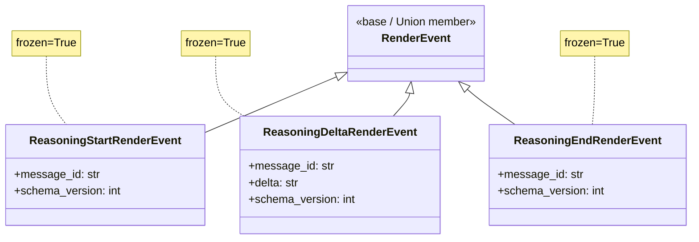
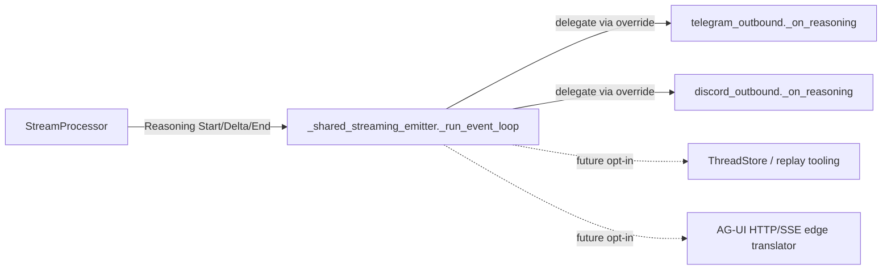

## Context

- **Promoted from:** `artifacts/frames/1101-typed-reasoning-events-frame.mdx` (approved 2026-05-13).
- **Parent epic:** `#1096` — RenderEvent v2, AG-UI modeling back-port. Umbrella spec: `artifacts/specs/1096-render-event-v2-agui-modeling-spec.mdx`.
- **Position in epic:** Slice 4 of 5. Per epic invariant: **`ADR → S1 → {S2, S3, S4 independent} → S5`**. S1 (#1098) merged. S3 (#1100) merged. S2 (#1099) frame written, not implemented. Slice 4 may land before or after S2 — they touch disjoint subsystems.
- **ADR:** `ADR-070` — RenderEvent v2 selective AG-UI modeling (back-port without wire adoption).

## Goal

Introduce the `ReasoningStart` / `ReasoningDelta` / `ReasoningEnd` render-event family and route the StreamProcessor's intermediate text into it via a positional heuristic so adapters can render reasoning as a typed channel distinct from final assistant output — preserving today's user-visible behavior on Telegram and Discord.

## Users

**Humans:**
- **End users on Telegram / Discord** with `show_intermediate=true` — see intermediate "thinking" lines today (`⏳` static prefix). Post-slice: same `⏳`-styled placeholder, now **live-updating** as reasoning deltas stream. This is a visible behavior change — the line now mutates as the model thinks, rather than appearing once and being replaced by the final answer. Final answer behavior unchanged.
- **Operators** running Lyra in production — see the same `show_intermediate=true` config switch. Rolling-deploy semantics unchanged (see Rollout, below).
- **Future AG-UI / web-frontend end users** — gain a typed reasoning channel mapping 1:1 to AG-UI's `Reasoning{Start,Content,End}` triplet (future epic).

**Systems / code paths:**
- **StreamProcessor** (`core/processors/stream_processor.py`) — gains reasoning-context tracking and emits `Reasoning*` alongside (per χ-1 resolution) the existing intermediate v1 `TextRenderEvent(is_final=False)` stream.
- **Shared streaming emitter** (`adapters/shared/_shared_streaming_emitter.py`) — gains an `isinstance` branch for `Reasoning*` events with a default `_on_reasoning` hook (no-op parity).
- **Telegram outbound + Discord outbound** — override `_on_reasoning` to render the dim/italic single-line summary on a lazily-created trace placeholder. Discord mirrors Telegram for parity; richer UX deferred.
- **Slice 5 (#1102)** — typed Reasoning is a prerequisite for v1 `TextRenderEvent` deletion; this slice unblocks it.

> **Reasoning context** is defined as: any `TextLlmEvent` arriving while no tool call is currently open — i.e., before the first `ToolUseLlmEvent`, between a `ToolResultLlmEvent` and the next `ToolUseLlmEvent`, or after the last tool result but before `ResultLlmEvent`. The state machine tracks this via a single `_reasoning_open: bool` flag.

## Expected Behavior

Narrative walk-through of a representative turn (`show_intermediate=true`, model uses one tool):

1. `RunStartedRenderEvent(run_id)` — emitted unchanged by Slice 1.
2. Model streams **pre-tool text** ("I'll search the codebase to find…"). StreamProcessor enters **reasoning context** on the first `TextLlmEvent`:
   a. Emits `ReasoningStartRenderEvent(message_id=r1)`.
   b. Emits `ReasoningDeltaRenderEvent(message_id=r1, delta=chunk)` per `TextLlmEvent` chunk.
3. Model emits a tool use. StreamProcessor:
   a. Emits `ReasoningEndRenderEvent(message_id=r1)` to close the open block.
   b. Resumes the existing Slice-3 tool-call flow (`ToolCallStartRenderEvent`, `ToolCallArgsRenderEvent`, `ToolCallEndRenderEvent`).
4. Tool result arrives. `ToolCallResultRenderEvent` is emitted (Slice 3 unchanged). StreamProcessor re-enters reasoning context.
5. Model streams **post-tool text** ("Found three matches. Here's the answer:…"). StreamProcessor:
   a. Emits `ReasoningStartRenderEvent(message_id=r2)` on the first post-tool `TextLlmEvent`.
   b. Emits `ReasoningDeltaRenderEvent(message_id=r2, delta=chunk)` per chunk.
6. `ResultLlmEvent` arrives. StreamProcessor:
   a. Emits `ReasoningEndRenderEvent(message_id=r2)` to close the open block.
   b. Emits `TextRenderEvent(text=total_text, is_final=True)` — the canonical final answer (v1, unchanged until Slice 5).
   c. Emits `RunFinishedRenderEvent(run_id, outcome="success")`.
7. **Telegram outbound:**
   - On `ReasoningStart`: lazily send a "trace" placeholder if not yet sent (mirrors the tool-card placeholder pattern).
   - On `ReasoningDelta`: throttle-edit the placeholder to show the dim/italic single-line current-summary (truncated, ≤120 chars, ellipsis suffix on overflow).
   - On `ReasoningEnd`: leave the dim line as-is.
   - On `TextRenderEvent(is_final=True)`: overwrite the main placeholder with the final answer (existing edit-in-place path, unchanged).
8. **Discord outbound:** same policy as Telegram (parity).

**No-tools run:** intermediate streaming text emits as Reasoning* throughout. Final `TextRenderEvent(is_final=True)` at result overwrites. Same edit-in-place outcome as today.

**`show_intermediate=false`:** intermediate text not streamed at all (existing gate preserved). No `Reasoning*` events produced. Final `TextRenderEvent(is_final=True)` carries the whole answer at result time. Same as today.

**Edge — exception mid-stream:** StreamProcessor's `except` branch synthesizes a `ReasoningEndRenderEvent` for any open reasoning block (mirroring the orphan `ToolCallEnd` synthesis pattern from Slice 3), then emits `RunErrorRenderEvent` and re-raises.

## Data Model & Consumers

### Data structure diagram



All three are `@dataclass(frozen=True)` per the existing `render_events.py` immutability contract (lines 8–15). `message_id` is a stable identifier per reasoning block (one new id per `ReasoningStart`; same id reused on every `ReasoningDelta` and the matching `ReasoningEnd`).

### Consumer map



Solid edges = this slice. Dashed = future consumers — fields must be accessible but no wiring required here.

### Consumer summary

| Consumer | Fields consumed | When | Status |
|---|---|---|---|
| `_shared_streaming_emitter._run_event_loop` | event type (isinstance routing); `message_id` opaque-passthrough | every event | this slice |
| `telegram_outbound._on_reasoning` (override) | `message_id` for placeholder correlation; `delta` for live summary | per event | this slice |
| `discord_outbound._on_reasoning` (override) | `message_id`; `delta` | per event | this slice |
| `ThreadStore` / replay tooling | full triplet | future | out of scope |
| AG-UI HTTP/SSE edge translator | full triplet | future | out of scope |
| NATS listener / codec | schema_version validation | every event | this slice (additive) |

## Breadboard

```
LlmEvent stream  ──►  StreamProcessor  ──►  RenderEvent stream  ──►  _shared_streaming_emitter
                          (v2 emit)           (incl. Reasoning*)      (isinstance ladder)
                                                                            │
                                          ┌─────────────────────────────────┼─────────────────────────────────┐
                                          ▼                                 ▼                                 ▼
                                    telegram_outbound                discord_outbound                    (future opt-ins)
                                    _on_reasoning override           _on_reasoning override
```

### Affordance tables

| ID | Affordance | Handler | Data |
|---|---|---|---|
| U1 | New `Reasoning*RenderEvent` dataclasses | `core/messaging/render_events.py` — 3 new `@dataclass(frozen=True)` blocks | per class diagram |
| U2 | StreamProcessor enters reasoning context on first `TextLlmEvent` of a reasoning window | `process()` — branch on `isinstance(event, TextLlmEvent)` with `_reasoning_open` flag check | flag flip + message_id generation |
| U3 | StreamProcessor closes reasoning context on tool-use transition | `_handle_tool_event()` — emit `ReasoningEndRenderEvent` if `_reasoning_open` before `ToolCallStart` | `_reasoning_open=False`, clear `_reasoning_message_id` |
| U4 | StreamProcessor re-enters reasoning after `ToolResultLlmEvent` | `process()` — `ToolResultLlmEvent` branch: do NOT open immediately, wait for next `TextLlmEvent` (lazy open) | none |
| U5 | StreamProcessor closes reasoning at `ResultLlmEvent` | `process()` — `ResultLlmEvent` branch: emit `ReasoningEndRenderEvent` if open BEFORE `TextRenderEvent(is_final=True)` | none |
| U6 | StreamProcessor synthesizes `ReasoningEnd` on exception (orphan close) | `except Exception` block — mirror the `_synth_orphan_tool_ends` pattern | log.warning(orphan close) |
| U6b | StreamProcessor synthesizes `ReasoningEnd` on truncated stream (no `ResultLlmEvent`) | `if not _result_received:` block (stream_processor.py ~270-285) — emit before any trailing v1 `TextRenderEvent` | log.warning(orphan close) |
| U7 | StreamProcessor gates Reasoning emission on `show_intermediate=true` | `_route_text_block(chunk)` — early-return when `not self._show_intermediate` (text accumulates into `_total_text` only) | none |
| U8 | Coexistence dispatch in `_shared_streaming_emitter._run_event_loop` | add an `isinstance(event, ReasoningStart|Delta|End)` branch → `await self._on_reasoning(event)` | event-type ladder |
| U9 | `_on_reasoning` default hook (no-op parity) | `_shared_streaming_emitter._on_reasoning` — empty coroutine, override per platform | none |
| U10 | Telegram `_on_reasoning` override | `telegram_outbound._on_reasoning` — render dim/italic single-line summary on placeholder (existing trace placeholder if any, else lazy-create) | `delta` accumulator (≤120 chars truncated) |
| U11 | Discord `_on_reasoning` override | `discord_outbound._on_reasoning` — same policy as Telegram (parity) | `delta` accumulator |
| U12 | Schema-floor enforcement on receive | `core/messaging/_version_check.check_schema_version()` — receivers reject `Reasoning*` with `schema_version > 1` | per-event const |
| U13 | Edit-rate throttle on Reasoning* placeholder updates | reuse existing `STREAMING_EDIT_INTERVAL` constant (already used for ToolSummary throttling); coalesce intra-interval deltas into a single placeholder edit | trailing-edge debounce, ≥1.0 s between API edits |
| U14 | Observability: log open/close of reasoning blocks | `log.debug("reasoning block opened/closed", message_id=…)` on every `ReasoningStart` and `ReasoningEnd` (not on Delta — too chatty) | trace-level breadcrumb |
| N1 | `SCHEMA_VERSION_REASONING_{START,DELTA,END}_RENDER_EVENT = 1` constants | `core/messaging/render_events.py` — module level | int |
| N2 | `RenderEvent` Union widens to include 3 new types | `core/messaging/render_events.py` — Union update + `__all__` exports | type alias |
| N3 | `_reasoning_open: bool` + `_reasoning_message_id: str \| None` on `StreamProcessor` | `core/processors/stream_processor.py` — `__init__` | per-instance state |
| S1 | `_pending_text` accumulator policy unchanged | StreamProcessor — keep `_total_text` for final v1 emit | — |
| S2 | v1 `TextRenderEvent(is_final=False)` intermediate **dual-emit** alongside `ReasoningDelta` (per χ-1) | StreamProcessor — keep existing `yield TextRenderEvent(text=event.text, is_final=False)` (v1 intermediate only, ¬Text triplet) | both events ship for same chunk |

### Wiring

```
TextLlmEvent  ──►  StreamProcessor.process()
                       │
                       ├─ if not _reasoning_open and _show_intermediate:
                       │     yield ReasoningStartRenderEvent(message_id=uuid7())
                       │     _reasoning_open = True
                       │
                       ├─ if _show_intermediate:
                       │     yield ReasoningDeltaRenderEvent(message_id=_reasoning_message_id, delta=text)
                       │
                       └─ _total_text += text   (unchanged — feeds final v1 emit)

ToolUseLlmEvent  ──►  _handle_tool_event()
                       │
                       ├─ if _reasoning_open:
                       │     yield ReasoningEndRenderEvent(message_id=_reasoning_message_id)
                       │     _reasoning_open = False
                       │
                       └─ existing Slice-3 flow (ToolCallStart + accumulate)

ResultLlmEvent  ──►  process()
                       │
                       ├─ if _reasoning_open:
                       │     yield ReasoningEndRenderEvent(message_id=_reasoning_message_id)
                       │     _reasoning_open = False
                       │
                       └─ yield TextRenderEvent(text=_total_text, is_final=True)   (unchanged)

exception  ──►  except branch
                       │
                       ├─ if _reasoning_open:
                       │     log.warning("orphan ReasoningEnd synthesis")
                       │     yield ReasoningEndRenderEvent(message_id=_reasoning_message_id)
                       │
                       └─ yield RunErrorRenderEvent(...)   (Slice 1, unchanged) + re-raise

truncated stream  ──►  if not _result_received:
                       │
                       ├─ if _reasoning_open:
                       │     log.warning("orphan ReasoningEnd synthesis — truncated stream")
                       │     yield ReasoningEndRenderEvent(message_id=_reasoning_message_id)
                       │
                       └─ existing v1 fallback TextRenderEvent emit   (unchanged)
```

## Slices

This slice is itself a leaf in epic #1096 — but it splits cleanly into ordered build waves for `/plan`:

| Wave | Affordances | Demo-able outcome |
|---|---|---|
| W1 — Types | U1, N1, N2 | New dataclasses + Union + schema constants land; tests cover frozen contract + Union membership |
| W2 — StreamProcessor emit | U2, U3, U4, U5, U6, U6b, U7, U14, N3, S1, S2 | StreamProcessor emits Reasoning* per the wiring; unit tests cover pre/inter/post-tool ordering + no-tools run + exception orphan-close + truncated-stream orphan-close; v1 intermediate dual-emit confirmed per χ-1 |
| W3 — Dispatch + adapter parity | U8, U9 | `_shared_streaming_emitter` routes Reasoning* through a no-op `_on_reasoning`; integration tests assert no regression on Telegram/Discord paths |
| W4 — Adapter rendering | U10, U11, U13 | Telegram + Discord render the dim/italic single-line reasoning summary, throttled at `STREAMING_EDIT_INTERVAL`; tests cover placeholder lazy-create + throttle bound |
| W5 — Schema enforcement | U12 | Receiver-side floor check accepts Reasoning* at v1 and rejects v2+; codec roundtrip tests |

**Atomic-merge constraint (architect review):** W1 (Union widening) and W3 (dispatch branch) **must land in the same PR** OR W3 must merge before W1's Union widening reaches CI. The `else: assert_never(event)` at `_shared_streaming_emitter._run_event_loop` (line ~232) will trip at pyright time as soon as `Reasoning*` types enter the `RenderEvent` Union; a standalone W1 PR would red-CI without W3 already merged. Recommended packaging: **W1 + W3 in one PR**, then W2 + W4 (each independently), then W5. Alternative: land W3's no-op `_on_reasoning` + the isinstance branch first (using forward-reference type-only imports), then W1.

W4 may merge in parallel with W5. Both depend only on W1+W3.

## Rollout

- **Coordinated deploy:** per epic spec's coordinated-deploy rule, `lyra_hub` + `lyra_telegram` + `lyra_discord` must deploy together for any slice that adds new event types. ADR-070 explicitly excludes `lyra-clipool` from this slice's gate because S4 is a `RenderEvent`-only change (no `LlmEvent` shape change).
- **Rolling-deploy safety (χ-1 dual-emit decision):** because v1 `TextRenderEvent(is_final=False)` continues to ship for the same chunks during the coexistence window, any adapter that has not yet wired `_on_reasoning` keeps its existing intermediate-streaming UX unchanged. A hub-ahead-of-adapter window is therefore safe.
- **Schema floor:** receivers reject `Reasoning*` with `schema_version > 1` (existing `_version_check.check_schema_version` policy, additively extended).
- **Feature flag:** the existing `show_intermediate` config remains the operator-facing kill switch (off ⇒ no `Reasoning*` produced ⇒ no v1 intermediate ⇒ no behavior change vs today). No new flag introduced.
- **Sunset:** Slice 5 (#1102) deletes v1 `TextRenderEvent(is_final=False)` intermediate emission once all adapters confirm migration to `_on_reasoning`. At that point dual-emit collapses to Reasoning-only.

## Open Questions

- **χ-1 [NEEDS CLARIFICATION]** — **v1 `TextRenderEvent(is_final=False)` coexistence policy:** when StreamProcessor enters reasoning context, should it (a) **dual-emit** (continue yielding v1 `TextRenderEvent(is_final=False)` for the same chunks alongside `ReasoningDelta`), or (b) **replace** (stop emitting v1 intermediate for chunks routed as `ReasoningDelta`)? Option (a) maximizes coexistence-period safety (a non-migrated adapter keeps current `⏳` streaming UX) but doubles outbound traffic and risks duplicate Telegram edits on a migrated adapter; option (b) is cleaner but adapters that haven't yet wired `_on_reasoning` silently lose the streaming-text UX until Slice 4 lands everywhere. Sibling Slice 3 (#1100) chose **dual-emit** for `ToolSummaryRenderEvent` ↔ `ToolCall*`. **Default for this spec (revised after product-lead review): option (a) — dual-emit** for consistency with S3, rolling-deploy safety, and explicit sunset in Slice 5. Confirm or revise.

- **χ-2 [NEEDS CLARIFICATION]** — **Reasoning re-entry trigger:** after a tool sequence completes, when exactly does reasoning re-open? Two candidates: (a) **eagerly** on `ToolCallResultRenderEvent` (emit `ReasoningStart` immediately, even before next `TextLlmEvent`); (b) **lazily** on the next `TextLlmEvent` after the tool result. Default for this spec: **(b) lazy** — avoids empty `ReasoningStart → ReasoningEnd` pairs when the next chunk is another tool use. Confirm or revise.

- **χ-3 [NEEDS CLARIFICATION]** — **`message_id` generation:** epic class diagram has `message_id: str` on all three. Source: (a) `uuid7()` (matches existing trace_id convention), (b) `f"{run_id}-r{counter}"` (deterministic, debuggable), (c) other? Default: **(a) `uuid7()`** — opaque, no collision risk, no counter state to thread. Confirm or pin to whatever Slice 2 (#1099) chooses for Text triplet `message_id` (currently unbuilt).

## Success Criteria

- [ ] `ReasoningStartRenderEvent`, `ReasoningDeltaRenderEvent`, `ReasoningEndRenderEvent` exist in `core/messaging/render_events.py`, each `frozen=True`, with fields exactly matching the class diagram (`message_id`, `delta` where applicable, `schema_version`).
- [ ] `SCHEMA_VERSION_REASONING_START_RENDER_EVENT`, `SCHEMA_VERSION_REASONING_DELTA_RENDER_EVENT`, `SCHEMA_VERSION_REASONING_END_RENDER_EVENT` constants exist (= 1) and are exported in `__all__`.
- [ ] `RenderEvent` Union includes the three new types; `pyright` typechecks pass without `assert_never` failures in StreamProcessor dispatch.
- [ ] StreamProcessor emits `ReasoningStart → (ReasoningDelta)+ → ReasoningEnd` with consistent `message_id` for each reasoning block in a unit test that drives a synthetic LlmEvent stream: text → tool → text → result. Test asserts exactly 2 `ReasoningStart` events and 2 matching `ReasoningEnd` events (no duplicates, no orphans).
- [ ] StreamProcessor emits exactly **one** `ReasoningStart` per reasoning block in a no-tools run (text → result): assert `len([e for e in events if isinstance(e, ReasoningStartRenderEvent)]) == 1` and matching `ReasoningEnd` count == 1.
- [ ] StreamProcessor does NOT emit `Reasoning*` when `show_intermediate=False` (unit test asserts zero `Reasoning*` events in a no-intermediate run).
- [ ] StreamProcessor dual-emits v1 `TextRenderEvent(is_final=False)` alongside every `ReasoningDelta` for the same chunk (per χ-1). Unit test pairs each `ReasoningDelta(delta=X)` with a `TextRenderEvent(text=X, is_final=False)`.
- [ ] StreamProcessor synthesizes a closing `ReasoningEndRenderEvent` when an exception interrupts an open reasoning block (unit test asserts orphan-close before `RunErrorRenderEvent`).
- [ ] StreamProcessor synthesizes a closing `ReasoningEndRenderEvent` when the stream terminates without `ResultLlmEvent` mid-reasoning (truncated-stream test; assert orphan-close before any v1 fallback emit).
- [ ] `_shared_streaming_emitter._run_event_loop` routes `Reasoning*` through `_on_reasoning` (default no-op); integration test asserts no regression on Telegram + Discord existing paths.
- [ ] Telegram outbound `_on_reasoning` renders a dim/italic single-line summary on the lazily-created trace placeholder. Integration test drives 20 deltas through a fake Telegram client and asserts: (a) placeholder text ends with the accumulated content; (b) actual API edit count ≤ ceil(test_duration / STREAMING_EDIT_INTERVAL) + 1 (throttle bound); (c) accumulated text truncated at ≤120 chars with ellipsis suffix on overflow.
- [ ] Discord outbound `_on_reasoning` provides parity with Telegram. Integration test mirrors Telegram's assertions.
- [ ] Receiver-side `check_schema_version()` accepts `Reasoning*` at `schema_version=1` and rejects newer versions per the existing floor-enforcement contract.
- [ ] `log.debug("reasoning block opened/closed", message_id=…)` fires exactly once per `ReasoningStart` and once per `ReasoningEnd` (observability criterion).
- [ ] No existing tests regress (full `tests/core/` + `tests/adapters/` suite green).
- [ ] `χ-1`, `χ-2`, `χ-3` resolved before `/plan` runs.

## Open Decisions Snapshot

|χ| = 3 — within the F-lite budget of ≤5. All three must be resolved before `/plan`.
