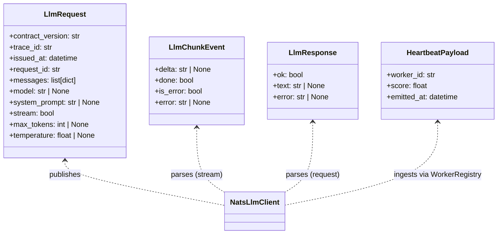
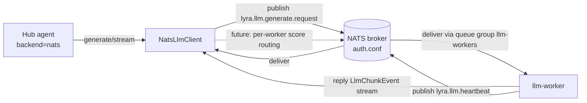

## Context

Promoted from [`artifacts/frames/1104-canonical-lyra-llm-wire-frame.mdx`](../frames/1104-canonical-lyra-llm-wire-frame.mdx).

Lyra's LLM domain is half-migrated to the canonical NATS contract pattern
(envelopes from `roxabi_contracts.llm`, [ADR-049](../../docs/architecture/decisions/0049-roxabi-contracts.md)).
Code-side canonicals exist but the deployed broker ACL and hub bootstrap
still speak the legacy ad-hoc contract. This spec defines the work to
close both gaps so the canonical hub client can exchange traffic with
canonical workers under epic
[#987](https://github.com/Roxabi/lyra/issues/987).

## Goal

Bring the LLM NATS wire to full canonical parity with voice (ADR-044) and
image (ADR-046/050) so the harness path (`HarnessCLI → hub → llmCLI worker
→ LiteLLM → llama-server`) lights up end-to-end on M₁ once the sister PR
llmCLI [PR #18](https://github.com/Roxabi/llmCLI/pull/18) lands.

**Why now:** epic [#987](https://github.com/Roxabi/lyra/issues/987)
deprecates the Anthropic API path; the harness route via llmCLI + LiteLLM
+ local llama-server is its replacement. This issue is the lyra-side gate
on that replacement landing — without it, P1-high traffic still requires
external paid API keys.

## Pivot Outcome (post-implementation amendment, 2026-05-07)

This spec was approved on the premise that `NatsLlmClient` was a drop-in
replacement for `NatsLlmDriver`. Implementation surfaced that
`NatsLlmClient` does not implement the `LlmProvider` protocol — it lacks
`capabilities` / `complete` / `is_alive` and its `stream(...)` yields
`AsyncIterator[str]` rather than `AsyncIterator[LlmEvent]`. PR #1121
pivoted to a subject-literal-only migration in `NatsLlmDriver`
(which IS the `LlmProvider`). The full bootstrap swap originally scoped
under AC-4 / AC-5 / AC-7 is deferred to follow-up issue
[#1119](https://github.com/Roxabi/lyra/issues/1119).

| Original AC | Status |
|-------------|--------|
| AC-1, AC-2, AC-3 (ACL canonical) | Met by PR #1121 |
| AC-4 (`init_nats_llm` returns `NatsLlmClient`) | Deferred to #1119 |
| AC-5 (5 wiring points reference `NatsLlmClient`) | Deferred to #1119 |
| AC-6 (`NatsLlmClient` publishes `SUBJECTS.generate_request`) | Met by PR #1121 (still a useful change for #1119) |
| AC-7 (`NatsLlmDriver` `# DEPRECATED` header) | N/A post-pivot — driver IS the canonical impl now; #1119 will remove it after `NatsLlmClient` reaches conformance |
| AC-8 (`pytest tests/llm/drivers/test_nats_*` passes) | Met by PR #1121 (subject literals updated; full client-path migration deferred to #1119) |

The user-visible outcome (canonical wire on the deployed broker, harness
path unblocked, sister PR llmCLI [PR #18](https://github.com/Roxabi/llmCLI/pull/18) mergeable) is delivered by PR #1121.

## Users

- **Primary:** Lyra hub — must publish on `lyra.llm.generate.request` and
  subscribe `lyra.llm.heartbeat` to dispatch agent turns whose
  `backend = "nats"`
- **Secondary:**
  - HarnessCLI consumers — end-users running local-only LLM turns;
    failure mode if this lands broken = harness-driven turns time out
    with "no responder" or fail ACL check at the broker
  - llmCLI worker (sister [PR #18](https://github.com/Roxabi/llmCLI/pull/18)) — cannot deploy
    its `LlmNatsAdapter` until canonical ACL is live on the broker
  - Epic [#987](https://github.com/Roxabi/lyra/issues/987) (Anthropic
    deprecation) — blocked end-to-end until both PRs merge
  - M₁ smoke-test gate operator — runs the
    `harness → hub → worker → LiteLLM → llama-server` integration check;
    needs `auth.conf` regenerated with canonical subjects on `roxabituwer`
    before flipping the gate green

## Expected Behavior

1. Operator regenerates `deploy/nats/auth.conf` via `sudo lyra-acl genkeys
   --regenerate`. The output references only canonical subjects for the LLM
   domain — no `lyra.llm.request` (legacy) or `lyra.llm.health.*` (legacy).
2. Hub bootstrap (single-process and standalone) constructs `NatsLlmClient`
   in place of `NatsLlmDriver`. `init_nats_llm` returns a started
   `NatsLlmClient`; agent factory wires it into the `"nats"` provider slot
   on the `ProviderRegistry`.
3. With one llm-worker subscribed to `lyra.llm.generate.request` (queue
   group `llm-workers`) and emitting heartbeats on `lyra.llm.heartbeat`,
   a hub agent configured with `backend = "nats"` resolves a streaming
   completion: the registry observes the heartbeat, `NatsLlmClient.stream`
   yields `LlmChunkEvent.delta` deltas, and final `chunk.done == true`
   completes the turn.
4. `NatsLlmDriver` carries a `# DEPRECATED` notice pointing to a follow-up
   removal issue. It is no longer constructed at startup.

## Data Model & Consumers





| Consumer | Fields consumed | When | Status |
|----------|-----------------|------|--------|
| `NatsLlmClient.stream` | `LlmChunkEvent.delta`, `.done`, `.is_error`, `.error` | Per delta on streaming completion | This issue |
| `NatsLlmClient.generate` | `LlmResponse.ok`, `.text`, `.error` | On non-streaming completion reply | This issue |
| `WorkerRegistry` | `HeartbeatPayload.worker_id`, `.score`, `.emitted_at` | On every heartbeat | This issue |
| `auth.conf` (broker) | Subject ACL (publish/subscribe allow lists) | Connection-establishment | This issue |
| Per-worker score routing | `worker_id` → `lyra.llm.generate.request.{id}` | Multi-worker future | Out of scope |

## Breadboard

### Affordances (where state changes happen)

| ID | Element | Handler | Reads | Writes |
|----|---------|---------|-------|--------|
| N1 | NATS hub-publish ACL | broker auth.conf | nkey: `UDETHUB` | `lyra.llm.generate.request` |
| N2 | NATS hub-subscribe ACL | broker auth.conf | nkey: `UDETHUB` | `lyra.llm.heartbeat` |
| N3 | NATS worker-subscribe ACL | broker auth.conf | nkey: `UDETLLMWORKER` | `lyra.llm.generate.request` |
| N4 | NATS worker-publish ACL | broker auth.conf | nkey: `UDETLLMWORKER` | `lyra.llm.heartbeat` |
| B1 | `init_nats_llm()` | `bootstrap/factory/llm_overlay.py` | `nc`, `NATS_URL` | returns `NatsLlmClient \| None` |
| B2 | `VoiceBundle.nats_llm_driver` field type (legacy field name; bundle is shared with voice services) | `factory/wiring_helpers.py` | `nc` via `_init_voice_services` | annotation: `NatsLlmClient \| None` |
| B3 | `register_agents` arg type | `factory/hub_builder.py` | per-agent registry | `nats_llm_driver: NatsLlmClient \| None` |
| B4 | `_build_shared_base_providers` | `factory/agent_factory.py` | `nats_llm_driver` | registers `"nats"` slot |
| B5 | Standalone shutdown | `standalone/hub_standalone_helpers.py` | `nats_llm_driver` | calls `await client.stop()` |
| C1 | Driver deprecation | `llm/drivers/nats_driver.py` | — | adds `# DEPRECATED` notice + removal issue link |

### Wiring

```
HarnessCLI
   ↓ (NATS request — out of scope, owned by llmCLI #12)
Hub agent (backend=nats)
   ↓ provider registry: "nats" → RetryDecorator(NatsLlmClient)
NatsLlmClient.stream()
   ↓ publishes LlmRequest (JSON envelope) to N1
NATS broker (auth.conf) — N1, N2, N3, N4 ACL gates
   ↓ queue-group dispatch ("llm-workers")
llm-worker (LlmNatsAdapter from llmCLI [#12](https://github.com/Roxabi/llmCLI/issues/12))
   ↓ replies LlmChunkEvent stream + emits heartbeat to N4
NatsLlmClient
   ↓ deltas yielded to agent → HarnessCLI
```

### Resolved spec decision (was NC-1)

`NatsLlmClient` currently publishes to `per_worker_llm(worker_id)` →
`lyra.llm.generate.request.{worker_id}` (`nats_llm_client.py:214, 246`).
The canonical ACL (issue §1) allows only literal `lyra.llm.generate.request`
— per-worker publishes would be denied at the broker.

**Resolution:** Slice 2 replaces both `per_worker_llm(...)` call sites with
`SUBJECTS.generate_request`, relying on queue group `llm-workers` for
dispatch. Single-worker mode for now; per-worker score-routing remains
out of scope per the issue body. `WorkerRegistry.ordered_by_score()` and
`mark_stale()` are retained (still useful for retry-walk timeout
handling); only the per-worker subject derivation is dropped. The unused
`per_worker_llm` import in `nats_llm_client.py` is removed.

## Slices

| # | Slice | Covers | Demo | Files (est.) |
|---|-------|--------|------|--------------|
| 1 | **ACL canonical migration** — flip YAML source for `hub` + `llm-worker` nkeys, regenerate `auth.conf`, add regression test asserting subject set | N1, N2, N3, N4 | `grep -E "lyra\.llm\.(request\|health\.\*)" deploy/nats/auth.conf` returns nothing; positive grep for canonical subjects | ACL YAML source (under `lyra-acl genkeys`), `deploy/nats/auth.conf`, 1 regression test |
| 2 | **Hub bootstrap switch + client publish fix** — `init_nats_llm` returns `NatsLlmClient`; update type annotations across overlay/wiring/builder/standalone; switch `NatsLlmClient` stream + non-stream call sites to `SUBJECTS.generate_request` (drop per-worker publish + unused import) | B1, B2, B3, B4, B5 | Hub starts, log line `NatsLlmClient: initialised`; mock NATS test exercises `client.stream()` end-to-end with canonical subject assertions | `llm_overlay.py`, `wiring_helpers.py`, `hub_builder.py`, `agent_factory.py`, `hub_standalone_helpers.py`, `nats_llm_client.py` |
| 3 | **Driver deprecation + test migration** — add `# DEPRECATED` header citing follow-up removal issue, migrate/rename `tests/llm/drivers/test_nats_driver.py` to exercise `NatsLlmClient` envelope path | C1 | Existing hub LLM tests pass; deprecated module not imported at runtime startup; legacy wire-format tests removed | `llm/drivers/nats_driver.py`, `tests/llm/drivers/test_*` |

Ordering: Slice 1 first (unblocks broker), Slice 2 second (consumes new
ACL), Slice 3 last (cleanup). **All three slices land in a single PR**
and the deployment is atomic on M₁: regenerate `auth.conf` + restart
`lyra-hub` + restart `llm-worker` (sister PR #12) in one operation. There
is no transitional state where ACL is updated but bootstrap is not — a
partial apply would deny hub LLM publishes at the broker until the hub
restarts onto the new client.

## Success Criteria

- [ ] Regenerated `deploy/nats/auth.conf` has, for **hub** (`UDETHUB`):
      `publish` allow contains `lyra.llm.generate.request` and `subscribe`
      allow contains `lyra.llm.heartbeat`
- [ ] Regenerated `deploy/nats/auth.conf` has, for **llm-worker**
      (`UDETLLMWORKER`): `subscribe` allow contains
      `lyra.llm.generate.request` and `publish` allow contains
      `lyra.llm.heartbeat`
- [ ] `auth.conf` no longer references `lyra.llm.request` (without
      `.generate.`) nor `lyra.llm.health.*` — verified by regex
      assertion in regression test
- [ ] `init_nats_llm()` returns `NatsLlmClient | None` (not
      `NatsLlmDriver | None`) — type annotation enforced by pyright
- [ ] All five wiring points (`llm_overlay.py`, `wiring_helpers.py`,
      `hub_builder.py`, `agent_factory.py`, `hub_standalone_helpers.py`)
      reference `NatsLlmClient` instead of `NatsLlmDriver`; no
      `NatsLlmDriver` import remains in `bootstrap/`
- [ ] `NatsLlmClient` publishes to `SUBJECTS.generate_request` (not
      `per_worker_llm(...)`) at both stream and non-stream call sites;
      `per_worker_llm` import removed from `nats_llm_client.py`
- [ ] `NatsLlmDriver` source begins with `# DEPRECATED — replaced by
      lyra.nats.nats_llm_client.NatsLlmClient (issue #N)` where N is the
      filed follow-up removal issue
- [ ] `pytest tests/llm/drivers/test_nats_*` passes against the migrated
      client path (no test exercises legacy driver wire format)

## Coordination Gate

Not a software AC — surfaced in PR description and enforced by reviewer
at "ready for review" handoff:

- PR #1104 and llmCLI [PR #18](https://github.com/Roxabi/llmCLI/pull/18) MUST reach
  "ready for review" simultaneously and merge in the same window. Either
  PR alone leaves the harness path red.
- M₁ smoke test
  (`HarnessCLI → hub → llmCLI worker → LiteLLM → llama-server`) gates
  the merge and runs after both PRs land on `staging`. Smoke test owner
  flips to green only when the full path resolves a sample completion
  end-to-end.

## Out of Scope

Carried from frame:
- Per-worker score-routed subjects (`lyra.llm.generate.request.{worker_id}`)
- ADR-045 `roxabi-nats` SDK uv-workspace extraction
- Full removal of `lyra.llm.drivers.nats_driver` (follow-up issue tracked
  in C1)
- LiteLLM proxy work (owned by llmCLI #12)
- Multi-worker load-balancing across multiple llm-worker instances

## Open Questions

None. NC-1 (per-worker publish in `NatsLlmClient`) is resolved in the
"Resolved spec decision" subsection — Slice 2 drops `per_worker_llm`,
publishes to `SUBJECTS.generate_request`, queue-group `llm-workers`
handles dispatch.
