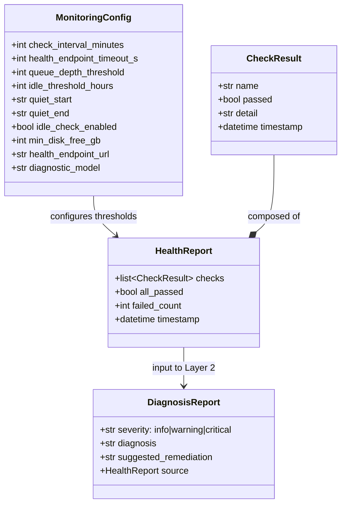
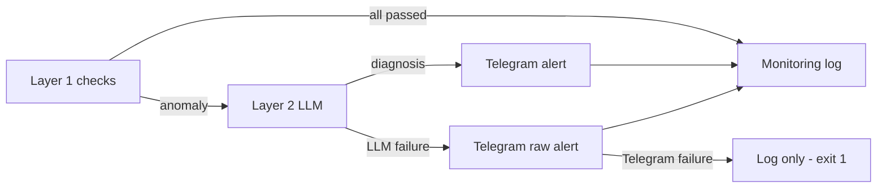

## Context

Promoted from [frame #111](../frames/111-bash-pre-check-monitoring-frame.mdx). Analysis skipped (F-lite).

Lyra hub runs 24/7 on Machine 1 as an asyncio app with FastAPI endpoints, Telegram/Discord adapters, and a circuit breaker registry. No periodic health monitoring exists today — the only observability is the `/status` endpoint (circuit breaker states, protected by webhook secret) and the `/circuit` admin command.

Currently there is no root-level FastAPI app — all HTTP routes live on adapter sub-applications (e.g., `TelegramAdapter.app`). The hub process itself (`Hub`) has no HTTP surface.

## Goal

Implement a two-layer monitoring system where deterministic pre-checks (Layer 1) run on a timer and only escalate to an LLM call (Layer 2) when an anomaly is detected, achieving ~95% token reduction compared to LLM-on-every-check.

## Users

- **Primary:** Hub operator (Mickael) — receives Telegram alerts only when something is wrong
- **Secondary:** Future multi-machine deployments — same pattern per node

## Expected Behavior

Every N minutes (configurable, default 5), a systemd timer triggers the monitoring script.

**Layer 1 (zero tokens):** The script runs deterministic checks:
1. **Process liveness** — Is the `lyra` systemd service active? (`systemctl is-active lyra`)
2. **HTTP health** — Does the hub `/health` endpoint respond within timeout? Returns queue depth, last message age, uptime, and circuit states. This endpoint lives on a new root FastAPI app in `__main__.py` (not on any adapter sub-app) so it represents hub-level health.
3. **Queue depth** — Is `queue_size` (from `/health` response) below threshold? (default: 80 of 100 max). Note: `queue_size` is a point-in-time snapshot via `asyncio.Queue.qsize()`, read synchronously at request time.
4. **Idle check** _(opt-in, disabled by default)_ — Has `last_message_age_s` (from `/health` response) exceeded the configured window? Requires configurable quiet-hours (`quiet_start`, `quiet_end` in TOML) to avoid false alerts overnight. Checks 3–5 depend on check 2 succeeding (HTTP response available).
5. **Circuit states** — Are all circuits in CLOSED state? Read from `/health` response `circuits` field (avoids querying the Telegram adapter's auth-protected `/status` endpoint separately).
6. **Disk space** — Is the data partition above minimum free threshold? (default: 1GB, via `shutil.disk_usage()`)

All checks pass → exit 0, log "OK" to monitoring log. No tokens consumed.

**Layer 2 (LLM, on anomaly only):** One or more checks fail → collect all check results into a structured report → call Anthropic API directly via `httpx` (the script runs as a separate process, not inside the hub — it cannot share the in-process `CircuitRegistry`) → LLM returns: severity (info/warning/critical), diagnosis, suggested remediation. Default model: `claude-haiku-4-5-20251001` (cheapest, sufficient for categorizing 6 boolean results).

**Notification:** Send Telegram message to admin chat with: severity emoji, which checks failed, LLM diagnosis, suggested remediation. Uses Telegram Bot API directly via `httpx` (not through hub — hub may be down).

**Fallback — LLM failure:** If Layer 2 LLM call fails (any `httpx` error or non-200 response), send a raw Telegram alert with just the Layer 1 check results — no diagnosis, but admin is still notified.

**Fallback — Telegram failure:** If Telegram delivery also fails, log the full check results + error to `~/.lyra/logs/monitor.log` with timestamp. The script still exits 1 so systemd `OnFailure=` can trigger an alternative alert path if configured.

## Data Model & Consumers

Note: Secrets (`TELEGRAM_TOKEN`, `ANTHROPIC_API_KEY`, `TELEGRAM_ADMIN_CHAT_ID`) are read from environment variables, never from `lyra.toml`. Only thresholds and behavioral config go in the TOML file.

| Consumer | Fields consumed | When | Status |
|----------|----------------|------|--------|
| Layer 2 LLM | HealthReport (all checks + details) | On anomaly | This issue |
| Telegram alert | DiagnosisReport (severity, diagnosis, remediation) | On anomaly + LLM success | This issue |
| Telegram raw alert | HealthReport (failed checks + details) | On anomaly + LLM failure | This issue |
| Monitoring log | HealthReport, DiagnosisReport | Every run | This issue |
| Dashboard / web UI | HealthReport history | Future | Future (#120+) |

## Breadboard

### Affordances

| ID | Element | Type | Description |
|----|---------|------|-------------|
| S1 | systemd timer | trigger | Fires every N minutes |
| S2 | `lyra-monitor` script | entrypoint | CLI entrypoint for monitoring |
| U1 | `/health` endpoint | HTTP GET | Root FastAPI app exposes hub health (queue, uptime, circuits) |
| N1 | Telegram Bot API | external | Direct message to admin chat via `httpx` |
| N2 | Anthropic API | external | LLM diagnosis call via `httpx` |

### Wiring

| Input | Handler | Output |
|-------|---------|--------|
| S1 fires | `run_checks(config)` | HealthReport |
| run_checks → check 1 | `check_process(service_name)` — `systemctl is-active lyra` | CheckResult(name="process") |
| run_checks → check 2 | `check_http_health(url, timeout)` — `httpx.get(health_endpoint_url)` | CheckResult(name="http_health") + raw JSON for checks 3–5 |
| run_checks → check 3 | `check_queue_depth(health_json, threshold)` — reads `queue_size` from check 2 response | CheckResult(name="queue_depth") |
| run_checks → check 4 | `check_idle(health_json, threshold_h, quiet_start, quiet_end)` — reads `last_message_age_s`, skips during quiet hours. Opt-in only. | CheckResult(name="idle") |
| run_checks → check 5 | `check_circuits(health_json)` — reads `circuits` dict, fails if any not CLOSED | CheckResult(name="circuits") |
| run_checks → check 6 | `check_disk(path, min_free_gb)` — `shutil.disk_usage(path)` | CheckResult(name="disk") |
| HealthReport.all_passed | `log_ok(report)` | exit 0 |
| HealthReport.failed_count > 0 | `escalate_to_llm(report, config)` — `httpx.post()` to Anthropic Messages API | DiagnosisReport (or raises on failure) |
| DiagnosisReport | `send_telegram_alert(diagnosis, config)` — `httpx.post()` to Telegram Bot API | Telegram message sent |
| escalate_to_llm raises | `send_telegram_raw_alert(report, config)` — `httpx.post()` to Telegram Bot API | Telegram message (raw checks) |
| send_telegram_* raises | `log_failure(report, error)` | Log to monitor.log, exit 1 |
| U1 request | `hub_health_handler(hub)` — reads `hub.bus.qsize()`, `hub._last_processed_at`, `hub._start_time`, `hub.circuit_registry.get_all_status()` | JSON: `{queue_size, last_message_age_s, uptime_s, circuits}` |

## Slices

| # | Slice | Deliverable | Demo |
|---|-------|-------------|------|
| 1 | Root FastAPI app + `/health` | New root app in `__main__.py` mounting adapters. `/health` endpoint reading `hub.bus.qsize()`, `hub._last_processed_at` (new attr), `hub._start_time` (new attr), circuit states. | `curl localhost:8443/health` returns JSON |
| 2 | Layer 1 checks + config | Monitoring script with 6 deterministic checks, `[monitoring]` TOML config, secrets from env vars, logging to `monitor.log` | Run script manually → exit 0 (all green) or exit 1 (anomaly) |
| 3 | Layer 2 LLM + Telegram alert | LLM escalation via `httpx` to Anthropic API, Telegram notification via `httpx`, fallback on LLM failure, log-only fallback on Telegram failure | Simulate anomaly → receive Telegram alert with diagnosis |
| 4 | systemd timer integration | Timer unit + install script for Machine 1 | `systemctl status lyra-monitor.timer` shows active, logs show periodic runs |

## Success Criteria

- [ ] Root FastAPI app in `__main__.py` mounts adapter sub-apps and exposes `/health`
- [ ] `/health` returns JSON with: `queue_size`, `last_message_age_s`, `uptime_s`, `circuits`
- [ ] Hub tracks `_last_processed_at` (updated after each `bus.task_done()`) and `_start_time`
- [ ] Monitoring script runs 6 deterministic checks with zero LLM calls when all pass
- [ ] Thresholds configurable via `[monitoring]` section in `lyra.toml`; secrets from env vars only
- [ ] Idle check is opt-in (disabled by default) with configurable quiet-hours window
- [ ] On anomaly: Anthropic API called via `httpx` with structured report, returns severity + diagnosis + remediation (default model: `claude-haiku-4-5-20251001`)
- [ ] Telegram alert sent to admin chat with LLM diagnosis on anomaly + LLM success
- [ ] Raw Telegram alert sent with check results on anomaly + LLM failure
- [ ] If Telegram delivery fails, full report logged to `~/.lyra/logs/monitor.log` with timestamp
- [ ] Script exits 0 on all-green, 1 on anomaly (for systemd `OnFailure=` integration)
- [ ] systemd timer runs monitoring script every N minutes (configurable, default 5)
