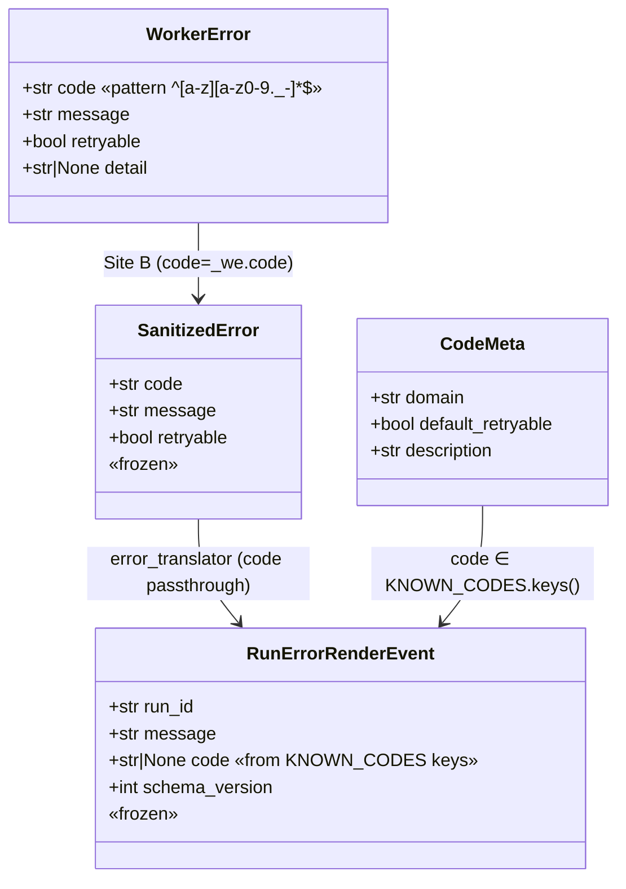
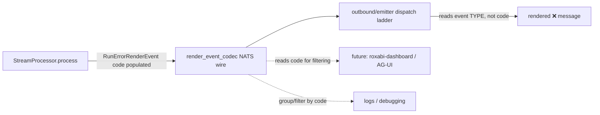

## Context

Source: [frame](../frames/1113-render-events-code-taxonomy-frame.mdx) (analysis skipped — F-lite).

`RunErrorRenderEvent.code: str | None = None` (`src/lyra/core/messaging/render_events.py:154`)
is always emitted as `None`. The field was added in Slice 1 of #1096 with a docstring note
deferring the taxonomy to "future" work.

**Investigation overturned the issue's stale action plan.** The issue body (line refs already
drifted: it cites `:381,402`; the real emit site is now `stream_processor.py:224`) proposed
*inventing* a new enum (`timeout`, `agent_crash`, `llm_failure`, …) under `core/messaging`.
Reading the code shows a canonical taxonomy **already exists**:

- `roxabi_contracts.errors.KNOWN_CODES` — a registry of 26 dotted codes across 7 domains
  (`transport`, `pool`, `worker`, `cli`, `llm`, `voice`, `image`), defined in ADR-066, with
  `CodeMeta` (domain, default_retryable, description).
- It is the single source of truth: `error-codes.md` is auto-generated from it and the
  `codes-sync` pre-commit hook + CI enforce the doc stays in sync.
- Both `RunErrorRenderEvent` emit paths **already carry a code** they then throw away:
  - **Site A — infra exception** (`stream_processor.py:254`): `SanitizedError(code="stream.error", …)`.
  - **Site B — soft error** (`stream_processor.py:281`): `SanitizedError(code=_we.code, …)` where
    `_we` is a `WorkerError` whose `code` is registry-valid; or `SanitizedError.from_message()`
    which defaults `code="stream.error"`.
  - The translator lambda (`stream_processor.py:224`) then builds
    `RunErrorRenderEvent(run_id=run_id, message=err.message, code=None)` — **discarding `err.code`.**

**This resolves the issue's open design fork decisively:** the taxonomy lives in
`roxabi_contracts.errors` (reuse `KNOWN_CODES`). Minting a parallel enum under `core/messaging`
would duplicate the registry and split the source of truth — rejected.

The fix is therefore far smaller and lower-risk than the issue assumed: stop discarding the
code that already flows, and close the one taxonomy gap (`stream.error` is emitted but
unregistered).

## Goal

Populate `RunErrorRenderEvent.code` at every emit site with a value from the canonical
`KNOWN_CODES` registry, so the field stops lying and infra-run-error events are filterable by code.

## Users

- **Primary:** operators/developers reading logs & debugging run failures — gain a categorized
  `code` for filtering/triage today, no UI required.
- **Secondary (out of scope to build):** future observability consumers (roxabi-dashboard,
  AG-UI HTTP/SSE adapter, structured-error filtering) — inherit historically-tagged data with
  zero backfill. The wire field must be accessible to them; this issue only populates it.

## Expected Behavior

Narrative walkthrough of `StreamProcessor.process()`:

1. A run begins → `RunStartedRenderEvent`.
2. **Infra exception** escapes the inner loop → `_emitter.emit_terminal(SanitizedError(code="stream.error", …))`.
   The translator now emits `RunErrorRenderEvent(code="stream.error")` (was `code=None`).
3. **Soft error** (`ResultLlmEvent.is_error=True`):
   - With a `WorkerError` → `SanitizedError(code=_we.code)` → `RunErrorRenderEvent(code=_we.code)`
     (e.g. `cli.auth`, `llm.rate_limit`, `worker.crash`).
   - Without one → `SanitizedError.from_message()` defaults to `code="stream.error"` →
     `RunErrorRenderEvent(code="stream.error")`.
4. The event is encoded by `render_event_codec` onto the NATS bus (std codec already serializes
   all dataclass fields → `code` round-trips with no codec change), and the outbound dispatch
   ladder still flags the turn with an `❌` prefix (behavior unchanged; it reads the event type,
   not `code`).

Invariants preserved:
- `message` remains `type(exc).__name__` / curated text — **never** `str(exc)` (NATS-bus safety).
- `SCHEMA_VERSION_RUN_ERROR_RENDER_EVENT` stays `1` — populating an existing optional field is
  forward-compatible; consumers that ignore `code` are unaffected.
- `code: str | None` keeps the `| None` arm: historical/in-flight events decode with `code=None`,
  and `None` remains the explicit "pre-taxonomy / unknown" sentinel. The field is *always*
  populated going forward, but the type is not tightened (avoids breaking decode of older events).

## Data Model & Consumers

### Data structure

### Consumer map

Solid = this issue. Dashed = future consumers (out of scope; field must be accessible).

### Consumer summary

| Consumer | Fields consumed | When | Status |
|---|---|---|---|
| `outbound/emitter.py` dispatch ladder | event type (isinstance) | per terminal event | existing — unchanged |
| `render_event_codec` (NATS) | pass-through serialise/deserialise of all fields (not a semantic `code` consumer) | encode/decode on bus | existing — `code` now non-None on wire, no codec edit |
| logs / debugging | `code` | on error | **this issue** |
| roxabi-dashboard / AG-UI adapter | `code` | future | future (out of scope) |

## Breadboard

Backend-only change; affordances are code seams, not UI.

| ID | Affordance (seam) | Handler | Data |
|----|-------------------|---------|------|
| N1 | `KNOWN_CODES` registry entry `stream.error` | `roxabi_contracts/errors.py` | `CodeMeta(domain="stream", default_retryable=False, description=…)` |
| N2 | `error-codes.md` regeneration | `check_codes_sync.py --write` (codes-sync hook) | generated doc + new `## stream.*` section |
| N3 | `error_translator` lambda | `stream_processor.py:224` | `RunErrorRenderEvent(run_id=run_id, message=err.message, code=err.code)`; add a brief comment at the `SanitizedError.from_message` default (`_result.py:42`) noting `stream.error` is its registry-valid fallback |
| N4 | `RunErrorRenderEvent` docstring + `messaging.md` note | `render_events.py:172-178`; `docs/architecture/messaging.md` (NATS codec / Registered event families) | replace "future taxonomy" note with KNOWN_CODES reference; add one sentence that `run_error` events carry a populated `code` from `KNOWN_CODES` |
| N5 | registry-membership test | `tests/.../test_render_events*` | assert emitted codes ⊆ `KNOWN_CODES` |
| N6 | codec round-trip test | `tests/.../test_render_event_codec*` | encode→decode preserves a non-`None` `code`, and a historical `code=None` event decodes without error (forward-compat) |

Wiring: N1→N2 (registry drives doc) · N3 consumes N1 codes · N4 documents N3 · N5 guards N1+N3 · N6 guards wire forward-compat.

## Slices

| # | Slice | Affordances | Demo |
|---|-------|-------------|------|
| S1 | Register `stream.error` + regenerate doc + update docstring & messaging.md | N1, N2, N4 | `codes-sync` passes; `error-codes.md` shows `## stream.*`; docstring + messaging.md reference registry |
| S2 | Propagate `err.code` through translator + tests (both paths + codec) | N3, N5, N6 | infra-exception → `code="stream.error"`; soft-error+WorkerError → `code=_we.code`; all emitted codes ∈ KNOWN_CODES; codec round-trips non-None and None code |

S1 before S2: the translator (S2) emits `stream.error`, which must be a registered code first (S1).

## Success Criteria

- [ ] `error_translator` in `stream_processor.py` builds `RunErrorRenderEvent(code=err.code)`; no `code=None` literal remains at the emit site.
- [ ] `stream.error` is registered in `KNOWN_CODES` with a `CodeMeta`; `error-codes.md` is regenerated and the `codes-sync` hook/CI passes.
- [ ] Infra-exception path (Site A) emits `RunErrorRenderEvent.code == "stream.error"` (asserted by test).
- [ ] Soft-error path with a `WorkerError` (Site B) emits `code == worker_error.code` for a representative code (asserted by test).
- [ ] Soft-error path without a `WorkerError` (`from_message`) emits `code == "stream.error"` (asserted by test).
- [ ] A test asserts every code `RunErrorRenderEvent` can emit is a key in `KNOWN_CODES`.
- [ ] `RunErrorRenderEvent` docstring no longer says `code` is "reserved for a future taxonomy" (references `KNOWN_CODES` instead), and `docs/architecture/messaging.md` notes `run_error` events carry a populated `code` from `KNOWN_CODES`.
- [ ] NATS `render_event_codec` round-trips both a non-`None` `code` (unchanged) and a historical `code=None` event (decodes without error) — asserted by test.

## Out of Scope

- Building any consumer of `code` (dashboard, AG-UI, error-filtering UI).
- Tightening `code: str | None` → `str` or a `Literal`/enum — would duplicate the `KNOWN_CODES` SSoT and break decode of historical `None`-coded events.
- Reworking error propagation/classification logic — only categorize what is already raised.
- Bumping `SCHEMA_VERSION_RUN_ERROR_RENDER_EVENT` — not required (forward-compatible).
