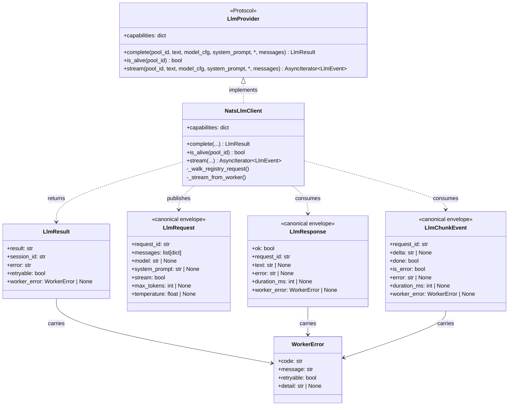
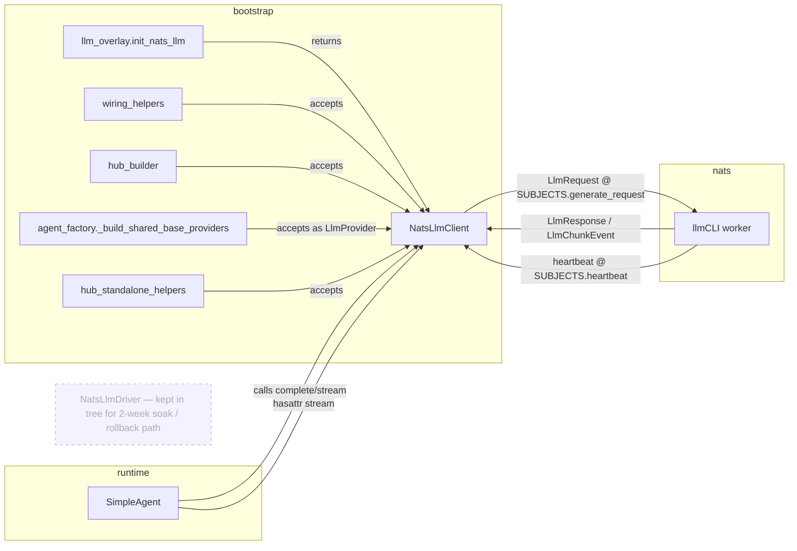

## Context

Promoted from `artifacts/frames/1119-nats-llm-client-conformance-frame.mdx` (frame approved 2026-05-14). Parent issue #1104 / PR #1121 canonicalized the LLM NATS wire (subjects, ACL). This issue finishes the originally-intended swap: make `NatsLlmClient` a true `LlmProvider` so the hub bootstrap can drop `NatsLlmDriver`.

Three additional grounded findings discovered while drafting:

1. The **real** `LlmProvider.complete` signature has no `on_intermediate` parameter (issue body §1 was outdated). Source: `src/lyra/core/ports/llm.py:45-54`.
2. `LlmResult` carries a structured `worker_error: WorkerError | None` field (ADR-066 / #1016). `NatsLlmDriver` populates it for every error path; the new `complete()` / `stream()` must do the same, using canonical codes from `roxabi_contracts.errors.KNOWN_CODES` (no ad-hoc strings).
3. **Frame inversion** — canonical `LlmChunkEvent` carries `delta` only — **no tool-use frames**. The frame's constraint "`stream()` must cover `ToolUseLlmEvent`" (frame §Constraints) is **structurally impossible** over the canonical wire and is reversed here. This issue accepts the parity gap; extending the canonical contract is a separate concern (see Out of Scope). Acceptance was implicit in the spec's pre-draft analysis; the inversion is named here so it cannot be missed at planning handoff.

## Goal

Make `NatsLlmClient` satisfy the `LlmProvider` protocol such that pyright is clean at `agent_factory.py:_build_shared_base_providers`, swap it in for `NatsLlmDriver` in `init_nats_llm`, and verify the hub starts cleanly under all 3 bootstrap modes.

## Users

- **Primary:** hub bootstrap path — `bootstrap/factory/llm_overlay.py:init_nats_llm` plus 4 wiring sites that thread the driver through (`wiring_helpers.py`, `hub_builder.py`, `agent_factory.py`, `bootstrap/standalone/hub_standalone_helpers.py`).
- **Secondary:** any contributor reading `NatsLlmClient` and trusting the "drop-in replacement" docstring; the M₁ production hub at runtime.

## Expected Behavior

After this issue ships:

1. Pyright passes against the `LlmProvider` protocol when `NatsLlmClient` is passed to `_build_shared_base_providers`. `from typing import runtime_checkable; isinstance(client, LlmProvider)` returns True.
2. `init_nats_llm` returns `NatsLlmClient | None` (was: `NatsLlmDriver | None`). When `NATS_URL` is unset or `nc` is None, returns None — unchanged behaviour.
3. `client.complete(pool_id, text, model_cfg, system_prompt, *, messages)`:
   - Folds `text` as the final user message in the publish payload. Concrete rule: if `messages` is None or empty, send `[{"role": "user", "content": text}]`; if non-empty and the last message's `content` already equals `text`, pass `messages` through unchanged; otherwise append `{"role": "user", "content": text}` to a copy of `messages`.
   - Ignores `pool_id` (canonical wire is queue-group dispatched; per-worker routing was dropped in #1104).
   - Maps `ModelConfig.model` → `LlmRequest.model`, `ModelConfig.max_tokens` → `LlmRequest.max_tokens`, `ModelConfig.temperature` → `LlmRequest.temperature` when those attributes exist on `ModelConfig`.
   - Returns `LlmResult(result=text, session_id=trace_id, error="", retryable=True)` on success. `trace_id` is the value generated for the outbound `LlmRequest.trace_id` and held locally by the call site (the canonical `LlmResponse` envelope does not echo `trace_id`).
   - Returns `LlmResult(error=msg, retryable=…, worker_error=WorkerError(code, message, retryable))` on failure. `code` from canonical registry; mapping table below.
   - **Rollback** (for the 2-week soak): revert `init_nats_llm` to instantiate `NatsLlmDriver` (still in tree); no other file change required. `nats_llm_driver` parameter name is preserved in all wiring sites precisely to keep this revert one-file-wide.
4. `client.is_alive(pool_id)` — ignores `pool_id` (same as `NatsLlmDriver`); returns `nc.is_connected and registry.any_alive()`.
5. `client.stream(pool_id, text, model_cfg, system_prompt, *, messages)` yields `AsyncIterator[LlmEvent]`:
   - `TextLlmEvent(text=delta)` per non-empty `chunk.delta`.
   - Final `ResultLlmEvent(is_error=False, duration_ms=chunk.duration_ms or 0, cost_usd=None)` on `chunk.done=True`.
   - On error chunk or transport failure: terminal `ResultLlmEvent(is_error=True, duration_ms=…, error_text=msg, worker_error=WorkerError(...), cost_usd=None)`.
   - Does **not** emit `ToolUseLlmEvent` — canonical envelope doesn't carry tool frames (out of scope).
6. `capabilities = {"streaming": True, "auth": "nats"}` — declared as class attribute.
7. Hub starts cleanly under `lyra start` (unified), `lyra hub` (hub-standalone), and `lyra adapter telegram` (adapter-standalone) with `NATS_URL` set.
8. M₁ E2E smoke test passes: `HarnessCLI → hub → llmCLI worker → LiteLLM → llama-server`.

### Error-code mapping (`LlmUnavailableError` → canonical `WorkerError`)

| Trigger in `NatsLlmClient` | `WorkerError.code` | `retryable` | Notes |
|---|---|---|---|
| `nc.request(...)` `TimeoutError` (no reply within `_timeout`) | `transport.timeout` | True | matches registry default |
| `NoRespondersError` / all workers exhausted | `transport.no_responders` | True | matches `NatsLlmDriver` precedent (`drivers/nats_driver.py:181-198`); reaching a worker failed at the transport layer |
| `LlmResponse`/`LlmChunkEvent` schema validation fails | `transport.parse` | False | matches registry default |
| `CONTRACT_VERSION` mismatch (future) | `transport.contract_mismatch` | False | matches registry default |
| Circuit breaker open (client-side back-pressure) | `worker.capacity` | True | local protection against overload; `worker.busy` would imply a worker-side concurrency limit that the client did not observe |
| Payload `> max_payload` | `transport.error` | **False (overrides registry default `True`)** | the payload will never succeed on retry without caller change; matches `NatsLlmDriver._raise_nats_failure` behaviour |
| Worker reply with `worker_error` populated | propagate `chunk.worker_error` / `resp.worker_error` verbatim | from envelope | trust the worker's classification |
| Worker reply with `error` only (legacy, no `worker_error`) | `worker.internal` | True | matches registry default |

## Data Model & Consumers

### Core types

### Consumer map

### Consumer summary

| Consumer | Fields consumed | When | Status |
|---|---|---|---|
| `init_nats_llm` | constructor `(nc, timeout)` + `await start()` | bootstrap | this issue |
| `_build_shared_base_providers` | `LlmProvider` protocol shape | bootstrap, pyright check | this issue |
| `SimpleAgent.complete` / `.stream` | `complete()`, `stream()`, `is_alive()` | per-message runtime | this issue |
| `hub_builder.build_hub` | passes client through to agents | bootstrap | this issue |
| `hub_standalone_helpers` | passes client through to standalone hub | bootstrap | this issue |
| 2-week prod soak on M₁ | full runtime path | post-deploy | this issue (acceptance gate for scope #3) |
| `NatsLlmDriver` deletion + param rename | code removal | after soak | **deferred — separate PR** |

## Breadboard

### Affordances

| ID | Affordance | Handler | Data |
|---|---|---|---|
| C1 | `capabilities` class attribute | `NatsLlmClient.capabilities` | `{"streaming": True, "auth": "nats"}` |
| C2 | `complete(pool_id, text, model_cfg, system_prompt, *, messages) -> LlmResult` | `NatsLlmClient.complete` | publishes `LlmRequest(stream=False)`, awaits `LlmResponse` |
| C3 | `is_alive(pool_id) -> bool` | `NatsLlmClient.is_alive` | delegates to existing `_registry.any_alive()` + `nc.is_connected` |
| C4 | `stream(pool_id, text, model_cfg, system_prompt, *, messages) -> AsyncIterator[LlmEvent]` | `NatsLlmClient.stream` | publishes `LlmRequest(stream=True)`, iterates `LlmChunkEvent` chunks, emits `TextLlmEvent` + terminal `ResultLlmEvent` |
| W1 | `init_nats_llm` returns `NatsLlmClient \| None` | `bootstrap/factory/llm_overlay.py` | instantiates `NatsLlmClient`, calls `await client.start()` |
| W2 | wiring sites accept `NatsLlmClient` type | `wiring_helpers.py`, `hub_builder.py`, `agent_factory.py`, `bootstrap/standalone/hub_standalone_helpers.py` | type annotation update; **parameter name `nats_llm_driver` unchanged** (rename deferred) |
| E1 | error envelope mapping per the table above | `_walk_registry_request` / `_stream_from_worker` | builds `WorkerError(code, message, retryable)`, attaches to `LlmResult` / `ResultLlmEvent` |
| T1 | unit tests covering protocol shape + error mapping + stream events | `tests/llm/` (new file: `test_nats_llm_client_provider.py`) | includes (a) `isinstance(client, LlmProvider)` assertion, (b) `complete()` and `stream()` invocations against a mock `nc`, (c) one test per error-mapping row in the §Error-code mapping table, (d) `TextLlmEvent` + `ResultLlmEvent(is_error=False)` + `ResultLlmEvent(is_error=True)` paths |
| T2 | scripted E2E smoke verifier | `tools/smoke_llm_e2e.sh` (new) | publishes a minimal `LlmRequest` to `SUBJECTS.generate_request`, waits for `LlmResponse`, exits 0 on success / 1 on failure. Referenced from `docs/ops/deploy-smoke-canary.md`. Run on M₁ before merge; used as the soak-gate check before scope #3. |
| T3 | local mode-boot verification | three local `lyra start` / `lyra hub` / `lyra adapter telegram` runs against a local NATS broker | wiring acceptance only — does not exercise an llm-worker; confirms each entry point's pyright + import + lifecycle path |

### Wiring

`SimpleAgent` (`hasattr(provider, "stream")`) → `NatsLlmClient.stream` → ephemeral inbox subscribe → `_nc.publish(SUBJECTS.generate_request, LlmRequest.model_dump_json(), reply=inbox)` → consume `LlmChunkEvent` until `chunk.done` → yield `LlmEvent` to caller.

`bootstrap` → `init_nats_llm(nc)` → `NatsLlmClient(nc).start()` → returned to caller → registered as `"nats"` backend in `ProviderRegistry`.

## Slices

| # | Slice | Affordances | Demo |
|---|---|---|---|
| 1 | **Protocol conformance** — add `capabilities`, refactor `generate→complete` to return `LlmResult`, add `is_alive(pool_id)`, refactor `stream` to yield `LlmEvent` union. Keep all existing wiring untouched. **Pyright must remain clean across the repo at the end of this slice** (intermediate state is the merge-gate, since CI runs pyright per slice if PRs are split). | C1, C2, C3, C4 | `isinstance(NatsLlmClient(nc), LlmProvider)` returns True; pyright clean on a standalone fixture; `uv run pytest tests/llm/` green |
| 2 | **Error envelope** — populate `LlmResult.worker_error` / `ResultLlmEvent.worker_error` per the mapping table. Propagate `worker_error` field verbatim from `LlmChunkEvent` / `LlmResponse` when present. Pyright remains clean. | E1 | unit tests cover all 8 mapping rows |
| 3 | **Bootstrap migration + local mode-boot** — switch `init_nats_llm` to return `NatsLlmClient \| None` and the 4 wiring sites to accept the new type. Keep parameter name `nats_llm_driver`. Verify `lyra start`, `lyra hub`, `lyra adapter telegram` all boot against a **local** NATS broker. | W1, W2, T3 | pyright clean repo-wide; all 3 entry points reach steady state (lifecycle event published) without exception |
| 4 | **Scripted M₁ smoke + soak gate** — author `tools/smoke_llm_e2e.sh`; run it on M₁ with a real llm-worker behind LiteLLM/llama-server; capture log + ACL-violation grep in PR body. | T1, T2 | `tools/smoke_llm_e2e.sh` exits 0 on M₁; NATS server log for the smoke window contains zero `Permissions Violation` lines |

**Scope #3 (`NatsLlmDriver` deletion + parameter rename)** is explicitly deferred to a separate PR after a ≥2-week prod soak on M₁ — it is **not** part of this issue's slices.

## Success Criteria

- [ ] `NatsLlmClient` declares `capabilities: dict[str, Any] = {"streaming": True, "auth": "nats"}` as a class attribute.
- [ ] `NatsLlmClient.complete(pool_id, text, model_cfg, system_prompt, *, messages)` exists and returns `LlmResult` matching the protocol signature.
- [ ] `NatsLlmClient.is_alive(pool_id)` exists, ignores `pool_id`, returns `bool`.
- [ ] `NatsLlmClient.stream(pool_id, text, model_cfg, system_prompt, *, messages)` yields `AsyncIterator[LlmEvent]` and emits at least `TextLlmEvent` + terminal `ResultLlmEvent`.
- [ ] `isinstance(client, LlmProvider)` returns True (using `@runtime_checkable`).
- [ ] Pyright passes against the protocol at `agent_factory.py:_build_shared_base_providers` with no `# type: ignore`.
- [ ] Every error path populates `LlmResult.worker_error` (or `ResultLlmEvent.worker_error`) with a `WorkerError` whose `code` is in `roxabi_contracts.errors.KNOWN_CODES`.
- [ ] `init_nats_llm` returns `NatsLlmClient | None` (annotation + runtime).
- [ ] All 4 wiring sites compile and pyright cleanly with the new type; parameter name `nats_llm_driver` unchanged.
- [ ] `lyra start` reaches steady state against a local NATS broker (no uncaught exception in lifecycle, startup-notify event published).
- [ ] `lyra hub` reaches steady state under the same conditions.
- [ ] `lyra adapter telegram` reaches steady state under the same conditions.
- [ ] `tests/llm/test_nats_llm_client_provider.py` exists and contains: (a) one passing test for each of the 8 error-mapping rows; (b) one passing test for each of `TextLlmEvent`, `ResultLlmEvent(is_error=False)`, `ResultLlmEvent(is_error=True)` paths; (c) one passing `isinstance(client, LlmProvider)` assertion; (d) `complete()` and `stream()` are invoked against a mock `nc` (not just protocol-shape checks).
- [ ] `uv run pytest` passes repo-wide.
- [ ] `tools/smoke_llm_e2e.sh` exists, is referenced from `docs/ops/deploy-smoke-canary.md`, and exits 0 when run on M₁ against the live `HarnessCLI → hub → llmCLI worker → LiteLLM → llama-server` path.
- [ ] NATS server log on M₁ during the smoke window contains zero `Permissions Violation` lines (verifies #1144/#1148/#1186 ACL surface against the canonical `_inbox.hub.*` reply pattern).
- [ ] `NatsLlmDriver` source file remains in tree (deletion is scope #3, deferred PR).

## Out of Scope

- `NatsLlmDriver` deletion and parameter rename (`nats_llm_driver` → `nats_llm_client`) — separate PR after ≥2-week prod soak.
- Per-worker score-routed publishing — separate issue.
- Extending `LlmChunkEvent` to carry tool-use frames — would unblock `ToolUseLlmEvent` over the canonical wire; not required for the canonical-only swap.
- ADR-045 `roxabi-nats` SDK extraction.
- Render-events triplet work (#1180 Reasoning, #1173 Text v2) — that's the render layer, not the driver layer.
