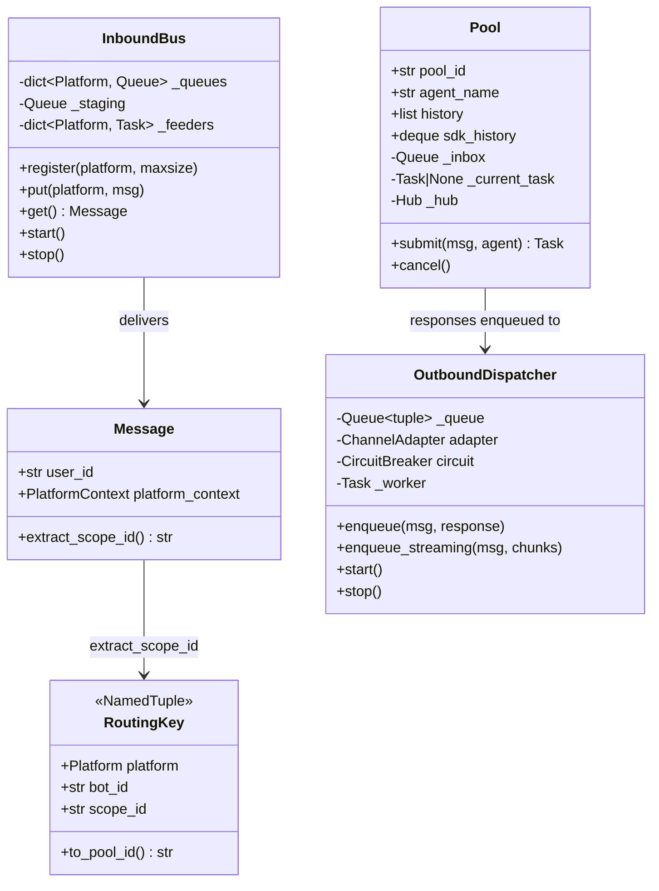
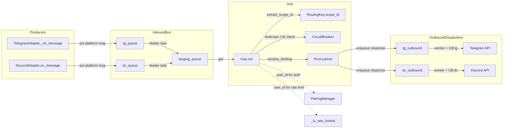

## Context

Promoted from [analysis](../analyses/112-conversation-scoped-sessions-analysis.mdx). Recommended shape: **Shape 2 (phased delivery)** — 3 sequential PRs delivering scope_id routing, per-channel queues, and per-session Task independently.

Dependency: #103 (unified pairing) is merged. This issue blocks #123, #83, #67.

## Goal

Enable parallel, isolated conversations per chat/thread by replacing user-scoped pool routing with conversation-scoped routing, splitting the shared bus into per-channel inbound/outbound queues, and replacing the per-pool lock with a per-session asyncio.Task.

## Users

- **Primary:** End users interacting with the bot across multiple Telegram chats/groups and Discord channels/threads
- **Secondary:** The system itself — platform isolation prevents cascading failures

## Expected Behavior

**Before:** Alice messages Lyra in a Telegram DM and a Telegram group. Both messages hit the same pool (`telegram:main:tg:user:123`), share the same history, and are serialized by a single lock. If Telegram API slows, Discord responses are blocked too.

**After:** Alice's DM routes to pool `telegram:main:chat:555` and the group routes to `telegram:main:chat:888`. Each has its own history and processes independently. Telegram API slowness only affects Telegram outbound — Discord responses flow unimpeded. If a turn takes too long, `/stop` cancels it without freezing other conversations.

### Scope extraction rules

| Platform | Context | Scope ID |
|----------|---------|----------|
| Telegram DM | `TelegramContext.chat_id` | `chat:{chat_id}` |
| Telegram group | `TelegramContext.chat_id` | `chat:{chat_id}` |
| Telegram forum | `TelegramContext.chat_id` + `topic_id` | `chat:{chat_id}:topic:{topic_id}` |
| Discord thread | `DiscordContext.thread_id` | `thread:{thread_id}` |
| Discord channel | `DiscordContext.channel_id` | `channel:{channel_id}` |

### Rate limiting

Rate limiting remains keyed by `msg.user_id` (per-person, not per-conversation). A user flooding one chat still gets rate-limited across all their chats.

### Key design decisions

- **Pool task lifecycle:** Processing task exits when inbox drains to zero. Next `submit()` creates a new task. `_current_task` is set to `None` on natural exit. This avoids unbounded idle tasks.
- **Hub reference on Pool:** `hub` is passed at `Pool` construction time (not per-call). Circular reference `Pool↔Hub` is accepted — test with hub stub/mock. `Pool` is no longer a plain dataclass.
- **Anthropic CB check:** Stays in `Hub.run()` before `Pool.submit()`, same pre-check pattern as today. The CB is not moved into the processing loop.
- **`register_binding` pool_id collision guard:** Applies only to explicit bindings. Wildcard-derived pools bypass it by design (they are synthesized at runtime from scope_id).

## Data Model & Consumers

### Data structures

### Consumer map

### Consumer summary

| Consumer | Fields consumed | When | Status |
|----------|----------------|------|--------|
| `Hub.run` routing | `RoutingKey.scope_id` | Every inbound message | This issue |
| `Hub.run` Anthropic CB | `CircuitBreaker.is_open()` | Before `Pool.submit()` | This issue (location unchanged) |
| `Hub._is_rate_limited` | `msg.user_id` directly | Every inbound message | This issue (key type change) |
| `PairingManager.is_paired` | `msg.user_id` | Pairing gate | Unchanged |
| `Pool.submit` | `pool_id` (from scope_id) | Per-turn processing | This issue |
| `OutboundDispatcher` | `(msg, response)` tuple | Per outbound delivery | This issue |
| `InboundBus._feeders` | Per-platform `Queue.get()` | Continuous | This issue |
| Health endpoint | Per-platform queue depths | On `/health` request | This issue |
| Turn logging | `pool_id`, `scope_id` | Future (#67) | Out of scope |
| Memory layer | `Pool.history`, `Pool.sdk_history` | Future (#83) | Out of scope |

## Breadboard

### Sub-system 1: scope_id routing

| ID | Affordance | Handler | Data |
|----|-----------|---------|------|
| S1-1 | Message arrives with `platform_context` | `Message.extract_scope_id()` | Reads `TelegramContext.chat_id`/`topic_id` or `DiscordContext.thread_id`/`channel_id` |
| S1-2 | RoutingKey constructed with scope_id | `Hub.run()`: `key = RoutingKey(msg.platform, msg.bot_id, msg.extract_scope_id())` | `RoutingKey.scope_id` replaces `.user_id` |
| S1-3 | Wildcard binding resolves per-scope | `Hub.resolve_binding()` | Synthesizes `pool_id` from scope_id via `RoutingKey.to_pool_id()` |
| S1-4 | Rate limiting stays user-scoped | `Hub._is_rate_limited()` | Keys on `(msg.platform, msg.bot_id, msg.user_id)` tuple, not RoutingKey |
| S1-5 | Pairing gate unchanged | `PairingManager.is_paired(msg.user_id)` | Uses `msg.user_id` directly |
| S1-6 | ADR-001 and ADR-005 updated | Documentation | Pool ID format and field name references updated to `scope_id` |

### Sub-system 2: InboundBus

| ID | Affordance | Handler | Data |
|----|-----------|---------|------|
| S2-1 | Per-platform queue registration | `InboundBus.register(platform, maxsize)` | Creates `asyncio.Queue(maxsize)` per platform |
| S2-2 | Adapter enqueues to own platform queue | `InboundBus.put(platform, msg)` | Routes to `_queues[platform]` |
| S2-3 | Feeder tasks pull from platform queues | `InboundBus.start()` → per-platform `asyncio.Task` | Each feeder: `await _queues[p].get()` → `_staging.put()` |
| S2-4 | Hub consumes from staging queue | `InboundBus.get()` → `await _staging.get()` | Single-consumer loop unchanged |
| S2-5 | Backpressure per platform | `QueueFull` on `_queues[platform]` | Adapter catches `QueueFull`, sends ack reply ("Processing your request...") to user, message dropped. Same behavior as current single-queue `QueueFull` handling. |
| S2-6 | Health endpoint queue metrics | `create_health_app()` | Reports per-platform dict: `{"inbound": {"telegram": N, "discord": N}, "outbound": {"telegram": N, "discord": N}}` |

### Sub-system 3: OutboundDispatcher

| ID | Affordance | Handler | Data |
|----|-----------|---------|------|
| S3-1 | Per-platform outbound queue | `OutboundDispatcher.__init__(adapter, circuit)` | `asyncio.Queue` for `(msg, response)` tuples |
| S3-2 | Hub enqueues response | `OutboundDispatcher.enqueue(msg, response)` | Put on outbound queue |
| S3-3 | Worker task consumes and delivers | `OutboundDispatcher._worker_loop()` | Calls `adapter.send()`, records CB success/failure |
| S3-4 | Streaming outbound | `OutboundDispatcher.enqueue_streaming(msg, chunks)` | Calls `adapter.send_streaming()` from worker |
| S3-5 | Circuit breaker on dispatcher | `OutboundDispatcher._worker_loop()` checks `circuit.is_open()` | On open circuit: drop message + log warning (same behavior as current adapter CB check). CB checks **removed** from `adapter.send()`/`adapter.send_streaming()` — dispatcher is single owner. |

### Sub-system 4: Per-session Task

| ID | Affordance | Handler | Data |
|----|-----------|---------|------|
| S4-1 | Pool gains inbox queue + hub ref | `Pool.__init__(pool_id, agent_name, hub)` | `_inbox: asyncio.Queue`, `_current_task: Task | None`, `_hub: Hub` |
| S4-2 | Hub submits message to pool | `Pool.submit(msg, agent)` | Puts `msg` on `_inbox`; creates processing task if `_current_task is None` |
| S4-3 | Processing task consumes inbox sequentially | `Pool._process_loop()` | `await _inbox.get()` → `agent.process()` → `hub.enqueue_outbound()`. History updated only on successful completion. |
| S4-4 | Per-turn timeout | `asyncio.wait_for(agent.process(...), timeout=turn_timeout)` | Configurable timeout (default: 60s). On `TimeoutError`: send timeout reply via `MessageManager.get("timeout")`, fall back to "generic" if key missing. Partial turn NOT appended to history. |
| S4-5 | `/stop` cancels current task | `Pool.cancel()` | Cancels `_current_task`. Send cancellation reply via `MessageManager.get("cancelled")`, fall back to "generic". Processing loop restarts on next `submit()`. |
| S4-6 | Task exits on idle | `Pool._process_loop()` | When `_inbox` drains to zero (no messages for ~1s or immediate), task returns naturally. `_current_task` set to `None`. Next `submit()` creates a new task. |
| S4-7 | Unhandled exception in process loop | `Pool._process_loop()` except clause | On unexpected exception: log error, send error reply via `MessageManager.get("generic")`, record hub CB failure. Do NOT append to history. Continue processing next message in inbox. |

### Sub-system 5: Discord thread auto-creation

| ID | Affordance | Handler | Data |
|----|-----------|---------|------|
| S5-1 | @mention in channel (not thread) detected | `DiscordAdapter.on_message()` | `is_mention=True` and `channel_type="text"` |
| S5-2 | Thread created from mention message | `message.create_thread(name=...)` | Returns `Thread` with `thread.id` |
| S5-3 | Scope set to new thread | scope_id = `thread:{thread.id}` | New pool created for thread |
| S5-4 | Response sent in thread | `thread.send(response)` | Subsequent messages in thread route to same pool |
| S5-5 | Config toggle controls auto-thread | `discord.auto_thread` in `lyra.toml` | `[NEEDS CLARIFICATION]` Default value TBD (opt-in `false` vs default-on `true`). Feature gated behind this config key regardless. |

## Slices

| Slice | Sub-systems | Demo | Independently shippable |
|-------|-------------|------|------------------------|
| **1. scope_id routing** | S1 | Same user sends messages in two different Telegram chats → two independent pools with separate histories | Yes (PR A). Delivers outcome 1. Unblocks #123. |
| **2. Per-channel queues** | S2 + S3 | Telegram adapter floods → only tg_inbound fills. Discord inbound unaffected. Telegram API 429 → only tg_outbound blocks. Discord responses flow. | Yes (PR B). Delivers outcomes 2-3. Escalation: if `hub.run()` restructuring overlaps heavily with PR A, collapse into one PR. |
| **3. Per-session Task + threads** | S4 + S5 | `/stop` cancels current turn. A 60s timeout fires on stuck LLM call. @mention in Discord channel creates thread (when `auto_thread=true`). | Yes (PR C). Delivers outcomes 4-5. |

## Success Criteria

### Slice 1: scope_id routing
- [ ] `RoutingKey` uses `scope_id` field instead of `user_id`
- [ ] `Message.extract_scope_id()` returns correct scope for all 5 platform contexts (TG DM, TG group, TG forum, DC thread, DC channel)
- [ ] `to_pool_id()` format is `{platform}:{bot_id}:{scope_id}`
- [ ] `resolve_binding()` wildcard path synthesizes pool_id from `scope_id`, not `user_id`
- [ ] Same user in two different Telegram chats gets two separate pools with independent histories
- [ ] Rate limiting keys on `(platform, bot_id, user_id)` tuple, not RoutingKey
- [ ] User cannot bypass rate limit by switching chats (RATE_LIMIT+1 messages across scopes within window → last message dropped)
- [ ] `_rate_timestamps` type annotation updated from `dict[RoutingKey, ...]` to user-keyed type
- [ ] Pairing gate still uses `msg.user_id` for `is_paired()` check
- [ ] ADR-001 and ADR-005 updated to reflect `scope_id` rename
- [ ] All existing tests pass (updated fixtures)

### Slice 2: Per-channel queues
- [ ] `InboundBus` registers one `asyncio.Queue` per platform
- [ ] Adapters call `inbound_bus.put(platform, msg)` instead of `hub.bus.put_nowait(msg)`
- [ ] Feeder tasks run as independent `asyncio.Task`s (one per platform)
- [ ] Hub.run() consumes from `InboundBus.get()` (staging queue)
- [ ] Flooding one platform queue does not affect the other platform's inbound capacity
- [ ] Per-platform `QueueFull` sends ack reply to user and drops message (same as current behavior)
- [ ] `OutboundDispatcher` runs as independent `asyncio.Task` per platform
- [ ] Hub enqueues to outbound dispatcher instead of calling `adapter.send()` inline
- [ ] `OutboundDispatcher._worker_loop()` checks circuit breaker; on open circuit, drops message + logs warning
- [ ] `adapter.send()` and `adapter.send_streaming()` no longer contain circuit breaker checks (CB owned solely by dispatcher)
- [ ] `/health` endpoint reports per-platform queue depths: `{"inbound": {"telegram": N, "discord": N}, "outbound": {"telegram": N, "discord": N}}`
- [ ] Anthropic circuit breaker check remains in `Hub.run()` before `Pool.submit()` (unchanged location)

### Slice 3: Per-session Task + Discord threads
- [ ] `Pool` constructed with `hub` reference; uses `_inbox` queue + `_current_task` instead of `asyncio.Lock`
- [ ] Messages within a scope are processed sequentially (history consistency preserved)
- [ ] Processing task exits when inbox drains; `_current_task` set to `None`; next `submit()` creates new task
- [ ] Per-turn timeout fires after configurable duration (default: 60s)
- [ ] Timeout reply uses `MessageManager.get("timeout")` (falls back to "generic")
- [ ] `/stop` command cancels the current scope's processing task
- [ ] Cancellation reply uses `MessageManager.get("cancelled")` (falls back to "generic")
- [ ] Timed-out or cancelled turn does NOT append partial data to `Pool.history` or `Pool.sdk_history`
- [ ] Unhandled exception in processing loop: logs error, sends "generic" reply, does NOT crash the pool task
- [ ] `Pool.cancel()` is safe when `_current_task is None` (no-op)
- [ ] Discord: when `discord.auto_thread` config is `true`, @mention in channel (not thread) creates a new thread `[NEEDS CLARIFICATION: default value]`
- [ ] Discord: subsequent messages in created thread route to same pool
- [ ] No regression on existing tests
