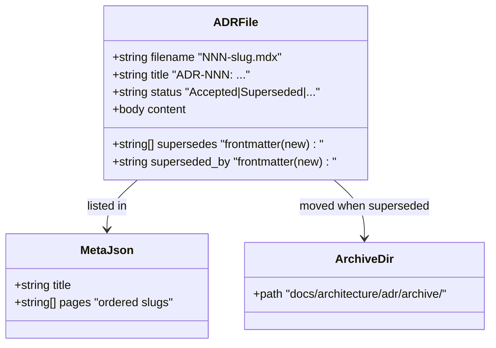
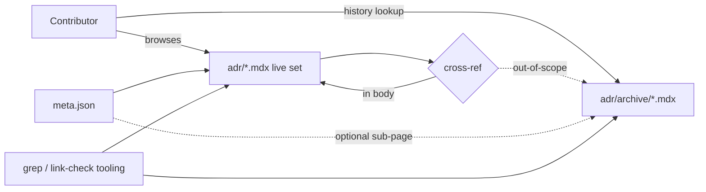

## Context

Promoted from `artifacts/frames/1145-adr-consolidation-frame.mdx`.

Current state (verified 2026-05-08):
- `docs/architecture/adr/*.mdx` — **72 files** (numbered 001–071, with **017 colliding**: `017-coupling-hotspots-and-decoupling-strategy.mdx` + `017-srp-violations-and-remediation-strategy.mdx`)
- `docs/architecture/adr/archive/` — **does not exist**
- `meta.json` lists every ADR explicitly (Fumadocs-style sidebar) — must be kept in sync after any rename/move
- ADRs use **body-section status** (`## Status\nAccepted`), not frontmatter status. The `superseded_by` pointer is a **new convention** this work introduces (frontmatter field).
- One non-mdx file present: `051-rollout-evidence.md` — companion artifact, leave in place.

PR #1004 proposed merge buckets (NATS Core / NATS Contracts / Quadlet / Architecture). Six new ADRs (066–071) have landed since and must be audited for inclusion.

## Goal

Reduce live ADR count to ~30 canonical decisions, archive superseded ones with bidirectional pointers, and fix the ADR-017 number collision — without breaking any cross-reference in remaining live ADRs or `meta.json` sidebar.

## Users

- **Primary:** Lyra contributors and AI agents (architect, doc-writer) reading `docs/architecture/adr/` to find the canonical decision for a topic.
- **Secondary:** roxabi-* projects mirroring this ADR pattern as a template.

## Expected Behavior

After this work:

1. `ls docs/architecture/adr/*.mdx` returns ~30 live ADRs (canonical-per-theme).
2. `ls docs/architecture/adr/archive/*.mdx` returns ~40+ archived ADRs.
3. Every archived ADR has a `superseded_by:` frontmatter field pointing to a live ADR.
4. No two live ADRs share a numeric prefix (017 collision resolved).
5. `meta.json` reflects only live ADRs in the sidebar (archive listed under a sub-page or omitted, see breadboard).
6. `grep -r "ADR-0XX" docs/ src/` for any archived ADR's old ID returns either zero hits or hits inside the archive itself; live cross-references all resolve to live ADR files.
7. Pre-commit hooks (lint, typecheck, file-length, folder-size, import-layers) pass on the resulting commit.

## Data Model & Consumers

| Consumer | Reads | When | Status |
|---|---|---|---|
| Contributors / IDE | `adr/*.mdx` | Browsing decisions | This issue |
| Fumadocs sidebar | `meta.json` | Doc rendering | This issue |
| `grep` link-check (slice 4) | both dirs | Validation | This issue |
| roxabi-* mirrors | live set as template | Future | Out of scope |

## Breadboard

Affordances (this is a docs reorg, so "affordances" = filesystem operations + content edits):

| ID | Affordance | Handler | Inputs | Outputs |
|---|---|---|---|---|
| F1 | Create archive dir | `mkdir -p docs/architecture/adr/archive/` | — | dir exists |
| F2 | Renumber ADR-017-srp → 017-bis or new number | `git mv` + body title edit + meta.json edit | old slug, new slug | renamed file |
| F3 | Merge bucket → canonical ADR | Edit canonical body to fold in superseded content | source ADRs, target ADR | enriched canonical body |
| F4 | Archive superseded ADR | `git mv` to archive/ + add `superseded_by:` frontmatter + change body status to "Superseded" | source path, target ADR id | moved file with pointer |
| F5 | Update inbound xrefs | Find/replace `ADR-0XX` references that should now point to canonical | old id, new id | edited files |
| F6 | Sync meta.json | Remove archived slugs from `pages`, optionally add archive sub-page | meta.json, archived slugs | updated meta.json |
| F7 | Verify link integrity | `grep -r "ADR-0[0-9][0-9]"` then resolve each hit against live+archive sets | — | report |
| F8 | Run pre-commit hooks | `pre-commit run --all-files` | — | pass/fail |

Wiring: F1 → F2 (collision fix isolates) → F3+F4 per bucket (merge then archive) → F5 (update xrefs) → F6 (sync sidebar) → F7 (verify) → F8 (gate).

## Slices

Vertical increments — each independently demo-able and committable.

| # | Slice | Affordances | Acceptance |
|---|---|---|---|
| S1 | **Audit & re-validate buckets** | none (analysis only) | Audit doc committed under `artifacts/` capturing: per-bucket source list (re-validated against current 72 ADRs), placement decisions for ADR-066–071, list of any new buckets discovered, list of standalone ADRs that stay live |
| S2 | **Fix ADR-017 collision** | F1, F2, F5, F6 | One of the two `017-*` files renumbered (target number TBD in S1); meta.json updated; all inbound xrefs updated; pre-commit passes |
| S3 | **Merge + archive NATS Core bucket** (037, 040, 047, 062 → 045) | F3, F4, F5, F6 | Sources moved to archive/ with `superseded_by: 045`; canonical ADR-045 contains the merged decision content; xrefs updated; pre-commit passes |
| S4 | **Merge + archive NATS Contracts bucket** (044, 050 → 049, audit 066) | F3, F4, F5, F6 | Same shape as S3 for the contracts bucket; ADR-066 placement decision from S1 honored |
| S5 | **Merge + archive Quadlet bucket** (053, 054, 056 → 055, audit 068) | F3, F4, F5, F6 | Same shape; ADR-068 placement decision honored |
| S6 | **Merge + archive Architecture bucket** (048, 060, 061 → 059) | F3, F4, F5, F6 | Same shape |
| S7 | **Any additional buckets surfaced in S1** | F3, F4, F5, F6 | Per-bucket acceptance same as S3 — only runs if S1 finds new buckets |
| S8 | **Link integrity sweep + final hooks** | F7, F8 | `grep -r "ADR-0XX"` for every archived id resolves cleanly; `pre-commit run --all-files` passes; ADR count reduced (target ~30 ± 5) |

S1 is mandatory and gates S2–S7. S2 can run in parallel with S3–S6 once S1 is done. S8 runs last.

## Success Criteria

- [ ] `docs/architecture/adr/archive/` directory exists and contains all superseded ADRs
- [ ] No two live ADRs in `docs/architecture/adr/*.mdx` share a numeric prefix (017 collision resolved)
- [ ] Every file in `docs/architecture/adr/archive/*.mdx` has a `superseded_by:` frontmatter field whose value matches a live ADR id
- [ ] Every archived ADR's body `## Status` reads `Superseded by ADR-NNN` (or equivalent), with the live target's body listing `supersedes:` either in frontmatter or a `## Supersedes` body section
- [ ] Live ADR count is between **25 and 35** (target ~30 — exact number locked in S1 audit)
- [ ] At least the four canonical buckets land: ADR-045, ADR-049, ADR-055, ADR-059 each absorbed their planned sources from the issue body, with any deviations explicitly justified in the S1 audit doc
- [ ] ADR-066–071 each have a documented placement decision (live, merged into bucket, or archived) recorded in S1 audit
- [ ] `meta.json` `pages` array contains only live ADR slugs (or live + an archive sub-page entry — choice locked in S1)
- [ ] `grep -r "ADR-0[0-9][0-9]" docs/ src/ packages/ --include="*.md*" --include="*.py"` shows zero references to archived-only ids inside live ADR bodies (exception: a "see also (archived)" pointer is OK)
- [ ] `pre-commit run --all-files` passes on the final commit of the worktree
- [ ] No archived ADR's `superseded_by` chain creates a cycle or terminates at another archived ADR

## Out of Scope (re-stated)

- Building a lint/CI rule that enforces the live/archive split going forward
- Migrating ADR format (still MDX with body-section status, plus the new `superseded_by:` frontmatter)
- Cross-repo consolidation (other roxabi-* projects)
- Authoring new architectural decisions

## Edge Cases

| Case | Handling |
|---|---|
| Bucket merge would lose information | S1 audit must explicitly flag; canonical body incorporates the unique content rather than dropping it |
| ADR cited from `src/` source code (not just docs) | F5 must update those references; tracked in S8 grep |
| `superseded_by` target itself becomes archived later | Out of scope here; chain only needs to be acyclic+terminate-in-live at end of this PR |
| ADR-017 collision: which one to renumber? | S1 picks; default = renumber the later-authored one to first free number ≥072 |
| meta.json archive listing format unclear (Fumadocs) | S1 picks one of: (a) omit archive entirely from sidebar, (b) add archive sub-page. Either is acceptable; lock in S1 |
| New buckets discovered in S1 | Add as S7; do not silently expand S3–S6 |
