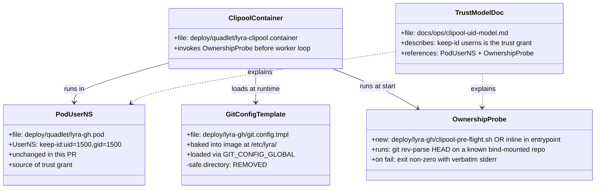
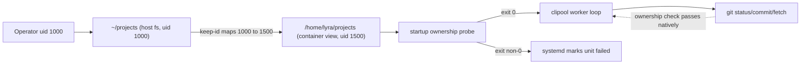

## Context

Promoted from `artifacts/frames/1149-safe-directory-idmap-frame.mdx` (epic #1158, child).

The original frame proposed Podman `Volume=...:idmap` to remove host↔container uid drift. That approach is unavailable: idmap on bind mounts requires rootful Podman (per official docs and Podman GH #24918); clipool runs rootless under `systemctl --user`, so the kernel rejects `mount_setattr` with `Operation not permitted`.

Empirical validation on M₂ (Podman 4.9.3, rootless) — transient container with `--userns=keep-id:uid=1500,gid=1500`, the `~/projects/lyra` bind mount, `alpine/git`, and **no** `safe.directory` config — produced:

```
PROC_UID=1500
FILE_UID=1500 (lyra/.git/HEAD seen inside container)
git rev-parse HEAD → exit 0
git status -s → exit 0
zero "dubious ownership" output
```

Audit of host fs: `find ~/projects -not -uid 1000` returns 0 files across 611,766. The `[safe] directory = /home/lyra/projects/*` wildcard introduced in `5c18a78b` (May 6, 2026) was prophylactic — added at the same time as the initial `git.config.tmpl` bake without a reproduced incident. The pod's existing `UserNS=keep-id:uid=1500,gid=1500` (on `lyra-gh.pod`) provides the trust grant by remapping host uid 1000 ↔ container uid 1500; inside the container, git sees its own uid on every file and the ownership check passes without any path-based bypass.

The fix is therefore minimal: delete the `[safe]` block. To prevent silent regression if the userns ever changes, add a startup probe to clipool that fails the unit fast if ownership errors appear.

## Goal

Delete the path-based `[safe] directory` wildcard from the clipool's baked git config, relying on the existing `keep-id` user namespace as the trust grant, and add a startup-time invariant check so any future regression (e.g. someone removes `keep-id`) is caught at unit start rather than silently re-introducing CWE-426/427 surface via a re-added wildcard.

## Users

- **Primary:** clipool runtime (`lyra adapter clipool`) on M₁ (prod) and M₂ (dev).
- **Secondary:** future Roxabi Quadlet adopters bind-mounting host trees — they inherit this trust model (`keep-id` userns alone, no path wildcards); lyra is the reference impl.
- **Tertiary:** the next person who edits the pod definition — the startup probe makes the userns invariant testable, so they get a loud failure rather than a silent security regression.

## Expected Behavior

Runtime walkthrough (clipool boot, post-change):

1. `lyra-clipool.container` starts via Quadlet; pod `lyra-gh.pod` already declares `UserNS=keep-id:uid=1500,gid=1500`.
2. Image-baked git config `/etc/lyra/git.config.tmpl` is loaded via `GIT_CONFIG_GLOBAL`. The template contains no `[safe]` block.
3. Container entrypoint (or pre-flight script run before the main worker loop) executes the ownership probe: `git -C /home/lyra/projects/lyra rev-parse HEAD >/dev/null`. Probe target is `lyra` itself (always bind-mounted, always a git repo on both M₁ and M₂).
4. Probe exit 0 → log one info line ("clipool git ownership probe OK"), continue to worker loop.
5. Probe non-zero ∨ stderr contains "dubious ownership" → log a fatal line with the stderr verbatim, exit non-zero. systemd surfaces it; `BindsTo=lyra-gh-pod.service` propagates.
6. Steady state: Claude subprocess runs `git status` / `git commit` / `git fetch` against bind-mounted repos. No "dubious ownership" warnings. No `safe.directory` config consulted.

Migration walkthrough — none required. No host fs changes, no chown sweep, no operator action beyond the standard image redeploy (CI → GHCR → `podman auto-update` per `docs/ops/container-publishing.md`).

## Data Model & Consumers





| Consumer | Reads | When | Status |
|---|---|---|---|
| Image build | `deploy/lyra-gh/git.config.tmpl` | CI image build | this issue (1 line removed) |
| Quadlet generator | `lyra-clipool.container` | `systemctl --user daemon-reload` | this issue (probe invocation added) |
| Ownership probe | `~/projects/lyra/.git` (bind-mounted into container) | every container start | this issue (new) |
| systemd | probe exit code | container start | this issue |
| Operator + future adopters | `docs/ops/clipool-uid-model.md` | once on read | this issue (new) |
| Claude subprocess | git over bind-mounted repos | every clipool task | unchanged behavior post-change |

## Breadboard

### Affordances

| ID | Affordance | Handler | Data |
|---|---|---|---|
| F1 | Absent `[safe]` block in baked git config | git inside container | `deploy/lyra-gh/git.config.tmpl` |
| F2 | Startup ownership probe runs before worker loop | container entrypoint / pre-flight script | `~/projects/lyra/.git` |
| F3 | Probe failure surfaces as systemd unit failure | systemd | container exit code |
| F4 | Trust-model doc explaining the keep-id grant | operator | `docs/ops/clipool-uid-model.md` |
| F5 | Existing pod `UserNS=keep-id:uid=1500,gid=1500` is preserved | Quadlet | `deploy/quadlet/lyra-gh.pod` (not edited; asserted unchanged) |

### Wiring

- F1: edit removes one config block; rebuilt image carries no wildcard.
- F2 → F3: probe runs synchronously at container start; non-zero exit propagates via systemd.
- F4 documents F2 + F5 together — without explaining what the probe checks and why `keep-id` is load-bearing, future edits to either is unsafe.
- F5 is not touched by this PR; the trust-model doc names it explicitly as the invariant the rest of the change depends on.

## Slices

| # | Slice | Affordances | Demo |
|---|---|---|---|
| S1 | Remove wildcard + add startup probe + doc | F1, F2, F3, F4, F5 | On M₂, after image rebuild + redeploy: container starts, probe logs OK, `podman exec lyra-clipool sh -c 'cd /home/lyra/projects/lyra && git rev-parse HEAD'` exits 0; `grep -r "safe.directory" /etc/lyra/` inside container returns empty; manually toggling pod UserNS off in a transient unit causes the probe to fail at start and the unit to be marked failed |

Single slice — the three pieces are atomic: shipping the wildcard removal without the probe trades a known prophylactic guard for no guard at all; shipping the probe without the doc leaves the trust model implicit; shipping the doc without the code change leaves the surface in place.

## Success Criteria

**Static (verifiable pre-merge, in CI):**

- [ ] `deploy/lyra-gh/git.config.tmpl` contains no `[safe]` section and no `directory =` line (verifiable: `! grep -E "^\[safe\]|^[[:space:]]*directory[[:space:]]*=" deploy/lyra-gh/git.config.tmpl`).
- [ ] `deploy/quadlet/lyra-clipool.container` invokes the ownership probe before the worker loop (verifiable: grep for the probe invocation in the unit file or in the image entrypoint script it references).
- [ ] A probe script (or equivalent inline check) exists, takes a repo path as input, runs `git -C <path> rev-parse HEAD`, and exits non-zero with verbatim stderr if git emits "dubious ownership".
- [ ] `docs/ops/clipool-uid-model.md` exists and documents: (a) `keep-id:uid=1500,gid=1500` is the trust grant, (b) no `safe.directory` wildcards are baked, (c) the startup probe is the regression catch.

**Smoke test (operator runs once post-deploy, recorded in PR comment, not CI-gated):**

- [ ] On M₂ after redeploy: `podman exec lyra-clipool sh -c 'cd /home/lyra/projects/lyra && git rev-parse HEAD'` exits 0 with no "dubious ownership" stderr.
- [ ] On M₂ after redeploy: `podman exec lyra-clipool cat /etc/lyra/git.config.tmpl` shows no `[safe]` section.
- [ ] On M₂ after redeploy: clipool unit logs show one info line from the startup probe ("OK" or equivalent).
- [ ] Negative test on M₂: a transient `podman run` of the same image **without** `--userns=keep-id` (e.g. default rootless mapping) causes the probe to fail at start with non-zero exit and stderr containing "dubious ownership". This is the safety-net assertion the probe exists to provide.

## Risks / Edge Cases

| Risk | Handling |
|---|---|
| `keep-id` userns silently removed in a future pod edit | Startup probe fails at boot → systemd marks unit failed → loud regression, not silent |
| The probe target repo (`~/projects/lyra`) absent on M₂ at runtime | Probe must use a fixed bind-mounted repo present on both machines; lyra itself is the natural choice (always bind-mounted via the existing `%h/projects:/home/lyra/projects:z` volume, always a git repo). If absent for any reason, probe fails fast — same loud-regression behavior |
| A future change reintroduces `safe.directory` "to be safe" | Trust-model doc explicitly states the wildcard is forbidden and explains why; PR template / lint optional but not in scope |
| Pod runs without `keep-id` on a future bootstrap machine | Caught by probe at first start; install docs (`docs/DEPLOYMENT.md`) and the new trust-model doc both name the userns as a prerequisite |
| Probe overhead at container boot | One `git rev-parse HEAD` invocation, ~10–50ms; negligible vs. typical clipool startup |
| The probe itself depends on a working git binary inside the image | Image bake step or the Claude subprocess's git is already present; if not, fall back to a stat-based check (`stat -c %u` on probe target == container's own uid). Implementer chooses based on what's available in the image |
| Idmap path resurfaces later (e.g. rootful Podman migration) | Out of scope; that's a separate epic-level shift; until then, `keep-id` + probe is the chosen model |
