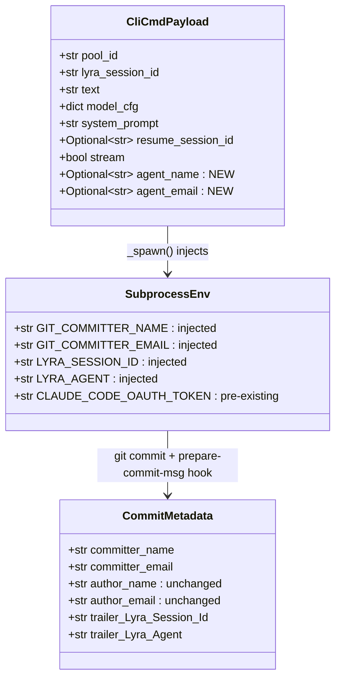
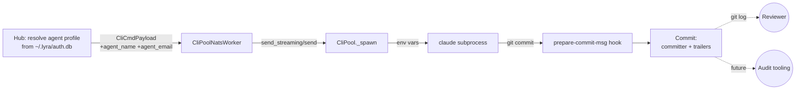

## Context

Promoted from `artifacts/frames/1150-clipool-agent-identity-frame.mdx` (approved 2026-05-18). Child of #1158 audit response.

Today every commit produced inside the clipool container attributes to a single image-baked identity (`lyra[bot] <lyra-bot@users.noreply.github.com>`, set in `deploy/lyra-gh/git.config.tmpl`). The agent profile (loaded from `~/.lyra/auth.db` by the hub) and `lyra_session_id` (already on the `CliCmdPayload` NATS envelope, `packages/roxabi-contracts/src/roxabi_contracts/cli/models.py`) are not propagated past the worker; they never reach the Claude subprocess environment, so git has no way to attribute the commit beyond the static template.

## Goal

Every commit produced by a clipool Claude subprocess carries a `committer` identity sourced from the per-session agent profile and trailers `Lyra-Session-Id` + `Lyra-Agent` in the commit message — without changing the GitHub App push identity.

## Users

- **Primary:** Reviewers debugging a regression from `git log` / PR history. Today they see one bot for everything; after the change they can read agent + session straight off the commit.
- **Secondary:** Audit / postmortem tooling that ingests commit metadata as canonical attribution.

## Expected Behavior

1. Hub receives an inbound message, resolves the bound agent profile (name + email) for that platform/bot via `BotAgentStore.get_bot_agent()`.
2. Hub constructs `CliCmdPayload` with `lyra_session_id` (already present), and the two new fields `agent_name`, `agent_email`. Publishes on `lyra.clipool.cmd`.
3. `CliPoolNatsWorker._handle_cmd` validates the envelope. `lyra_session_id` is **always present** (required field on `CliCmdPayload` today); `agent_name` and `agent_email` are the new `str | None` optional pair. Missing pair ⇒ fall back to the current image-baked identity (forward-compat with older hubs).
4. Worker calls `CliPool.send_streaming(...)` / `send(...)` passing `agent_name`, `agent_email`, `lyra_session_id` through to `_spawn()`.
5. On subprocess spawn, `_spawn()` merges identity env vars into the subprocess env **via an explicit post-filter merge step** — *not* by extending `_SAFE_ENV_KEYS`. The allowlist is reserved for vars inherited from the parent process environment (its design intent per the inline rationale at `cli_pool_worker.py:36–54`); synthesised-at-spawn vars take a separate codepath. The gate is layered:
   - `agent_name` absent ⇒ no identity vars injected; subprocess uses the image-baked template identity entirely (legacy hub or unbound bot).
   - `agent_name` present, `agent_email` absent ⇒ **trailers-only mode**: `LYRA_AGENT` and `LYRA_SESSION_ID` are injected and the prepare-commit-msg hook appends trailers; `GIT_COMMITTER_*` is left unset so committer falls back to the template. Reviewer-visible attribution comes entirely from the trailers (`Lyra-Agent`, `Lyra-Session-Id`).
   - `agent_name` + `agent_email` both present ⇒ **full mode**: all four vars are injected; committer identity AND trailers carry agent attribution.

   The trailers-only mode is the **production steady state today** because `AgentRow` does not yet model an `email` field — when that field is added in a follow-up, production flips to full mode with no code change here. The frame's failure-mode test ("identify session + agent from `git log`") is satisfied by either mode because the trailers carry both signals.
6. Inside the container, a `prepare-commit-msg` hook (installed under `/opt/lyra-gh/hooks/`, sourced from `deploy/lyra-gh/hooks/prepare-commit-msg` and copied into the image, wired via a new `[core] hooksPath = /opt/lyra-gh/hooks` line in `git.config.tmpl`) reads `LYRA_SESSION_ID` and `LYRA_AGENT` from the environment and uses `git interpret-trailers --in-place --if-exists doNothing --trailer "Lyra-Session-Id: $LYRA_SESSION_ID" --trailer "Lyra-Agent: $LYRA_AGENT"` to append trailers idempotently (the `--if-exists doNothing` flag prevents duplication on `git commit --amend`). Hook is a no-op when either var is missing.
7. `git commit` invoked by Claude inside the subprocess sees `GIT_COMMITTER_*` (which override `[user]` per git docs §`GIT_COMMITTER_NAME`), and the hook injects trailers. `git push` still uses the GitHub App credentials via `git-credential-lyra-gh` — push identity unchanged.

## Data Model & Consumers

**Consumer summary**

| Consumer | Fields consumed | When | Status |
|---|---|---|---|
| `git commit` (inside subprocess) | `GIT_COMMITTER_NAME`, `GIT_COMMITTER_EMAIL` | every commit | this issue |
| `prepare-commit-msg` hook | `LYRA_SESSION_ID`, `LYRA_AGENT` | every commit message | this issue |
| Reviewer via `git log --format='%cn %ce %(trailers)'` | committer + trailers | post-PR, regression hunts | this issue |
| Audit pipeline (future) | committer + `Lyra-Session-Id` trailer | nightly ingest | out of scope (fields must be machine-readable) |

## Breadboard

### Affordance map

| ID | Affordance | Handler | Data source | Notes |
|---|---|---|---|---|
| N1 | Envelope fields `agent_name`, `agent_email` | `CliCmdPayload` in `packages/roxabi-contracts/src/roxabi_contracts/cli/models.py` | hub | additive minor contract bump (¬security-bearing — auth still owned by GitHub App) |
| N2 | Hub publish path stamps agent identity | hub's clipool LLM driver `src/lyra/nats/cli_nats_driver.py` (publish call site) | `BotAgentStore` + agent row from `~/.lyra/auth.db` | resolve once at publish time |
| S1 | Worker passes fields through | `CliPoolNatsWorker._handle_cmd_streaming` / `_handle_cmd_blocking` in `src/lyra/adapters/clipool/clipool_worker.py` | `CliCmdPayload` | wire `cmd.agent_name`/`agent_email`/`lyra_session_id` into `send`/`send_streaming` |
| S2 | `CliPool.send` / `send_streaming` accept identity kwargs | `src/lyra/core/cli/cli_pool.py`, `cli_pool_streaming.py` | call site | propagate to `_spawn`; **prerequisite for S3 observability** (Slice 2 must land before Slice 3 takes effect end-to-end) |
| S3 | `_spawn` injects 4 env vars when identity pair present | `src/lyra/core/cli/cli_pool_worker.py` | explicit post-filter merge | **¬extend `_SAFE_ENV_KEYS`** — the allowlist filters inherited vars; the new vars are synthesised at spawn time and merged after the filter |
| S4 | Hook appends trailers via `git interpret-trailers --if-exists doNothing` | new file `deploy/lyra-gh/hooks/prepare-commit-msg` | subprocess env (`LYRA_SESSION_ID`, `LYRA_AGENT`) | no-op if either var missing; idempotent on `git commit --amend` |
| S5 | Image bake + `core.hooksPath` wiring | new lines in `Dockerfile` (COPY `deploy/lyra-gh/hooks/` → `/opt/lyra-gh/hooks/`, `chmod 0755`) + new `[core] hooksPath = /opt/lyra-gh/hooks` line in `deploy/lyra-gh/git.config.tmpl` | static | both image-layer changes — slice 4 requires a published image rebuild via `publish.yml`, not just a file merge |

### Wiring

- **N1 ← `roxabi-contracts/cli/models.py`** — additive only; bump `packages/roxabi-contracts/CHANGELOG.md` per the package's versioning rules (minor bump, no `contract_version` increment — additive non-security-bearing).
- **N2 ← `src/lyra/nats/cli_nats_driver.py`** — single `BotAgentStore` resolution call before envelope construction; ¬touch agent profile schema.
- **S1 → S2 → S3** — passthrough plumbing with the "agent_name AND agent_email present" guard at S3 before injecting; S2 is a strict prerequisite for S3 to be observable (call site change must land before envelope fields can be consumed).
- **S4 → S5** — hook is the trailer authority; image-layer changes (Dockerfile COPY + `hooksPath` template line) are atomic and land together in slice 4.

### Failure modes

| Case | Behavior |
|---|---|
| Older hub publishes without `agent_name`/`agent_email` | Worker passes `None`; `_spawn` skips env injection; git falls back to the template identity. Hook sees no `LYRA_*` env → no-op. **No commit fails.** |
| Agent profile row missing `email` (current production state) | Hub publishes `agent_name` only; `_spawn` injects `LYRA_AGENT` + `LYRA_SESSION_ID` (trailers-only mode); `GIT_COMMITTER_*` stays unset and committer falls back to the template. Trailers carry attribution. |
| Claude pre-sets `GIT_COMMITTER_*` itself | `_spawn` overwrites — our env merge wins because it runs after the inherited-env filter. |
| Hook running on `git commit --amend` with trailers already present | `git interpret-trailers --if-exists doNothing` is a no-op on existing trailer keys — no duplication. |
| Local dev (no container) — operator runs `lyra adapter clipool` outside Quadlet | `GIT_CONFIG_GLOBAL` unset → `core.hooksPath` does not apply → hook is never invoked. Safe degradation. |

## Slices

| # | Slice | Files | Demo |
|---|---|---|---|
| 1 | Contract bump — add optional `agent_name`/`agent_email` to `CliCmdPayload`; CHANGELOG entry | `packages/roxabi-contracts/src/roxabi_contracts/cli/models.py`, `packages/roxabi-contracts/CHANGELOG.md` + tests | unit test: validate envelope with and without new fields; ensure default `None` |
| 2 | Plumb identity through worker → `CliPool` → `_spawn`; explicit post-filter env merge gated on identity pair; `_SAFE_ENV_KEYS` **unchanged** | `src/lyra/adapters/clipool/clipool_worker.py`, `src/lyra/core/cli/cli_pool.py`, `cli_pool_streaming.py`, `cli_pool_worker.py` + tests | unit test: spawn with full identity → `proc.env` contains 4 vars; spawn with missing field → env vars absent, no crash |
| 3 | Hub publish path resolves agent profile and stamps envelope | `src/lyra/nats/cli_nats_driver.py` (or current hub clipool publish call site) + tests | integration test: hub publish stub with bot bound to agent X → captured `CliCmdPayload` carries X's name + email |
| 4 | Container image: `prepare-commit-msg` hook + `[core] hooksPath` + Dockerfile bake; docs update | new `deploy/lyra-gh/hooks/prepare-commit-msg`, new `[core] hooksPath` line in `deploy/lyra-gh/git.config.tmpl`, `Dockerfile` (COPY + chmod for `/opt/lyra-gh/hooks/`), `docs/agent-management.md` (note committer behavior + trailers) | live-fire test in built container: `LYRA_SESSION_ID=abc LYRA_AGENT=research-assistant git commit -m "x"` → trailers appear in `git log`; `--amend` does not duplicate trailers |

Ordering:
- Slice 1 ships standalone (additive, zero behavior change).
- Slice 2 is a strict prerequisite for Slice 3 to be observable end-to-end (Slice 3 lands payload fields the worker must read).
- Slice 4 requires a CI image rebuild via `publish.yml`; the new hook only activates on the next `podman-auto-update` cycle post-merge (no operator action needed, but timing is image-bound, not file-merge-bound).

## Success Criteria

- [ ] `CliCmdPayload.agent_name: str | None` and `agent_email: str | None` exist; envelope validates with and without them; `packages/roxabi-contracts/CHANGELOG.md` has an entry describing the additive minor bump.
- [ ] When hub publishes a `CliCmdPayload` for a bot bound to agent `X`, the payload carries `agent_name="X"`. **Production steady state today**: `agent_email` is always `None` because `AgentRow` has no email field — the trailers-only mode (next criterion) is the satisfying observable. When the `AgentRow.email` follow-up (#1244) lands, this criterion's "full mode" half ("payload carries `agent_email="e"`") becomes testable without further code change in this slice.
- [ ] When the worker dispatches a `CliCmdPayload` with both `agent_name` and `agent_email` present (and the always-present `lyra_session_id`), the resulting subprocess environment contains `GIT_COMMITTER_NAME`, `GIT_COMMITTER_EMAIL`, `LYRA_SESSION_ID`, `LYRA_AGENT` with matching values (full mode).
- [ ] When `agent_name` is present but `agent_email` is `None`, the subprocess environment contains `LYRA_AGENT` and `LYRA_SESSION_ID` (when present) but neither `GIT_COMMITTER_NAME` nor `GIT_COMMITTER_EMAIL` — trailers-only mode.
- [ ] When `agent_name` is `None`, no `GIT_COMMITTER_*` or `LYRA_*` vars are injected and the subprocess spawns successfully.
- [ ] Inside the deployed container, a `git commit -m "x"` invoked with `LYRA_SESSION_ID` + `LYRA_AGENT` in env appends exactly one `Lyra-Session-Id:` trailer and one `Lyra-Agent:` trailer to the commit message; running `git commit --amend --no-edit` on the same commit does not duplicate trailers.
- [ ] **End-to-end attribution check (full mode)**: a commit produced through the full hub→clipool→subprocess path with agent `X` (email `e`) and session id `S` yields, when queried via `git log -1 --format='%cn|%ce|%(trailers:key=Lyra-Session-Id,valueonly)|%(trailers:key=Lyra-Agent,valueonly)'`, the exact line `X|e|S|X`.
- [ ] **End-to-end attribution check (trailers-only mode, production steady state)**: the same path with agent `X`, `agent_email=None`, session id `S` yields a `git log` line where the trailers carry `S` and `X` (committer falls back to the template identity, but `Lyra-Session-Id` and `Lyra-Agent` trailers are present and correct).
- [ ] `git push` from inside the container still authenticates via `git-credential-lyra-gh` (GitHub App identity unchanged). **Asserted by inspection**: GitHub push authorization is owned by the credential helper, which resolves to `<app_id>+lyra-bot[bot]@users.noreply.github.com` server-side; `GIT_COMMITTER_EMAIL` affects commit metadata only and does not gate push auth. No black-box push test in this slice.
- [ ] `_SAFE_ENV_KEYS` is **unchanged** by this issue (per S3 design — identity vars use a separate explicit-merge codepath). A test asserts `_SAFE_ENV_KEYS` does not contain any `GIT_*` or `LYRA_*` key.
- [ ] On an older hub (without the contract bump deployed), a clipool worker on the new image continues to spawn subprocesses successfully and produces commits with the legacy template identity.
- [ ] `docs/agent-management.md` documents the per-session committer behavior and the two trailers (`Lyra-Session-Id`, `Lyra-Agent`).

## Out of Scope

- Audit pipeline that ingests trailers (future consumer; this issue only ensures fields are accessible).
- `GIT_AUTHOR_*` injection — author identity stays bot-baked; only committer + trailers carry agent provenance.
- GitHub App push-auth identity change.
- Sibling audit children #1149 (idmap / safe.directory) and #1151 (token TTL floor).
- Adding an `email` field to `AgentRow` / the agent profile schema. Tracked as #1244; until then production runs in trailers-only mode.
- Hardening `core.hooksPath` against per-repo override (workspace volume is mounted RW; a malicious subprocess could set per-repo `core.hooksPath` and bypass the image-baked hook). Tracked as #1245; within the single-tenant container threat model this is accepted residual risk for this PR.
- Pinning the base image (`FROM ghcr.io/roxabi/base:latest`). This PR introduces the first behavioral dependency on a specific git capability from the base image; pinning is a repo-wide policy concern tracked as #1246.
