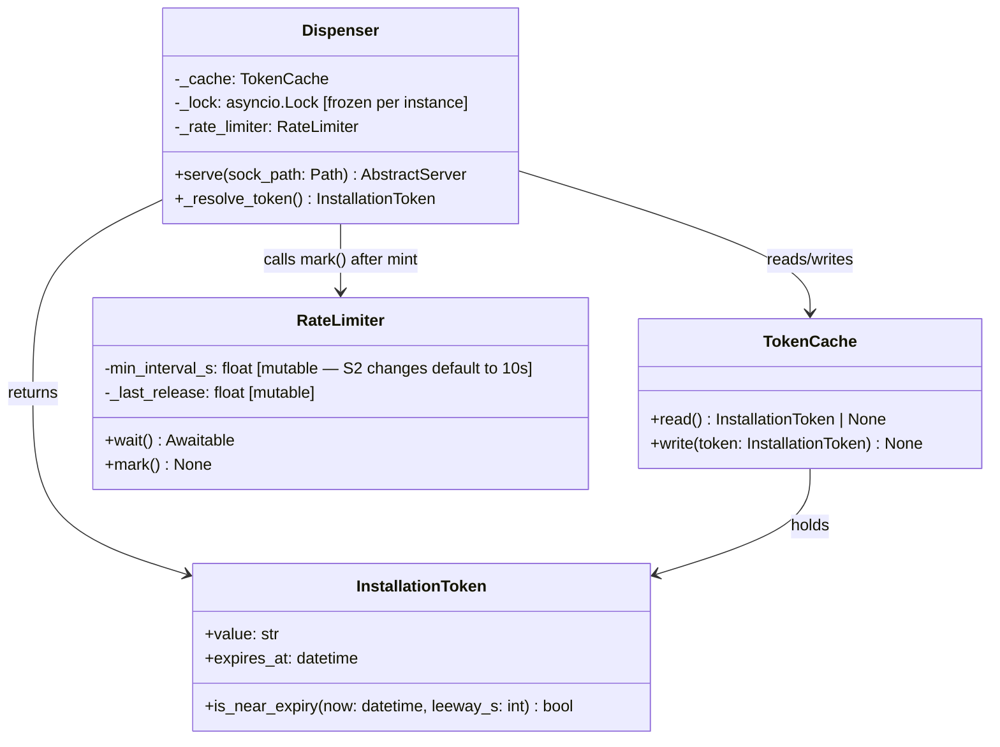

## Context

Issue [#1151](https://github.com/Roxabi/lyra/issues/1151) is the third child of
epic [#1158 — CLIpool git audit response](../frames/1158-clipool-git-audit-response-frame.mdx).
The epic frames a trust-model migration: Claude now ingests untrusted input, so
"trust the agent" no longer implies "trust everything the agent touches." Row 9
of the data-flow table in the epic frame captures this finding: today's policy
is "reactive mint, hope for the best"; the target is "≥15 min TTL by invariant
at every dispenser read."

The issue body was revised during design to adopt a **lazy refresh at the
dispenser** approach — no background refresh loop — superseding the original
frame's framing of a proactive background task. This spec formalises that
revised approach.

## Goal

Every `Dispenser._resolve_token()` (and therefore every `dispenser.get()` /
`get`/`peek` socket request) returns a token whose `expires_at - now() >= 15
minutes` as a structural invariant enforced on the read path, with no background
refresh process.

## Users

- **Clipool worker** (`lyra adapter clipool`) — runs `git` subprocesses whose
  credential helper connects to the dispenser socket on every operation.
- **Agents performing git operations via clipool** — any Lyra agent session that
  issues a git command (clone, fetch, push); they receive the token indirectly
  via the credential helper.
- **Ops (M₁/M₂)** — observes daemon logs; cares that process restart requires
  no manual warm-up and that no background task silently dies undetected.

## Expected Behavior

**Cold cache (process restart or first start):** `_resolve_token()` reads the
cache and finds it empty. It acquires `_lock`, re-checks (still empty), mints
synchronously via `mint()`, writes the result to `TokenCache`, calls
`_rate_limiter.mark()`, and returns the `InstallationToken`. TTL is ~60 min
post-mint, well above the 15 min threshold. Subsequent git operations during the
next ~45 min reuse this cached token without any API call.

**Normal read (token fresh, TTL >= 15 min):** `_resolve_token()` reads the
cache, finds a token whose TTL exceeds the threshold, and returns it immediately
— no lock acquisition, no API call.

**Near-expiry read (TTL < 15 min):** `_resolve_token()` detects the threshold
breach. It acquires `_lock`. Inside the lock it re-reads the cache — if another
concurrent caller already minted (thundering-herd guard), it returns that fresh
token. Otherwise it calls `mint()` synchronously, writes the result, marks the
rate limiter, and returns. The caller receives a token with ~60 min TTL
remaining. The synchronous mint latency (~1–2 s) is invisible next to a typical
`git push` duration of 30 s–2 min.

**Concurrent near-expiry reads (N callers simultaneously):** All N callers
detect TTL &lt; 15 min and attempt to acquire `_lock`. Only the first proceeds
to mint. The remaining N-1 wait on the lock, then re-read the cache inside it,
find a fresh token written by the winner, and return it — exactly one GitHub API
call is made regardless of N.

**Process idle for >45 min, then a new git operation:** Cache contains a token
with TTL that may or may not be below the threshold depending on elapsed time.
Read path evaluates TTL and either returns (fresh) or mints (below threshold).
No dependency on any background task having run during the idle window.

## Data Model &amp; Consumers

### Class diagram



Note: `InstallationToken` is defined in `lyra.tools.gh_token.helper`. TTL
remaining is computed inline at the single call site in `_resolve_token()` as
`(token.expires_at - now).total_seconds()` — no new public method is added.

### Flow diagram

```mermaid
flowchart TD
    A[caller / git credential helper] --> B[Dispenser._resolve_token]
    B --> C{cache.read()}
    C -->|token is None| D[Acquire _lock]
    C -->|TTL &lt; 15 min| D
    C -->|TTL >= 15 min| Z[return InstallationToken]
    D --> E{re-read inside lock\nTTL still &lt; 15 min?}
    E -->|No — another waiter already minted| Z
    E -->|Yes| F[await mint&#40;&#41;]
    F --> G[cache.write&#40;&#41; + rate_limiter.mark&#40;&#41;]
    G --> Z

    style F stroke:#000,stroke-width:2px
    style D stroke:#000,stroke-width:2px
    style G stroke:#000,stroke-width:2px
```

All solid lines are in scope for this issue. There are no dashed (out-of-scope)
paths.

### Consumer summary

| Consumer | What it consumes | Call frequency | In scope |
|---|---|---|---|
| `git-credential-lyra-gh` shell script | `InstallationToken.value` via socket response (`password=`) | Every git network op | Yes |
| `lyra-gh` shim | `InstallationToken.value` via socket response | Every `gh` CLI invocation | Yes |
| `tests/tools/gh_token/` | `Dispenser._resolve_token`, `RateLimiter` | Test suite | Yes |

## Breadboard

### Affordance table

| ID | Kind | Handler | Data touched |
|---|---|---|---|
| N1 | function (async) | `Dispenser._resolve_token()` | `_cache` (read), `_lock` (acquire), `_rate_limiter` (mark) |
| N2 | lock | `asyncio.Lock` (per `Dispenser` instance) | Serialises concurrent mint attempts; guards `_cache.write()` |
| N3 | object | `RateLimiter` (repurposed) | `_last_release` timestamp; `wait()` is the abuse floor; `mark()` called after each mint |
| N4 | data / persistent | `TokenCache` | Holds `InstallationToken` with `expires_at`; written after mint, read on every `_resolve_token()` call |

### Lock primitive rationale

`Dispenser` is an `asyncio` server (`asyncio.start_unix_server`); all its
handlers run in the same event loop. An `asyncio.Lock` is the correct primitive
— no thread interaction exists on this code path. The existing code already uses
`asyncio.Lock` in `Dispenser.__init__`. This spec does not change the primitive.

## Slices

| Slice | Description | Files touched | Done when |
|---|---|---|---|
| **S1** | Dispenser TTL invariant | `dispenser.py`, `tests/tools/gh_token/test_dispenser.py` | `_resolve_token()` mints if `expires_at - now() < 15 min`; lock serialises concurrent callers; parametrized tests cover cold cache / near-expiry / fresh cache / N=10 concurrent callers |
| **S2** | Rate limiter as abuse floor | `rate_limit.py`, `tests/tools/gh_token/test_rate_limit.py` | Default `min_interval_s` is 10 s; docstring updated to "abuse floor" semantics; `wait()` is no longer called on the main read path (only `mark()` after mint); test verifies ≥10 s spacing enforcement |
| **S3** | Delete refresh.py + wiring | `refresh.py` (deleted), `daemon.py`, `__init__.py`, `tests/tools/gh_token/test_refresh.py` (deleted or repurposed) | `refresh.py` absent from tree; `daemon.py` no longer imports or creates a `refresh_loop` task; `__init__.py` no longer exports `mint_capped` or `refresh_loop`; `grep -r "gh_token.refresh"` returns empty |

### S1 detail

`_resolve_token()` currently has two paths: (a) forced-mint when
`is_near_expiry(now, 300)` (5 min threshold), (b) delegate to `mint_capped`.
S1 consolidates into a single path: check TTL against `MIN_TOKEN_TTL_SECONDS =
900` (15 min), acquire lock, double-check inside lock, call `mint()` directly
(not `mint_capped`), write cache, mark rate limiter, return.

### S2 detail

`RateLimiter.wait()` is currently called inside `mint_capped` before every mint.
After S1, the dispenser no longer calls `mint_capped` — it calls `mint()`
directly. `RateLimiter.wait()` becomes an abuse-floor guard: it should be called
inside the lock just before `mint()`, so a pathological tight loop (dispenser
bug that mints on every single request) is caught. `mark()` is called after
mint as today. Default `min_interval_s` changes from 45 s to 10 s.

`RateLimiter.wait()` emits a `logger.warning(...)` when `remaining > 0` (i.e.
when it actually sleeps), making the abuse-floor stall observable in
production logs. Silent stalls in token-path code are precisely the failure
mode this refactor hardens against, so the cost of one log line is justified.

### S3 detail

`daemon.py` contains the only call site for `refresh_loop` (guarded by
`config.disable_refresh`). After S3, the `disable_refresh` config field and its
conditional task-creation block are both removed. `mint_capped` in `refresh.py`
is currently used by `dispenser.py` on the normal (non-near-expiry) path — S1
replaces this with a direct `mint()` call, so `mint_capped` is also no longer
needed externally. `__init__.py` re-exports both; those exports are removed.

`helper.py` line 9 mentions `mint_capped` and `refresh_loop` in its module
docstring — that reference should also be cleaned up in S3.

## Success Criteria

- [ ] `Dispenser._resolve_token()` returns a token where `expires_at - now() >= timedelta(minutes=15)` on every call; parametrized test covers: cold cache (token absent), near-expiry (token present with TTL=14 min), fresh cache (token present with TTL=30 min).
- [ ] Concurrent `Dispenser._resolve_token()` calls during a near-expiry window trigger exactly **one** `mint()` call; test uses N=10 concurrent asyncio tasks and asserts `mint` mock was called once.
- [ ] Cold read after process restart mints on first call with no running refresh task (test instantiates `Dispenser` with empty `TokenCache`, calls `_resolve_token()`, asserts one mint and token returned with TTL &gt;= 15 min).
- [ ] `src/lyra/tools/gh_token/refresh.py` is deleted from the tree (`git ls-files src/lyra/tools/gh_token/refresh.py` returns empty).
- [ ] No remaining import of `gh_token.refresh`, `mint_capped`, or `refresh_loop` anywhere in `src/` (`grep -r "gh_token.refresh\|mint_capped\|refresh_loop" src/` returns empty).
- [ ] `RateLimiter` enforces ≥10 s minimum spacing between successive `mark()`/`wait()` cycles; test uses injected `clock` to simulate rapid successive calls and asserts `wait()` delays the second call.
- [ ] `daemon.py` no longer creates a `refresh_loop` task; clipool daemon startup smoke test asserts task list contains exactly one task (the dispenser server), not two.
