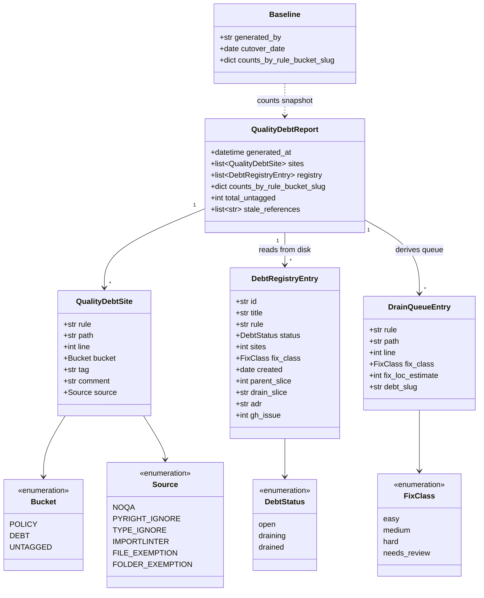
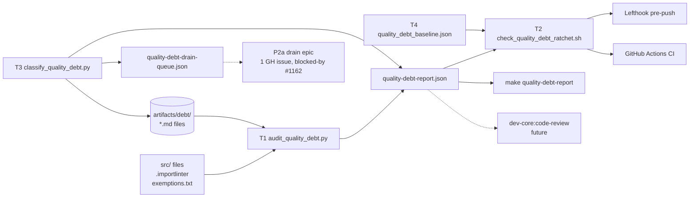

## Context

Promoted from [frame](../frames/1162-quality-debt-invariant-frame.mdx). Driver C (clean lyra). F-lite slice ships **audit tool + ratchet gate + classification + tags + file-based debt registry + drain queue + playbook** — no runtime refactor in this slice; refactor pass is the immediately-next P2a slice (one GH issue, blocked-by #1162).

**v3 changes vs. v2** (after user direction + Wave 4 verification):

| Shift | Reason |
|---|---|
| Debt tracked as **registry files** (`artifacts/debt/<slug>.md`), not GitHub issues | GH issues = decisions/work, files = instances. ~12 GH issues for code-smell tracking IS the bookkeeping smell the user wants to remove. |
| Ratchet drops `gh` calls entirely — pure file/frontmatter check | No API limits, no TTL cache, no network failure modes. ~30% of v2 complexity evaporates. |
| Tag syntax: `DEBT:<slug>` (drop `#`) | `<slug>` matches a registry filename, not a GH issue number; `#` was misleading. |
| **Playbook** `docs/playbooks/quality-debt-pipeline.md` is a slice deliverable | Captures process + learnings, seeds phase-2 dev-core lift. |
| **All Wave 4 #411 references removed** | Verified live: issue #411 is **CLOSED** but 7 `reportUnknown*` global suppressions persist in `pyproject.toml`. The inline comment lies. This is the canonical playbook anti-pattern, not a parallel track for this slice. |

## Goal

Establish a machine-enforced grammar where every exception marker in `src/` is either a policy-approved escape-hatch use (POLICY:`<tag>`) or a tracked debt with an open registry entry (DEBT:`<slug>`). Ratchet prevents new untagged exceptions and net DEBT growth. Registry files are pure version-controlled inventory; no GH API surface. Drain happens in P2a, blocked-by this slice.

## Users

- **dev (primary)** — wants visibly fewer exceptions; writes new code under the new gate; reads `make quality-debt-report` to see progress.
- **dev-core:fixer α** — consumes `artifacts/quality-debt-drain-queue.json` in P2a; closes registry entries (flips `status: drained` or deletes the file).
- **dev-core:code-review α** — gates new PRs with "untagged exception = blocker"; replaces subjective per-noqa judgement.

## Expected Behavior

**Author flow (writing new code):**
1. Dev introduces `# noqa: BLE001`. Pre-push runs ratchet.
2. Ratchet greps for `POLICY:<tag>` or `DEBT:<slug>` suffix.
3. Missing suffix → ratchet prints offending line + cite of `docs/quality-policy.md § Adding an exception`. PR blocked (post-cutover) or warned (pre-cutover).
4. Dev either (a) tags `POLICY:<tag> — <reason>`, (b) writes new `artifacts/debt/<slug>.md` and tags `DEBT:<slug>`, or (c) refactors to eliminate.
5. `DEBT:<slug>` → ratchet verifies `artifacts/debt/<slug>.md` exists and frontmatter `status: open`. Missing or `status: drained` → fail with `"DEBT:<slug> references missing/drained registry entry. Re-tag or refactor."`

**Drain flow (closing debt):**
1. Author refactors away N sites mapped to `DEBT:PLR0913-wiring`.
2. PR removes the noqa comments.
3. If count for that slug reaches 0: flip `artifacts/debt/PLR0913-wiring.md` frontmatter `status: open → drained` (or `git rm` the file, equivalent semantically).
4. `make quality-debt-rebaseline` → regenerates baseline. Only accepts baselines with `generated_by: make quality-debt-rebaseline` (forge-resistant).
5. Future re-introduction of `DEBT:PLR0913-wiring` after `drained` → ratchet fails.

**Audit + report flow (visibility):**
1. `make quality-debt-report` → emits `artifacts/quality-debt-report.json` + summary table. Exits non-zero if any UNTAGGED in `src/`.
2. `make quality-debt-rebaseline` → regenerates baseline, stamps `generated_by` + `cutover_date` (today + 7d on first generation, preserved on subsequent).
3. CI fails PRs where (a) untagged count > 0 (post-cutover), (b) any `(rule, DEBT:<slug>)` count strictly exceeds baseline, or (c) any DEBT slug references missing/drained registry entry.

**Cutover (automatic, no human flip):**
- Baseline JSON stores `cutover_date` (ISO).
- Ratchet computes mode at runtime: `today < cutover_date → soft (warn, exit 0)`, else `hard (exit 1 on violation)`.
- Env override: `RATCHET_MODE=soft|hard` (operator escape hatch; CI never sets it).
- No follow-up PR, no human flip, no forget risk.

## Data Model & Consumers

### Structure



### Consumer Map



**Note: zero `gh` calls in the gate.** Registry is pure local file state.

### Consumer Summary

| Consumer | Reads | When | Status |
|---|---|---|---|
| `check_quality_debt_ratchet.sh` | report + baseline + registry files | pre-push + every CI run | this slice |
| `make quality-debt-report` | report | dev-invoked | this slice |
| `make quality-debt-rebaseline` | writes baseline | dev-invoked after drain | this slice |
| P2a drain slice (fixer α) | drain queue + registry files | next slice, blocked-by #1162 | future |
| `dev-core:code-review` α | report | per-PR review | future |

## Breadboard

### Inputs (existing surfaces → new tag format)

| ID | Source | New tag format | Allowed buckets |
|---|---|---|---|
| N1 | `src/**/*.py` `# noqa: <rule>` | `# noqa: <rule> — POLICY:<tag>` ∨ `# noqa: <rule> — DEBT:<slug>` | POLICY, DEBT |
| N2 | `src/**/*.py` `# pyright: ignore[<rule>]` | append ` — POLICY:<tag>` ∨ ` — DEBT:<slug>` | POLICY, DEBT |
| N3 | `src/**/*.py` `# type: ignore[<rule>]` | append ` — POLICY:<tag>` ∨ ` — DEBT:<slug>` | POLICY, DEBT |
| N4 | `.importlinter` `ignore_imports` block lines | inline ` # DEBT:<slug>` per line | **DEBT only** |
| N5 | `tools/file_exemptions.txt` entries | normalize trailing `# DEBT:<slug> — <desc>` | **DEBT only** |
| N6 | `tools/folder_exemptions.txt` entries | normalize trailing `# DEBT:<slug> — <desc>` | **DEBT only** |

**Asymmetry rule:** N1–N3 (inline code escape-hatches) accept POLICY because intent is contextual and the comment locates it. N4–N6 (config-file waivers) are bulk bypasses of quality gates — by definition debt, no POLICY at this granularity.

### Tools (new)

| ID | Path | Inputs | Outputs |
|---|---|---|---|
| T1 | `tools/audit_quality_debt.py` | repo tree + `artifacts/debt/` | `artifacts/quality-debt-report.json` + stdout summary; exit non-zero if any UNTAGGED in `src/` or any inline `DEBT:<slug>` references a missing/drained registry entry |
| T2 | `tools/check_quality_debt_ratchet.sh` | report + baseline + optional `RATCHET_MODE` env | exit 0 (soft warn ∨ clean) or 1 (hard violation); prints diff summary |
| T3 | `tools/classify_quality_debt.py` | report (UNTAGGED rows) | proposed-tags TSV + drain queue JSON + writes new registry files via `--apply`; `F401` multi-tag → `fix_class: needs_review` (not auto-tagged) |
| T4 | `tools/quality_debt_baseline.json` | committed snapshot via `make quality-debt-rebaseline` | — |
| T5 | `artifacts/quality-debt-drain-queue.json` | T3 output | feeds P2a |

### Artifacts (new directory)

```
artifacts/debt/
├── INDEX.md                          # auto-generated table by T1
├── PLR0913-wiring.md
├── PLR0913-factory.md
├── C901-migrations.md
├── BLE001-untracked.md
├── PLR0915-orchestration.md
├── F401-needs-review.md
├── pyright-narrow-isinstance.md
├── importlinter-adr048-transition.md
├── file-exemptions.md
├── folder-exemptions.md
└── … (~10–12 total, exact count emerges from S3)
```

Per-file frontmatter schema:
```yaml
---
id: PLR0913-wiring                    # matches filename slug
title: PLR0913 on bootstrap wiring functions
rule: PLR0913                          # ruff/pyright/importlinter rule code
status: open                           # open | draining | drained
sites: 23                              # count at last audit (informational)
fix_class: medium                      # easy | medium | hard | needs_review
created: 2026-05-11
parent_slice: 1162                     # always #1162 for items born in this slice
drain_slice: P2a                       # slug/issue once drain epic exists; null otherwise
adr: null                              # optional → if escalates to architectural
gh_issue: null                         # optional → if escalates to functional issue
---

## Pattern
{1–3 paragraphs: what the pattern is, why it's debt vs. POLICY}

## Sites
{either inline list of path:line or "see artifacts/quality-debt-report.json"}

## Drain plan
{how to fix — extract dataclass, replace BLE001 with specific exception, etc.}

## Notes
{history, related work, why not POLICY, lifecycle events}
```

### Wiring

| Surface | Action |
|---|---|
| `Makefile` | targets `quality-debt-report`, `quality-debt-rebaseline`, `quality-debt-classify` |
| `lefthook.yml` (pre-push) | invoke T2 |
| `.github/workflows/quality-debt.yml` | new CI workflow on PR open/sync, calls T2 |
| `docs/quality-policy.md` | new file — grammar, vocab table, "adding an exception", error catalog, cutover migration, DEBT lifecycle, "transient drain tickets" framing, registry conventions |
| `docs/playbooks/quality-debt-pipeline.md` | **new file** — process + learnings + cookbook; seed for phase-2 dev-core lift |
| `pyproject.toml`, `tools/qg.conf` | unchanged |

### POLICY Vocabulary (initial seed — extensible, quarterly audit)

| Tag | Rules | Pattern |
|---|---|---|
| `boundary` | BLE001 | `try…except Exception` at CLI entry / top-level async task |
| `typer-default` | B008 | `typer.Option(...)` / `typer.Argument(...)` defaults |
| `decorator-registered` | F401, unused-function | callable referenced only by `@app.command`, `@hub.handler`, etc. |
| `re-export` | F401 | `__init__.py` stable import surface |
| `module-level-patch` | F401, E402 | import-then-patch in tests/fixtures |
| `wiring` | PLR0913 | bootstrap/factory funcs with 1:1 dep params |
| `migration-sequence` | C901, PLR0915 | strictly-sequential migration steps |
| `protocol-private` | reportUnusedClass | `Protocol` types used only via duck-typing |
| `defensive-narrow` | reportUnnecessaryIsInstance | runtime narrowing for NATS events |

### Classification + Cap

T3 sorts UNTAGGED sites into `fix_class`:

| fix_class | Rule | Bucket |
|---|---|---|
| `easy` | fix ≤ 10 LOC, single file, no test changes, deterministic POLICY map | REFACTOR-NOW |
| `medium` | fix 10–50 LOC, single domain, may touch tests | DEBT registry |
| `hard` | multi-file ∨ arch shift ∨ new abstraction | DEBT registry (own entry) |
| `needs_review` | F401 with ambiguous POLICY; AST/usage inspection required | DEBT registry (flagged) |

Cap of 30 applies **only to `easy` sites entering REFACTOR-NOW**. Overflow `easy` spills to DEBT preserving `fix_class: easy` (P2a/P2b still picks them off cheaply).

### Playbook scope — `docs/playbooks/quality-debt-pipeline.md`

| § | Content |
|---|---|
| 1. Intent | when to run this playbook |
| 2. Pre-flight | what to audit first, what NOT to touch |
| 3. Steps | 4-slice order with rationale (especially: why warn-gate ships before backfill) |
| 4. POLICY tag cookbook | tag → rule → example with `path:line` citation |
| 5. Classification heuristics | rule → `fix_class` mapping with rationale + counter-examples |
| 6. Anti-patterns | (a) **closed-issue-stale-comment** (`pyproject.toml` Wave-4 cite — issue #411 closed, suppressions persist, comment lies, nothing flagged it); (b) "auto-fix everything" big-bang strategy (rejected); (c) GitHub-issue-as-debt-tracker (recreates the smell) |
| 7. Re-run recipe | how to apply on a new debt category |
| 8. Generalization notes | what's lyra-specific vs. liftable to dev-core (phase 2) |

## Slices

| # | Slice | Demo | Files (new) | Dep |
|---|---|---|---|---|
| S1 | Audit tool + policy doc + playbook + Makefile | `make quality-debt-report` lists all sites with UNTAGGED bucket; report JSON validates; playbook + policy docs exist | `tools/audit_quality_debt.py`, `docs/quality-policy.md`, `docs/playbooks/quality-debt-pipeline.md`, Makefile additions, empty `artifacts/debt/INDEX.md` | — |
| S2 | Ratchet gate (warn-only via `cutover_date`) + baseline scaffold | throwaway untagged noqa commit → pre-push warns, exit 0; baseline JSON committed with `cutover_date = today + 7d` | `tools/check_quality_debt_ratchet.sh`, initial `tools/quality_debt_baseline.json`, `lefthook.yml` entry, `.github/workflows/quality-debt.yml` | S1 |
| S3 | Classifier + backfill tags + registry files + drain queue + P2a issue | `make quality-debt-report` exits 0; ~10–12 registry files in `artifacts/debt/` with `status: open`; drain queue JSON committed; **one** GH issue P2a filed and blocked-by #1162 | `tools/classify_quality_debt.py`, ~250 inline comment edits in `src/`, ~10–12 new registry files, INDEX.md populated, `artifacts/quality-debt-drain-queue.json`, 1 GH issue (P2a) | S2 |
| S4 | Importlinter + exemptions normalization | report covers all 6 sources with `DEBT:<slug>` grammar | edits in `.importlinter`, `tools/file_exemptions.txt`, `tools/folder_exemptions.txt`, T1 extended | S1 |

Single PR, ~4 commits. Smart-splitting trigger fires (4 slices) but justified single-PR — S3 hard-depends on S2, S4 thin extension of S1, complete value is post-merge state (gate live + everything tagged + registry + drain queue + P2a filed).

## Success Criteria

- [ ] `tools/audit_quality_debt.py` exists, runnable via `make quality-debt-report`, emits valid JSON to `artifacts/quality-debt-report.json` matching documented schema (verified by JSON-schema check in T1 unit test)
- [ ] Audit covers all 6 sources: `# noqa:`, `# pyright: ignore`, `# type: ignore`, `.importlinter ignore_imports`, `tools/file_exemptions.txt`, `tools/folder_exemptions.txt`
- [ ] Every `# noqa:`, `# pyright: ignore`, `# type: ignore` in `src/` carries `POLICY:<tag>` or `DEBT:<slug>` suffix (verified by `make quality-debt-report` exit code = 0)
- [ ] Every `.importlinter ignore_imports` line carries `# DEBT:<slug>` trailing comment
- [ ] Every entry in `tools/file_exemptions.txt` + `tools/folder_exemptions.txt` carries `# DEBT:<slug>` in the standardized position
- [ ] `artifacts/debt/` directory exists; `INDEX.md` auto-generated by T1 lists every registry file with `id`, `status`, `sites`, `fix_class`
- [ ] Every `DEBT:<slug>` in `src/` and config files resolves to an `artifacts/debt/<slug>.md` file with frontmatter `status: open`
- [ ] Each registry file has all required frontmatter fields (`id`, `title`, `rule`, `status`, `sites`, `fix_class`, `created`, `parent_slice`) and ≥ stub content for `## Pattern`, `## Drain plan`
- [ ] `docs/quality-policy.md` exists with: grammar, initial POLICY vocab, DEBT rules, "adding an exception" how-to, **error message catalog**, **cutover migration note**, **"transient drain entries" framing**, **DEBT lifecycle edge cases** (drained reintroduction, file rename, status transitions), quarterly audit cadence, registry conventions
- [ ] `docs/playbooks/quality-debt-pipeline.md` exists with all 8 sections (intent, pre-flight, steps, POLICY cookbook, classification heuristics, anti-patterns including the stale-comment incident, re-run recipe, generalization notes)
- [ ] `tools/classify_quality_debt.py` exists; classifier produces deterministic POLICY suggestion for **≥80% of UNTAGGED sites excluding `needs_review`** (machine-readable: `classified_count / (total - needs_review_count) >= 0.80`)
- [ ] `artifacts/quality-debt-drain-queue.json` committed, non-empty, lists every REFACTOR-NOW entry with `fix_class`, `fix_loc_estimate`, `debt_slug`; cap ≤ 30 `easy` entries (overflow `easy` goes to DEBT preserving `fix_class: easy`)
- [ ] **P2a follow-up GH issue filed**, titled e.g. `"Quality-debt drain pass — REFACTOR-NOW + first DEBT batch (P2a)"`, with `blocked-by: #1162` via `dev-core:issue-triage`. This is the **only** new GH issue this slice files; instance-level debt lives in registry files, not issues.
- [ ] `tools/quality_debt_baseline.json` committed; contains `generated_by: "make quality-debt-rebaseline"`, `cutover_date` (= merge-date + 7d), per-(rule, bucket, slug) counts
- [ ] `tools/check_quality_debt_ratchet.sh` exists; fails on (a) any UNTAGGED site in `src/`, (b) any `(rule, DEBT:<slug>)` count strictly above baseline, (c) any `DEBT:<slug>` whose registry file is missing or has `status != open`
- [ ] Ratchet **auto-promotes** from soft to hard when `today >= cutover_date`. No external PR required.
- [ ] `RATCHET_MODE` env var (optional) overrides automatic mode; CI does NOT set it
- [ ] **No `gh` API calls in the ratchet hot path** (verified by grep + unit test — registry is pure local file check)
- [ ] Pre-push hook (`lefthook.yml`) invokes ratchet
- [ ] CI workflow `.github/workflows/quality-debt.yml` invokes ratchet on PR open/sync
- [ ] `make quality-debt-rebaseline` regenerates baseline; ratchet rejects baselines where `generated_by != "make quality-debt-rebaseline"`
- [ ] Rebaseline with no decrease for any targeted DEBT slug prints warning, exits 0 (informational only; gate enforces drops)
- [ ] All existing pre-push gates still pass (lint, typecheck, test, import-layers, file-length, folder-size, duplicate-test-basenames)
- [ ] No runtime code touched in `src/lyra/` (verify: `git diff src/lyra/` shows only `*.py` lines that are comment-only or comment-suffix changes)

## Decisions Resolved

| Topic | Decision |
|---|---|
| Debt tracking primitive | File-per-item registry in `artifacts/debt/<slug>.md`; **not** GH issues for instance-level tracking |
| Tag syntax | `DEBT:<slug>` (no `#`) where slug = registry filename without extension |
| GH issues during slice | Exactly **one** new: P2a drain epic. #1162 = this slice (already filed). |
| Cutover mechanism | Auto-promote via `today >= cutover_date` in ratchet itself |
| F401 multi-tag ambiguity | `fix_class: needs_review`; excluded from 80% classifier denominator |
| Ratchet network deps | **Zero.** Registry is local. No gh, no GraphQL, no TTL cache. |
| REFACTOR-NOW cap | 30 `easy` sites; overflow keeps `fix_class: easy` and goes to DEBT |
| Soft duration | 7 days from merge-date, encoded in `cutover_date`, auto-flips |
| Mode override | `RATCHET_MODE` env (operator only, CI never sets) |
| Wave 4 #411 | **Dropped from slice scope.** Issue #411 is CLOSED but global suppressions persist — surfaced as canonical anti-pattern in playbook §6. Audit-Wave-4 is a separate follow-up if user wants it. |

## Open Questions (deferred to /plan)

- **POLICY tag vocab governance** — should obsolete tags be listed in a "deprecated" table or just removed? Low-impact, decide in /plan.
- **Phase-2 success metric for dev-core lift** — suggest "zero new UNTAGGED in PRs merged during soft window." Add to playbook §8 as informational. Confirm in /plan.
- **Registry file rename UX** — git mv + grep+replace across `src/` callsites. Provide a one-liner helper script in /plan?

## Side Note (out of slice scope)

`pyproject.toml:123` cites Wave 4 (`#411`) for the 7 `reportUnknown*` global suppressions. Issue #411 verified **CLOSED** as of audit; suppressions persist. The comment is stale. Recommended (separate from this slice): file a new GH issue `"Audit Wave-4 status — #411 closed but suppressions persist in pyproject.toml"` to resolve the inconsistency. Out of scope here because (a) global pyright config is a different surface than inline markers, (b) the work is architectural/scoping, not instance tracking. Logged in playbook §6 as the canonical anti-pattern motivating this slice's design.
