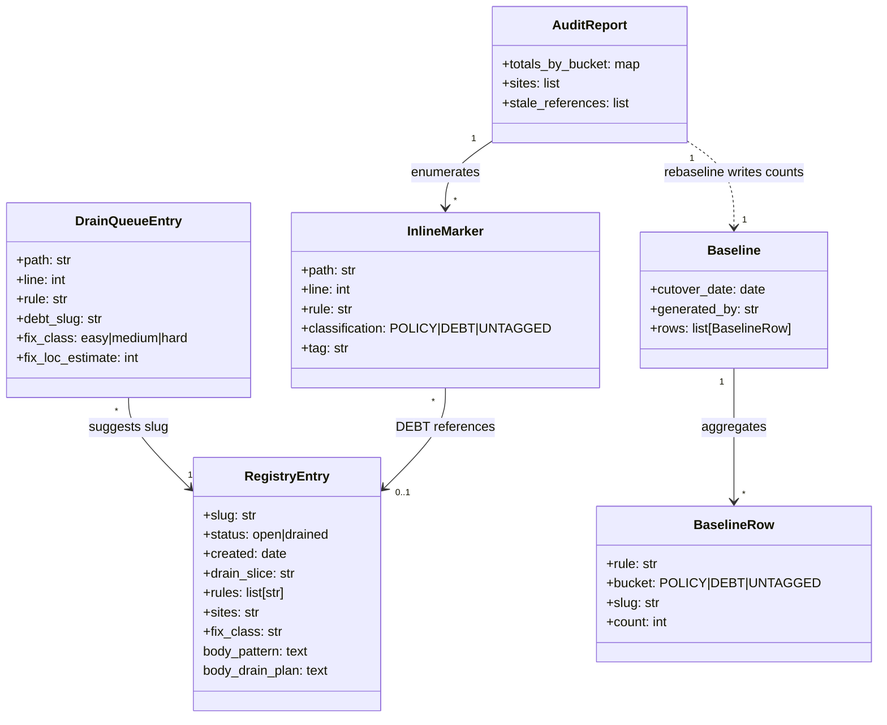
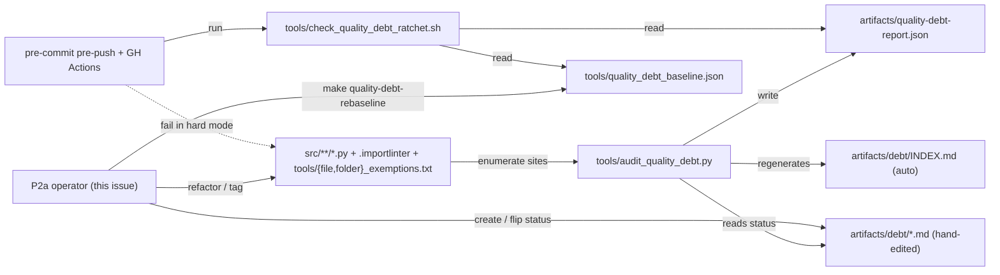

## Context

Source: [`artifacts/frames/1163-quality-debt-drain-frame.mdx`](../frames/1163-quality-debt-drain-frame.mdx) (approved 2026-05-11).
Parent: #1162 — quality-debt invariant (POLICY/DEBT grammar, audit, ratchet, registry).
Policy: [`docs/quality-policy.md`](../../docs/quality-policy.md) · Playbook: [`docs/playbooks/quality-debt-pipeline.md`](../../docs/playbooks/quality-debt-pipeline.md).

Current state at HEAD (`make quality-debt-report`):

| Bucket | Count |
|---|---|
| UNTAGGED rows in `src/` (all rules) | ~222 |
| Largest UNTAGGED clusters | BLE001:60, PLR0913:46, C901:35, PLR0915:14, F401:10, E402:9 |
| REFACTOR-NOW queue (`artifacts/quality-debt-drain-queue.json`) | 30 (wiring:12, typer-default:10, boundary:8) |
| Open DEBT slugs with populated bodies | 4 (file-exemptions, folder-exemptions, importlinter-adr048-transition, importlinter-shared-modules-transitive) |
| Stale references | 0 |
| Malformed tags detected | 1 (`PLR0913 POLICY wiring--` typo, 1 site) |

Cutover deadline (`tools/quality_debt_baseline.json`): **2026-05-18**.

## Goal

Drive `make quality-debt-report` to exit 0 in `src/` (zero UNTAGGED, zero stale_references) before the 2026-05-18 hard-cutover, via a mix of refactor and POLICY/DEBT tagging — without regressing the #1162 hotfix invariants:

- **Audit exit-code semantics** (memory `feedback_audit_exit_codes_in_gates`): scanner exit code = "scanner ran OK / regression" — never "violations count"; verdict belongs in the report.
- **Read→write scope discipline** (memory `feedback_scan_tool_read_vs_write_scope`): mutating tools default-exclude tests/fixtures/packages.
- **Annotation grammar portability** (memory `feedback_annotation_grammar_portability`): `# tag` only in .py/.sh; config files use the trailing form from `docs/quality-policy.md`.

## Users

- **Primary:** Mickael / quality-debt operator running the P2a drain. Per-entry refactor vs POLICY vs DEBT decision.
- **Secondary:** Future contributors hitting the ratchet in hard mode after 2026-05-18; they rely on the registry to know what each `DEBT:<slug>` means.

## Expected Behavior

The drain pass proceeds in **two operator passes that may be interleaved** (S1, S2), followed by a single verify-and-ship slice (S3). Slices 1 and 2 do not have a strict order — the drain-queue is a subset of UNTAGGED rows surfaced as "easy"; processing them first or last is operator preference.

1. **REFACTOR-NOW pass.** Operator walks the 30 drain-queue entries. For each, decides: refactor away the exception (preferred — eliminates the marker) OR accept a POLICY tag (vocab already covers `wiring`, `typer-default`, `boundary`). Drain-queue entries that get refactored disappear; the rest gain inline POLICY suffixes. The malformed `wiring--` tag is corrected in passing. **Note:** after this slice alone, `make quality-debt-report` still shows the residual ~190+ UNTAGGED — Slice 1 does not produce a passing report on its own.

2. **UNTAGGED bulk classification.** For the remaining ~222 untagged rows (minus any addressed in slice 1), operator classifies each into one of three actions: (a) refactor; (b) POLICY:`<existing-tag>` if it matches the vocab (extending `docs/quality-policy.md` when a new structural pattern emerges); (c) DEBT:`<new-slug>` with a fresh `artifacts/debt/<slug>.md` registry file in `status: open`. Where a cluster is large enough to share a slug (e.g. all C901 in migration paths), one slug covers many callsites.

3. **Verify, baseline, PR.** Operator runs `make quality-debt-report` until it exits 0. If net counts dropped, `make quality-debt-rebaseline` is run (without `--reset-cutover`) to commit the lower numbers (cutover date preserved). PR opens with the diff: tag suffixes added, refactors landed, new registry files, baseline JSON updated, any drained slug flipped `status: drained`.

Out-of-scope guardrails enforced throughout:
- Tests, fixtures, packages, tools/ are **never** mutated by this pass (read→write scope, memory: `feedback_scan_tool_read_vs_write_scope`).
- The classifier's `--apply` is **not** re-run wholesale here; if used, scope is explicitly limited to `src/` and operator-reviewed.
- No POLICY tag without a row in `docs/quality-policy.md`; no DEBT:`<slug>` without a matching registry file.
- Annotation grammar respected: `# tag` only in .py/.sh; `.importlinter` and exemption files use the trailing `# DEBT:<slug>` form per `docs/quality-policy.md` table.

## Data Model & Consumers

| Consumer | Fields consumed | When | Status |
|---|---|---|---|
| `audit_quality_debt.py` | InlineMarker, RegistryEntry.status, .slug | every `make quality-debt-report` | this issue |
| `check_quality_debt_ratchet.sh` | Baseline.rows, AuditReport.totals_by_bucket, RegistryEntry.status | pre-push + CI | this issue |
| `INDEX.md` generator | RegistryEntry.{slug, status, rules, sites, drain_slice, created} | end of `make quality-debt-report` | this issue |
| `make quality-debt-rebaseline` | AuditReport.totals_by_bucket | after the drain pass settles | this issue |
| Future P2b/P2-X (tests, packages) | same schema, new scope glob | future drain pass | future (out of scope) |

## Breadboard

| ID | Affordance | Handler | Data touched |
|---|---|---|---|
| S1 | Operator walks `artifacts/quality-debt-drain-queue.json` 1-by-1 | Edit `src/**/*.py` (refactor or add POLICY suffix); 1b1 skill / inline edits | InlineMarker, DrainQueueEntry |
| S2 | `make quality-debt-report` + inspect UNTAGGED rows | `audit_quality_debt.py` (read-only) | AuditReport |
| S3 | Classify each UNTAGGED site → refactor / POLICY / DEBT | Edit source; for DEBT, also Write `artifacts/debt/<slug>.md` with frontmatter + body | InlineMarker, RegistryEntry |
| S4 | Add POLICY vocab row (only if new pattern emerges) | Edit `docs/quality-policy.md` POLICY table | (vocab table) |
| S5 | Flip drained slug (only if all callsites for an open slug eliminated by refactor) | Edit `artifacts/debt/<slug>.md` frontmatter `status: open → drained` | RegistryEntry.status |
| S6 | Fix malformed `wiring--` tag | Edit source line | InlineMarker.tag |
| S7 | `make quality-debt-rebaseline` (only at end, after settle) | `tools/rebaseline_quality_debt.py` | Baseline.rows (preserves cutover_date) |
| S8 | Open PR | `gh pr create`; CI runs ratchet in soft mode (cutover_date in future) | — |

Wiring: (S1 ∥ S3, with S6 folded into S1) → S2 (verify residual) → (S4/S5 as needed during S3) → S2 (re-run until UNTAGGED=0) → S7 → S8. Slices 1 and 2 below correspond to S1+S6 and S3+S4+S5; slice 3 corresponds to S7+S8.

## Slices

| # | Slice | Affordances | Demo | Files touched |
|---|---|---|---|---|
| 1 | REFACTOR-NOW pass (queue cleared) | S1, S6 | `artifacts/quality-debt-drain-queue.json` regenerated and shows 0 'easy' entries (file empty or deleted); all 30 sites either refactored away or POLICY-tagged; malformed `wiring--` fixed. `make quality-debt-report` does **not** yet pass (residual untagged remain). | `src/lyra/bootstrap/**`, `src/lyra/cli*.py`, possibly `docs/quality-policy.md` if new vocab needed |
| 2 | UNTAGGED bulk classification + registry expansion | S3, S4, S5 (gated by S2) | `make quality-debt-report` UNTAGGED rows = 0; new `artifacts/debt/<slug>.md` files for new clusters; existing 4 slugs left as-is unless callsites disappear; INDEX.md regenerated | `src/**/*.py`, `artifacts/debt/<new-slugs>.md`, possibly `docs/quality-policy.md` |
| 3 | Verify, rebaseline, PR | S7, S8 (gated by S2 green) | `make quality-debt-report` exits 0; baseline regenerated (cutover_date preserved); PR opened; pre-push hooks pass | `tools/quality_debt_baseline.json`, `artifacts/debt/INDEX.md` (auto), PR description |

## Success Criteria

- [ ] `make quality-debt-report` exits 0 from the PR branch at HEAD (zero UNTAGGED in `src/`, zero stale_references).
- [ ] Every entry from the original `artifacts/quality-debt-drain-queue.json` (30 entries) is processed — either refactored (site no longer exists / no longer emits the rule) or POLICY-tagged (so it no longer counts as UNTAGGED). Queue file regenerated; 0 'easy' entries remain unaddressed.
- [ ] Per drained slug (if any), registry file frontmatter is `status: drained` — file not deleted.
- [ ] No tests, fixtures, `packages/`, or `tools/` files mutated by this pass — sole exception is `tools/quality_debt_baseline.json` regenerated via `make quality-debt-rebaseline` in slice 3 (corresponds to breadboard S7).
- [ ] Every new `DEBT:<slug>` has a matching `artifacts/debt/<slug>.md` with `status: open`, required frontmatter (slug, status, created, rules), and the four body sections (Pattern, Sites, Drain plan, Notes).
- [ ] Every new `POLICY:<tag>` references a vocab row in `docs/quality-policy.md` (existing or newly added).
- [ ] The malformed `PLR0913 POLICY wiring--` tag is eliminated.
- [ ] Pre-push hooks and CI pass green on the PR. Ratchet runs in soft mode while `today < cutover_date` (today 2026-05-11, cutover 2026-05-18); audit exit-code invariant preserved (`|| true` and `continue-on-error: true` from #1162 hotfix 6cae765f remain unchanged).

## Edge Cases

| Case | Handling |
|---|---|
| `needs_review` rows from classifier surface during the bulk pass | Hand-resolve 1-by-1; do **not** run `classify_quality_debt.py --apply` wholesale (read→write scope rule, #1162 memory) |
| New structural pattern emerges (no existing POLICY tag fits) | Add row to `docs/quality-policy.md` POLICY table in the same commit as the first use; PR description explains |
| All callsites for an existing open slug eliminated by refactor | Flip `status: open → drained`; do not delete file; add a `## Notes` entry citing #1163 |
| Net DEBT count grows for an existing slug (regression) | Allowed only if `make quality-debt-rebaseline` is re-run with PR-description justification |
| Drain-queue entry refers to a site already refactored in the bulk pass | Drop from queue; no separate fix; regenerate queue at end of slice 1 |
| Cutover deadline (2026-05-18) approaches with drain incomplete | Push cutover by running `make quality-debt-rebaseline -- --reset-cutover` (resets to today+7d) — must be in a dedicated commit, justified in PR description, no maximum extension defined here |
| Refactoring a wiring callsite shortens a file already in `tools/file_exemptions.txt` below the 300-line gate | Remove the exemption entry in the same commit; if it crosses back into compliance, leave the registry slug `open` until all entries drain |
| `make quality-debt-report` exits non-zero in CI or pre-push | Distinguish script crash (Python stack trace on stderr) from a ratchet regression verdict (report content). Hotfix 6cae765f guarantees `|| true` / `continue-on-error: true`; verdict comes from the report parse, not the exit code |
| `.pre-commit-config.yaml` ruff format runs and dirties shared worktree (memory: `feedback_pre_commit_ruff_contaminates_shared_worktree`) | Implement in an isolated worktree; if /plan spawns multiple parallel fixers, each runs in its own `isolation: "worktree"` |
| `uv run` re-resolves a stale `uv.lock` and the pre-commit hook trips on the regen | Export `UV_FROZEN=1` in the shell before `git push` (memory: `feedback_uv_frozen_for_pre_push`); do **not** use `--no-verify` |
