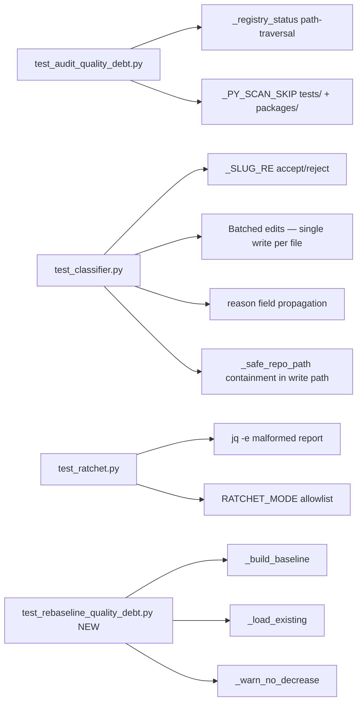

## Context

Promoted from [frame #1165](../frames/1165-quality-debt-test-coverage-frame.mdx).

PR #1164 (quality-debt invariant, slice 1 of #1162) merged with iter-2 of `/code-review` flagging 9 non-blocking test-coverage gaps. The production code is correct and shipped; tests are missing. This spec covers the test additions only — zero changes to `tools/*.py` or `tools/*.sh`.

## Goal

Add 9 regression tests across 4 files in `tests/tools/` so every iter-2-flagged behavior (path-traversal guards, slug regex, batched edits, ratchet error-paths, rebaseline coverage) is locked in before further iteration.

## Users

- **Primary:** maintainers of `tools/audit_quality_debt.py`, `tools/classify_quality_debt.py`, `tools/check_quality_debt_ratchet.sh`, `tools/rebaseline_quality_debt.py`.
- **Secondary:** CI / quality-debt ratchet consumers — green pre-commit + ratchet stays unbroken.

## Expected Behavior

After this slice merges:

1. `uv run pytest tests/tools/ -v` shows 9 new tests (plus the new `test_rebaseline_quality_debt.py` module), all GREEN.
2. Coverage report for `tools/audit_quality_debt.py` and `tools/classify_quality_debt.py` shows path-traversal branches (`_SLUG_RE` reject, `_safe_repo_path` containment) hit.
3. Pre-commit + ratchet gate run cleanly on the test additions (no new POLICY/DEBT tags in `tests/` because `_PY_SCAN_SKIP` already excludes `tests/`).
4. `tests/tools/test_rebaseline_quality_debt.py` exercises `_build_baseline`, `_load_existing`, and `_warn_no_decrease`.

No production code changes. No new fixtures beyond what's needed per-test.

## Data Model & Consumers

| Consumer | Fields / branches | When | Status |
|---|---|---|---|
| `test_audit_quality_debt.py` | `_registry_status` (slug guard), `_PY_SCAN_SKIP` set | per-test | this issue |
| `test_classifier.py` | `_SLUG_RE`, batched-edit dedup, `reason` field, `_safe_repo_path` | per-test | this issue |
| `test_ratchet.py` | `jq -e` pre-check, `RATCHET_MODE` allowlist | per-test | this issue |
| `test_rebaseline_quality_debt.py` (NEW) | `_build_baseline`, `_load_existing`, `_warn_no_decrease` | per-test | this issue |

## Breadboard

### Test affordances per slice

| ID | Test target | File | Function exercised | Assertion shape |
|----|-------------|------|---------------------|------------------|
| T1 | Path-traversal `_registry_status` | `test_audit_quality_debt.py` | `_registry_status(root, "../foo")` | returns `"open"` (verified: source returns `"open"` on slug regex failure or path-traversal containment failure; `tools/audit_quality_debt.py:160-169`) |
| T2a | Slug regex accept | both `test_audit_quality_debt.py` AND `test_classifier.py` (see Wiring) | `_SLUG_RE.fullmatch("valid-slug-1")` | match ≠ None |
| T2b | Slug regex reject | both files (see Wiring) | uppercase / slashes / leading dash / empty | match == None |
| T3 | Batched edits dedup | `test_classifier.py` | classifier apply on file w/ 2+ POLICY tags | file written once, both lines updated |
| T4a | `_build_baseline` | `test_rebaseline_quality_debt.py` (NEW) | feed sample report | returns dict with keys `{generated_by, generated_at, cutover_date, counts}`; `counts` reflects `report["counts_by_rule_bucket_slug"]`; `cutover_date` honors existing baseline unless `reset_cutover=True` |
| T4b | `_load_existing` | same | read existing baseline file | returns parsed dict for existing file; returns `None` for missing file; returns `None` for malformed JSON (verified: `tools/rebaseline_quality_debt.py:27-33`) |
| T4c | `_warn_no_decrease` | same | new ≥ old → warns; new < old → silent | stderr/return signal asserted |
| T5 | `_PY_SCAN_SKIP` excludes `tests/` + `packages/` | `test_audit_quality_debt.py` | run scan over tmp tree with both | results ∋ source paths, ∌ tests/packages paths |
| T6 | `jq -e` malformed report | `test_ratchet.py` | run ratchet shell with bad JSON | exit ≠ 0, stderr mentions schema |
| T7 | `RATCHET_MODE` allowlist | `test_ratchet.py` | set RATCHET_MODE=bogus | exit ≠ 0, stderr names allowed values |
| T8 | `reason` field propagation | `test_classifier.py` | classify a row with reason | drain-queue output JSON contains `reason` |
| T9 | `_safe_repo_path` containment in write path | `test_classifier.py` | apply edit with path escaping root | `_safe_repo_path` returns `None`, no write |

### Wiring

- T1, T9 share intent (containment). Place T1 in audit tests (`_registry_status` lives there), T9 in classifier tests (`_safe_repo_path` lives there, exercised in apply path around line 400/434).
- T2 split across both audit + classifier: each module defines its own `_SLUG_RE` (audit:30, classifier:74). Add a parametrized test in **each** test file to lock both copies. If both prove identical, future refactor can dedupe; the duplicate test cost is small.
- T4 introduces a new test file. Follow the layout of `test_audit_quality_debt.py` for fixtures (use `tmp_path`).

## Slices

| # | Slice | Files touched | Tests | Demoable |
|---|-------|---------------|-------|----------|
| 1 | **Audit hardening** | `tests/tools/test_audit_quality_debt.py` | T1, T2 (audit copy), T5 | `pytest tests/tools/test_audit_quality_debt.py -v` shows 3 new GREEN |
| 2 | **Classifier coverage** | `tests/tools/test_classifier.py` | T2 (classifier copy), T3, T8, T9 | `pytest tests/tools/test_classifier.py -v` shows 4 new GREEN |
| 3 | **Ratchet + rebaseline** | `tests/tools/test_ratchet.py`, `tests/tools/test_rebaseline_quality_debt.py` (NEW) | T4a, T4b, T4c, T6, T7 | `pytest tests/tools/test_ratchet.py tests/tools/test_rebaseline_quality_debt.py -v` shows 5 new GREEN |

Slices are independent — each can land as its own commit, each independently demoable. Recommended order: 1 → 2 → 3 (audit is the most-cited surface; classifier depends on slug grammar locked first; ratchet/rebaseline is pure tooling).

## Success Criteria

- [ ] T1: `_registry_status` returns `"open"` for a slug containing `..`, `/`, or other regex-failing characters (path-traversal containment branch in `tools/audit_quality_debt.py:160-169`)
- [ ] T2: parametrized cases prove `_SLUG_RE` accepts canonical slugs and rejects uppercase, slashes, leading dash, empty string — duplicated in **both** `tests/tools/test_audit_quality_debt.py` AND `tests/tools/test_classifier.py` (one assertion per source-of-truth regex)
- [ ] T3: classifier apply on a file with ≥2 POLICY tags writes that file exactly once and both lines reflect the edit
- [ ] T4a: `_build_baseline` returns a dict with keys `{generated_by, generated_at, cutover_date, counts}`, where `counts` equals `report["counts_by_rule_bucket_slug"]` and `cutover_date` is preserved from an existing baseline unless `reset_cutover=True`
- [ ] T4b: `_load_existing` returns a parsed dict for an existing valid JSON file; returns `None` for a missing file; returns `None` for malformed JSON
- [ ] T4c: `_warn_no_decrease` emits a `WARN: no decrease …` message to stderr when new count ≥ old (and old > 0); silent otherwise
- [ ] T5: scan with `tests/` and `packages/` subdirs present excludes both; source dirs included
- [ ] T6: ratchet shell with malformed JSON exits non-zero with stderr referencing the missing key / schema
- [ ] T7: ratchet shell with `RATCHET_MODE=bogus` exits non-zero with stderr listing valid modes
- [ ] T8: classifier output JSON for the drain queue carries the `reason` field from row classification
- [ ] T9: `_safe_repo_path` returns `None` for a path escaping root; classifier apply path does not write in that case
- [ ] `uv run pytest tests/tools/ -v` exits 0
- [ ] Pre-commit + ratchet gates pass on the test additions
- [ ] PR diff touches only `tests/tools/` paths — no changes to `tools/*.py`, `tools/*.sh`, or any production file (machine-checkable scope boundary; if a test surfaces a real defect, file a follow-up issue)

## Notes / Risks

- **Symbol drift:** the issue body says "`_safe_repo_path` containment in `_write_inline`" — `grep` confirms `_safe_repo_path` exists (`tools/classify_quality_debt.py:81`) but there is no symbol literally named `_write_inline`; the actual write call sites are around `tools/classify_quality_debt.py:400` and `:434`. Implementation should target the real write path. Not a blocker — covered by T9 phrasing.
- **Duplicate `_SLUG_RE`:** the same regex is defined twice (audit:30, classifier:74). T2 covers both deliberately — out of scope to dedupe in this slice.
- No production code changes. If any test surfaces a real defect, file a follow-up issue rather than fixing here.
