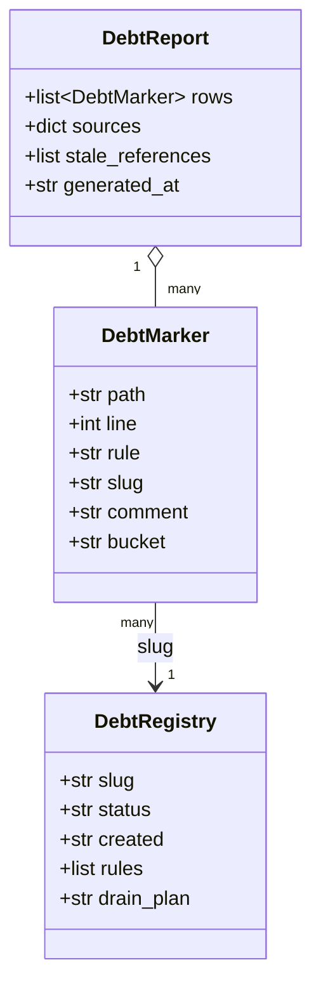
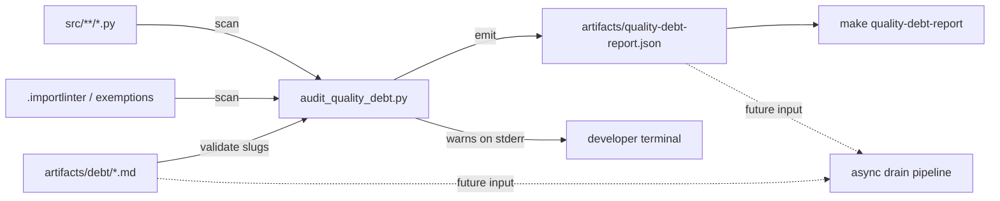

## Context

Promoted from [`1175-quality-debt-dismantle-frame.mdx`](../frames/1175-quality-debt-dismantle-frame.mdx). PR #1164 (issue #1162) shipped a POLICY/DEBT tag grammar plus a ratchet gate. Observation after a few days in production: the system normalises exceptions instead of pressuring code quality. Adding `# noqa: PLR0913 — POLICY:wiring` is a 10-second action; refactoring the underlying smell is hours. The POLICY vocabulary became a menu of pre-approved excuses, and ~80 % of the 196 POLICY sites are real code smells dressed as legitimate patterns.

Decision: strip the coercive layer (ratchet, baseline, hard-mode cutover, pre-push and CI gates), drop the POLICY half of the grammar, and keep the system as a pure observability layer whose `artifacts/debt/` registry is the input queue for a future async debt-drain pipeline (separate epic).

## Goal

Replace the ratchet-and-POLICY system with an observability-only debt tracking layer that warns but never fails, and migrate all 196 existing POLICY markers in `src/` to honest `DEBT:<slug>` entries that a future async pipeline can consume.

## Users

- **Lyra developers** — no longer fight a ratchet, no longer pick from a POLICY menu, no longer blocked at pre-push or CI on debt findings
- **Future async drain pipeline** (separate epic) — consumes `artifacts/debt/<slug>.md` registry files as its work queue; this spec preserves that input format
- **Code reviewers** — see honest `DEBT:<slug>` signals instead of `POLICY:<tag>` rubber stamps

## Expected Behavior

A developer pushes a branch containing a new `# noqa: BLE001 — DEBT:boundary-broad-catch`. The pre-push hook runs `tools/audit_quality_debt.py`, which scans `src/` for suppression markers, validates that every marker is tagged `— DEBT:<slug>` and that every referenced slug has a matching `artifacts/debt/<slug>.md` registry file. Any untagged marker or dangling slug is reported as a warning on stderr. The audit always exits 0. The pre-push hook does not block the push.

CI runs the same audit step as an informational job — it appears in the build output for visibility but never fails the build. The `artifacts/quality-debt-report.json` file produced by the audit is the canonical machine-readable inventory: it lists every marker site, its rule, its slug, and is the future async pipeline's input.

When a developer wants to add a new debt-tagged exception, the path is: (a) create or reuse `artifacts/debt/<slug>.md` with `status: open` frontmatter, (b) append `— DEBT:<slug>` to the marker. There is no PR template hook, no commit-msg validator, no quota — only the audit warning if either step is skipped. The system trusts the developer to follow the grammar; non-compliance produces noisy reports but no friction.

The future async drain pipeline (out of scope here) reads `artifacts/debt/<slug>.md` files where `status: open`, schedules refactors, and flips `status: drained` once all callsites are gone. That mechanism does not exist in this issue; this spec only delivers the input format.

## Data Model & Consumers

| Consumer | Fields consumed | When | Status |
|---|---|---|---|
| `tools/audit_quality_debt.py` | DebtMarker.* (writes) | every audit run | this issue |
| `make quality-debt-report` | DebtReport.rows, stale_references | manual + CI informational job | this issue |
| `tools/classify_quality_debt.py` | DebtMarker (path, line, rule, comment) | one-shot during reclassification | this issue |
| pre-push hook | DebtReport stderr warnings | every push | this issue |
| async drain pipeline | DebtRegistry.{slug, status, sites}, DebtMarker.{path, line, rule} | future | out of scope |

The `DebtMarker.bucket` field is retained for backwards compatibility with existing report consumers but its value space narrows: `DEBT | UNTAGGED`. The value `POLICY` is removed.

## Breadboard

### Affordances (T = tool, D = doc, R = registry, M = marker rewrite)

| ID | Affordance | Handler | Data | Type |
|---|---|---|---|---|
| T1 | `tools/audit_quality_debt.py` | scan + emit + warn | reads src/, configs, registry; writes `artifacts/quality-debt-report.json` | tool (simplified) |
| T2 | `tools/classify_quality_debt.py` | one-shot reclassifier | reads ex-POLICY markers; rewrites to DEBT:slug | tool (gains `--migrate-policy`) |
| T3 | `make quality-debt-report` | invokes T1 | exits 0 | makefile target |
| D1 | `docs/debt-tracking.md` | rendered docs | grammar + workflow + registry conventions | doc (renamed from quality-policy.md) |
| R1 | `artifacts/debt/<cluster>.md` × 8 | registry files | frontmatter + sections | data |
| M1 | inline marker rewrites in `src/lyra/` | one-shot bulk via T2 | `POLICY:<tag>` → `DEBT:<slug>` | code edit |
| X1 | `tools/check_quality_debt_ratchet.sh` | — | deleted | removal |
| X2 | `tools/quality_debt_baseline.json` | — | deleted | removal |
| X3 | `tools/rebaseline_quality_debt.py` | — | deleted | removal |
| X4 | Makefile `quality-debt-rebaseline` target | — | removed | removal |
| X5 | Lefthook `quality-debt-ratchet` step | — | removed from `lefthook.yml` | removal |
| X6 | CI workflow ratchet step | — | removed from `.github/workflows/*` | removal |

### Wiring

- T1 reads `src/`, `.importlinter`, `tools/file_exemptions.txt`, `tools/folder_exemptions.txt`, `artifacts/debt/*.md`
- T1 emits `artifacts/quality-debt-report.json` and prints warnings on stderr; always exits 0
- T2 invoked once via `tools/classify_quality_debt.py --migrate-policy` to perform M1
- Pre-push hook runs T1 as an info step (exit code ignored, output preserved)
- CI runs T1 in an informational job step (`continue-on-error: true` or no failure semantics)

### Cluster slugs (R1 — 8 new files)

| ex-POLICY tag | New DEBT slug | Sites | Rules |
|---|---|---|---|
| `boundary` | `boundary-broad-catch` | 74 | BLE001 |
| `wiring` | `wiring-bootstrap-deps` | 70 | PLR0913, C901 |
| `defensive-narrow` | `defensive-narrow-payloads` | 16 | pyright narrowing |
| `re-export` | `re-export-init` | 12 | F401 |
| `typer-default` | `typer-default-option` | 10 | B008 |
| `migration-sequence` | `migration-sequence-bootstrap` | 7 | C901, PLR0915 |
| `protocol-private` | `protocol-private-ducktyping` | 4 | pyright Protocol |
| `module-level-patch` | `module-level-patch-fixtures` | 3 | F401, E402 |

Each registry file uses the existing schema (frontmatter: `slug`, `status: open`, `created`, `rules`; body: `## Pattern`, `## Sites`, `## Drain plan`, `## Notes`). The `## Drain plan` section may reference the future async pipeline as the executor.

## Slices

| # | Slice | Demo | Deliverables |
|---|---|---|---|
| A | Decommission ratchet & baseline | pre-push / CI no longer fail on debt findings; ratchet shell + baseline JSON absent from repo | X1, X2, X3, X4, X5, X6 |
| B | Simplify audit + rename doc + create registry stubs | `tools/audit_quality_debt.py` warns-only, emits report with no `POLICY` bucket; `docs/debt-tracking.md` exists and replaces `quality-policy.md`; 8 new registry stubs committed | T1 simplified, T3 updated, D1, R1 (8 files) |
| C | Reclassify markers via classifier + close #1163 | `make quality-debt-report` shows 0 `POLICY` rows and 0 `UNTAGGED` rows in `src/lyra/`; issue #1163 closed with state `not_planned` referencing #1175 | T2 (with `--migrate-policy`), M1 (~196 inline rewrites in `src/`) |

Slices are independently demoable: after A, the system is no longer coercive but tags remain POLICY-shaped; after B, the new grammar and registry exist but markers in `src/` are temporarily reported as untagged (warnings only — non-blocking); after C, the codebase is migrated and consistent. C depends on B (needs the 8 registry files to exist before slug references resolve), B depends on A only by convention (cleaner to land removals first).

## Success Criteria

- [ ] `tools/check_quality_debt_ratchet.sh` does not exist in the repo
- [ ] `tools/quality_debt_baseline.json` does not exist in the repo
- [ ] `tools/rebaseline_quality_debt.py` does not exist in the repo
- [ ] `make quality-debt-rebaseline` is not a Makefile target
- [ ] `lefthook.yml` has no step that runs a debt-related script with failure semantics
- [ ] No file in `.github/workflows/` fails the build on debt-related findings
- [ ] `tools/audit_quality_debt.py` exits 0 on any input, including untagged markers
- [ ] `artifacts/quality-debt-report.json` contains no row where `bucket == "POLICY"`
- [ ] `artifacts/quality-debt-report.json` contains no row where `bucket == "UNTAGGED"` for paths under `src/lyra/`
- [ ] Every `DEBT:<slug>` referenced from `src/` has a matching `artifacts/debt/<slug>.md` registry file with `status: open`
- [ ] `docs/quality-policy.md` no longer exists; `docs/debt-tracking.md` exists with sections: Grammar, Registry Conventions, Adding a DEBT entry, Workflow
- [ ] Issue #1163 is closed with state `not_planned` and a comment linking to #1175
- [ ] `git diff` for this change shows no edits in `src/` other than comment rewrites (no behavioural code changes)
- [ ] `make quality-debt-report` succeeds and produces a valid JSON file

## Edge Cases

| Case | Handling |
|---|---|
| Existing `DEBT:<slug>` markers (87 in baseline) reference slugs that already exist | No rewrite needed; audit confirms registry presence |
| Markers in `tests/` or `packages/` carrying POLICY tags | Out of scope — unchanged |
| Stale references in old baseline `cutover_date` documentation | Doc rewrite (D1) supersedes; no migration needed since baseline JSON is deleted |
| Registry files referenced by existing DEBT markers but with `status: drained` (none currently) | Audit warns but does not fail; same behaviour as before |
| Future re-introduction of POLICY in code | Audit treats as UNTAGGED → warning; no enforcement |
| `tools/classify_quality_debt.py --migrate-policy` ambiguous match (marker text doesn't map cleanly to a cluster) | Classifier prints unmatched markers to stderr; operator handles manually before commit |
