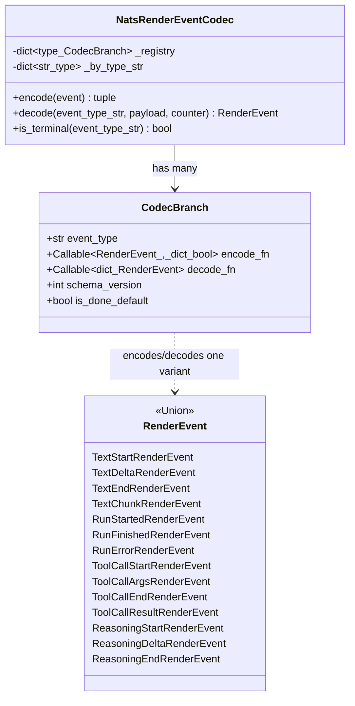
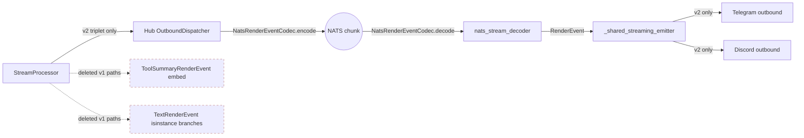

## Context

- **Frame:** `artifacts/frames/1192-codec-registry-v2-cutover-frame.mdx`
- **Analysis:** `artifacts/analyses/1192-codec-registry-v2-cutover-analysis.mdx`
- **Panel consensus (motivated split):** `artifacts/analyses/1190-codec-review-findings-consensus.mdx` — architect/backend-dev/security-auditor, 3-0 high confidence, 2026-05-14.
- **Epic:** #1096 (render-event v2 modeling). Epic-level ADR: `docs/architecture/adr/070-render-event-v2-agui-modeling.mdx`.
- **Original umbrella:** #1102 (now split — see panel consensus). Sibling: #1191 (integration test, **merged** in `2cf24f19`). Sub-tracker: #1177 (closes as part of this slice).
- **Shape chosen:** **Shape 2 — hardening-first, cutover-last** (analysis Fit Check). Codec rewritten exactly once; every commit CI-green; snapshots-before-removal natural; aligned with panel verdict.

## Goal

Replace `NatsRenderEventCodec`'s 32 hand-written if-elif branches with a `dict[Type[RenderEvent], CodecBranch]` registry, drop the v1 dual-emit surface (`TextRenderEvent`, `ToolSummaryRenderEvent`) atomically across hub + telegram + discord, and remove the file-length exemption — all in one F-full PR, four CI-green commits.

## Users

- **Primary (runtime):** `lyra-hub`, `lyra-telegram`, `lyra-discord` — must deploy atomically because `SCHEMA_VERSION_RENDER` floor bumps cause receivers on older versions to loud-fail by design.
- **Primary (contributors):** future authors of new `RenderEvent` subtypes — registry-completeness test fails loud at CI on a missed entry, rather than silently routing to a default.
- **Secondary (ops):** the SRE who runs the schema-floor release. New runbook section in `docs/ops/container-publishing.md` lays out the manual atomic-restart procedure (auto-update timer does **not** respect Quadlet `After=`).

> **Closes sub-issue #1177** as part of this slice's commits (three deferred items: S2 stream_processor test rewrites, S3 adapter snapshot gates, N6 dynamic `test_all_exports_complete`). #1177 is not a user — it is a tracker that links to acceptance items, encoded in the relevant slice rows below.

**Explicit non-users:**
- `lyra-clipool` does **not** participate in the schema handshake (clipool is on the LLM-driver path `lyra.clipool.cmd`, not a RenderEvent receiver).
- `lyra start` (unified single-process mode) is **immune** to version skew by construction (hub + adapters in one process → same SCHEMA_VERSION_RENDER at boot, always).

## Expected Behavior

**Steady-state after the slice ships:**

1. The hub publishes a streaming render-event chunk to NATS. `NatsRenderEventCodec.encode()` looks up the event's runtime type in a registry, returns `(event_type_str, payload_dict, is_done)` from the matching `CodecBranch`. There are no `isinstance` chains; adding a new event type is one registry insertion + the completeness test stays green.

2. The adapter receives the chunk. `NatsRenderEventCodec.decode(event_type, payload)` looks up the registry by the `event_type` string, runs the branch's `decode_fn` inside a per-branch `try/except (TypeError, ValueError, KeyError)`. On exception: log at exception level, return `None`, the upstream `decode_stream_events` aborts the stream cleanly (no silent default-routing).

3. `nats_stream_decoder.py:122` reads `chunk.get("event_type")` (no default). The handling order is strict:
   1. `event_type is None` → `log.warning(…)` + `break`
   2. `event_type == "stream_error"` → `break`
   3. otherwise → `_codec.decode(event_type, payload, …)`.

   **Synthetic terminal sentinels.** `stream_end` and `stream_error` are **not** in the `RenderEvent` union and therefore **not** in `_registry`. The codec maintains a hard-coded module-level set `_SYNTHETIC_TERMINALS = frozenset({"stream_end", "stream_error"})`. `decode()` checks membership in `_SYNTHETIC_TERMINALS` **before** registry lookup and returns `None` for those event types (matching today's behavior — codec:374-377). `is_terminal()` returns `True` iff `event_type ∈ _SYNTHETIC_TERMINALS ∨ branch.is_done_default` for the matching `CodecBranch` (covering `run_finished` and `run_error`). This preserves the current behavior (no spurious "unknown event_type" warning on clean stream close) while keeping the registry the single source of truth for `RenderEvent`-derived dispatch.

4. v1 types are gone: `grep -rEn "ToolSummaryRenderEvent" src/ tests/` and `grep -rEn "from.*\bTextRenderEvent\b" src/ tests/` both return zero matches. The `RenderEvent` union contains only the v2 types + non-text types.

5. `stream_processor.py` emits **only** the v2 triplet (`TextStart`/`Delta`/`End`/`Chunk`) and tool-call v2 events. No `yield TextRenderEvent(...)` lines remain.

6. `render_event_codec.py` is < 300 LOC; `tools/file_exemptions.txt` has no `render_event_codec.py` line.

7. Schema-floor release procedure: ops follows `docs/ops/container-publishing.md` § "Schema-floor releases" — stops the auto-update timer, pulls, restarts hub + telegram + discord atomically, restarts the timer. **`lyra-clipool` is intentionally excluded** from the schema-floor restart sequence — it is on the LLM-driver path (`lyra.clipool.cmd`), not a RenderEvent receiver, and does not participate in the schema handshake. The runbook section makes this exclusion explicit so an operator does not mistake the omission for an oversight relative to the generic "M1 manual pull + restart" pattern above it.

## Data Model & Consumers

### Registry data structure



The registry is built once at class construction. `_by_type_str` is the inverse
index built from `_registry` to keep `decode()` O(1) on `event_type` string.
Both maps are immutable after `__init__`.

### Consumer map



Solid edges = surviving paths this slice rewires to v2.
Dashed nodes = deleted v1 paths.

### Consumer summary table

| Consumer | Fields consumed today | After slice | Status |
|---|---|---|---|
| `stream_processor.py` | emits both v1 + v2 (dual-emit) | emits v2 only | rewrites in this issue |
| `_shared_streaming_state.py` | `isinstance(event, TextRenderEvent)` v1 path | v2 triplet accumulator only | this issue |
| `_shared_streaming_emitter.py` | dual-emit branches; `ToolSummaryRenderEvent` recap embed | v2 only; no recap embed | this issue |
| `telegram_outbound.py` | `_format_tool_summary` + `ToolSummary` edit-trace | deleted | this issue |
| `discord_outbound.py` | `_build_tool_embed` + `ToolSummary` edit-trace | deleted | this issue |
| `pool_processor_streaming.py` | `isinstance(event, TextRenderEvent)` for echo | v2 triplet accumulator | this issue |
| `outbound_tts.py` | skips `TextRenderEvent` for voice | skips v2 triplet types | this issue |
| `outbound_streaming.py` | `TextRenderEvent` is_final terminus | `TextEnd` terminus | this issue |
| `nats_stream_decoder.py:122` | `chunk.get("event_type", "text")` default | explicit `None → log+break` first | this issue |
| `lyra-clipool` | not a render-event receiver | unchanged | out of scope |
| `lyra start` (unified) | in-process; no version skew possible | unchanged | out of scope |

## Breadboard

### Surface elements (affordances)

| ID | Affordance | Type | Handler |
|----|-----------|------|---------|
| C-1 | `NatsRenderEventCodec._registry: dict[type, CodecBranch]` | code | builds in `__init__` |
| C-2 | `CodecBranch` dataclass | code | `event_type: str`, `encode_fn`, `decode_fn`, `schema_version`, `is_done_default` |
| C-3 | `encode(event)` registry lookup + invoke | code | runtime type → branch → call |
| C-4 | `decode(event_type, payload, counter)` registry lookup + per-branch try/except | code | string → branch → wrapped call |
| C-5 | `is_terminal(event_type)` synthetic-set + registry-driven | code | `event_type ∈ _SYNTHETIC_TERMINALS` (hard-coded `{"stream_end", "stream_error"}`) ∨ matching `CodecBranch.is_done_default` (covers `run_finished`, `run_error`) |
| D-1 | Decoder fix at `nats_stream_decoder.py:122` (None-first ordering) | code | strict 3-branch ladder |
| T-1 | `tests/nats/test_render_event_codec.py::TestRegistryCompleteness` | test | `set(typing.get_args(RenderEvent)) == set(_registry.keys())` |
| T-2 | `tests/nats/test_render_event_codec.py::TestDecodeErrorAbort` | test | per-branch: bad payload raises → decode returns None |
| T-3 | `tests/nats/test_render_event_codec.py::test_decode_missing_event_type_breaks_first` | test | None event_type aborts BEFORE stream_error check |
| T-4 | `tests/adapters/test_telegram_snapshots.py` (new) | test | single-block / multi-block / error snapshots |
| T-5 | `tests/adapters/test_discord_snapshots.py` (new) | test | same three scenarios for discord |
| T-6 | `tests/core/test_render_events.py::test_all_exports_complete` dynamic | test | enumerates `typing.get_args(RenderEvent)` instead of comparing against a hardcoded set literal (implementation detail; SC checks only that the test passes after v1 union members are removed) |
| T-8 | `tests/nats/test_render_event_codec.py::test_is_terminal_synthetic_sentinels` | test | `is_terminal("stream_end")` and `is_terminal("stream_error")` both return `True` after registry refactor |
| T-9 | `tests/nats/test_render_event_codec.py::test_decode_synthetic_sentinel_no_warning` | test | `decode("stream_end", {})` returns `None` without emitting `log.warning("unknown event_type")` (asserts `_SYNTHETIC_TERMINALS` short-circuits the registry lookup) |
| T-7 | `tests/core/test_stream_processor.py` v2-triplet rewrites | test | `test_text_only`, `test_single_edit`, `test_single_edit_no_intermediate` — drop `strip_run_lifecycle` filter |
| R-1 | `SCHEMA_VERSION_TEXT_RENDER_EVENT` constant | code | DELETE |
| R-2 | `SCHEMA_VERSION_TOOL_SUMMARY_RENDER_EVENT` constant | code | DELETE |
| R-3 | `TextRenderEvent` dataclass | code | DELETE from `render_events.py` |
| R-4 | `ToolSummaryRenderEvent` dataclass | code | DELETE from `render_events.py` |
| R-5 | `tool_recap_format.py` formatter module | code | **DELETE FILE** |
| R-6 | `# pyright: ignore[reportUnreachable]` override | code | DELETE (registry makes branch unreachable by construction) |
| F-1 | `tools/file_exemptions.txt` line for `render_event_codec.py` | config | DELETE (after LOC verification) |
| O-1 | `docs/ops/container-publishing.md` § "Schema-floor releases" | doc | NEW section with manual atomic-restart commands |
| O-2 | New ADR (next slot: 072) — codec registry pattern | doc | NEW, supersedes ADR-032 |
| O-3 | ADR-032 superseded banner | doc | EDIT — `status: superseded`, redirect to ADR-072 |
| O-4 | `CHANGELOG.md` coordinated-deploy entry | doc | NEW entry, names the schema-floor release procedure |
| O-5 | `docs/architecture/messaging.md` | doc | EDIT — describe the live registry pattern (per ADR consolidation memory) |

### Wiring

```
encode path:
  RenderEvent instance
    → type(event)
    → _registry[type(event)]
    → branch.encode_fn(event)
    → (branch.event_type, payload_dict, is_done)

decode path:
  (event_type_str, payload_dict, counter)
    → _by_type_str.get(event_type_str)
      → None: log unknown + counter inc + return None
      → CodecBranch:
          schema_version check (per-branch expected version)
            → fail: counter inc + return None
            → pass: try: branch.decode_fn(payload)
                    except (TypeError, ValueError, KeyError): log + return None
```

## Slices

| # | Name | Files (key) | CI-green at end? | Behavior change | Sub-issue items closed |
|---|------|------------|------------------|------------------|------------------------|
| 1 | **Test plumbing (snapshots + dynamic exports)** | `tests/adapters/test_telegram_snapshots.py` (new), `tests/adapters/test_discord_snapshots.py` (new), `tests/core/test_render_events.py` (N6) | ✓ | none — additive tests | #1177 S3 + N6 |
| 2 | **Codec registry refactor + decoder fix + ADR-072** | `src/lyra/nats/render_event_codec.py` (rewrite to registry, both v1+v2 entries; introduce `_SYNTHETIC_TERMINALS` module-level frozenset; remove `# pyright: ignore[reportUnreachable]`), `src/lyra/adapters/nats/nats_stream_decoder.py:122` (None-first ordering), `tests/nats/test_render_event_codec.py` (T-1, T-2, T-3, T-8, T-9), `docs/architecture/adr/072-codec-registry-pattern.mdx` (new) | ✓ | none — internal refactor, same wire output | — |
| 3 | **v1 cutover atomic** | `src/lyra/core/messaging/render_events.py` (delete `TextRenderEvent`, `ToolSummaryRenderEvent`, `SCHEMA_VERSION_TEXT_RENDER_EVENT`, `SCHEMA_VERSION_TOOL_SUMMARY_RENDER_EVENT`; shrink `RenderEvent` union), `src/lyra/core/messaging/tool_recap_format.py` (**DELETE**), `src/lyra/core/messaging/__init__.py` + `src/lyra/core/__init__.py` (drop v1 re-exports), `src/lyra/nats/render_event_codec.py` (remove v1 entries from `_registry`; drop v1 imports), `src/lyra/core/processors/stream_processor.py` (drop 5 dual-emit `yield TextRenderEvent(...)` sites), **seven consumer paths** enumerated explicitly: (1) `src/lyra/adapters/shared/_shared.py` (drop `ToolSummaryRenderEvent` import + `format_tool_summary_header`), (2) `src/lyra/adapters/shared/_shared_streaming_state.py` (drop v1 `TextRenderEvent` accumulator + `on_final_text` handler), (3) `src/lyra/adapters/shared/_shared_streaming_emitter.py` (drop dual-emit `isinstance(event, TextRenderEvent)` branches + `ToolSummaryRenderEvent` recap), (4) `src/lyra/adapters/telegram/telegram_outbound.py` (drop `_format_tool_summary` + `ToolSummary` edit_trace), (5) `src/lyra/adapters/discord/discord_outbound.py` (drop `_build_tool_embed` + `ToolSummary` edit_trace), (6) `src/lyra/core/pool/pool_processor_streaming.py` (swap v1 capture for v2 triplet accumulator), (7) `src/lyra/core/hub/outbound/outbound_tts.py` + `src/lyra/core/hub/outbound/outbound_streaming.py` (v1 isinstance → v2 type checks). Plus `src/lyra/core/hub/hub_protocol.py` (docstring), tests: `tests/core/test_stream_processor.py` (T-7), `tests/adapters/test_shared.py`, `tests/adapters/test_streaming_emitter_toolcall_v2.py`, **`tests/nats/test_render_event_wire_roundtrip.py`** (from #1191 — drop `TextRenderEvent` + `ToolSummaryRenderEvent` imports + samples; the file's completeness guard at line 115 will assert the new smaller union). Docs: `docs/architecture/adr/032-*.mdx` (`status: superseded` + redirect to ADR-072), `docs/architecture/messaging.md` (registry pattern live doc, per ADR consolidation memory), `CHANGELOG.md` (coordinated-deploy entry), `docs/ops/container-publishing.md` (new `## Schema-floor releases` heading inserted **between** `## M1 manual pull + restart` and `## M1 GHCR auth`). | ✓ | **yes** — wire-visible: v1 chunks no longer published; SCHEMA_VERSION_RENDER floor bumped | #1177 S2 |
| 4 | **File-exemption removal** | `tools/file_exemptions.txt` | ✓ | none — gate cleanup | — |

Slice independence: Slice 1 (additive tests) can be reverted alone. Slice 2 (registry refactor) can be reverted alone. **Slice 3 cannot be reverted alone** — Slice 2's registry references v1 types that Slice 3 deletes; revert order must be 3 then 2. This rollback constraint is encoded in CHANGELOG and is the reason image-tag rollback (via Quadlet `Image=`) is the recommended prod path.

**Smart splitting note:** |slices| = 4 and |success criteria| > 8, which trips the smart-splitting heuristic. **This slice intentionally stays monolithic** — splitting it would force two codec rewrites (the hot-file constraint that motivated splitting the original #1102 god-slice into #1192 + #1191 in the first place). The panel consensus already split off #1191 (integration test) and #1177 (deferred tests). Further splitting would re-introduce the merge-conflict risk on `render_event_codec.py` that this design exists to avoid.

## Success Criteria

### Code surface (grep-verifiable)

- [ ] `grep -rEn "\bToolSummaryRenderEvent\b" src/ tests/` returns **zero** matches
- [ ] `grep -rEn "from .* import .*\bTextRenderEvent\b" src/ tests/` returns **zero** matches (v2 triplet imports remain)
- [ ] `grep -rEn "isinstance\([^,]*,\s*TextRenderEvent\)" src/ tests/` returns **zero** matches
- [ ] `wc -l src/lyra/nats/render_event_codec.py` returns ≤ **300**
- [ ] `grep "render_event_codec.py" tools/file_exemptions.txt` returns **zero** matches
- [ ] `grep -E "# pyright: ignore\[reportUnreachable\]" src/lyra/nats/render_event_codec.py` returns **zero** matches
- [ ] `grep -E 'chunk\.get\("event_type", "text"\)' src/lyra/adapters/nats/nats_stream_decoder.py` returns **zero** matches; the file shows `event_type = chunk.get("event_type")` followed by an `if event_type is None: log.warning + break` branch that precedes the existing `if event_type == "stream_error": break` branch

### Tests

- [ ] `uv run pytest tests/nats/test_render_event_codec.py -k "TestRegistryCompleteness or TestDecodeErrorAbort or test_decode_missing_event_type_breaks_first"` → all green
- [ ] `uv run pytest tests/adapters/test_telegram_snapshots.py tests/adapters/test_discord_snapshots.py` → all green
- [ ] `uv run pytest tests/core/test_render_events.py::test_all_exports_complete` → green after Slice 3 (v1 union members removed)
- [ ] `uv run pytest tests/core/test_stream_processor.py::test_text_only tests/core/test_stream_processor.py::test_single_edit tests/core/test_stream_processor.py::test_single_edit_no_intermediate` → green, and `grep -E "strip_run_lifecycle" tests/core/test_stream_processor.py` returns zero hits inside those three test bodies
- [ ] `uv run pytest tests/nats/test_render_event_codec.py::test_is_terminal_synthetic_sentinels tests/nats/test_render_event_codec.py::test_decode_synthetic_sentinel_no_warning` → green
- [ ] `uv run pytest tests/nats/test_render_event_wire_roundtrip.py` → green after Slice 3 v1-sample removal
- [ ] `uv run pytest` full suite → green at every commit boundary (commits 1, 2, 3, 4)

### Gates

- [ ] `uv run lint-imports` → green at every commit boundary
- [ ] `uv run ruff check . && uv run ruff format --check .` → green at every commit boundary
- [ ] `uv run pyright` → green at every commit boundary (especially commit 2: the `pyright: ignore[reportUnreachable]` removal must not surface a new warning)
- [ ] Stale-exemption check: `tools/check_file_length.sh --check-stale-exemptions` (new flag added in Slice 4 ∨ a one-liner pytest in `tests/tooling/test_file_exemptions.py`) reports `render_event_codec.py` as a stale exemption when its actual LOC drops below the gate, blocking Slice 4 from being merged without the exemption removal *and* blocking future regressions where an exempted file is silently kept exempt past its repair date

### Docs

- [ ] `docs/architecture/adr/032-*.mdx` has `status: superseded` and a redirect banner pointing to ADR-072
- [ ] `docs/architecture/adr/072-codec-registry-pattern.mdx` exists with `status: accepted`, cites `artifacts/analyses/1190-codec-review-findings-consensus.mdx`, and is ≤ 200 lines
- [ ] `docs/architecture/messaging.md` has a new section describing the live registry pattern (per ADR consolidation memory — domain page is SoT)
- [ ] `docs/ops/container-publishing.md` has a new "Schema-floor releases" section with the exact manual atomic-restart command sequence
- [ ] `CHANGELOG.md` has a coordinated-deploy entry naming hub + telegram + discord and pointing to the runbook section

### Project state

- [ ] `gh issue view 1177 --state` returns `CLOSED`, closing comment names this slice's PR
- [ ] PR contains exactly **4 commits** matching the Slices table (snapshot tests → registry refactor → v1 cutover atomic → exemption removal), all CI-green individually

## Risks + open χ

### Risks (carried from analysis; mitigations encoded above)

- Codec hot-file double-touch ↦ Shape 2 mandates single rewrite
- `nats_stream_decoder.py:122` ordering ↦ T-3 test asserts strict 3-branch sequence
- Pre-commit ruff contamination ↦ single dedicated worktree, no parallel agents
- Coordinated 3-service deploy ↦ runbook + image-tag rollback path
- Commit 4 LOC pre-condition ↦ explicit gate (verify `wc -l` < 300 before commit 4)
- v1 export deletion + `.importlinter` parse quirks ↦ `lint-imports` gate after every commit
- **`ToolSummaryRenderEvent` hand-rolled decode failure surface differs from all other branches.** The branch at `render_event_codec.py:222-243` does not call `roxabi_nats._serialize.deserialize` — it constructs `FileEditSummary` and `SilentCounts` directly from `payload.get(...)` lookups. Failure modes are `TypeError` (wrong type passed to `**dict`), `KeyError` (only if the code switches to bracket access — currently uses `.get` so missing keys default), or `AttributeError` (if `silent_raw` is a non-dict, non-`SilentCounts` value). The standard `(TypeError, ValueError, KeyError)` tuple covers the realistic surface, but the branch is the **only** one in the registry where this exact set is structurally necessary rather than incidental. ↦ Slice 2 wraps this branch with an inline `try/except (TypeError, ValueError, KeyError, AttributeError)` (the broader tuple is safe — the branch dies in Slice 3). Documented in ADR-072 implementation notes.
- **Slice 3 atomic-commit completeness — implementer migrates N-1 of N consumers and one is silently missed.** With 7 explicit consumer paths now enumerated in the Slice 3 row + the wire-roundtrip test file, the surface is larger than human working memory. ↦ Plan must produce a 7-item migration checklist that maps 1:1 to the Slice 3 file list; review must tick each off; CI `lint-imports` + full pytest will catch a missed import, but the failure mode is loud-at-CI not silent.
- **Slice 2 review starvation.** "Pure refactor, same wire output" risks shallow review attention; the Slice 2 → Slice 3 boundary is where CI-green + import-layers gates carry the load. ↦ Slice 2 commit message must state "no wire behavior change" explicitly and include a before/after LOC comparison; reviewing architect diffs only codec files and `tests/nats/test_render_event_codec.py`.

### Expert Review Summary (4 reviewers, 2026-05-14)

| ρ | Verdict | Accepted into spec |
|---|---------|--------------------|
| architect | needs improvement → all 3 blocking findings folded | Consumer count fixed (7 paths enumerated explicitly); `tests/nats/test_render_event_wire_roundtrip.py` added to Slice 3 (was missing); `_SYNTHETIC_TERMINALS` hard-coded frozenset specified for `is_terminal` + T-8/T-9 tests added |
| doc-writer | good (2 edits) | C-5 affordance rewording; T-6 SC tightening |
| product-lead | good (4 action items) | #1177 moved from Users to Context callout; SC parenthetical tightened; process-gate SC removed (moved to handoff preamble); ToolSummary hand-rolled risk promoted from χ to Risks table; Slice 2 review-expectation sentence added |
| devops | needs improvement → all 5 prior + 3 new findings folded | Clipool-omission note added to Expected Behavior item 7 + runbook scope; runbook insertion point locked (between `## M1 manual pull + restart` and `## M1 GHCR auth`); stale-exemption check promoted to SC as a tooling artifact (Slice 4 adds `--check-stale-exemptions` or `tests/tooling/test_file_exemptions.py`) |

### Open clarifications (χ) — 2 items, under budget

1. [NEEDS CLARIFICATION] **Per-branch `try/except` exception tuple.**
   The spec mandates `(TypeError, ValueError, KeyError)` at minimum, derived from
   what `roxabi_nats._serialize.deserialize` is observed to raise. However,
   `_serialize.py:130` carries an `except Exception` for forward-ref resolution
   inside `deserialize_dict`, and `_serialize.py:259` raises a plain
   `ValueError`. Inspection during implementation should confirm whether the
   wrapper needs `AttributeError` or a more specific exception type from
   pydantic / msgspec internals. Resolution: implementer reads the
   `deserialize` source path end-to-end in Slice 2, expands the tuple if a
   real raise site falls outside the current set, and documents the chosen
   tuple in the ADR-072 body.

2. [NEEDS CLARIFICATION] **`ToolSummaryRenderEvent` hand-rolled decode wrapper
   shape during Slice 2.** The current branch at `render_event_codec.py:222-243`
   constructs `FileEditSummary` and `SilentCounts` from `payload.get(...)` dict
   calls, **not** via `deserialize()`. Slice 2's per-branch `try/except` must
   wrap this hand-rolled path identically — but the wrapper shape (decorator vs
   inline) is undecided. The branch deletes entirely in Slice 3, so the
   wrapper is transient. Resolution: implementer picks the lightest-touch
   shape (likely inline `try/except` around the hand-rolled block) and notes
   it in the Slice 2 commit message; the choice does not survive past Slice 3.

## Acceptance handoff to `/plan`

- Slice order is **fixed**: 1 → 2 → 3 → 4. No reordering — each slice's CI-green
  guarantee depends on the prior slice's state.
- Slice 3 is the largest. The plan must include an **explicit 7-item migration
  checklist** mapping 1:1 to the Slice 3 file list (`_shared.py`,
  `_shared_streaming_state.py`, `_shared_streaming_emitter.py`,
  `telegram_outbound.py`, `discord_outbound.py`, `pool_processor_streaming.py`,
  `outbound_tts.py` + `outbound_streaming.py` as one entry), plus a separate
  line for the #1191 wire-roundtrip test file (`tests/nats/test_render_event_wire_roundtrip.py`).
- **Slice 2 review expectation:** commit message states "no wire behavior
  change" explicitly + before/after LOC comparison; reviewing architect diffs
  only codec files + `tests/nats/test_render_event_codec.py`. This is the
  CI-green-at-each-commit + import-layers verification gate.
- Implementation runs in **one dedicated worktree** with **no parallel agents**
  (per memory `pre_commit_ruff_contaminates_shared_worktree`). The plan sizes
  the work for a single backend-dev agent walking the slices in order, with
  the architect spot-reviewing at the Slice 2 → Slice 3 boundary.
- Smart-splitting deliberately not applied — see "Smart splitting note"
  above. The plan inherits the monolithic shape.
- Process-gate rules (no `--no-verify`, `--amend`, `--force`, `--hard`) are
  carried by global-patterns and the project Git rules — they apply to **all**
  work and are not slice-specific success criteria. The plan should restate
  them once in its preamble, not in per-task lists.
