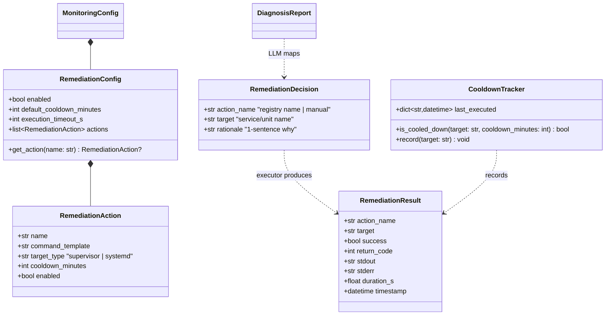
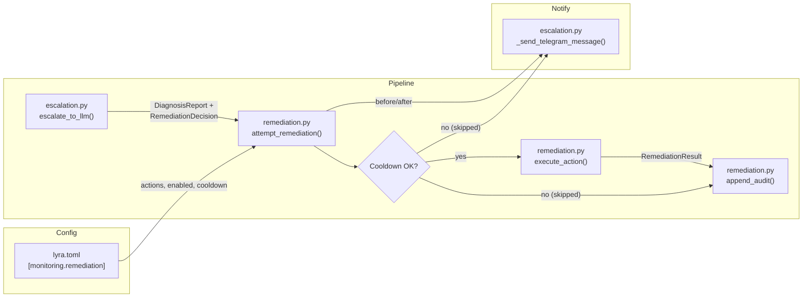

## Context

Promoted from [frame #120](../frames/120-auto-remediation-llm-health-frame.mdx). Depends on #111 (bash pre-check layer — merged) and #104 (LLM circuit breaker — merged).

The monitoring pipeline currently ends at notification: Layer 1 checks detect anomalies → Layer 2 LLM diagnoses → Telegram alert with suggested remediation. The operator must manually SSH and execute the fix. This spec closes the loop for safe, pre-approved actions.

## Goal

When the LLM diagnoses a common failure, automatically execute a pre-approved remediation action and notify the operator before and after — reducing downtime without human intervention.

## Users

- **Primary:** Operator (Mickael) — receives diagnosis alerts, currently acts on them manually
- **Secondary:** End users of Lyra — experience reduced downtime when common failures self-heal

## Expected Behavior

1. Operator configures a set of safe remediation actions in `[monitoring.remediation]` TOML section, each with a name, shell command template, target type (supervisor/systemd), and per-action cooldown.
2. When Layer 1 detects an anomaly and Layer 2 produces a `DiagnosisReport`, the system checks if auto-remediation is enabled (global kill switch).
3. If enabled and actions are registered, the LLM prompt is extended to include the registry of available action names. The LLM returns an `action_name` field alongside diagnosis. If disabled or no actions registered, the original 3-field prompt is used unchanged.
4. The system validates the LLM-returned `action_name` against the registry. If unregistered or missing → treated as `"manual"`.
5. If `action_name != "manual"`: check per-target cooldown. If cooldown has not elapsed → notify "skipped (cooldown)" via Telegram, audit the skip, and stop. If clear → proceed.
6. Send Telegram "Executing {action} on {target}..." notification.
7. Execute the action via `subprocess.run` with `shell=False` (command split via `shlex`), timeout-bounded by `execution_timeout_s`. Target name validated against `[a-zA-Z0-9_@.-]+` before substitution into the command template.
8. Send Telegram "Result: {success|failed|timeout}" notification with stdout/stderr excerpt.
9. Append an entry to the audit log (JSON lines file) for every attempt — including skipped (cooldown), success, failure, and timeout.
10. If auto-remediation is disabled or action is `"manual"` → current behavior (notify with suggested remediation text only).

**Return type change:** `escalate_to_llm()` returns `tuple[DiagnosisReport, RemediationDecision | None]`. `None` when remediation is disabled or prompt was not extended.

**Known limitation:** `CooldownTracker` is in-memory — resets on process restart. Acceptable for the 5-minute cron cadence. If restart storms cause re-execution, a follow-on task can seed the tracker from `remediation-audit.jsonl` at startup.

## Data Model & Consumers

### Consumer Summary

| Consumer | Fields consumed | When | Status |
|----------|----------------|------|--------|
| `remediation.py` | `RemediationConfig.enabled`, `actions`, `default_cooldown_minutes`, `execution_timeout_s` | Every anomaly detection | This issue |
| `escalation.py` | `RemediationConfig.actions[*].name` (injected into LLM prompt, conditional on `enabled`) | LLM diagnosis call | This issue |
| `remediation.py` | `RemediationResult` (append to audit log, format notifications) | After execution/skip | This issue |
| `__main__.py` | `RemediationResult` (log summary to monitor.log) | After `attempt_remediation()` returns | This issue |
| Future: dashboard | `audit.jsonl` entries | Read-only | Future |

Note: `DiagnosisReport` is defined in `models.py` (from #111).

## Breadboard

### Affordances

| ID | Element | Location |
|----|---------|----------|
| C1 | `[monitoring.remediation]` TOML section | `lyra.toml` |
| C2 | `enabled` kill switch (bool) | C1 |
| C3 | `default_cooldown_minutes` (int, default 5) | C1 |
| C4 | `execution_timeout_s` (int, default 30) | C1 |
| C5 | `[[monitoring.remediation.actions]]` array | C1 |
| C6 | Action fields: `name`, `command_template`, `target_type`, `cooldown_minutes`, `enabled` | C5 |
| N1 | Extended LLM system prompt (includes action names) | `escalation.py` |
| N2 | `RemediationDecision` parsed from LLM JSON | `escalation.py` |
| N3 | `attempt_remediation()` orchestrator | `remediation.py` (new file) |
| N4 | `execute_action()` subprocess runner | `remediation.py` |
| N5 | `CooldownTracker` in-memory state | `remediation.py` |
| N6 | Audit log writer (JSON lines) | `remediation.py` |
| N7 | Telegram "before" notification | `remediation.py` (calls `escalation._send_telegram_message()`) |
| N8 | Telegram "after" notification | `remediation.py` (calls `escalation._send_telegram_message()`) |

### Wiring

| Trigger | Handler | Data |
|---------|---------|------|
| TOML loaded | `load_monitoring_config()` | Parses `RemediationConfig` from `[monitoring.remediation]` |
| Anomaly + LLM call | `escalate_to_llm()` | Injects action names into system prompt, parses `RemediationDecision` alongside `DiagnosisReport` |
| Diagnosis complete | `attempt_remediation()` | Checks kill switch → cooldown → execute → audit → notify |
| Action executed | `append_audit()` | Writes `RemediationResult` to `~/.local/state/lyra/logs/remediation-audit.jsonl` |
| Before/after exec | `_send_telegram_message()` | Formats pre/post notifications |

## Slices

| # | Slice | Affordances | Demo |
|---|-------|-------------|------|
| 1 | Action registry + config | C1–C6, data models | `load_monitoring_config()` parses `[monitoring.remediation]` section; unit test validates TOML loading, defaults, validation |
| 2 | LLM action mapping + cooldown | N1, N2, N5 | Extended prompt returns `action_name`; cooldown tracker blocks repeat execution; unit test with mocked LLM |
| 3 | Execution + audit + notifications | N3, N4, N6, N7, N8 | Full pipeline: diagnosis → execute → audit log entry → Telegram before/after; integration test with mocked subprocess |

## Success Criteria

- [ ] `[monitoring.remediation]` TOML section parsed into `RemediationConfig` with validation (action names unique, command_template non-empty, target_type in {supervisor, systemd})
- [ ] Global `enabled = false` (kill switch) skips all auto-remediation — only notification sent
- [ ] LLM prompt conditionally extended with action names only when `enabled = true` and actions are registered; original 3-field prompt used otherwise
- [ ] LLM response `action_name` validated against registry — unregistered names treated as `"manual"`
- [ ] Per-target cooldown prevents re-execution within the configured window; Telegram notification sent on cooldown skip
- [ ] Telegram notification sent **before** execution ("Executing {action} on {target}...")
- [ ] Action executed via `subprocess.run` with `shell=False` (`shlex.split`); target name validated against `[a-zA-Z0-9_@.-]+` before substitution (security invariant)
- [ ] Subprocess timeout (`execution_timeout_s`) fires → audit records timeout, Telegram reports "timeout"
- [ ] Telegram notification sent **after** execution with success/fail/timeout + stdout excerpt
- [ ] Audit log entry appended to `~/.local/state/lyra/logs/remediation-audit.jsonl` for every attempt (including skipped/cooldown, success, failure, timeout)
- [ ] `escalate_to_llm()` returns `tuple[DiagnosisReport, RemediationDecision | None]`; `max_tokens` bumped to 512 for the extended response
- [ ] LLM failure gracefully falls back to current behavior (notification only, no remediation attempt)
- [ ] Existing monitoring pipeline behavior unchanged when `[monitoring.remediation]` section is absent (backwards compatible)
