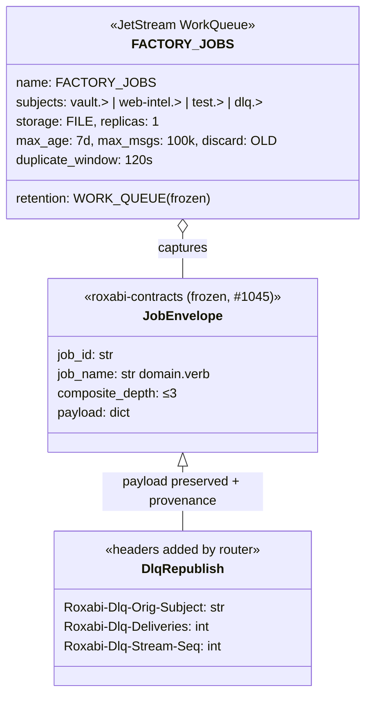
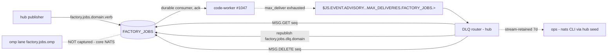

## Context

**Promoted from:** [frame](../frames/1203-jetstream-jobs-stream-dlq-frame.mdx) (approved 2026-06-11, 3-lens validated)
**GitHub issue:** #1203 — Phase 1.5 of epic #1044; also unblocks dispatch-side #1792 work.
**SSoT:** `docs/architecture/job-model.md` (§Subject taxonomy, §Transport tiers). Issue-body stream definition is stale (pre-#1793) — this spec re-anchors it; subjects/consumers herein are the revalidation the issue's backlog-sweep note demands.

## Goal

`factory.jobs.*` dispatch becomes durable: a hub-provisioned WorkQueue JetStream stream captures job submissions, failed jobs surface on `factory.jobs.dlq.<domain>`, and all downstream worker slices (#1046+) have a known substrate to bind durable consumers against.

## Users

- **#1046/#1047 implementers** — bind `code-worker` durable consumers against `FACTORY_JOBS` (consumer creation stays lazy, worker-side — out of scope here).
- **Hub** — sole provisioner (ADR-079 pattern) + DLQ router host.
- **Ops (M₁)** — `/jsz` visibility; DLQ inspection + replay via hub seed + nats CLI; 7d DLQ retention window in-stream. (The issue's "extend `monitor` ACL" acceptance item is void — the `monitor` identity was **retired 2026-05-26** (acl-matrix `status: retired`, no auth.conf block); DLQ observability is ops-only until a real monitoring consumer exists.)

## Expected Behavior

1. **Boot:** `factory hub` provisions `FACTORY_JOBS` (idempotent add→`BadRequestError`→update) in `_bootstrap_hub_standalone()` alongside the audio stream/KV ensures — strictly **before** `announce_hub_ready()` (`hub_standalone.py:161-204` block). Provision failure = terminal (fail-fast, same as audio/audit).
2. **Publish:** any grant-holding identity publishes a `WorkEnvelope`-correlated `JobEnvelope` to `factory.jobs.<domain>.<verb>`; the stream captures it (PubAck). Publishers MAY set `Nats-Msg-Id: <job_id>` for dedup within `duplicate_window`.
3. **Consume:** workers (future, #1047) bind durable consumers with non-overlapping subject filters (`factory.jobs.vault.>`, `factory.jobs.web-intel.>`); WorkQueue retention deletes on ack.
4. **Fail:** after a consumer exhausts `max_deliver`, the server emits a `MAX_DELIVERIES` advisory. The hub's **DLQ router** receives it, fetches the message by `stream_seq` (`MSG.GET`), republishes the payload to `factory.jobs.dlq.<domain>` with provenance headers, and deletes the original (`MSG.DELETE`) so the WorkQueue stays clean. Implementation note: MSG.GET/MSG.DELETE are `JetStreamManager` methods — `nc.jsm().get_msg(stream, seq=N)` / `nc.jsm().delete_msg(stream, seq)`; the `nc.jetstream()` client does NOT expose them.
5. **Observe:** the stream's own `factory.jobs.dlq.>` binding retains DLQ copies for replay until `max_age`/`max_msgs` (no consumer needed — limits are the backstop); ops inspect via hub seed + nats CLI / `/jsz`.

## Stream Definition (ratified by this spec)

```python
# src/factory/infrastructure/jobs/stream_setup.py
STREAM_NAME = "FACTORY_JOBS"                      # fleet convention: FACTORY_TURNS / FACTORY_AUDIT / FACTORY_OUTBOUND_AUDIO
SUBJECTS = [
    "factory.jobs.vault.>",                       # #1050/#1051 lane
    "factory.jobs.web-intel.>",                   # #1050 lane
    "factory.jobs.test.>",                        # smoke-test lane (prod-safe, issue acceptance)
    "factory.jobs.dlq.>",                         # DLQ retention (router republish target)
]
# retention=WORK_QUEUE, storage=FILE, replicas=1, max_age=7d, max_msgs=100_000,
# discard=OLD, duplicate_window=120s
```

**Explicit enumeration, NOT `factory.jobs.>`** — the live omp lane (`factory.jobs.omp`, core-NATS queue group `omp-workers`, #1812) must not be captured: a WorkQueue copy with no bound consumer accumulates to limits for no benefit. Revisit at #1813 (runtime selection) whether omp dispatch migrates onto the stream. Adding a domain = one-line subjects change; the boot-time update path converges live config.

## Data Model & Consumers





| Consumer | Consumes | When | Status |
|---|---|---|---|
| `code-worker` durable (filters `vault.>`, `web-intel.>`) | JobEnvelope, ack/term | per dispatch | **future** (#1047 — lazy creation, worker-side) |
| DLQ router (hub) | MAX_DELIVERIES advisories + MSG.GET | on exhaustion | **this issue** |
| ops (nats CLI via hub seed; stream retention) | DLQ copies | on demand | **this issue** (no identity grant — `monitor` retired 2026-05-26) |
| #1800 dashboard v2 | `factory.job.>` (different stream, LIMITS) | future | out of scope |

## Breadboard

| ID | Affordance | Handler / Home | Data |
|---|---|---|---|
| N1 | `FACTORY_JOBS` stream (4-subject enumeration) | `ensure_jobs_stream(js)` — `src/factory/infrastructure/jobs/stream_setup.py` (new subdir + ADR) | StreamConfig above |
| N2 | `factory.jobs.dlq.<domain>` republish | `DlqRouter` — `src/factory/infrastructure/jobs/dlq_router.py` | payload + `Roxabi-Dlq-*` headers |
| N3 | `$JS.EVENT.ADVISORY.CONSUMER.MAX_DELIVERIES.FACTORY_JOBS.>` | core subscription inside `DlqRouter` | advisory JSON (`stream_seq`, `deliveries`, consumer) |
| S1 | Hub boot wiring: ensure + router start before `announce_hub_ready()` | `hub_standalone.py` provisioning block (fail-fast) | — |
| A1 | ACL: hub publish `factory.jobs.>`; hub subscribe `$JS.EVENT.ADVISORY.CONSUMER.MAX_DELIVERIES.FACTORY_JOBS.>` (NO monitor grant — identity retired) | `deploy/nats/acl-matrix.json`; regen via `sudo env "PATH=$PATH" factory-acl genkeys --regenerate` (produces all 4: auth.conf, 706 spec, v3-current, CURRENT.generated.md); `tests/scripts/fixtures/v3-pre-grant-group.json` is hand-mirrored — NO script exists, mirror the publish/subscribe diff manually | grants |
| D1 | ADR: `infrastructure/jobs/` subdir (governance rule) + stream/DLQ design record | `docs/architecture/adr/088-factory-jobs-stream.mdx` (next free number after 087) + redirect to `messaging.md` | — |
| D2 | `docs/architecture/messaging.md`: add `FACTORY_JOBS` row to the NATS planes catalogue table; add `factory.jobs.<domain>.<verb>` + `factory.jobs.dlq.<domain>` rows to the subject naming table; add DLQ flow subsection | doc-writer task | — |
| D3 | `CURRENT.generated.md` regen — run `tools/check_architecture_snapshot.sh` after src changes (architecture_snapshot gate; generated file, ¬hand-edit) | implementer step | — |
| T1 | Unit tests (AsyncMock pattern of `tests/infrastructure/turn_writer/test_stream_setup.py`) | `tests/infrastructure/jobs/` | add path, update path, omp-exclusion literal guard, router advisory→get→republish→delete |

**Wiring:** S1 calls N1 then starts N2's router; N3 feeds N2; A1 gates everything in prod (CI-only equivalence checks — local green ≠ CI green); D1 unblocks the new subdir per `src/factory/infrastructure/CLAUDE.md`.

## Slices

| # | Slice | Demo | Contains |
|---|---|---|---|
| 1 | Stream substrate | hub boots (mocked js) → `ensure_jobs_stream` called before announce; add + update paths pass | N1, S1, D1 (ADR), T1(a,b,c) |
| 2 | ACL surface | acl regen artifacts byte-identical to committed; CI acl checks green | A1 + fixture mirror |
| 3 | DLQ path | simulated MAX_DELIVERIES advisory → republish on `factory.jobs.dlq.test` + original deleted | N2, N3, T1(d), D2, D3 |

## Success Criteria

- [ ] `ensure_jobs_stream()` provisions `FACTORY_JOBS` with the exact config above; both add-success and `BadRequestError`→update paths unit-tested (AsyncMock, no live NATS).
- [ ] Hub boot orders: audio ensures → audit → **jobs ensure → DLQ router start** → `announce_hub_ready()`; provision failure raises (fail-fast), unit-asserted on call order.
- [ ] `SUBJECTS` literal excludes `factory.jobs.omp` — guarded by an explicit test assertion (omp lane stays core-NATS until #1813).
- [ ] `acl-matrix.json`: hub publish `factory.jobs.>`, hub subscribe `$JS.EVENT.ADVISORY.CONSUMER.MAX_DELIVERIES.FACTORY_JOBS.>` (no monitor grant — identity retired 2026-05-26, deviation from issue acceptance documented); 4 generated artifacts regenerated via `factory-acl genkeys --regenerate`; `v3-pre-grant-group.json` hand-mirrored.
- [ ] `DlqRouter`: on advisory → `MSG.GET(stream_seq)` → republish payload to `factory.jobs.dlq.<domain>` with `Roxabi-Dlq-*` headers → `MSG.DELETE(stream_seq)`; no `str(exc)`/f-string-exc in any published field (str_exc_bus_bound gate).
- [ ] ADR for `infrastructure/jobs/` committed (governance rule satisfied); `messaging.md` documents stream + DLQ; `doc_drift`, `architecture_snapshot`, `secrets_drift`, `import_layers` all green (run manually pre-push — stage:pre-push gates skip on lead worktree pushes).
- [ ] Full repo `uv run pytest` green (from main repo venv — no `uv run` inside worktree).

## Out of Scope (re-anchored from frame)

Worker consumers + `ack_wait`/`max_deliver` values (#1047 decides per role) · omp lane migration (#1813) · v2 observability stream over `factory.job.>` (#1800) · per-job-id facet ACLs (#1812 pattern) · `bootstrap_streams.py` ops mirror (hub is the single authoritative ensure; a mirror would create dual SSoT) · monitor-side DLQ tooling/alerting.
