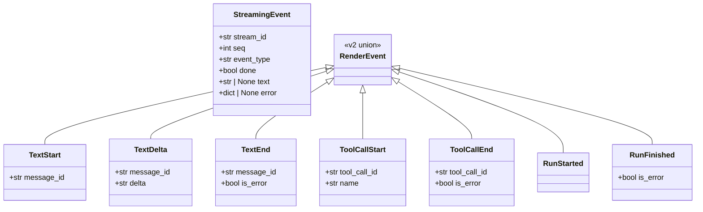
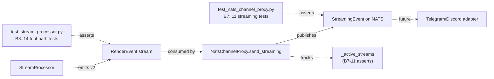

## Context

Promoted from `artifacts/frames/1211-rewrite-v2-tests-frame.mdx`. PR #1210 (Slice 3 of #1192) cut v1 RenderEvent over to v2 and left 25 tests skipped with `reason="v1 removed in #1192 S3 — rewrite for v2 deferred"`. Iter-1 review classified these as **B7** (NATS proxy) and **B8** (StreamProcessor). Security-auditor dissented on the deferral, flagging `test_send_streaming_exception_publishes_stream_error` as the only adapter-hang recovery path on the wire.

See PR #1210 consensus: `artifacts/analyses/1205-pr1210-consensus.mdx`.

> **Scope note (was NEEDS CLARIFICATION 1, resolved):** The issue body lists 11 (B7) + 14 (B8) = 25 tests, with acceptance "56 → 31 skipped-test count". The two target files actually contain 11 + 30 = 41 skips with the same `v1 removed in #1192 S3` reason. **Decision: the 25-test scope from the issue body is authoritative.** The additional 16 v1-skips in `test_stream_processor.py` are deferred to a separate follow-up issue (to be filed at `/plan` time and linked here before that step closes).

## Goal

Close the v2-wire-format test gap on B7 + B8: every test listed in the issue scope is either rewritten for v2 or deleted with explicit rationale, restoring active coverage for the `send_streaming()` exception → `stream_error` recovery path.

## Users

- **Primary:** Lyra adapters team — gains regression coverage on the v2 NATS wire (recovery path, seq, event_type, active-stream tracking)
- **Secondary:** End-users on Telegram/Discord — protected from silent adapter hangs when a streaming response raises mid-flight

## Expected Behavior

After this issue lands:

1. `pytest tests/nats/test_nats_channel_proxy.py -v` runs all 11 streaming tests as active (no `@pytest.mark.skip`); each asserts against the v2 wire format (`StreamingEvent` envelope with `seq`, `event_type`, `stream_id`, `done`)
2. `pytest tests/core/test_stream_processor.py -v` runs the 14 tool-path tests listed in the issue as active; each asserts against v2 RenderEvent emissions (no v1 attribute access)
3. `test_send_streaming_exception_publishes_stream_error` exists and fails-loudly if `NatsChannelProxy.send_streaming()` raises without publishing a terminal `stream_error` event
4. Neither file contains `# pyright: reportAttributeAccessIssue=false` (or `reportInvalidTypeForm=false`) at module level
5. `pytest --collect-only -q | grep -c SKIPPED` returns 31 or fewer (matches pre-#1210 baseline)
6. Any test from the issue scope that is deleted instead of rewritten has a comment on the deletion line citing the rationale

## Data Model & Consumers

### v2 wire — what the rewritten tests assert against

### Consumers under test

### Consumer summary

| Consumer | Asserts | When | Status |
|---|---|---|---|
| `test_nats_channel_proxy.py` (B7) | `StreamingEvent` envelope shape, seq, event_type, done, stream_error on exception | After `send_streaming()` completes or raises | **this issue** |
| `test_stream_processor.py` (B8) | `RenderEvent` v2 union emissions, tool-path triplet order, throttling, is_error propagation | While iterating SP output | **this issue** |
| `Adapter (TG/Discord)` | End-to-end v2 wire consumption | Production runtime | future (covered by integration tests) |

## Breadboard

This is a test-rewrite issue — no UI/API affordances change. The "wiring" is test file → production module.

### Test → production module map

| Test file | Production module under test | Symbol |
|---|---|---|
| `tests/nats/test_nats_channel_proxy.py` | `src/lyra/nats/nats_channel_proxy.py` | `NatsChannelProxy.send_streaming` |
| `tests/core/test_stream_processor.py` | `src/lyra/core/stream_processor.py` | `StreamProcessor.run` |

Production code path verified at spec time: `send_streaming()` already publishes `type=stream_error` with `reason="streaming_exception"` in its `except Exception` block, and drains the source iterator in the `finally`. The B7-1 rewrite asserts existing behavior; no production change required.

### Test inventory (B7) — `test_nats_channel_proxy.py`

| ID | Test | Asserts | Priority |
|---|---|---|---|
| B7-1 | `test_send_streaming_exception_publishes_stream_error` | exception → terminal `stream_error` event | **P0** |
| B7-2 | `test_send_streaming_publishes_chunks_with_incrementing_seq` | seq starts at 0, monotonic +1 | P1 |
| B7-3 | `test_send_streaming_event_type_text` | text events carry `event_type="text"` | P1 |
| B7-4 | `test_send_streaming_event_type_tool_summary` | tool events carry `event_type="tool_summary"` | P1 |
| B7-5 | `test_send_streaming_done_true_on_final_text_event` | terminal event has `done=True` | P1 |
| B7-6 | `test_send_streaming_done_false_on_non_final_event` | mid-stream events have `done=False` | P2 |
| B7-7 | `test_send_streaming_subject_is_single_outbound_subject` | single subject for full stream | P2 |
| B7-8 | `test_send_streaming_uses_single_subject` | duplicate of B7-7 → candidate for deletion | P3 |
| B7-9 | `test_send_streaming_chunk_has_stream_id_no_type` | chunk envelope has `stream_id` + no legacy `type` field | P2 |
| B7-10 | `test_send_streaming_drains_iterator_on_publish_failure` | publish exception drains source iterator | P2 |
| B7-11 | `test_active_streams_tracked_during_streaming` | `_active_streams` set tracks stream during emission | P2 |

Verified at spec time: all 11 B7 tests above are existing `@pytest.mark.skip` entries in `tests/nats/test_nats_channel_proxy.py` (lines 166, 190, 207, 224, 242, 259, 278, 298, 473, 513, 588). B7-8 (`test_send_streaming_uses_single_subject`, line 473) duplicates B7-7 (`test_send_streaming_subject_is_single_outbound_subject`, line 190) — recommended **delete** with rationale.

### Test inventory (B8) — `test_stream_processor.py` (issue-scoped 14)

| ID | Test | Asserts | Priority |
|---|---|---|---|
| B8-1 | `test_single_edit` | single Edit emits tool triplet | P1 |
| B8-2 | `test_write_tool_tracked` | Write tool is tracked + emits | P1 |
| B8-3 | `test_five_edits_at_threshold` | 5 edits at file-group threshold | P2 |
| B8-4 | `test_six_edits_count_mode` | 6th edit → count-mode rendering | P2 |
| B8-5 | `test_bash_truncation` | bash output truncated in `tool_args` | P2 |
| B8-6 | `test_silent_read_grep_glob` | Read/Grep/Glob produce no events | P2 |
| B8-7 | `test_web_fetch_visible` | WebFetch surfaces in tool_summary | P2 |
| B8-8 | `test_result_bypasses_throttle` | tool_result event bypasses throttle | P2 |
| B8-9 | `test_throttle_suppression` | within-window deltas suppressed | P2 |
| B8-10 | `test_is_error_propagated_to_text_render_event` | `is_error=True` → TextEnd.is_error=True | P1 |
| B8-11 | `test_empty_stream` | empty input → no RenderEvents | P1 |
| B8-12 | `test_emission_order_text_only` | text path event ordering | P2 |
| B8-13 | `test_emission_order_with_tool` | tool path event ordering | P2 |
| B8-14 | `test_dual_emit_v1_and_v2_both_present` | **delete** (v1 removed, test premise invalid) | delete |

## Slices

| # | Slice | Tests | Demo |
|---|---|---|---|
| 1 | **Recovery path (P0)** — rewrite the single security-auditor-flagged test | B7-1 only | `pytest tests/nats/test_nats_channel_proxy.py::test_send_streaming_exception_publishes_stream_error -v` passes; reproduce `send_streaming()` raising mid-stream → assert `stream_error` envelope published. **Guard:** B7-1 must use a real v2 RenderEvent (e.g. `TextDelta`) for the pre-exception chunk — must NOT use the `Any`-stub `TextRenderEvent` carry-over, otherwise the exception fires on the first `_codec.encode()` and the drain path is never exercised (false-pass). |
| 2 | **NATS proxy completion (B7)** — rewrite 9 remaining streaming tests + delete B7-8 duplicate + remove v1-shape Any typing | B7-2..B7-7, B7-9..B7-11 (rewrite) · B7-8 (delete) | all 11 B7 entries resolved (10 active + 1 deleted with rationale); pyright run on file passes without suppressions |
| 3 | **StreamProcessor non-tool paths (B8 easy)** — error propagation + empty stream | B8-10, B8-11, B8-14 (delete) | 3 tests rewritten/deleted; baseline assertions against v2 RenderEvent union |
| 4 | **StreamProcessor tool path (B8 hard)** — tool triplet + throttling + truncation | B8-1..B8-9, B8-12, B8-13 | all 11 tool-path tests active; emission-order tests pin the v2 triplet sequence |
| 5 | **Cleanup** — remove module-level pyright suppressions, fixture cleanup | n/a (both files) | grep `# pyright:` in both files → no hits; `pyright tests/{nats,core}/` clean |

Slice 1 is the security-auditor's blocker — independently demo-able and ship-worthy if scope shrinks. Slices 2–5 are additive; if Slice 4 proves harder than estimated, Slices 1–3 still close the dissent.

## Success Criteria

- [ ] B7-1 (`test_send_streaming_exception_publishes_stream_error`) is rewritten for v2 and actively passes
- [ ] All 11 B7 streaming tests in `test_nats_channel_proxy.py` are either active (no skip) or deleted with explicit rationale comment
- [ ] All 14 B8 tool-path tests in `test_stream_processor.py` are either active or deleted with rationale
- [ ] In the in-scope B7+B8 tests, `grep -c "@pytest.mark.skip.*v1 removed.*#1192" tests/nats/test_nats_channel_proxy.py` returns **0** AND, for the 14 in-scope B8 tests, the same grep against the specific B8 test names returns **0** (the 16 out-of-scope skips in `test_stream_processor.py` may remain — they belong to the follow-up issue)
- [ ] `grep -E "^# pyright: report(AttributeAccessIssue|InvalidTypeForm)=false" tests/nats/test_nats_channel_proxy.py tests/core/test_stream_processor.py` returns **0 matches**
- [ ] `grep -n "Typed as Any so pyright" tests/nats/test_nats_channel_proxy.py tests/core/test_stream_processor.py` returns **0 matches**, OR any surviving `Any`-typed shim is documented as required for an explicitly-deleted test only
- [ ] `uv run pyright tests/nats/test_nats_channel_proxy.py tests/core/test_stream_processor.py` passes
- [ ] `uv run pytest tests/nats/test_nats_channel_proxy.py tests/core/test_stream_processor.py` passes
- [ ] No production code in `src/lyra/adapters/nats/channel_proxy.py` or `src/lyra/core/stream_processor.py` is modified

## Out of Scope

- The 16 additional `v1 removed in #1192 S3` skips in `test_stream_processor.py` that are not enumerated in the issue scope (see NEEDS CLARIFICATION 1) — separate follow-up
- Integration tests for adapter-end consumption of v2 wire
- Refactoring shared test fixtures or helpers beyond what the rewrite requires
- New coverage beyond pre-#1210 baseline

## Open Questions

All clarifications resolved at spec review time:

- **(was CLARIFICATION 1)** Extra 16 v1-skips in `test_stream_processor.py` → **deferred** to follow-up issue. Action at `/plan` time: file the follow-up issue and link its number back into the Context section.
- **(was CLARIFICATION 2)** `test_active_streams_tracked_during_streaming` → **existing** (line 513 of `test_nats_channel_proxy.py`), not net-new. Treated as one of the 11 B7 entries.
