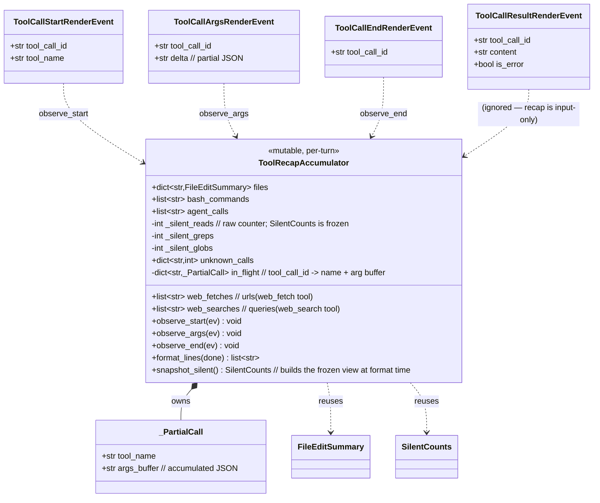
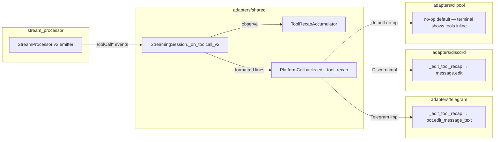

## Context

Source: `artifacts/frames/1214-tool-recap-card-v2-frame.mdx` (approved
2026-05-15).

The v1 `ToolSummaryRenderEvent` + `tool_recap_format.py` were removed in
#1192 slice 3 (commit `e4d0a241`) as the atomic v2 cutover. The replacement
hook `_on_toolcall_v2()` in `_shared_streaming_emitter.py:117` is a stub
that only sets `had_tool_events=True` — `edit_trace` callback is wired to a
no-op in both Telegram (`telegram_outbound.py:243`) and Discord
(`discord_outbound.py:245`). PR #1209's unknown-tool feature was lost in
the cutover and never re-shipped.

DEBT #1102 explicitly tracks "wire `_on_toolcall_v2()` to `PlatformCallbacks`"
as the missing leg of slice 5; closing #1214 should let #1102 close.

## Goal

Render the tool activity recap card for every multi-tool turn in Telegram
and Discord, sourced exclusively from v2 `ToolCall*` events, including the
`🔧 N toolname` line for unknown tools.

## Users

- **Primary:** Lyra Telegram + Discord users who relied on the recap card
  to see what an agent did per turn.
- **Secondary:** Developers debugging multi-tool turns who use the recap as
  a quick read of agent activity without scrolling raw events.

## Expected Behavior

A turn that triggers ≥1 tool call ends with a recap message visually
identical to the pre-cutover card:

```
🔧 Done ✅
✏️ src/foo.py (edit)
💻 4 commands
🌐 https://example.com
🤖 agent description
🔧 3 todowrite
🔍 14 reads · 8 greps · 2 globs
```

Behaviors:

- Recap is sent as a **separate placeholder message** ("trace placeholder",
  reusing the existing `send_trace_placeholder` callback, lazily on the
  first `ToolCallStartRenderEvent` per turn).
- Recap is **edited in place** as further tool events arrive (debounced at
  `STREAMING_EDIT_INTERVAL` = 1 s, same as text/reasoning).
- Final edit on `RunFinishedRenderEvent` (or end of stream) shows
  `🔧 Done ✅`. Intermediate state may show `🔧 Working…`.
- Text-only turns (no tool events) MUST NOT send a trace placeholder.
- Reasoning + tool recap may both want the trace placeholder; they share
  the same placeholder slot (last writer wins during streaming, recap
  wins on `done=True` so the final view always shows tool activity —
  same as v1 behaviour). Ownership invariant: the **single** shared cell
  is `StreamingSession._trace_obj` (already declared,
  `_shared_streaming_emitter.py:115`); whoever fires first lazily calls
  `send_trace_placeholder` and writes to the cell, all subsequent
  consumers read it. Telegram/Discord MUST migrate off their per-callback
  `_reasoning_trace_cell` closures to the shared session cell.
- Unknown tool names render as `🔧 N toolname`, sorted alphabetically.
- A tool whose result has `is_error=True` is **counted identically** to a
  successful call (v1 parity — no `❌` decoration in the recap card).
  Errors surface in the main message via `RunErrorRenderEvent`'s `❌`
  prefix; the recap stays a quantitative summary.
- Ungraceful stream end (no `RunFinishedRenderEvent`, no
  `RunErrorRenderEvent`): `StreamingSession._deliver_final` MUST issue a
  best-effort `edit_tool_recap(..., done=True)` from its `finally`-equivalent
  path so the placeholder never sticks at `🔧 Working…`. Failures of
  that final edit are logged at `debug` (same discipline as the existing
  `_deliver_final` text edit at `_shared_streaming_emitter.py:325-328`).

### Canonical line order (prescriptive)

`format_recap_lines` MUST emit lines in this exact order — the example
above is one instance of this ordering:

1. Header: `🔧 Working…` (intermediate) ∨ `🔧 Done ✅` (final, done=True).
2. Files: `✏️` lines from `files` accumulator (collapsed `N files · M
   edits` when ≥3 files — same threshold as v1
   `tool_recap_format._format_files`).
3. Bash: `💻` lines (collapsed to `💻 N commands` when ≥3 — same
   threshold as v1 `_BASH_GROUP_THRESHOLD`).
4. Web fetches: `🌐 {url}` lines from `web_fetches` accumulator.
5. Web searches: `🌐 {query}` lines from `web_searches` accumulator.
6. Agent calls: `🤖 {description}` lines (truncated to 48 chars — v1
   `_AGENT_DISPLAY_MAX`).
7. Unknown tools: `🔧 N toolname` lines, sorted alphabetically by name.
8. Silent counts (single line): `🔍 N reads · M greps · K globs` (only
   non-zero buckets included; line omitted entirely if all zero).

## Data Model & Consumers

### Data structure diagram



`FileEditSummary` and `SilentCounts` already exist in
`src/lyra/core/messaging/render_events.py:39–63` — reuse, do not redefine.
`SilentCounts` is `frozen=True`; the accumulator stores raw `int`
counters and constructs a `SilentCounts` snapshot at `format_lines()`
time only.

`web_fetch` (URL bucket) and `web_search` (query bucket) are kept in
**separate** lists, not merged — `format_lines` emits them in two
distinct sections (see Canonical line order). This matches v1
`stream_processor._accumulate` (`stream_processor.py:524-528`).

### Consumer map



Solid = this issue. Dashed = retained behavior (no-op default).

### Consumer summary table

| Consumer | Fields consumed | When | Status |
|----------|-----------------|------|--------|
| `StreamingSession._on_toolcall_v2` | full `ToolCall*` events | per event during turn | this issue |
| `ToolRecapAccumulator.observe_*` | `tool_name`, `delta`, `tool_call_id` | per event | this issue |
| `PlatformCallbacks.edit_tool_recap` | `(trace_obj, lines: list[str], done: bool)` | debounced (1 s) + final | this issue |
| Telegram `_edit_tool_recap` | rendered Markdown text | each callback fire | this issue |
| Discord `_edit_tool_recap` | rendered text (≤ embed limits) | each callback fire | this issue |
| CLI adapter | — | — | out of scope (no-op default) |

## Breadboard

### Affordances

| ID | Element | Handler | Data |
|----|---------|---------|------|
| N1 | `ToolCallStart` event | `_on_toolcall_v2` → `accum.observe_start` | `tool_name` |
| N2 | `ToolCallArgs` event | `accum.observe_args` | accumulate JSON delta per `tool_call_id` |
| N3 | `ToolCallEnd` event | `accum.observe_end` → categorise → bucket | parsed args by tool family |
| N4 | `ToolCallResult` event | `_on_toolcall_v2` (no-op for recap; flag only) | — |
| N5 | Lazy trace placeholder | `_send_trace_placeholder` (callback) | id of new platform message |
| N6 | Debounced edit | `edit_tool_recap` callback (with `done=False`) | rendered lines |
| N7 | Final flush | `edit_tool_recap` callback (with `done=True`) | rendered lines + ✅ header |
| S1 | Pure formatter | `format_recap_lines(accum, *, done)` | list of lines |
| S2 | Telegram render | `_edit_tool_recap_telegram` | Markdown-escaped text |
| S3 | Discord render | `_edit_tool_recap_discord` | text fitting embed limits |

### Wiring

```
events  ─► StreamingSession._run_event_loop
            │
            ├─ ToolCall*  ─► _on_toolcall_v2(event)
            │                  ├─ accum.observe_*(event)
            │                  ├─ if first tool event: lazily send trace placeholder (N5)
            │                  └─ if debounced or done: cb.edit_tool_recap(trace_obj,
            │                                                              format_recap_lines(accum, done=done))
            │
            └─ Run/Reasoning/Text — unchanged
```

`done=True` is fired exactly once per turn, from `_deliver_final` (or
explicitly on `RunFinishedRenderEvent`/`RunErrorRenderEvent`), guaranteeing
the final `🔧 Done ✅` regardless of whether the last tool event happened
to fall inside or outside the throttle window.

## Slices

| ID | Slice | Files (approx) | Demo |
|----|-------|----------------|------|
| SL1 | Pure aggregator + formatter (`ToolRecapAccumulator`, `format_recap_lines`, including unknown-tool path) with full unit tests | `src/lyra/adapters/shared/_tool_recap.py` (new) + tests | unit tests pass; no platform integration yet |
| SL2 | Wire `_on_toolcall_v2` → accumulator + `PlatformCallbacks.edit_tool_recap` (added as a defaulted dataclass field — `field(default=_default_no_op_edit_tool_recap)` mirroring the `edit_reasoning` precedent at `_shared_streaming_emitter.py:72-80` so existing construction sites compile unchanged); fire on debounced + final + ungraceful-end best-effort | `_shared_streaming_emitter.py`, tests for the session | session unit test asserts callback invoked with expected lines on a synthetic event stream |
| SL3 | Telegram adapter: real `_edit_tool_recap` using existing `_send_trace_placeholder` + Markdown render + tests; **migrate `_reasoning_trace_cell` to read from `StreamingSession._trace_obj`** so reasoning + recap share the placeholder slot | `telegram_outbound.py`, telegram tests | run a Telegram fake session with multi-tool turn → asserts edited text matches expected card |
| SL4 | Discord adapter: mirror SL3 — real `_edit_tool_recap` + same shared-cell migration; close DEBT #1102 | `discord_outbound.py`, discord tests, DEBT registry update | Discord fake session test passes; #1102 closed |

Order matters: SL1 has no consumers (safe to land alone), SL2 consumes SL1
behind a no-op default (no UX change), SL3+SL4 enable rendering per
platform. Each slice is independently mergeable.

## Success Criteria

- [ ] `ToolRecapAccumulator` consumes a synthetic stream of
      `ToolCallStart/Args/End` events for `edit`, `write`, `bash`, `read`,
      `grep`, `glob`, `web_fetch`, `web_search`, `agent`, and an unknown
      tool name (e.g. `todowrite`); `format_recap_lines(accum, done=True)`
      returns the canonical line list in the canonical order.
- [ ] Unknown tool names render exactly as `🔧 N toolname`, sorted
      alphabetically by name (matches PR #1209 spec).
- [ ] `format_recap_lines(empty_accum, done=True)` returns `[]` (text-only
      turn → no recap sent).
- [ ] `StreamingSession._on_toolcall_v2` invokes
      `PlatformCallbacks.edit_tool_recap` at least once during streaming
      AND exactly once with `done=True` per turn (verified via mock
      callback in unit test). Ungraceful stream end (no
      `RunFinishedRenderEvent`, no `RunErrorRenderEvent`) still fires the
      `done=True` final edit.
- [ ] `PlatformCallbacks.edit_tool_recap` is added as a defaulted
      dataclass field (`field(default=_default_no_op_edit_tool_recap)`)
      so existing `PlatformCallbacks(...)` construction sites in Telegram
      and Discord adapters compile unchanged. CLI adapter (no override)
      remains a no-op.
- [ ] A tool whose `ToolCallResultRenderEvent` has `is_error=True` is
      counted identically to a successful call in the recap (no `❌`
      decoration); unit test asserts the rendered line list is bytewise
      identical to the success case for a one-tool turn.
- [ ] Telegram adapter renders the recap card on a multi-tool turn,
      visually equivalent to the pre-cutover card; integration test asserts
      `edit_message_text` is called with the expected formatted text.
- [ ] Discord adapter renders the recap card on a multi-tool turn;
      integration test asserts the platform edit call receives the
      expected text.
- [ ] Text-only turn (`TextStart → TextDelta → TextEnd`, no tool events)
      MUST NOT send a trace placeholder in either adapter (regression
      guard — assert `send_trace_placeholder` not called).
- [ ] No imports of `tool_recap_format` or `ToolSummaryRenderEvent` are
      reintroduced anywhere (enforced by a pytest fixture that greps the
      `src/`, `tests/`, and `packages/` trees for either symbol and fails
      on any match).
- [ ] DEBT #1102 (`_on_toolcall_v2 wired to callbacks`) status flips to
      done in the registry / referenced as `Closes #1102` in the merge PR.

## Non-Goals (recap)

- v1 codec resurrection.
- Argument-level rendering (showing diffs, full shell commands beyond
  truncation, full agent prompts).
- New tool icons or visual redesign.
- CLI adapter rendering.
- NATS contract changes — events already defined.
