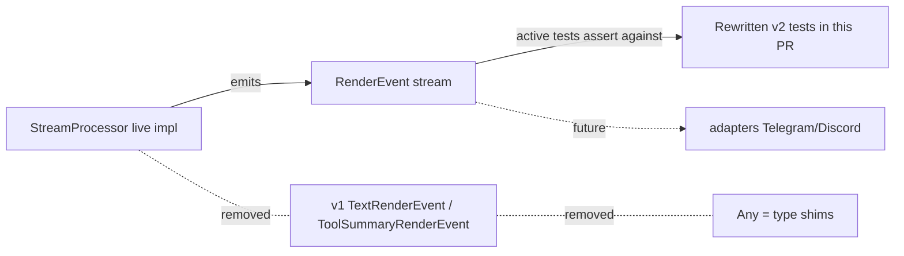

## Context

Promoted from `artifacts/frames/1216-rewrite-leftover-v1-skipped-tests-frame.mdx`. Direct follow-up of #1211 / PR #1218. The parent spec scoped 25 enumerated tests (B7-1..B7-11 in `test_nats_channel_proxy.py` + B8-1..B8-14 in `test_stream_processor.py`); a post-merge inventory shows **18 additional skips** remain in `tests/core/test_stream_processor.py` with the same `v1 removed in #1192 S3 — rewrite for v2 deferred` reason, plus two module-level `Any = type(...)` shims that keep those tests type-checking.

Verified at spec time:

- `grep -c "@pytest.mark.skip" tests/core/test_stream_processor.py` → **18** (matches issue body)
- Module-level shims at lines 1808–1809: `TextRenderEvent: Any = type("TextRenderEvent", (), {})` and `ToolSummaryRenderEvent: Any = type("ToolSummaryRenderEvent", (), {})`
- Live `StreamProcessor` at `src/lyra/core/processors/stream_processor.py:391–401` emits `RunErrorRenderEvent` (terminal) when `_result_is_error=True` — confirms B8-10 (`test_is_error_propagated_to_text_render_event` / `test_is_error_run_error_carries_error_text`) reflects the **current production contract**.

## Goal

Resolve every one of the 18 leftover v1-skipped tests (rewrite against v2 contracts OR delete with rationale), delete the module-level `Any = type(...)` shims, and record the B8-10 vs `test_soft_error_emits_finished_not_error` reconciliation in writing so the next contributor sees the decision and its grounds.

## Users

- **Primary:** lyra contributors touching `src/lyra/core/processors/stream_processor.py` — gain live regression coverage on the v2 RenderEvent contract for tool-path, reasoning, error-surfacing, and v1↔v2 parity scenarios.
- **Secondary:** PR reviewers using `# skipped` count + suppression density as a quality signal — they will see the count drop by 18 and the shim block gone.

## Expected Behavior

After this issue lands:

1. `grep -c "@pytest.mark.skip" tests/core/test_stream_processor.py` returns **0** for the `v1 removed in #1192 S3 — rewrite for v2 deferred` reason (unrelated skips, if any are introduced later, may remain).
2. `tests/core/test_stream_processor.py` no longer contains the module-level `TextRenderEvent: Any = type(...)` or `ToolSummaryRenderEvent: Any = type(...)` shims.
3. `uv run pytest tests/core/test_stream_processor.py -v` passes with no `pyright` suppressions in the file.
4. Each of the 18 tests has been resolved: either present as a v2-active test asserting against `RenderEvent` subclasses (not v1 `TextRenderEvent` / `ToolSummaryRenderEvent`), OR deleted with a rationale comment on the deletion line in the PR description.
5. The PR body contains a `## B8-10 Reconciliation` section naming the resolution and its grounds.
6. `uv run pyright tests/core/test_stream_processor.py` is clean.

## Data Model & Consumers

### v2 contracts the rewritten tests assert against

```mermaid
classDiagram
    class RenderEvent {
      <<v2 union>>
    }
    class RunStartedRenderEvent {
      +str run_id
    }
    class RunFinishedRenderEvent {
      +str run_id
      +str outcome
    }
    class RunErrorRenderEvent {
      +str run_id
      +str message
    }
    class TextStartRenderEvent {
      +str message_id
    }
    class TextDeltaRenderEvent {
      +str message_id
      +str delta
    }
    class TextEndRenderEvent {
      +str message_id
      +bool is_error
    }
    class TextChunkRenderEvent {
      +str text
      +bool is_error
    }
    class ToolCallStartRenderEvent {
      +str tool_call_id
      +str tool_name
    }
    class ToolCallArgsRenderEvent {
      +str tool_call_id
      +str args_delta
    }
    class ToolCallEndRenderEvent {
      +str tool_call_id
    }
    class ToolCallResultRenderEvent {
      +str tool_call_id
      +bool is_error
    }
    class ReasoningStartRenderEvent {
      +str message_id
    }
    class ReasoningDeltaRenderEvent {
      +str message_id
      +str delta
    }
    class ReasoningEndRenderEvent {
      +str message_id
    }
    RenderEvent <|-- RunStartedRenderEvent
    RenderEvent <|-- RunFinishedRenderEvent
    RenderEvent <|-- RunErrorRenderEvent
    RenderEvent <|-- TextStartRenderEvent
    RenderEvent <|-- TextDeltaRenderEvent
    RenderEvent <|-- TextEndRenderEvent
    RenderEvent <|-- TextChunkRenderEvent
    RenderEvent <|-- ToolCallStartRenderEvent
    RenderEvent <|-- ToolCallArgsRenderEvent
    RenderEvent <|-- ToolCallEndRenderEvent
    RenderEvent <|-- ToolCallResultRenderEvent
    RenderEvent <|-- ReasoningStartRenderEvent
    RenderEvent <|-- ReasoningDeltaRenderEvent
    RenderEvent <|-- ReasoningEndRenderEvent
```



### Consumer map — who reads what after this issue



### Consumer summary

| Consumer | Fields consumed | When | Status |
|---|---|---|---|
| Rewritten v2 tests | `RenderEvent` subclass type + fields above | this PR | this issue |
| Deleted v1 tests | (none — removed) | this PR | this issue (deletion) |
| `StreamProcessor` production code | unchanged unless B8-10 reconciliation amends contract | n/a | unchanged |
| Adapters (Telegram/Discord) | `RenderEvent` stream | future | out of scope |

## B8-10 Reconciliation

`test_soft_error_emits_finished_not_error` (currently skipped, line 1135) asserts:

```python
assert isinstance(result[-1], RunFinishedRenderEvent)
assert result[-1].outcome == "success"
assert not any(isinstance(e, RunErrorRenderEvent) for e in result)
```

for an input of `ResultLlmEvent(is_error=True, ...)`.

`StreamProcessor` lines 391–401 currently does the opposite — when `_result_is_error=True`, it emits `RunErrorRenderEvent` as the terminal event. B8-10 (`test_is_error_propagated_to_text_render_event` at line 756, `test_is_error_run_error_carries_error_text` at line 789, both active) asserts this behavior.

**Decision: delete `test_soft_error_emits_finished_not_error`.** Grounds:

1. The live `StreamProcessor` already implements the B8-10 contract; restoring the skipped test would either (a) require changing production behavior away from a contract that is already shipped + asserted, or (b) coexist with B8-10 as a contradictory assertion against the same input.
2. The "soft error → RunFinished + TextRenderEvent.is_error=True" surface from v1 belongs to the v1 wire that #1192 S3 removed. v2 carries error semantics on the terminal `RunErrorRenderEvent.message` + per-block `TextEndRenderEvent.is_error` / `TextChunkRenderEvent.is_error`. The skipped test asserts both a removed type (`TextRenderEvent`) and a removed contract.
3. B8-10's coverage of the is_error path is already present and active.

The PR must record this decision in its body and on the deletion line.

## Breadboard

This issue is a test rewrite, not a UI/API change. The "affordances" are pytest functions; the "wiring" is which `RenderEvent` subclasses each rewritten test asserts against.

### Per-test classification table

| # | Test name | Class | Target v2 contract | Notes |
|---|---|---|---|---|
| L01 | `test_single_edit_no_intermediate` | rewrite | tool-display path: single `ToolCallStartRenderEvent` + `ToolCallResultRenderEvent`, no intermediate `TextChunkRenderEvent` | tool-display fixture |
| L02 | `test_two_files_no_group` | rewrite | tool-display path: 2 distinct tool-calls, no group/summary collapse on v2 | confirm grouping logic still present in v2 |
| L03 | `test_three_files_group` | rewrite | tool-display path: 3+ tool-calls grouped into one summary | confirm grouping logic still present in v2 |
| L04 | `test_eighty_tools_multi_file` | rewrite | tool-display path: high-volume grouping at v2 threshold | volumes-only check; assert against event counts |
| L05 | `test_web_search_visible` | rewrite | tool-display: `web_search` always emits `ToolCall*` events | parity with existing `test_web_fetch_visible` (active) |
| L06 | `test_web_fetch_hidden_when_show_false` | rewrite | tool-display config: `show=false` suppresses `ToolCall*` for `web_fetch` | config-flag path |
| L07 | `test_agent_calls_accumulation` | rewrite | tool-display: agent calls accumulate (no per-call summary) | confirm v2 still implements this behavior in StreamProcessor |
| L08 | `test_throttle_pass_through` | rewrite | throttle path: pass-through case emits events 1:1 (no suppression) | parity with `test_throttle_suppression` (active) |
| L09 | `test_text_accumulation` | rewrite | text triplet: TextDelta accumulation within a block | overlaps with active `test_text_triplet_*` — verify it adds coverage; delete if redundant |
| L10 | `test_is_error_false_propagated_to_text_render_event` | rewrite | `TextEndRenderEvent.is_error` / `TextChunkRenderEvent.is_error` is `False` when `ResultLlmEvent.is_error=False` | parity with active `test_is_error_propagated_to_text_render_event` (False case) |
| L11 | `test_error_text_surfaces_when_no_streamed_text` | rewrite | `RunErrorRenderEvent.message` carries `error_text` when no streamed text precedes | parity with active `test_is_error_run_error_carries_error_text` (no-text variant) |
| L12 | `test_streamed_text_preferred_over_error_text` | rewrite | when both streamed text and `error_text` exist, streamed text surfaces in `TextEndRenderEvent` and `error_text` in terminal `RunErrorRenderEvent.message` | precedence rule |
| L13 | `test_no_result_event` | rewrite | stream ending without `ResultLlmEvent` still emits `RunFinishedRenderEvent` (or `RunErrorRenderEvent` for orphan-close) | parity with `test_run_error_on_input_exception` (active) |
| L14 | `test_soft_error_emits_finished_not_error` | **delete** | n/a — contracts contradict B8-10 (live code) | rationale recorded in PR body + this spec |
| L15 | `test_show_intermediate_false_emits_no_reasoning_events` | rewrite | reasoning config: `show_intermediate=false` suppresses `Reasoning*RenderEvent` | parity with reasoning tests at lines 1401–1820 |
| L16 | `test_dual_emit_v1_text_alongside_reasoning_delta` | **delete** | n/a — v1 `TextRenderEvent` removed in #1192 S3; "dual emit v1 alongside v2" is no longer a real path | v2-only world; nothing to dual-emit |
| L17 | `test_text_end_before_v1_fallback_on_truncation` | **delete** | n/a — same reason; v1 fallback path was the dual-emit bridge | v2-only |
| L18 | `test_v1_parity_against_baseline_fixture` | **delete** | n/a — baseline fixture was the v1 wire; no parity target to compare against | the v2 baseline is the active tests in this file |

Classifications: **rewrite = 13** (L01–L13 except L14; plus L15), **delete = 4 fixed** (L14, L16, L17, L18) **+ 1 conditional** (L09 — default rewrite, downgrade to delete only if duplicate coverage is confirmed at `/plan` time). L07 also conditional: default rewrite, downgrade to delete if the agent-calls path is gone from `StreamProcessor` v2.

> [NEEDS CLARIFICATION 1]: L09 (`test_text_accumulation`) overlap vs the active `TestTextTriplet` block at lines 1829+ — to be resolved at `/plan` time by reading the active suite. Resolution rule: run `grep -nE "test_text_(accumulation|triplet_single_block_ordering|triplet_multi_block_distinct_ids)" tests/core/test_stream_processor.py` and read the bodies of the matched active tests. If `TestTextTriplet::test_text_triplet_single_block_ordering` already asserts ordered `TextStart → TextDelta+ → TextEnd` for one block, L09 is a strict subset → delete. Otherwise → rewrite.

> [NEEDS CLARIFICATION 2]: L07 (`test_agent_calls_accumulation`) — confirm the "agent calls accumulation" behavior is still implemented in `StreamProcessor` v2. Resolution rule: run `grep -nE "agent_calls|sub_agent|nested_agent" src/lyra/core/processors/stream_processor.py`. No match → delete L07 with rationale "agent-calls accumulation path removed from `StreamProcessor` in v2; nothing to assert against." Match → rewrite, targeting the matched symbol.

## Slices

S1 is a **plan-time gate** (resolved in the `/plan` doc), not an independently merge-able increment. Both S1 and S2 land in a single PR; S1's artifact is the plan doc + the B8-10 reconciliation section in the PR body, S2's artifact is the code change.

| # | Slice | Acceptance | Demo |
|---|---|---|---|
| S1 (gate) | Classification + B8-10 reconciliation in writing + v1-residue audit | Plan-time table resolves [NC-1] (L09) and [NC-2] (L07); B8-10 reconciliation section drafted for PR body; v1-residue audit confirms `grep -nE "dual_emit\|v1_fallback\|TextRenderEvent\|ToolSummaryRenderEvent" src/lyra/core/processors/stream_processor.py` returns no match (i.e. deleting L16/L17/L18 forfeits no production-path coverage) | `/plan` doc contains the table + the v1-residue grep evidence |
| S2 (apply) | Apply classifications | All 18 entries resolved per S1 table: rewrites land as active v2 tests, deletions are gone; both `Any = type(...)` shims at lines 1808–1809 removed | `grep -c "@pytest.mark.skip" tests/core/test_stream_processor.py` returns 0; `grep -E "TextRenderEvent: Any = type\|ToolSummaryRenderEvent: Any = type" tests/core/test_stream_processor.py` returns no match; `uv run pytest tests/core/test_stream_processor.py` is green; `uv run pyright tests/core/test_stream_processor.py` is clean |

## Success Criteria

- [ ] `grep -c "@pytest.mark.skip" tests/core/test_stream_processor.py` returns 0
- [ ] `grep "TextRenderEvent: Any = type" tests/core/test_stream_processor.py` returns no match
- [ ] `grep "ToolSummaryRenderEvent: Any = type" tests/core/test_stream_processor.py` returns no match
- [ ] `uv run pytest tests/core/test_stream_processor.py -v` exits 0 with no skipped tests for reason `v1 removed in #1192 S3`
- [ ] `uv run pyright tests/core/test_stream_processor.py` reports 0 errors / 0 warnings
- [ ] PR body contains a `## B8-10 Reconciliation` section naming the resolution and grounds (deletion of `test_soft_error_emits_finished_not_error`)
- [ ] Every deleted test from the 18 has its deletion rationale recorded in the PR body — each rationale line must identify **either** the removed v1 construct (e.g. "v1 `TextRenderEvent`", "v1 dual-emit bridge") **or** the contradicting active test (e.g. "contradicts `test_is_error_propagated_to_text_render_event`")
- [ ] No `# pyright: report*=false` directive is added to `tests/core/test_stream_processor.py`
- [ ] Total collected tests in `tests/core/test_stream_processor.py` is ≥ 64 + 9 = **73** (lower bound: minimum 9 net additions = 13 rewrites − 4 fixed deletes; exact target finalized in `/plan` after L07/L09 conditionals resolve)

## Ambiguity Budget

2 of 5 used.
