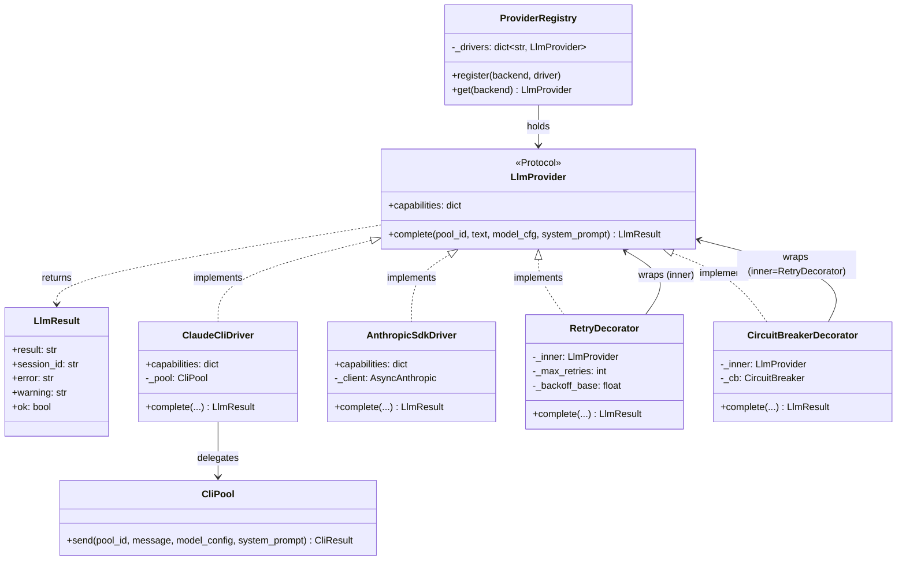
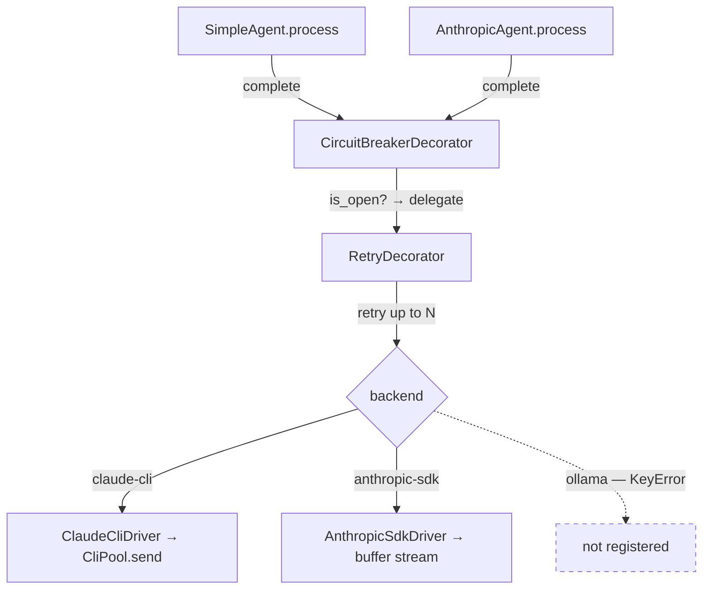

## Context

Promoted from frame [`123-claude-cli-wrapper-library-frame.mdx`](../frames/123-claude-cli-wrapper-library-frame.mdx).

**Key codebase finding:** `CliPool` already exists at `src/lyra/core/cli_pool.py` — the 2ndBrain pool design has already been ported. `ClaudeCliDriver` is therefore a thin protocol adapter over the existing `CliPool`, not a new implementation.

Current state:
- `SimpleAgent` calls `CliPool.send()` directly (no protocol layer)
- `AnthropicAgent.process()` is an `async def ... -> AsyncIterator[str]` — it yields text deltas
- `CircuitBreaker`/`CircuitRegistry` exist in `core/circuit_breaker.py`
- `ModelConfig.backend` already enumerates `"claude-cli"`, `"anthropic-sdk"`, `"ollama"`
- No `LlmProvider` Protocol or `ProviderRegistry` exists yet

**Streaming decision (Option A — Buffer):** `LlmProvider.complete()` is a single coroutine returning `LlmResult`. `AnthropicSdkDriver.complete()` buffers the full stream internally before returning. **Consequence:** `AnthropicAgent.process()` changes from `AsyncIterator[str]` to a plain coroutine returning `Response` — delta streaming to channel adapters is intentionally removed in this issue. This aligns `AnthropicAgent` UX with `SimpleAgent` (full reply arrives at once). Streaming can be re-added in a future issue via a `stream()` Protocol method.

## Goal

Extract LLM dispatch into a `lyra.llm` module: a `LlmProvider` Protocol with a single `complete()` method, two concrete drivers (`AnthropicSdkDriver`, `ClaudeCliDriver`), a `ProviderRegistry` that selects driver from `ModelConfig.backend`, and a `CircuitBreakerDecorator` wrapping a `RetryDecorator` — so agents call a unified interface rather than a specific backend.

## Users

- **Primary:** `SimpleAgent` and `AnthropicAgent` (and future agents) — call `provider.complete(...)` instead of `CliPool.send()` / SDK client.
- **Secondary:** Future backend implementors — implement `LlmProvider`, register with `ProviderRegistry`.

## Expected Behavior

1. `AgentBase` subclasses hold a `provider: LlmProvider` injected at construction. `ProviderRegistry` is built once in `__main__.py` and passed to agent constructors.
2. All agents call `await self._provider.complete(pool_id, text, model_cfg, system_prompt) → LlmResult`.
3. `LlmResult` fields: `result: str`, `session_id: str`, `error: str`, `warning: str`, `ok: bool`. Semantically equivalent to `CliResult`; `CliResult` stays as `CliPool`'s internal type and is translated at the `ClaudeCliDriver` boundary — no inheritance or aliasing.
4. `ClaudeCliDriver` delegates to `CliPool.send()` (parameter names differ: `complete(pool_id, text, ...)` maps to `send(pool_id, message, model_config, system_prompt)` by semantics). Declares `capabilities = {"streaming": False, "auth": "oauth_only"}`.
5. `AnthropicSdkDriver` runs the full SDK streaming loop internally, buffers accumulated text, returns `LlmResult(result=accumulated)`. Declares `capabilities = {"streaming": False, "auth": "api_key"}`. (Streaming capability is `False` because the driver does not expose deltas — buffering is internal.)
6. `RetryDecorator` wraps a driver: on `LlmResult.ok == False`, retries up to `max_retries` times with exponential backoff (`delay = base * 2^k`, default `base=1.0s`). Returns the final `LlmResult` after all retries exhausted.
7. `CircuitBreakerDecorator` wraps `RetryDecorator` (CB is outer, Retry is inner). Before delegating: if `cb.is_open()` returns `True`, returns `LlmResult(error="Circuit 'X' is open. Retry in Ys.")` without calling inner. After inner returns: calls `cb.record_success()` on `ok == True`, `cb.record_failure()` on `ok == False`. Note: `record_success()` is a no-op when circuit is CLOSED — this is intentional per the CB implementation and must not be treated as an error.
8. `SimpleAgent.process()` calls `self._provider.complete(...)`, returns `Response`. Behavior identical to before: same `Response.content`, same `session_id` in `metadata`.
9. `AnthropicAgent.process()` is refactored from `AsyncIterator[str]` to a plain coroutine returning `Response`. STT handling, tool-use loop, and history persistence stay in the agent. The LLM call delegates to `self._provider.complete(...)`.
10. `__main__.py` (`_create_agent()`) is updated: constructs drivers and passes `provider` to each agent. Starting with `backend = "claude-cli"` without `ANTHROPIC_API_KEY` must work. Configuring `backend = "ollama"` raises `KeyError` from `ProviderRegistry.get()` with a clear message; no silent fallback.

## Data Model & Consumers

**Consumer summary:**

| Consumer | Fields consumed | When | Status |
|----------|----------------|------|--------|
| `SimpleAgent.process()` | `result`, `error`, `warning`, `session_id` | Every message | This issue |
| `AnthropicAgent.process()` | `result`, `error` | Every message (LLM call) | This issue |
| `CircuitBreakerDecorator` | `ok` | Per call | This issue |
| `RetryDecorator` | `ok`, `error` | Per call | This issue |
| SmartRoutingDecorator (#134) | `capabilities`, `ok` | Per call | Future (dashed) |
| OllamaDriver (future) | — | — | Future |

## Breadboard

### U1 — Startup wiring (`__main__.py`)

| Affordance | Handler | Data |
|------------|---------|------|
| `CliPool` constructed + started | hub bootstrap | `CliPool(idle_ttl, timeout)` |
| `ClaudeCliDriver(pool)` | `lyra.llm.drivers.cli` | wraps CliPool — registered bare (CliPool has internal timeout/error handling) |
| `AnthropicSdkDriver(api_key)` | `lyra.llm.drivers.sdk` | wraps AsyncAnthropic |
| `RetryDecorator(max_retries=3, base=1.0, inner=AnthropicSdkDriver)` | `lyra.llm.decorators` | |
| `CircuitBreakerDecorator(cb, inner=RetryDecorator)` | `lyra.llm.decorators` | CB outer, Retry inner |
| `ProviderRegistry.register("claude-cli", ClaudeCliDriver)` | hub bootstrap | |
| `ProviderRegistry.register("anthropic-sdk", CircuitBreakerDecorator)` | hub bootstrap | full chain |
| `_create_agent()` passes `provider=registry.get(backend)` | `__main__.py` | updated from cli_pool injection |

> **Wiring asymmetry:** `ClaudeCliDriver` is registered bare; `AnthropicSdkDriver` gets the full CB+Retry chain. Rationale: `CliPool` already handles timeouts and process-level errors internally; the Anthropic SDK path has no equivalent internal resilience.

### U2 — Message dispatch (SimpleAgent)

| Affordance | Handler | Data |
|------------|---------|------|
| `SimpleAgent.__init__(config, provider, ...)` | `simple_agent.py` | `provider: LlmProvider` replaces `cli_pool: CliPool` |
| `await self._provider.complete(pool_id, text, model_cfg, system_prompt)` | `ClaudeCliDriver.complete()` → `CliPool.send()` | returns `LlmResult` |
| `LlmResult.ok == False` | `SimpleAgent.process()` | returns error `Response` (same logic as before) |
| `LlmResult.session_id` | `SimpleAgent.process()` | `Response(metadata={"session_id": ...})` |

### U3 — Message dispatch (AnthropicAgent)

| Affordance | Handler | Data |
|------------|---------|------|
| `AnthropicAgent.__init__(config, provider, ...)` | `anthropic_agent.py` | `provider: LlmProvider` replaces embedded `AsyncAnthropic` client |
| `await self._provider.complete(pool_id, text, model_cfg, system_prompt)` | `AnthropicSdkDriver.complete()` | buffers full stream; returns `LlmResult` |
| Tool use loop | stays in `AnthropicAgent` | `AnthropicSdkDriver` does NOT handle tool use — tool loop is agent logic |
| STT + temp-file cleanup | stays in `AgentBase` subclass | no change |
| `AnthropicAgent.process()` return type | changes from `AsyncIterator[str]` to `Response` | callers updated in `Hub` |

### U4 — Circuit breaker + retry

| Affordance | Handler | Data |
|------------|---------|------|
| `cb.is_open() == True` | `CircuitBreakerDecorator.complete()` | returns `LlmResult(error=f"Circuit '{name}' is open. Retry in {t:.0f}s.")` |
| `cb.is_open() == False` → delegate to `RetryDecorator` | `CircuitBreakerDecorator.complete()` | |
| `inner.complete()` returns `ok == True` → `cb.record_success()` | `CircuitBreakerDecorator.complete()` | no-op when CLOSED; HALF_OPEN → CLOSED transition |
| `inner.complete()` returns `ok == False` → `cb.record_failure()` | `CircuitBreakerDecorator.complete()` | |
| `LlmResult.ok == False` → retry | `RetryDecorator.complete()` | delay = `base * 2^k`; k = attempt index (0-based) |
| `LlmResult.ok == True` → return immediately | `RetryDecorator.complete()` | no retry on success |
| All retries exhausted → return final error | `RetryDecorator.complete()` | returns last `LlmResult.error` |
| HALF_OPEN probe: retry re-checks `cb.is_open()` each attempt | `CircuitBreakerDecorator` is outer | CB is called per-retry; `_probe_in_flight` cleared by `record_failure()` so 2nd attempt gets a new probe slot |

## Slices

| # | Slice | Files | Demo-able |
|---|-------|-------|-----------|
| S1 | `lyra.llm` skeleton: `LlmProvider` Protocol, `LlmResult`, `ProviderRegistry` | `src/lyra/llm/__init__.py`, `src/lyra/llm/base.py`, `src/lyra/llm/registry.py` | `ProviderRegistry.register/get` works; pyright passes; no agents changed |
| S2 | `AnthropicSdkDriver` + migrate `AnthropicAgent` + update `__main__.py` for SDK path | `src/lyra/llm/drivers/sdk.py`, `agents/anthropic_agent.py`, `__main__.py` | AnthropicAgent calls driver; behavior: same `Response.content`, same metadata; `AsyncIterator` → `Response` migration done |
| S3 | `ClaudeCliDriver` + migrate `SimpleAgent` + update `__main__.py` for CLI path | `src/lyra/llm/drivers/cli.py`, `agents/simple_agent.py`, `__main__.py` | SimpleAgent calls driver; same responses, same session_id in metadata; no API key required for `claude-cli` |
| S4 | `RetryDecorator` + `CircuitBreakerDecorator` + wire into registry | `src/lyra/llm/decorators.py`, `__main__.py` | CB+Retry chain wraps AnthropicSdkDriver in registry; open circuit returns error LlmResult |
| S5 | Tests | `tests/llm/` | All tests green (see criteria) |

> **Note on split:** |slices| = 5 > 3 triggers split check. Slices are sequentially dependent (S1 → S2 → S3 → S4 → S5) and scope is M-sized. Splitting into sub-issues creates 5 tiny PRs for a single coherent refactor. Not splitting.

## Success Criteria

### Protocol + Registry (S1)
- [ ] `LlmProvider` Protocol defined in `lyra.llm.base` with `complete(pool_id: str, text: str, model_cfg: ModelConfig, system_prompt: str) -> LlmResult` and `capabilities: dict` (S1)
- [ ] `LlmResult` dataclass: `result: str`, `session_id: str`, `error: str`, `warning: str`; `ok: bool` property = `not self.error` (S1)
- [ ] `ProviderRegistry.get(backend)` returns registered `LlmProvider`; raises `KeyError("No provider for 'ollama'. Registered: ...")` for unregistered backends (S1)
- [ ] `uv run pyright` passes on `lyra.llm` module (S1)

### AnthropicSdkDriver (S2)
- [ ] `AnthropicSdkDriver` implements `LlmProvider`; pyright type check passes (S2)
- [ ] `AnthropicSdkDriver.complete()` buffers full SDK stream and returns `LlmResult(result=accumulated_text)` (S2)
- [ ] `AnthropicSdkDriver.capabilities["streaming"] == False` (S2)
- [ ] `AnthropicAgent.process()` returns `Response` (not `AsyncIterator`); `Response.content` equals what the SDK streamed (S2)
- [ ] Starting `AnthropicAgent` without `ANTHROPIC_API_KEY` still raises `SystemExit` (S2)
- [ ] Tool-use loop remains in `AnthropicAgent` — `AnthropicSdkDriver` does not handle tools (S2)
- [ ] Unit tests: `AnthropicSdkDriver` with mocked `AsyncAnthropic` — verifies buffering, `LlmResult.ok`, error propagation (S2)

### ClaudeCliDriver (S3)
- [ ] `ClaudeCliDriver` implements `LlmProvider`; `complete()` maps to `CliPool.send()` by semantics (S3)
- [ ] `ClaudeCliDriver.capabilities == {"streaming": False, "auth": "oauth_only"}` (S3)
- [ ] `SimpleAgent.process()` produces identical `Response.content` and `metadata["session_id"]` before and after migration (S3)
- [ ] Running `SimpleAgent` with `backend = "claude-cli"` without `ANTHROPIC_API_KEY` does not raise (S3)
- [ ] Unit tests: `ClaudeCliDriver` with mocked `CliPool.send()` — verifies `LlmResult` translation, `ok` propagation (S3)

### Decorators (S4)
- [ ] `RetryDecorator.complete()` retries exactly `max_retries` times on `ok == False`; delay between attempt k and k+1 is `base * 2^k` (default `base=1.0s`) (S4)
- [ ] `RetryDecorator.complete()` returns immediately on first `ok == True`; inner called exactly once (S4)
- [ ] `CircuitBreakerDecorator.complete()` returns `LlmResult(error=...)` without calling inner when `cb.is_open() == True` (S4)
- [ ] `CircuitBreakerDecorator.complete()` calls `cb.record_success()` on `ok == True` and `cb.record_failure()` on `ok == False`; no error when `record_success()` is a no-op in CLOSED state (S4)
- [ ] `ProviderRegistry` wires `"anthropic-sdk"` → `CircuitBreakerDecorator(RetryDecorator(AnthropicSdkDriver))` (S4)
- [ ] Unit tests: `RetryDecorator` (retry count, backoff); `CircuitBreakerDecorator` (open circuit, success/failure recording) (S4)

### Integration (S5)
- [ ] Integration test: `ProviderRegistry.get("claude-cli")` and `get("anthropic-sdk")` return correct driver types (S5)
- [ ] Integration test: `get("ollama")` raises `KeyError` with message naming registered backends (S5)
- [ ] `uv run ruff check .` and `uv run pyright` pass on all changed files (all slices)
- [ ] `uv run pytest` green (all slices)
