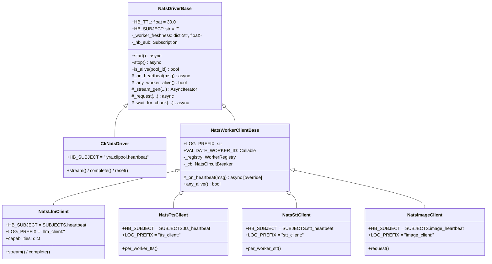
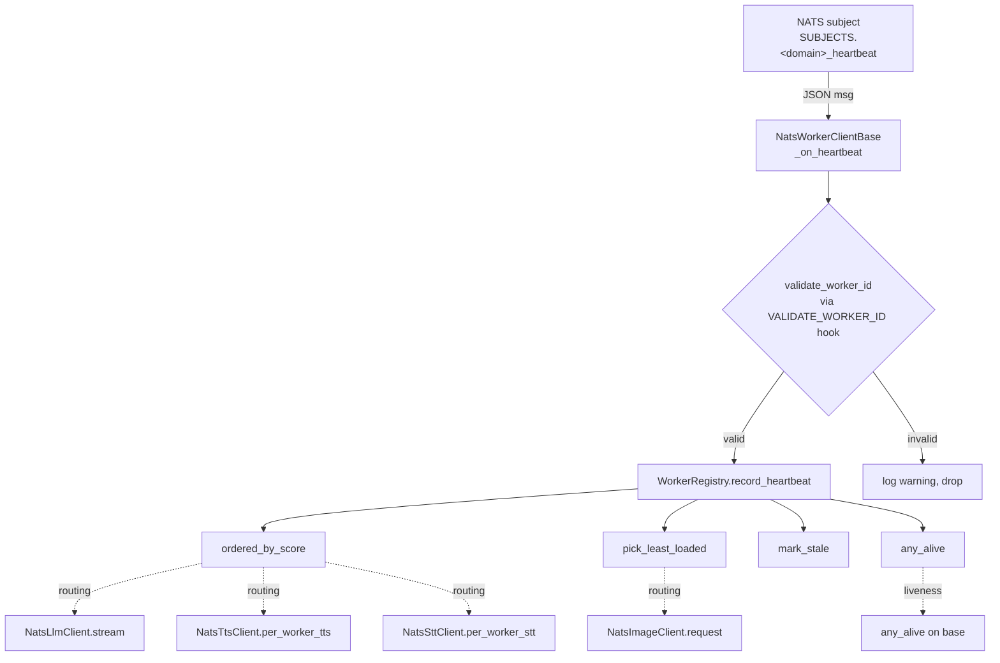

## Context

Promoted from `artifacts/frames/1235-nats-heartbeat-dedup-frame.mdx`. Empirical scan (2026-05-18) resolved the central A/B/C decision:

| Approach | Verdict | Evidence |
|---|---|---|
| A — fold into `NatsDriverBase` | ✗ rejected | `NatsDriverBase._worker_freshness: dict[str, float]` is timestamp-only; 4 clients depend on `WorkerStats` payload (`vram_used_mb`, `active_requests`) via `ordered_by_score()` / `pick_least_loaded()` / `mark_stale()`. Folding rich payload into base would either break `CliNatsDriver` (which uses the timestamp-only path) or require strategy injection (ugly no-op for the CLI driver). |
| B — sibling base in `roxabi-nats` | ✗ rejected | Frame explicitly out-of-scope: "Extracting `validate_worker_id`, `WorkerRegistry`, `NatsCircuitBreaker` from `src/lyra/nats/` to `roxabi-nats` (audit cluster 5, séparé)". `roxabi-nats` cannot import from `src/lyra/nats/` (package → app circular). |
| **C — Lyra-local base inheriting `NatsDriverBase`** | ✓ **chosen** | Stays inside `src/lyra/nats/`, uses local `WorkerRegistry` + `NatsCircuitBreaker`, extends `NatsDriverBase` for `_stream_gen`/`_request`/`_wait_for_chunk` primitives. Zero churn on `CliNatsDriver`. Zero churn on `roxabi-nats`/`roxabi-contracts`. |

## Goal

Une seule classe `NatsWorkerClientBase` (Lyra-local, hérite de `NatsDriverBase`) factorise le heartbeat lifecycle des 4 clients hub-side NATS — toute évolution du protocole heartbeat se fait à un seul endroit.

## Users

- **Primary:** développeurs Lyra modifiant le hub-side messaging (`src/lyra/nats/`).
- **Secondary:** future 5ᵉ classe de worker (embeddings/vision pressentie) — héritera directement, zéro duplication.

## Expected Behavior

Aujourd'hui, chaque client (`NatsLlmClient`, `NatsTtsClient`, `NatsSttClient`, `NatsImageClient`) instancie son propre `WorkerRegistry` + `NatsCircuitBreaker`, souscrit dans son `start()` à `SUBJECTS.<domain>_heartbeat`, et possède un `_on_heartbeat()` qui parse JSON → `validate_worker_id()` → `registry.record_heartbeat(data)`. ~18–29 LOC × 4 quasi-identiques.

Après refactor:

1. `NatsWorkerClientBase` (nouveau, `src/lyra/nats/_worker_client_base.py`) hérite de `NatsDriverBase` et:
   - Déclare class attrs configurables par subclass: `HB_SUBJECT: str` (déjà sur la base parente), `LOG_PREFIX: str`, `VALIDATE_WORKER_ID: Callable[[str], None]`.
   - Possède en `__init__`: `self._registry = WorkerRegistry()` + `self._cb = NatsCircuitBreaker()`.
   - **Override** `_on_heartbeat()` du parent pour: JSON-decode, `isinstance` check, `VALIDATE_WORKER_ID(worker_id)` (try/except ValueError), `self._registry.record_heartbeat(data)`. Log via `LOG_PREFIX`.
   - Expose `any_alive()` qui délègue à `self._registry.any_alive()`.
2. Les 4 clients sous-classent `NatsWorkerClientBase`, fixent leurs class attrs (`HB_SUBJECT`, `LOG_PREFIX`, `VALIDATE_WORKER_ID`), suppriment leur `_on_heartbeat`/`start`/`stop` locaux, gardent leur logique métier (routing, `stream`, `complete`, `tts`, etc.) et accèdent à `self._registry` / `self._cb` hérités.
3. `CliNatsDriver` reste strictement inchangé — il hérite toujours directement de `NatsDriverBase` (pas de `NatsWorkerClientBase`).
4. `NatsDriverBase._worker_freshness` reste — utilisé par `CliNatsDriver` + chemin de liveness backstop de `_wait_for_chunk`. `NatsWorkerClientBase._on_heartbeat` **co-alimente** `_worker_freshness[worker_id] = time.monotonic()` en plus d'appeler `_registry.record_heartbeat(data)` — un one-liner qui préserve la sémantique de `_any_worker_alive()` héritée sans override. Décision figée ici (cf. revue architect).

## Data Model & Consumers

### Class hierarchy

### Heartbeat data flow

### Consumer summary

| Consumer | Fields read | When | Status |
|---|---|---|---|
| `NatsLlmClient.stream` / `complete` | `worker_id`, scoring (`vram_used_mb`, `vram_total_mb`, `active_requests`) | per-request routing | this issue (preserved) |
| `NatsTtsClient.per_worker_tts` | same | per-request routing | this issue (preserved) |
| `NatsSttClient.per_worker_stt` | same | per-request routing | this issue (preserved) |
| `NatsImageClient.request` | `pick_least_loaded()` → None check only | per-request liveness | this issue (preserved) |
| `*.any_alive()` | bool only | request gate | this issue (preserved) |
| `NatsWorkerClientBase._on_heartbeat` | `worker_id` + full payload to registry | each heartbeat | this issue (new) |
| Future 5ᵉ worker class | same | future | out of scope but addressable via inheritance |

## Breadboard

### Affordances

| ID | Affordance | Location | Role |
|---|---|---|---|
| N1 | `NatsWorkerClientBase` class | `src/lyra/nats/_worker_client_base.py` (new) | shared heartbeat lifecycle host |
| N2 | `LOG_PREFIX: str` class attr | N1 | per-domain log identification |
| N3 | `VALIDATE_WORKER_ID: Callable` class attr | N1 | per-domain validator hook (re-exported from `roxabi_contracts.<domain>`) |
| N4 | `_registry: WorkerRegistry` instance | N1 | rich-payload heartbeat store |
| N5 | `_cb: NatsCircuitBreaker` instance | N1 | failure-rate breaker slot |
| N6 | `_on_heartbeat()` override | N1 | parse → validate → record |
| N7 | `any_alive()` method | N1 | delegates to `_registry.any_alive()` |
| S1 | `NatsLlmClient` subclass | `src/lyra/nats/nats_llm_client.py` | sets N2/N3 + adds `capabilities`, `stream`, `complete`, `is_alive(pool_id)` (preserved override) |
| S2 | `NatsTtsClient` subclass | `src/lyra/nats/nats_tts_client.py` | sets N2/N3 + adds `is_available`, `per_worker_tts` |
| S3 | `NatsSttClient` subclass | `src/lyra/nats/nats_stt_client.py` | sets N2/N3 + adds `is_available`, `per_worker_stt` |
| S4 | `NatsImageClient` subclass | `src/lyra/nats/nats_image_client.py` | sets N2/N3 + adds `request` (queue-group routing) |
| T1 | Unit tests for `NatsWorkerClientBase` | `tests/nats/test_worker_client_base.py` (new) | fake subclass + synthetic heartbeat → registry assertions |

### Wiring

- N1 inherits `NatsDriverBase` from `roxabi-nats` → reuses **only** `start()` / `stop()` plumbing (idempotent subscribe/unsubscribe driven by `HB_SUBJECT` class attr, no override needed). `_stream_gen()` / `_request()` / `_wait_for_chunk()` are **not** consumed by the 4 worker clients (each manages its own inbox / Pydantic-validated chunk loop) — they remain `CliNatsDriver`-path primitives.
- N1 overrides only `_on_heartbeat()` (rich-payload path) and adds N7 (`any_alive`).
- N1 sets `HB_SUBJECT = ""` by default — subclasses S1–S4 set their domain subject.
- N1 `_on_heartbeat()` co-populates `_worker_freshness` (parent's dict) **and** `_registry` (new) on every valid heartbeat — preserves parent's `_any_worker_alive()` semantics without override.
- N3 is a `staticmethod`-like class attr (Callable) — subclasses assign their re-exported `validate_worker_id` from `roxabi_contracts.<domain>` (or base imports from `roxabi_contracts._nats_utils` directly — see [NEEDS CLARIFICATION] 2).
- S1–S4 keep their existing public surface unchanged (`stream`, `complete`, `per_worker_tts`, `per_worker_stt`, `request`, `is_alive`, `is_available`).
- `CliNatsDriver` keeps inheriting `NatsDriverBase` directly (untouched).

## Slices

| # | Slice | Affordances | Independently demo-able |
|---|---|---|---|
| 1 | Add `NatsWorkerClientBase` + unit tests | N1, N2, N3, N4, N5, N6, N7, T1 | Yes — fake subclass in tests exercises full lifecycle without touching the 4 production clients |
| 2 | **Pilot migration: `NatsImageClient`** (simplest — no per-worker routing, no Pydantic chunk chain, no `is_alive(pool_id)` override; pure dedup target) | S4 | Yes — `tests/nats/test_nats_image_client.py` green; behavior parity verified |
| 3 | Migrate `NatsLlmClient` + `NatsTtsClient` + `NatsSttClient` + exemption audit | S1, S2, S3 + `tools/file_exemptions.txt` / `tools/folder_exemptions.txt` re-evaluation | Yes — `tests/llm/test_nats_llm_client_provider.py` + `tests/nats/test_nats_{llm,tts,stt}_client.py` green; gates clean; exemption diffs visible |

## Success Criteria

- [ ] `NatsWorkerClientBase` exists in `src/lyra/nats/_worker_client_base.py` with `_on_heartbeat`, `any_alive`, `_registry`, `_cb`, and `LOG_PREFIX` / `VALIDATE_WORKER_ID` class-attr hooks.
- [ ] Each of the 4 clients (`nats_llm_client.py`, `nats_tts_client.py`, `nats_stt_client.py`, `nats_image_client.py`) no longer defines a local `_on_heartbeat`; the heartbeat block per file shrinks to ≤4 LOC (just class-attr declarations).
- [ ] `validate_worker_id()` sanitization is invoked on every heartbeat path in all 4 clients (verified by `tests/nats/test_worker_client_base.py` asserting wildcard-bearing worker IDs are rejected).
- [ ] `WorkerRegistry.record_heartbeat(data)` receives the same full-payload dict it does today **and** each of the 4 clients exposes `self._cb: NatsCircuitBreaker` (verified by existing tests in `tests/nats/test_worker_registry.py` + each client's test suite passing unchanged).
- [ ] **Liveness parity** — T1 asserts that, for an identical heartbeat history, the post-refactor `_any_worker_alive()` (inherited, reads `_worker_freshness` co-populated by N1) and `any_alive()` (N7, delegates to `_registry.any_alive()`) return the **same bool** as pre-refactor on each of the 4 clients.
- [ ] All existing `tests/nats/test_nats_*_client.py` + `tests/llm/test_nats_llm_client_provider.py` pass with zero modifications to assertions.
- [ ] All quality gates pass: `ruff`, `pyright`, `lint-imports`, `check-file-length`, `check-folder-size`, `check-duplicate-test-basenames`.
- [ ] `src/lyra/llm/drivers/cli_nats.py` unchanged in this PR (diff = empty).

## Open Questions

[NEEDS CLARIFICATION] 1 — **`validate_worker_id` hook shape.** Three options:
  - (a) Class attr `VALIDATE_WORKER_ID: Callable[[str], None]` — set by subclass (current spec assumption).
  - (b) Abstract method `_validate_worker_id(self, worker_id: str) -> None` — subclass overrides.
  - (c) Import `validate_worker_id` directly in the base from `roxabi_contracts._nats_utils` (same canonical impl) — no hook needed.
  Option (c) is simplest if `roxabi_contracts._nats_utils` is considered a stable canonical (it is; all domain re-exports point back to it). **Verify at /plan**: that `from roxabi_contracts._nats_utils import validate_worker_id` is permissible under `.importlinter` rules (importing a private/underscore module from another shared package may trigger a contract violation). If yes → pick (c). If no → fall back to (a).

[NEEDS CLARIFICATION] 2 — **Mocking `NatsCircuitBreaker` in tests.** Some existing tests inject mocks for `_cb`. Confirm the new base instantiates `NatsCircuitBreaker()` in `__init__` so test fixtures can `monkeypatch` post-construction (current pattern in tests already does this). Probably no change needed — flag for plan verification.

## Edge Cases

- **`NatsLlmClient.is_alive(pool_id)` pool-agnostic override** — current `is_alive` accepts a `pool_id` but ignores it (stateless per-pool). Must be preserved verbatim on the subclass (do not pull it into base — `NatsTtsClient`/`NatsSttClient` use `is_available()` instead, and `NatsImageClient` has no `is_alive`).
- **`isinstance` + empty-check split** — `NatsLlmClient` combines both checks; TTS/STT/Image split into two `if`s. Base must verify `worker_id` is a non-empty `str` (rejecting `None`, empty string, and non-string types alike). Behavioral parity verified by tests asserting all three invalid inputs are dropped.
- **`WorkerRegistry.record_heartbeat` double-validation** — `WorkerRegistry` internally calls `validate_nats_token` (different function, `roxabi_nats._validate`). Base's call to `VALIDATE_WORKER_ID` is the first guard; registry's is the second. Keep both (defense in depth). No coupling required.
- **`NatsImageClient` queue-group routing** — uses `pick_least_loaded()` returning `None` for "no worker alive", not `any_alive()`. Preserved as subclass method; base provides `any_alive()` but doesn't enforce its use.
